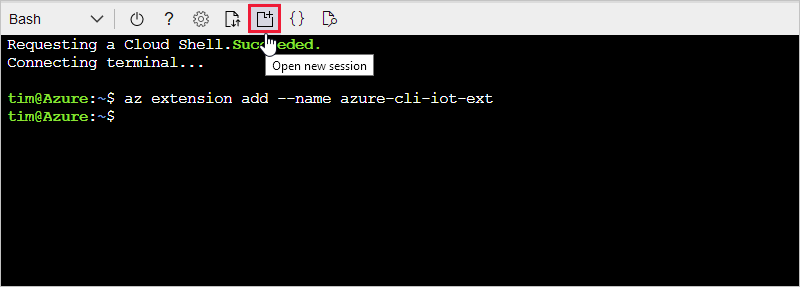
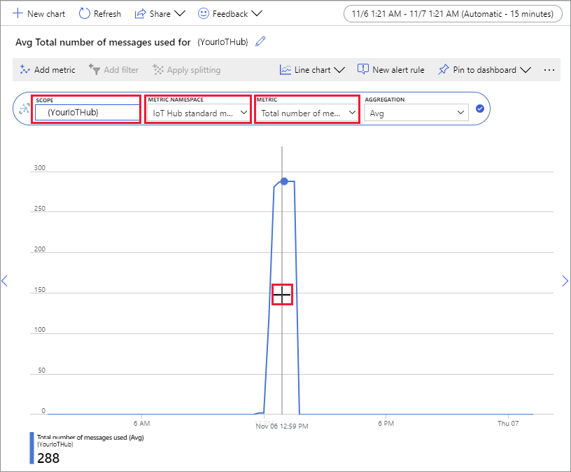

# Quickstart: Send telemetry from a device to an IoT hub and monitor it with the Azure CLI

IoT Hub is an Azure service that enables you to ingest high volumes of telemetry from your IoT devices into the cloud for storage or processing. In this codeless quickstart, you use the Azure CLI to create an IoT hub and a simulated device.  You'll send device telemetry to the hub, and send messages, call methods, and update properties on the device. You'll also use the Azure portal to visualize device metrics. This article shows a basic workflow for developers who use the CLI to interact with an IoT Hub application.

## Prerequisites

- If you don't have an Azure subscription, [create one for free](https://azure.microsoft.com/free/?WT.mc_id=A261C142F) before you begin.
- Azure CLI. You can run all commands in this quickstart using the Azure Cloud Shell, an interactive CLI shell that runs in your browser or in an app such as Windows Terminal. If you use the Cloud Shell, you don't need to install anything. If you prefer to use the CLI locally, this quickstart requires Azure CLI version 2.36 or later. Run `az --version` to find the version. To install or upgrade, see [Install Azure CLI](/cli/azure/install-azure-cli).

## Sign in to the Azure portal

Sign in to the [Azure portal](https://portal.azure.com).

Regardless of whether you run the CLI locally or in the Cloud Shell, keep the portal open in your browser.  You use it later in this quickstart.

## Launch the Cloud Shell

In this section, you launch an instance of the Azure Cloud Shell. If you use the CLI locally, skip to the section [Prepare two CLI sessions](#prepare-two-cli-sessions).

To launch the Cloud Shell:

1. Select the **Cloud Shell** button on the top-right menu bar in the Azure portal.

    

    > [!NOTE]
    > If this is the first time you've used the Cloud Shell, it prompts you to create storage, which is required to use the Cloud Shell.  Select a subscription to create a storage account and Microsoft Azure Files share.

2. Select your preferred CLI environment in the **Select environment** dropdown. This quickstart uses the **Bash** environment. You can also use the **PowerShell** environment. 

    > [!NOTE]
    > Some commands require different syntax or formatting in the **Bash** and **PowerShell** environments.  For more information, see [Tips for using the Azure CLI successfully](/cli/azure/use-cli-effectively?tabs=bash%2Cbash2).

    

## Prepare two CLI sessions

Next, you prepare two Azure CLI sessions. If you're using the Cloud Shell, you'll run these sessions in separate Cloud Shell tabs. If using a local CLI client, you'll run separate CLI instances. Use the separate CLI sessions for the following tasks:
- The first session simulates an IoT device that communicates with your IoT hub. 
- The second session either monitors the device in the first session, or sends messages, commands, and property updates. 

To run a command, select **Copy** to copy a block of code in this quickstart, paste it into your shell session, and run it.

Azure CLI requires you to be logged into your Azure account. All communication between your Azure CLI shell session and your IoT hub is authenticated and encrypted. As a result, this quickstart doesn't need extra authentication that you'd use with a real device, such as a connection string.

- In the first CLI session, run the [az extension add](/cli/azure/extension#az-extension-add) command. The command adds the Microsoft Azure IoT Extension for Azure CLI to your CLI shell. The IOT Extension adds IoT Hub, IoT Edge, and IoT Device Provisioning Service (DPS) specific commands to Azure CLI.

   ```azurecli
   az extension add --name azure-iot
   ```

   After you install the Azure IOT extension, you don't need to install it again in any Cloud Shell session.

   [!INCLUDE [iot-hub-cli-version-info](../../includes/iot-hub-cli-version-info.md)]

- Open the second CLI session.  If you're using the Cloud Shell in a browser, use the **Open new session** button. If using the CLI locally, open a second CLI instance.

    >[!div class="mx-imgBorder"]
    >

## Create an IoT hub

In this section, you use the Azure CLI to create a resource group and an IoT hub.  An Azure resource group is a logical container into which Azure resources are deployed and managed. An IoT hub acts as a central message hub for bi-directional communication between your IoT application and the devices.

> [!TIP]
> Optionally, you can create an Azure resource group, an IoT hub, and other resources by using the [Azure portal](iot-hub-create-through-portal.md), [Visual Studio Code](iot-hub-create-use-iot-toolkit.md), or other programmatic methods.  

1. In the first CLI session, run the [az group create](/cli/azure/group#az-group-create) command to create a resource group. The following command creates a resource group named *MyResourceGroup* in the *eastus* location.

    ```azurecli
    az group create --name MyResourceGroup --location eastus
    ```

1. In the first CLI session, run the [Az PowerShell module iot hub create](/cli/azure/iot/hub#az-iot-hub-create) command to create an IoT hub. It takes a few minutes to create an IoT hub.

    *YourIotHubName*. Replace this placeholder and the surrounding braces in the following command, using the name you chose for your IoT hub. An IoT hub name must be globally unique in Azure. Use your IoT hub name in the rest of this quickstart wherever you see the placeholder.

    ```azurecli
    az iot hub create --resource-group MyResourceGroup --name {YourIoTHubName}
    ```

## Create and monitor a device

In this section, you create a simulated device in the first CLI session. The simulated device sends device telemetry to your IoT hub. In the second CLI session, you monitor events and telemetry.

To create and start a simulated device:

1. In the first CLI session, run the [az iot hub device-identity create](/cli/azure/iot/hub/device-identity#az-iot-hub-device-identity-create) command. This command creates the simulated device identity.

    *YourIotHubName*. Replace this placeholder below with the name you chose for your IoT hub.

    *simDevice*. You can use this name directly for the simulated device in the rest of this quickstart. Optionally, use a different name.

    ```azurecli
    az iot hub device-identity create -d simDevice -n {YourIoTHubName} 
    ```

1. In the first CLI session, run the [az iot device simulate](/cli/azure/iot/device#az-iot-device-simulate) command.  This command starts the simulated device. The device sends telemetry to your IoT hub and receives messages from it.  

    *YourIotHubName*. Replace this placeholder below with the name you chose for your IoT hub.

    ```azurecli
    az iot device simulate -d simDevice -n {YourIoTHubName}
    ```

To monitor a device:

1. In the second CLI session, run the [az iot hub monitor-events](/cli/azure/iot/hub#az-iot-hub-monitor-events) command. This command continuously monitors the simulated device. The output shows telemetry such as events and property state changes that the simulated device sends to the IoT hub.

    *YourIotHubName*. Replace this placeholder below with the name you chose for your IoT hub.
    
    ```azurecli
    az iot hub monitor-events --output table -p all -n {YourIoTHubName}
    ```
    
    :::image type="content" source="media/quickstart-send-telemetry-cli/cloud-shell-monitor.png" alt-text="Screenshot of monitoring events on a simulated device.":::

1. After you monitor the simulated device in the second CLI session, press Ctrl+C to stop monitoring. Keep the second CLI session open to use in later steps.

## Use the CLI to send a message

In this section, you send a message to the simulated device.

1. In the first CLI session, confirm that the simulated device is still running. If the device stopped, run the following command to restart it:

    *YourIotHubName*. Replace this placeholder below with the name you chose for your IoT hub.

    ```azurecli
    az iot device simulate -d simDevice -n {YourIoTHubName}
    ```

1. In the second CLI session, run the [az iot device c2d-message send](/cli/azure/iot/device/c2d-message#az-iot-device-c2d-message-send) command. This command sends a cloud-to-device message from your IoT hub to the simulated device. The message includes a string and two key-value pairs.  

    *YourIotHubName*. Replace this placeholder below with the name you chose for your IoT hub.

    ```azurecli
    az iot device c2d-message send -d simDevice --data "Hello World" --props "key0=value0;key1=value1" -n {YourIoTHubName}
    ```

    Optionally, you can send cloud-to-device messages by using the Azure portal. To do this, browse to the overview page for your IoT Hub, select **IoT Devices**, select the simulated device, and select **Message to Device**.

1. In the first CLI session, confirm that the simulated device received the message.

    :::image type="content" source="media/quickstart-send-telemetry-cli/cloud-shell-receive-message.png" alt-text="Screenshot of a simulated device receiving a message.":::


## Use the CLI to call a device method

In this section, you call a direct method on the simulated device.

1. As you did before, confirm that the simulated device in the first CLI session is running.  If not, restart it. 

1. In the second CLI session, run the [az iot hub invoke-device-method](/cli/azure/iot/hub#az-iot-hub-invoke-device-method) command. In this example, there's no preexisting method for the device. The command calls an example method name on the simulated device and returns a payload.

    *YourIotHubName*. Replace this placeholder below with the name you chose for your IoT hub.
    
    ```azurecli
    az iot hub invoke-device-method --mn MySampleMethod -d simDevice -n {YourIoTHubName}
    ```
1. In the first CLI session, confirm the output shows the method call. 

    :::image type="content" source="media/quickstart-send-telemetry-cli/cloud-shell-method-payload.png" alt-text="Screenshot of a simulated device displaying output after a method was invoked.":::

## Use the CLI to update device properties

In this section, you update the state of the simulated device by setting property values. 

1. As you did before, confirm that the simulated device in the first CLI session is running.  If not, restart it. 

1. In the second CLI session, run the [az iot hub device-twin update](/cli/azure/iot/hub/device-twin#az-iot-hub-device-twin-update) command. This command updates the properties to the desired state on the IoT hub device twin that corresponds to your simulated device. In this case, the command sets example temperature condition properties.

    > [!IMPORTANT]
    > If you're using PowerShell in the CLI shell, use the PowerShell version of the command below. PowerShell requires you to escape the characters in the JSON payload. 

    *YourIotHubName*. Replace this placeholder below with the name you chose for your IoT hub.
    
    ```azurecli
    az iot hub device-twin update -d simDevice --desired '{"conditions":{"temperature":{"warning":98, "critical":107}}}' -n {YourIoTHubName}
    ```
    ```azurepowershell
    az iot hub device-twin update -d simDevice --desired '{\"conditions\":{\"temperature\":{\"warning\":98, \"critical\":107}}}' -n {YourIoTHubName}
    ```

1. In the first CLI session, confirm that the simulated device outputs the property update.

    :::image type="content" source="media/quickstart-send-telemetry-cli/cloud-shell-device-twin-update.png" alt-text="Screenshot that shows how to update properties on a device.":::

1. In the second CLI session, run the [az iot hub device-twin show](/cli/azure/iot/hub/device-twin#az-iot-hub-device-twin-show) command. This command reports changes to the device properties. 

    *YourIotHubName*. Replace this placeholder below with the name you chose for your IoT hub.
    
    ```azurecli
    az iot hub device-twin show -d simDevice --query properties.reported -n {YourIoTHubName}
    ```

    :::image type="content" source="media/quickstart-send-telemetry-cli/cloud-shell-device-twin-show-update.png" alt-text="Screenshot that shows the updated properties on a device twin.":::

## View messaging metrics in the portal

The Azure portal enables you to manage all aspects of your IoT hub and devices. In a typical IoT Hub application that ingests telemetry from devices, you might want to monitor devices or view metrics on device telemetry.

To visualize messaging metrics in the Azure portal:

1. In the left navigation menu on the portal, select **All Resources**. This tab lists all resources in your subscription, including the IoT hub you created.

1. Select the link on the IoT hub you created. The portal displays the overview page for the hub.

1. Select **Metrics** in the left pane of your IoT Hub.

    

1. In the **Scope** field, enter your IoT hub name.

1. In the **Metric Namespace** field, select *Iot Hub Standard Metrics*.

1. In the **Metric** field, select *Total number of messages used*.

1. Hover your mouse pointer over the area of the timeline in which your device sent messages. The total number of messages at a point in time appears in the lower left corner of the timeline.

    

1. Optionally, use the **Metric** dropdown to display other metrics on your simulated device. For example, *C2d message deliveries completed* or *Total devices (preview)*.

## Clean up resources

If you no longer need the Azure resources created in this quickstart, you can use the Azure CLI to delete them.

If you continue to the next recommended article, you can keep the resources you've already created and reuse them.

> [!IMPORTANT]
> Deleting a resource group is irreversible. The resource group and all the resources contained in it are permanently deleted. Make sure that you do not accidentally delete the wrong resource group or resources.

To delete a resource group by name:

1. Run the [az group delete](/cli/azure/group#az-group-delete) command. This command removes the resource group, the IoT hub, and the device registration you created.

    ```azurecli
    az group delete --name MyResourceGroup
    ```

1. Run the [az group list](/cli/azure/group#az-group-list) command to confirm the resource group is deleted.  

    ```azurecli
    az group list
    ```

## Next steps

In this quickstart, you used the Azure CLI to create an IoT hub, create a simulated device, send and monitor telemetry, call a method, set desired properties, and clean up resources. You used the Azure portal to visualize messaging metrics on your device.

If you're a device developer, the suggested next step is to see the telemetry quickstart that uses the Azure IoT Device SDK for C. Optionally, see one of the available Azure IoT Hub telemetry quickstart articles in your preferred language or SDK.

To learn how to control your simulated device from a back-end application, continue to the next quickstart.

> [!div class="nextstepaction"]
> [Quickstart: Control a device connected to an IoT hub](quickstart-control-device.md)
