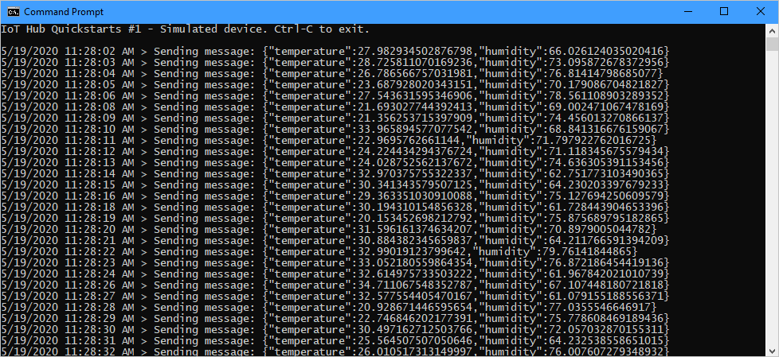
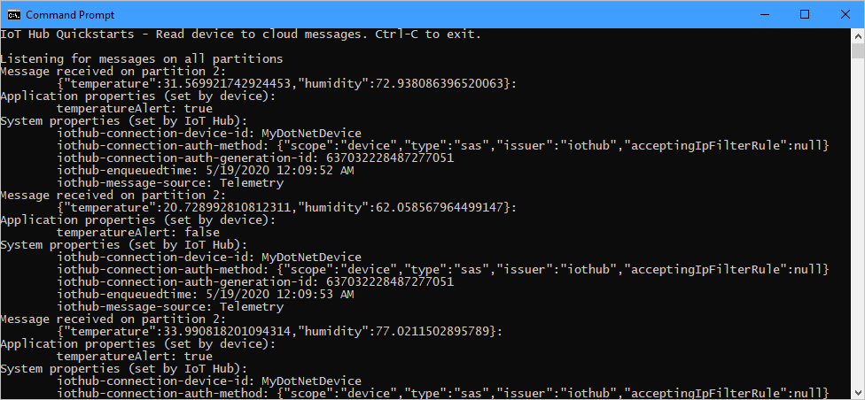

# Quickstart: Send telemetry from a device to an IoT hub and read it with a service application (.NET)

[!INCLUDE [iot-hub-quickstarts-1-selector](../../includes/iot-hub-quickstarts-1-selector.md)]

IoT Hub is an Azure service that enables you to ingest high volumes of telemetry from your IoT devices into the cloud for storage or processing. In this quickstart, you send telemetry from a simulated device application, through IoT Hub, to a service application for processing.

The quickstart uses two pre-written C# applications, one to send the telemetry and one to read the telemetry from the hub. Before you run these two applications, you create an IoT hub and register a device with the hub.

[!INCLUDE [quickstarts-free-trial-note](../../includes/quickstarts-free-trial-note.md)]

## Prerequisites

* The two sample applications you run in this quickstart are written using C#. You need the .NET Core SDK 3.1 or greater on your development machine.

    You can download the .NET Core SDK for multiple platforms from [.NET](https://dotnet.microsoft.com/download).

    You can verify the current version of C# on your development machine using the following command:

    ```cmd/sh
    dotnet --version
    ```

    > [!NOTE]
    > .NET Core SDK 3.1 or greater is recommended to compile the Event Hubs service code used to read telemetry in this quickstart.


* Download the Azure IoT C# samples from [https://github.com/Azure-Samples/azure-iot-samples-csharp/archive/master.zip](https://github.com/Azure-Samples/azure-iot-samples-csharp/archive/master.zip) and extract the ZIP archive.

* Make sure that port 8883 is open in your firewall. The device sample in this quickstart uses MQTT protocol, which communicates over port 8883. This port may be blocked in some corporate and educational network environments. For more information and ways to work around this issue, see [Connecting to IoT Hub (MQTT)](iot-hub-mqtt-support.md#connecting-to-iot-hub).

[!INCLUDE [azure-cli-prepare-your-environment.md](../../includes/azure-cli-prepare-your-environment-no-header.md)]

[!INCLUDE [iot-hub-cli-version-info](../../includes/iot-hub-cli-version-info.md)]

## Create an IoT hub

[!INCLUDE [iot-hub-include-create-hub](../../includes/iot-hub-include-create-hub.md)]

## Register a device

A device must be registered with your IoT hub before it can connect. In this quickstart, you use the Azure Cloud Shell to register a simulated device.

1. Run the following command in Azure Cloud Shell to create the device identity.

   **YourIoTHubName**: Replace this placeholder below with the name you chose for your IoT hub.

   **MyDotnetDevice**: This is the name of the device you're registering. It's recommended to use **MyDotnetDevice** as shown. If you choose a different name for your device, you'll also need to use that name throughout this article, and update the device name in the sample applications before you run them.

    ```azurecli-interactive
    az iot hub device-identity create --hub-name {YourIoTHubName} --device-id MyDotnetDevice
    ```

2. Run the following command in Azure Cloud Shell to get the _device connection string_ for the device you just registered:

   **YourIoTHubName**: Replace this placeholder below with the name you chose for your IoT hub.

    ```azurecli-interactive
    az iot hub device-identity connection-string show --hub-name {YourIoTHubName} --device-id MyDotnetDevice --output table
    ```

    Make a note of the device connection string, which looks like:

   `HostName={YourIoTHubName}.azure-devices.net;DeviceId=MyDotnetDevice;SharedAccessKey={YourSharedAccessKey}`

    You'll use this value later in the quickstart.

3. You also need the _Event Hubs-compatible endpoint_, _Event Hubs-compatible path_, and _service primary key_ from your IoT hub to enable the service application to connect to your IoT hub and retrieve the messages. The following commands retrieve these values for your IoT hub:

   **YourIoTHubName**: Replace this placeholder below with the name you choose for your IoT hub.

    ```azurecli-interactive
    az iot hub show --query properties.eventHubEndpoints.events.endpoint --name {YourIoTHubName}

    az iot hub show --query properties.eventHubEndpoints.events.path --name {YourIoTHubName}

    az iot hub policy show --name service --query primaryKey --hub-name {YourIoTHubName}
    ```

    Make a note of these three values, which you'll use later in the quickstart.

## Send simulated telemetry

The simulated device application connects to a device-specific endpoint on your IoT hub and sends simulated temperature and humidity telemetry.

1. In a local terminal window, navigate to the root folder of the sample C# project. Then navigate to the **iot-hub\Quickstarts\SimulatedDevice** folder.

2. In the local terminal window, run the following commands to install the required packages for simulated device application:

    ```cmd/sh
    dotnet restore
    ```

3. In the local terminal window, run the following command to build and run the simulated device application with the device connection string you made a note of earlier:

    ```cmd/sh
    dotnet run -- {DeviceConnectionString}
    ```

    The following screenshot shows the output as the simulated device application sends telemetry to your IoT hub:

    

## Read the telemetry from your hub

The service application connects to the service-side **Events** endpoint on your IoT Hub. The application receives the device-to-cloud messages sent from your simulated device. An IoT Hub service application typically runs in the cloud to receive and process device-to-cloud messages.

1. In another local terminal window, navigate to the root folder of the sample C# project. Then navigate to the **iot-hub\Quickstarts\ReadD2cMessages** folder.

2. In the local terminal window, run the following command to install the required libraries for the application:

    ```cmd/sh
    dotnet restore
    ```

3. In the local terminal window, run the following command to see the parameter options.

    ```cmd/sh
    dotnet run
    ```

4. In the local terminal window, run one of the following command to build and run the application with the :

    ```cmd/sh
    dotnet run -- -c {EventHubConnectionString}
    ```

    or

    ```cmd/sh
    dotnet run -- -e {EventHubCompatibleEndpoint} -n {EventHubName} -s {SharedAccessKey}
    ```

    The following screenshot shows the output as the service application receives telemetry sent by the simulated device to the hub:

    

## Clean up resources

[!INCLUDE [iot-hub-quickstarts-clean-up-resources](../../includes/iot-hub-quickstarts-clean-up-resources.md)]

## Next steps

In this quickstart, you set up an IoT hub, registered a device, sent simulated telemetry to the hub using a C# application, and read the telemetry from the hub using a simple service application.

To learn how to control your simulated device from a service application, continue to the next quickstart.

> [!div class="nextstepaction"]
> [Quickstart: Control a device connected to an IoT hub](quickstart-control-device-dotnet.md)
