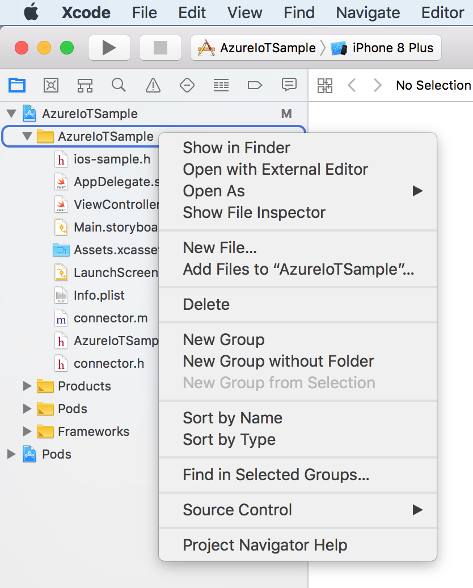

# Quickstart: Send telemetry from a device to an IoT hub

In this quickstart, you send telemetry from a simulated device, through IoT Hub, to a back-end application for processing. You complete the following steps in this quickstart:

- Use the Azure portal to create an IoT hub in your Azure subscription.
- Use the Azure CLI to register a simulated device in your IoT hub.
- Run an Objective C application that sends simulated telemetry from an iPhone emulator.
- Run a simple Node.js back-end application that reads and processes the telemetry.

<!-- 
[!INCLUDE [cloud-shell-try-it.md](../../includes/cloud-shell-try-it.md)]
-->

If you don’t have an Azure subscription, create a [free account](https://azure.microsoft.com/free/?WT.mc_id=A261C142F) before you begin.

## Prerequisites

- The latest version of [XCode](https://developer.apple.com/xcode/), running the latest verstion of the iOS SDK. This quickstart was tested with XCode 9.3 and iOS 11.3.
- The latest version of [CocoaPods](https://guides.cocoapods.org/using/getting-started.html).
- [Node.js](https://nodejs.org) version 4.x.x or later.

## Create an IoT hub

The first step is to use the Azure portal to create an IoT hub in your subscription. The IoT hub enables you to ingest high volumes of telemetry into the cloud from many devices. The hub then enables one or more back-end services running in the cloud to read and process that telemetry.

1. In a new browser window, sign in to the [Azure portal](http://portal.azure.com).

1. Select **Create a resource** > **Internet of Things** > **IoT Hub**.

<!--
    
-->

1. To create your IoT hub, use the values in the following table:

    | Setting | Value |
    | ------- | ----- |
    | Name | A unique name for your hub |
    | Pricing and scale tier | F1 Free |
    | IoT Hub units | 1 |
    | Device-to-cloud partitions | 2 partitions |
    | Subscription | Your Azure subscription. |
    | Resource group | Create new. Enter a name for your resource group. |
    | Location | The location closest to you. |
    | Pin to dashboard | Yes |

1. Click **Create**.

<!--
    
-->

1. Make a note of your IoT hub and resource group names. You use these values later in this quickstart.

## Register a device

A device must be registered with your IoT hub before it can connect. In this quickstart, you use the Azure CLI to register a simulated device.

1. Add the IoT Hub CLI extension and create the device identity. Replace `{YourIoTHubName}` with the name of your IoT hub:

    ```azurecli-interactive
    az extension add --name azure-cli-iot-ext
    az iot hub device-identity create --hub-name {YourIoTHubName} --device-id myiOSdevice
    ```

1. Run the following command to get the _device connection string_ for the device you just registered:

    ```azurecli-interactive
    az iot hub device-identity show-connection-string --hub-name {YourIoTHubName} --device-id myiOSdevice --output table
    ```

    Make a note of the device connection string, which looks like `Hostname=...=`. You use this value later in the quickstart.

1. You also need a _service connection string_ to enable the back-end application to connect to your IoT hub and retrieve the messages. The following command retrieves the service connection string for your IoT hub:

    ```azurecli-interactive
    az iot hub show-connection-string --hub-name {YourIoTHubName} --output table
    ```

    Make a note of the service connection string, which looks like `Hostname=...=`. You use this value later in the quickstart.

## Download the sample

In your terminal, navigate to the location where you want to store the sample. Clone the Azure IoT C SDK repo, which contains several samples including the one that this article walks through.

```sh
git clone https://github.com/Azure/azure-iot-sdk-c.git
```

Navigate to the Azure IoT Sample folder.

```sh
cd azure-iot-sdk-c/iothub-client/samples/ios/AzureIoTSample
```

Install the CocoaPods, which manage the dependencies for your Objective-C project. The install command reads the `podfile` in the AzureIoTSample project and installs the pods as instructed. Make sure that XCode is closed before you run this command. 

```sh
pod install
```

Copy the sample project code into your AzureIoTSample folder. 
```sh
cp ../../iothub_ll_telemetry_sample/iothub_ll_telemetry_sample.c ./AzureIoTSample/iothub_ll_telemetry_sample.c 
```

## Run the simulated device application

The simulated device application connects to a device-specific endpoint on your IoT hub and sends simulated temperature and humidity telemetry.

1. Open the sample workspace in XCode.

   ```sh
   open AzureIoTSampleWorkspace.xcworkspace
   ```

2. In the project navigator, expand the **AzureIoTSample** project.
3. Right-click the **AzureIoTSample** folder and select **Add Files to "AzureIoTSample"**.

   

4. Select **iothub_ll_telemetry_sample.c** and click **Add**. 
5. Expand the **AzureIoTSample** folder and open **iothub_ll_telemetry_sample.c** for editing in XCode. 
6. Add the following include to line 12, after the other include files:

   ```objc
   #include "ios-sample.h"
   ```
7. In line 45 replace the value of the **connectionString** variable with the device connection string that you copied earlier. 
8. Save your changes. 
9. Run the project in the device emulator with the build and run button or the key combo **Command + r**. 

   

The following screenshot shows some example output as the application sends simulated telemetry to your IoT hub:


## Clean up resources

If you plan to complete the next quickstart, leave the resource group and IoT hub and reuse them later.

If you don't need the IoT hub any longer, delete it and the resource group in the portal. To do so, select the resource group that contains your IoT hub and click **Delete**.

## Next steps

In this quickstart, you've setup an IoT hub, registered a device, sent simulated telemetry to the hub using a Node.js application, and read the telemetry from the hub using a simple back-end app. To learn how to control your simulated device from a back-end app, continue to the next quickstart.

> [!div class="nextstepaction"]
> [Quickstart: Control a device connected to an IoT hub](quickstart-control-device-node.md)