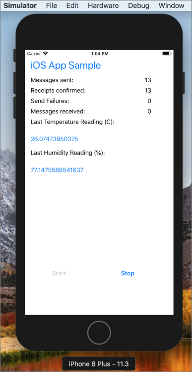

# Send telemetry from a device to an IoT hub (Swift)

IoT Hub is an Azure service that enables you to ingest high volumes of telemetry from your IoT devices into the cloud for storage or processing. In this article, you send telemetry from a simulated device application to IoT Hub. Then you can view the data from a back-end application. 

This article uses a pre-written Swift application to send the telemetry and a CLI utility to read the telemetry from IoT Hub. 

[!INCLUDE [cloud-shell-try-it.md](../../includes/cloud-shell-try-it.md)]

If you don’t have an Azure subscription, create a [free account](https://azure.microsoft.com/free/?WT.mc_id=A261C142F) before you begin.

## Prerequisites

- Download the code sample from [Azure samples](https://github.com/Azure-Samples/azure-iot-ios-sample/archive/master.zip) 
- The latest version of [XCode](https://developer.apple.com/xcode/), running the latest version of the iOS SDK. This quickstart was tested with XCode 9.3 and iOS 11.3.
- The latest version of [CocoaPods](https://guides.cocoapods.org/using/getting-started.html).
- The iothub-explorer CLI utility, which reads telemetry from IoT Hub. To install, first install [Node.js](https://nodejs.org) v4.x.x or higher, then run the following command: 

   ```sh
   sudo npm install -g iothub-explorer
   ```

## Create an IoT hub

The first step is to use the Azure portal to create an IoT hub in your subscription. The IoT hub enables you to ingest high volumes of telemetry into the cloud from many devices. The hub then enables one or more back-end services running in the cloud to read and process that telemetry.

1. Sign in to the [Azure portal](http://portal.azure.com).

1. Select **Create a resource** > **Internet of Things** > **IoT Hub**. 

   

1. To create your IoT hub, use the values in the following table:

    | Setting | Value |
    | ------- | ----- |
    | Name | A unique name for your hub |
    | Pricing and scale tier | F1 Free |
    | IoT Hub units | 1 |
    | Device-to-cloud partitions | 2 partitions |
    | Subscription | Your Azure subscription. |
    | Resource group | Create new. Enter a name for your resource group. |
    | Location | The location closest to you. |
    | Pin to dashboard | Yes |

1. Click **Create**.  

   

1. Make a note of your IoT hub and resource group names. You use these values later in this quickstart.

## Register a device

A device must be registered with your IoT hub before it can connect. In this quickstart, you use the Azure CLI to register a simulated device.

Add the IoT Hub CLI extension and create the device identity. Replace `{YourIoTHubName}` with a name for your IoT hub:

    ```azurecli-interactive
    az extension add --name azure-cli-iot-ext
    az iot hub device-identity create --hub-name {YourIoTHubName} --device-id myiOSdevice
    ```

Run the following command to get the _device connection string_ for the device you just registered:

    ```azurecli-interactive
    az iot hub device-identity show-connection-string --hub-name {YourIoTHubName} --device-id myiOSdevice --output table
    ```

    Make a note of the device connection string, which looks like `Hostname=...=`. You use this value later in the article.

You also need a _service connection string_ to enable back-end applications to connect to your IoT hub and retrieve device-to-cloud messages. The following command retrieves the service connection string for your IoT hub:

    ```azurecli-interactive
    az iot hub show-connection-string --hub-name {YourIoTHubName} --output table
    ```

    Make a note of the service connection string, which looks like `Hostname=...=`. You use this value later in the article.

## Send simulated telemetry

The sample application runs on an iOS device, which connects to a device-specific endpoint on your IoT hub and sends simulated temperature and humidity telemetry. 

### Install CocoaPods

CocoaPods manage dependencies for iOS projects that use third-party libraries.

Navigate to the Azure IoT iOS Samples folder that you downloaded in the prerequisites. Then, navigate to the sample project:

```sh
cd quickstart/sample-device
```

This folder has the XCode project files and workspace, and a `Podfile` file that lists the pods required for the sample project. Make sure that XCode is closed, then run the following command to install the pods according to the podfile:

```sh
pod install
```

Your project folder now has another file named `Pods` and a second XCode workspace file. 

### Run the sample application 

1. Open the sample workspace in XCode.

   ```sh
   open "MQTT Client Sample WS.xcworkspace"
   ```

2. Expand the **MQTT Client Sample** project and then folder of the same name.  
3. Open **ViewController.swift** for editing in XCode. 
4. Search for the **connectionString** variable and update the value with the device connection string that you copied previously.
5. Save your changes. 
6. Run the project in the device emulator with the build and run button or the key combo **Command + r**. 

   

7. When the emulator opens, select **Start** in the sample app.

The following screenshot shows some example output as the application sends simulated telemetry to your IoT hub:



## Read the telemetry from your hub

The sample app that you ran on the XCode emulator shows data about messages sent from the device. You can also view the data through your IoT hub as it is received. The `iothub-explorer` CLI utility connects to the service-side **Events** endpoint on your IoT Hub. 

Open a new terminal window. Run the following command replacing {your hub service connection string} with the service connection string that you retrieved at the beginning of this article:

    ```sh
    iothub-explorer monitor-events myiOSdevice --login "{your hub service connection string}"
    ```


## Clean up resources

If you plan to complete the next quickstart, leave the resource group and IoT hub and reuse them later.

If you don't need the IoT hub any longer, delete it and the resource group in the portal. To do so, select the resource group that contains your IoT hub and click **Delete**.

## Next steps

In this article, you set up an IoT hub, registered a device, sent simulated telemetry to the hub from an iOS device, and read the telemetry from the hub. 

To continue getting started with IoT Hub and to explore other IoT scenarios, see:

* [Connecting your device][lnk-connect-device]
* [Getting started with device management][lnk-device-management]
* [Getting started with IoT Edge][lnk-iot-edge]

To learn how to extend your IoT solution and process device-to-cloud messages at scale, see the [Process device-to-cloud messages][lnk-process-d2c-tutorial] tutorial.

<!-- Links -->
[lnk-process-d2c-tutorial]: iot-hub-csharp-csharp-process-d2c.md
[lnk-device-management]: iot-hub-node-node-device-management-get-started.md
[lnk-iot-edge]: ../iot-edge/tutorial-simulate-device-linux.md
[lnk-connect-device]: https://azure.microsoft.com/develop/iot/
