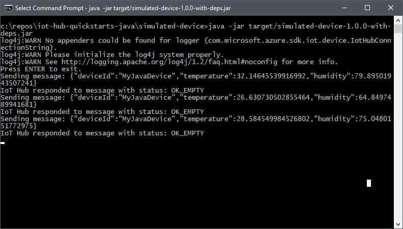
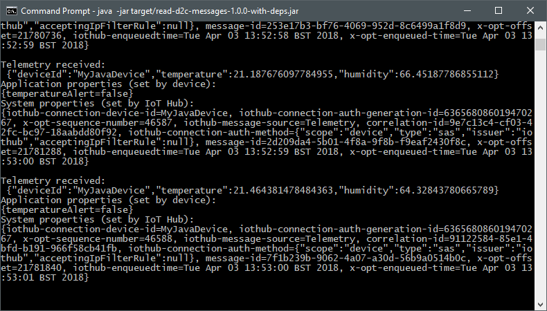

# Quickstart: Send telemetry from a device to an IoT hub and read it with a back-end application (Java)

[!INCLUDE [iot-hub-quickstarts-1-selector](../../includes/iot-hub-quickstarts-1-selector.md)]

IoT Hub is an Azure service that enables you to ingest high volumes of telemetry from your IoT devices into the cloud for storage or processing. In this quickstart, you send telemetry from a simulated device application, through IoT Hub, to a back-end application for processing.

The quickstart uses two pre-written Java applications, one to send the telemetry and one to read the telemetry from the hub. Before you run these two applications, you create an IoT hub and register a device with the hub.

[!INCLUDE [cloud-shell-try-it.md](../../includes/cloud-shell-try-it.md)]

If you don’t have an Azure subscription, create a [free account](https://azure.microsoft.com/free/?WT.mc_id=A261C142F) before you begin.

## Prerequisites

The two sample applications you run in this quickstart are written using Java. You need Java SE 8 or later on your development machine.

You can download Java for multiple platforms from [Oracle](https://aka.ms/azure-jdks).

You can verify the current version of Java on your development machine using the following command:

```cmd/sh
java -version
```

To build the samples, you need to install Maven 3. You can download Maven for multiple platforms from [Apache Maven](https://maven.apache.org/download.cgi).

You can verify the current version of Maven on your development machine using the following command:

```cmd/sh
mvn --version
```

Run the following command to add the Microsoft Azure IoT Extension for Azure CLI to your Cloud Shell instance. The IOT Extension adds IoT Hub, IoT Edge, and IoT Device Provisioning Service (DPS) specific commands to Azure CLI.

```azurecli-interactive
az extension add --name azure-cli-iot-ext
```

Download the sample Java project from https://github.com/Azure-Samples/azure-iot-samples-java/archive/master.zip and extract the ZIP archive.

## Create an IoT hub

[!INCLUDE [iot-hub-include-create-hub](../../includes/iot-hub-include-create-hub.md)]

## Register a device

A device must be registered with your IoT hub before it can connect. In this quickstart, you use the Azure Cloud Shell to register a simulated device.

1. Run the following command in Azure Cloud Shell to create the device identity.

   **YourIoTHubName**: Replace this placeholder below with the name you choose for your IoT hub.

   **MyJavaDevice**: The name of the device you're registering. Use **MyJavaDevice** as shown. If you choose a different name for your device, you need to use that name throughout this article, and update the device name in the sample applications before you run them.

    ```azurecli-interactive
    az iot hub device-identity create --hub-name YourIoTHubName --device-id MyJavaDevice
    ```

2. Run the following commands in Azure Cloud Shell to get the _device connection string_ for the device you just registered:
    **YourIoTHubName: Replace this placeholder below with the name you choose for your IoT hub.

    ```azurecli-interactive
    az iot hub device-identity show-connection-string --hub-name YourIoTHubName --device-id MyJavaDevice --output table
    ```

    Make a note of the device connection string, which looks like:

   `HostName={YourIoTHubName}.azure-devices.net;DeviceId=MyNodeDevice;SharedAccessKey={YourSharedAccessKey}`

    You use this value later in the quickstart.

3. You also need the _Event Hubs-compatible endpoint_, _Event Hubs-compatible path_, and _service primary key_ from your IoT hub to enable the back-end application to connect to your IoT hub and retrieve the messages. The following commands retrieve these values for your IoT hub:

     **YourIoTHubName: Replace this placeholder below with the name you choose for your IoT hub.

    ```azurecli-interactive
    az iot hub show --query properties.eventHubEndpoints.events.endpoint --name YourIoTHubName

    az iot hub show --query properties.eventHubEndpoints.events.path --name YourIoTHubName

    az iot hub policy show --name service --query primaryKey --hub-name YourIoTHubName
    ```

    Make a note of these three values, which you use later in the quickstart.

## Send simulated telemetry

The simulated device application connects to a device-specific endpoint on your IoT hub and sends simulated temperature and humidity telemetry.

1. In a local terminal window, navigate to the root folder of the sample Java project. Then navigate to the **iot-hub\Quickstarts\simulated-device** folder.

2. Open the **src/main/java/com/microsoft/docs/iothub/samples/SimulatedDevice.java** file in a text editor of your choice.

    Replace the value of the `connString` variable with the device connection string you made a note of previously. Then save your changes to **SimulatedDevice.java** file.

3. In the local terminal window, run the following commands to install the required libraries and build the simulated device application:

    ```cmd/sh
    mvn clean package
    ```

4. In the local terminal window, run the following commands to run the simulated device application:

    ```cmd/sh
    java -jar target/simulated-device-1.0.0-with-deps.jar
    ```

    The following screenshot shows the output as the simulated device application sends telemetry to your IoT hub:

    

## Read the telemetry from your hub

The back-end application connects to the service-side **Events** endpoint on your IoT Hub. The application receives the device-to-cloud messages sent from your simulated device. An IoT Hub back-end application typically runs in the cloud to receive and process device-to-cloud messages.

1. In another local terminal window, navigate to the root folder of the sample Java project. Then navigate to the **iot-hub\Quickstarts\read-d2c-messages** folder.

2. Open the **src/main/java/com/microsoft/docs/iothub/samples/ReadDeviceToCloudMessages.java** file in a text editor of your choice. Update the following variables and save your changes to the file.

    | Variable | Value |
    | -------- | ----------- |
    | `eventHubsCompatibleEndpoint` | Replace the value of the variable with the Event Hubs-compatible endpoint you made a note of previously. |
    | `eventHubsCompatiblePath`     | Replace the value of the variable with the Event Hubs-compatible path you made a note of previously. |
    | `iotHubSasKey`                | Replace the value of the variable with the service primary key you made a note of previously. |

3. In the local terminal window, run the following commands to install the required libraries and build the back-end application:

    ```cmd/sh
    mvn clean package
    ```

4. In the local terminal window, run the following commands to run the back-end application:

    ```cmd/sh
    java -jar target/read-d2c-messages-1.0.0-with-deps.jar
    ```

    The following screenshot shows the output as the back-end application receives telemetry sent by the simulated device to the hub:

    

## Clean up resources

[!INCLUDE [iot-hub-quickstarts-clean-up-resources](../../includes/iot-hub-quickstarts-clean-up-resources.md)]

## Next steps

In this quickstart, you've setup an IoT hub, registered a device, sent simulated telemetry to the hub using a Java application, and read the telemetry from the hub using a simple back-end application.

To learn how to control your simulated device from a back-end application, continue to the next quickstart.

> [!div class="nextstepaction"]
> [Quickstart: Control a device connected to an IoT hub](quickstart-control-device-java.md)