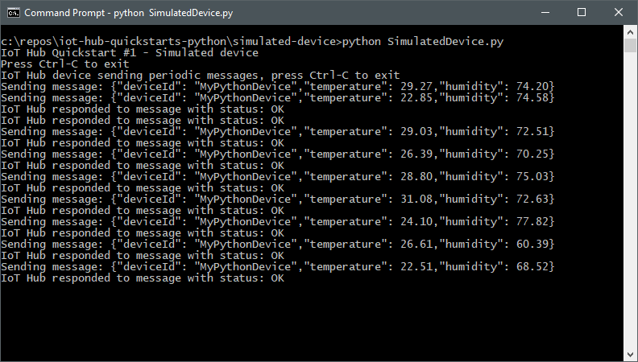
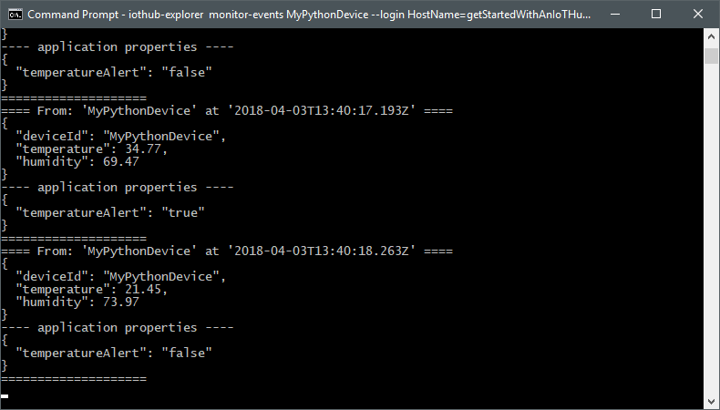

# Quickstart: Send telemetry from a device to an IoT hub and read the telemetry from the hub with a back-end application (Python)

[!INCLUDE [iot-hub-quickstarts-1-selector](../../includes/iot-hub-quickstarts-1-selector.md)]

IoT Hub is an Azure service that enables you to ingest high volumes of telemetry from your IoT devices into the cloud for storage or processing. In this quickstart, you send telemetry from a simulated device application, through IoT Hub, to a back-end application for processing.

The quickstart uses a pre-written Python application to send the telemetry and a CLI utility to read the telemetry from the hub. Before you run these two applications, you create an IoT hub and register a device with the hub.

[!INCLUDE [cloud-shell-try-it.md](../../includes/cloud-shell-try-it.md)]

If you don’t have an Azure subscription, create a [free account](https://azure.microsoft.com/free/?WT.mc_id=A261C142F) before you begin.

## Prerequisites

The two sample applications you run in this quickstart are written using Python. You need either Python 2.7.x or 3.5.x on your development machine.

You can download Python for multiple platforms from [Python.org](https://www.python.org/downloads/).
The Python installer you choose should be based on the architecture of the system that you are working with. If your system CPU architecture is 32 bit then download x86, which is the default installer on Python.org and for the 64bit architecture you need to download x86-64 installer.

You can verify the current version of Python on your development machine using one of the following commands:

```python
python --version
```

```python
python3 --version
```

Download the sample Python project from https://github.com/Azure-Samples/azure-iot-samples-python/archive/master.zip and extract the ZIP archive.

## Create an IoT hub

[!INCLUDE [iot-hub-quickstarts-create-hub](../../includes/iot-hub-quickstarts-create-hub.md)]

## Register a device

A device must be registered with your IoT hub before it can connect. In this quickstart, you use the Azure CLI to register a simulated device.

1. Add the IoT Hub CLI extension and create the device identity. Replace `{YourIoTHubName}` with the name you chose for your IoT hub:

    ```azurecli-interactive
    az extension add --name azure-cli-iot-ext
    az iot hub device-identity create --hub-name {YourIoTHubName} --device-id MyPythonDevice
    ```

    If you choose a different name for your device, update the device name in the sample application before you run it.

1. Run the following command to get the _device connection string_ for the device you just registered:

    ```azurecli-interactive
    az iot hub device-identity show-connection-string --hub-name {YourIoTHubName} --device-id MyPythonDevice --output table
    ```

    Make a note of the device connection string, which looks like `Hostname=...=`. You use this value later in the quickstart.

## Send simulated telemetry

The simulated device application connects to a device-specific endpoint on your IoT hub and sends simulated temperature and humidity telemetry.

1. In a terminal window, navigate to the root folder of the sample Python project. Then navigate to the **iot-hub\Quickstarts\simulated-device** folder.

1. Open the **SimulatedDevice.py** file in a text editor of your choice.

    Replace the value of the `CONNECTION_STRING` variable with the device connection string you made a note of previously. Then save your changes to **SimulatedDevice.py** file.

1. In the terminal window, run the following commands to install the required libraries for the simulated device application:

    ```cmd/sh
    pip install azure-iothub-device-client
    ```

1. In the terminal window, run the following commands to run the simulated device application:

    ```cmd/sh
    python SimulatedDevice.py
    ```

    The following screenshot shows the output as the simulated device application sends telemetry to your IoT hub:

    

## Read the telemetry from your hub

The IoT Hub CLI extension can connect to the service-side **Events** endpoint on your IoT Hub. The extension receives the device-to-cloud messages sent from your simulated device. An IoT Hub back-end application typically runs in the cloud to receive and process device-to-cloud messages.

Run the following Azure CLI commands, replacing `{YourIoTHubName}` with the name of your IoT hub:

```azurecli-interactive
az iot hub monitor-events --device-id MyPythonDevice --hub-name {YourIoTHubName}
```

The following screenshot shows the output as the extension receives telemetry sent by the simulated device to the hub:



## Clean up resources

[!INCLUDE [iot-hub-quickstarts-clean-up-resources](../../includes/iot-hub-quickstarts-clean-up-resources.md)]

## Next steps

In this quickstart, you've setup an IoT hub, registered a device, sent simulated telemetry to the hub using a Python application, and read the telemetry from the hub using a simple back-end application.

To learn how to control your simulated device from a back-end application, continue to the next quickstart.

> [!div class="nextstepaction"]
> [Quickstart: Control a device connected to an IoT hub](quickstart-control-device-python.md)