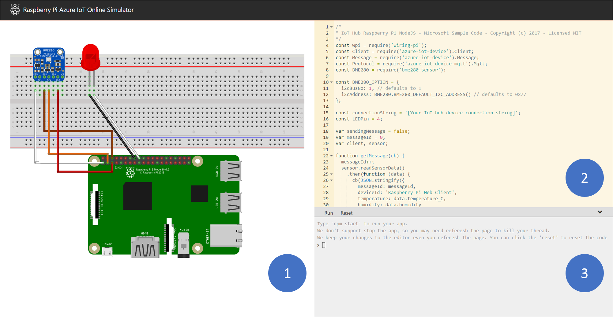
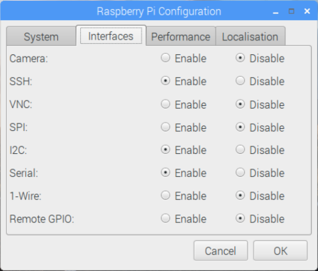

# Connect Raspberry Pi to Azure IoT Hub

This article provides basic steps for getting starting with connecting a Raspberry Pi that's running Raspberry Pi OS to the cloud by using [Azure IoT Hub](about-iot-hub.md). You can use a physical Raspberry Pi device or an online device emulator.

## Prerequisites

Have the following prerequisites prepared before starting this article:

* An Azure subscription.
* An IoT hub with a device registered to it. If you don't have a hub with a registered device already, see [Create an IoT hub using the Azure portal](./iot-hub-create-through-portal.md).

## Use the online simulator

Select the following button to start Raspberry Pi online simulator.

> [!div class="button"]
> <a href="https://azure-samples.github.io/raspberry-pi-web-simulator/#GetStarted" target="_blank">Start Raspberry Pi Simulator</a>

There are three areas in the web simulator.

1. Assembly area - A graphic depiction of the Pi simulator, including connections between the Pi and two devices:

   * A BME280 humidity sensor connected to I2C.1
   * An LED connected to GPIO 4

2. Coding area - An online code editor for you to code with Raspberry Pi. The default sample application collects sensor data from the simulated BME280 sensor and sends that data to your IoT hub. The application is fully compatible with real Pi devices.

3. Integrated console window - A window that shows the output of your code. At the top of this window, there are three buttons.

   * **Run** - Run the application in the coding area.

   * **Reset** - Reset the coding area to the default sample application.

   * **Collapse/Expand** - On the right side, there's a button for you to collapse or expand the console window.

> [!NOTE]
> The Raspberry Pi web simulator is currently archived and no longer being actively maintained. The source code is public on GitHub: [raspberry-pi-web-simulator](https://github.com/Azure-Samples/raspberry-pi-web-simulator).

### Run a sample application on the Pi web simulator

1. In the coding area, make sure you're working with the default sample application. Replace the placeholder in line 15 with a device connection string from your IoT hub.

   

2. Select **Run** or type `npm start` in the integrated console window to run the application.

You should see the following output that shows the sensor data and the messages that are sent to your IoT hub:

## Use a physical device

The following sections walk through setting up a Raspberry Pi solution, including:

* A Raspberry Pi device

  >[!NOTE]
  >The steps in this article have been tested on Raspberry Pi 2 and Raspberry Pi 3 boards.

* A monitor, a USB keyboard, and mouse that connects to Pi.

* A Mac or PC that is running Windows or Linux.

* An internet connection.

* A 16 GB or larger microSD card.

* A USB-SD adapter or microSD card to burn the operating system image onto the microSD card.

* A 5-volt 2-amp power supply with the 6-foot micro USB cable.

### Install the Raspberry Pi OS

Prepare the microSD card for installation of the Raspberry Pi OS image.

1. Download Raspberry Pi OS with desktop.

   a. [Raspberry Pi OS with desktop](https://www.raspberrypi.org/software/) (the .zip file).

   b. Extract the Raspberry Pi OS with desktop image to a folder on your computer.

2. Install Raspberry Pi OS with desktop to the microSD card.

   a. [Download and install the Etcher SD card burner utility](https://etcher.io/).

   b. Run Etcher and select the Raspberry Pi OS with desktop image that you extracted in step 1.

   c. Select the microSD card drive if it isn't selected already.

   d. Select Flash to install Raspberry Pi OS with desktop to the microSD card.

   e. Remove the microSD card from your computer when installation is complete. It's safe to remove the microSD card directly because Etcher automatically ejects or unmounts the microSD card upon completion.

   f. Insert the microSD card into Pi.

### Enable SSH and I2C

1. Connect Pi to the monitor, keyboard, and mouse.

2. Start Pi and then sign into Raspberry Pi OS by using `pi` as the user name and `raspberry` as the password.

3. Select the Raspberry icon > **Preferences** > **Raspberry Pi Configuration**.

   

4. On the **Interfaces** tab, set **SSH** and **I2C** to **Enable**, and then select **OK**.

    | Interface | Description |
    | --------- | ----------- |
    | *SSH* | Secure Shell (SSH) is used to remote into the Raspberry Pi with a remote command-line. SSH is the preferred method for issuing the commands to your Raspberry Pi remotely in this document. |
    | *I2C* | Inter-integrated Circuit (I2C) is a communications protocol used to interface with hardware such as sensors. This interface is required for interfacing with physical sensors in this article.|

    If you don't have physical sensors and want to use simulated sensor data from your Raspberry Pi device, you can leave **I2C** disabled.

   

> [!NOTE]
> To enable SSH and I2C, you can find more reference documents on [raspberrypi.org](https://www.raspberrypi.org/documentation/remote-access/ssh/) and [Adafruit.com](https://learn.adafruit.com/adafruits-raspberry-pi-lesson-4-gpio-setup/configuring-i2c).

### Connect Pi to the network

Turn on Pi by using the micro USB cable and the power supply. Use the Ethernet cable to connect Pi to your wired network or follow the [instructions from the Raspberry Pi Foundation](https://www.raspberrypi.org/documentation/configuration/wireless/) to connect Pi to your wireless network. After your Pi is connected to the network, you need to take a note of the [IP address of your Pi](https://www.raspberrypi.org/documentation/remote-access/ip-address.md).

> [!NOTE]
> Make sure that Pi is connected to the same network as your computer. For example, if your computer is connected to a wireless network while Pi is connected to a wired network, you might not see the IP address in the devdisco output.

### Run a sample application on the Pi

The following samples collect sensor data from a BME280 sensor (or can simulate the data if you don't have that hardware available) and send it to your IoT hub.

| SDK | Sample |
| --- | ------ |
| Python | [iot-hub-python-raspberrypi-client-app](https://github.com/Azure-Samples/iot-hub-python-raspberrypi-client-app) |
| C | [iot-hub-c-raspberrypi-client-app](https://github.com/Azure-Samples/iot-hub-c-raspberrypi-client-app) |
| Node | [RaspberryPiApp](https://github.com/Azure-Samples/azure-iot-samples-node/tree/master/iot-hub/Tutorials/RaspberryPiApp) |

> [!NOTE]
> These samples are currently archived and no longer being actively maintained.
