# Tutorial: Use a simulated device to test connectivity with your IoT hub

In this tutorial, you use Azure IoT Hub portal tools and Azure CLI commands to test device connectivity. This tutorial also uses a simple device simulator that you run on your desktop machine.

If you don't have an Azure subscription, [create a free account](https://azure.microsoft.com/free/) before you begin.

In this tutorial, you learn how to:
> [!div class="checklist"]
> * Check your device authentication
> * Check device-to-cloud connectivity
> * Check cloud-to-device connectivity
> * Check device twin synchronization

[!INCLUDE [cloud-shell-try-it.md](../../includes/cloud-shell-try-it.md)]

## Prerequisites

The CLI scripts you run in this tutorial use the [Microsoft Azure IoT Extension for Azure CLI](https://github.com/Azure/azure-iot-cli-extension/blob/master/README.md). To install this extension, run the following CLI command:

```azurecli-interactive
az extension add --name azure-cli-iot-ext
```

The device simulator application you run in this tutorial is written using Node.js. You need Node.js v10.x.x or later on your development machine.

You can download Node.js for multiple platforms from [nodejs.org](https://nodejs.org).

You can verify the current version of Node.js on your development machine using the following command:

```cmd/sh
node --version
```

Download the sample device simulator Node.js project from https://github.com/Azure-Samples/azure-iot-samples-node/archive/master.zip and extract the ZIP archive.

## Create an IoT hub

If you created a free or standard tier IoT hub in a previous quickstart or tutorial, you can skip this step.

[!INCLUDE [iot-hub-tutorials-create-free-hub](../../includes/iot-hub-tutorials-create-free-hub.md)]

## Check device authentication

A device must authenticate with your hub before it can exchange any data with the hub. You can use the **IoT Devices** tool in the **Device Management** section of the portal to manage your devices and check the authentication keys they're using. In this section of the tutorial, you add a new test device, retrieve its key, and check that the test device can connect to the hub. Later you reset the authentication key to observe what happens when a device tries to use an outdated key. This section of the tutorial uses the Azure portal to create, manage, and monitor a device, and the sample Node.js device simulator.

Sign in to the portal and navigate to your IoT hub. Then navigate to the **IoT Devices** tool:

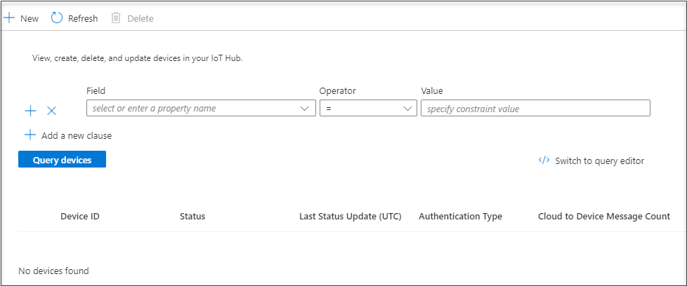

To register a new device, click **+ Add**, set **Device ID** to **MyTestDevice**, and click **Save**:

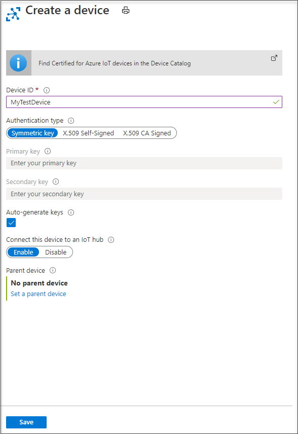

To retrieve the connection string for **MyTestDevice**, click on it in the list of devices and then copy the **Connection string-primary key** value. The connection string includes the *shared access key* for the device.

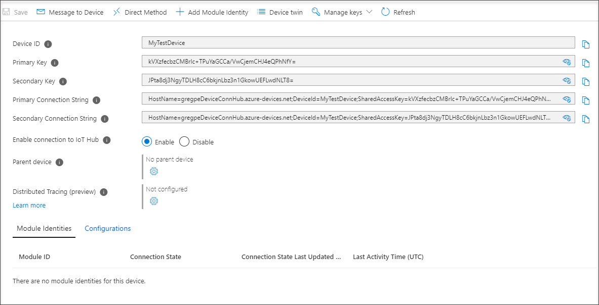

To simulate **MyTestDevice** sending telemetry to your IoT hub, run the Node.js simulated device application you downloaded previously.

In a terminal window on your development machine, navigate to the root folder of the sample Node.js project you downloaded. Then navigate to the **iot-hub\Tutorials\ConnectivityTests** folder.

In the terminal window, run the following commands to install the required libraries and run the simulated device application. Use the device connection string you made a note of when you added the device in the portal.

```cmd/sh
npm install
node SimulatedDevice-1.js "{your device connection string}"
```

The terminal window displays information as it tries to connect to your hub:

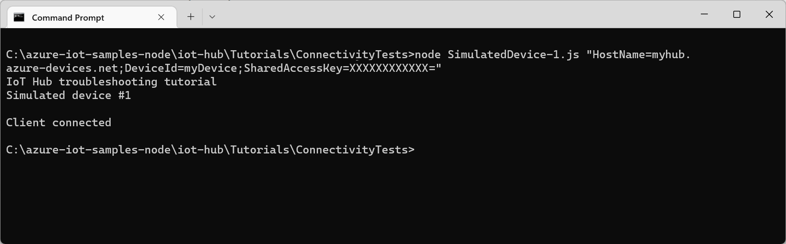

You've now successfully authenticated from a device using a device key generated by your IoT hub.

### Reset keys

In this section, you reset the device key and observe the error when the simulated device tries to connect.

To reset the primary device key for **MyTestDevice**, run the following commands:

```azurecli-interactive
# Generate a new Base64 encoded key using the current date
read key < <(date +%s | sha256sum | base64 | head -c 32)

# Requires the IoT Extension for Azure CLI
# az extension add --name azure-cli-iot-ext

# Reset the primary device key for MyTestDevice
az iot hub device-identity update --device-id MyTestDevice --set authentication.symmetricKey.primaryKey=$key --hub-name {YourIoTHubName}
```

In the terminal window on your development machine, run the simulated device application again:

```cmd/sh
npm install
node SimulatedDevice-1.js "{your device connection string}"
```

This time you see an authentication error when the application tries to connect:

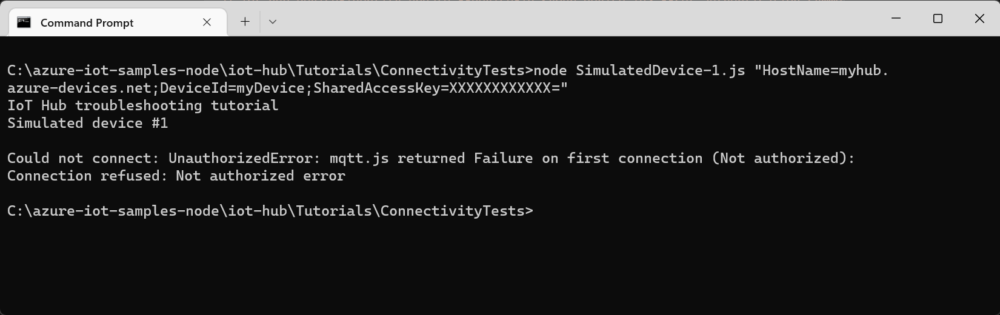

### Generate shared access signature (SAS) token

If your device uses one of the IoT Hub device SDKs, the SDK library code generates the SAS token used to authenticate with the hub. A SAS token is generated from the name of your hub, the name of your device, and the device key.

In some scenarios, such as in a cloud protocol gateway or as part of a custom authentication scheme, you may need to generate the SAS token yourself. To troubleshoot issues with your SAS generation code, it's useful to generate a known-good SAS token to use during testing.

> [!NOTE]
> The SimulatedDevice-2.js sample includes examples of generating a SAS token both with and without the SDK.

To generate a known-good SAS token using the CLI, run the following command:

```azurecli-interactive
az iot hub generate-sas-token --device-id MyTestDevice --hub-name {YourIoTHubName}
```

Make a note of the full text of the generated SAS token. A SAS token looks like the following: `SharedAccessSignature sr=tutorials-iot-hub.azure-devices.net%2Fdevices%2FMyTestDevice&sig=....&se=1524155307`

In a terminal window on your development machine, navigate to the root folder of the sample Node.js project you downloaded. Then navigate to the **iot-hub\Tutorials\ConnectivityTests** folder.

In the terminal window, run the following commands to install the required libraries and run the simulated device application:

```cmd/sh
npm install
node SimulatedDevice-2.js "{Your SAS token}"
```

The terminal window displays information as it tries to connect to your hub using the SAS token:

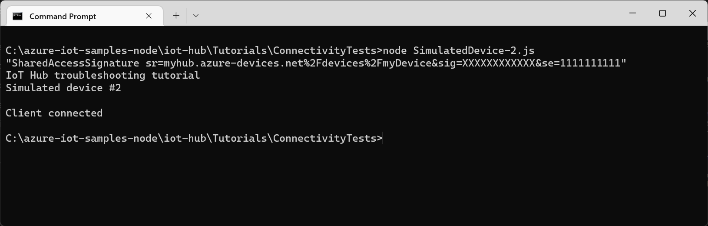

You've now successfully authenticated from a device using a test SAS token generated by a CLI command. The **SimulatedDevice-2.js** file includes sample code that shows you how to generate a SAS token in code.

### Protocols

A device can use any of the following protocols to connect to your IoT hub:

| Protocol | Outbound port |
| --- | --- |
| MQTT |8883 |
| MQTT over WebSockets |443 |
| AMQP |5671 |
| AMQP over WebSockets |443 |
| HTTPS |443 |

If the outbound port is blocked by a firewall, the device can't connect:

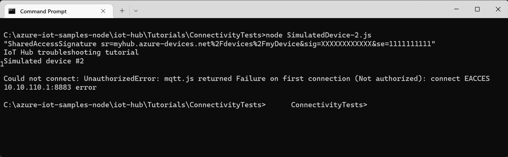

## Check device-to-cloud connectivity

After a device connects, it typically tries to send telemetry to your IoT hub. This section shows you how you can verify that the telemetry sent by the device reaches your hub.

First, retrieve the current connection string for your simulated device using the following command:

```azurecli-interactive
az iot hub device-identity show-connection-string --device-id MyTestDevice --output table --hub-name {YourIoTHubName}
```

To run a simulated device that sends messages, navigate to the **iot-hub\Tutorials\ConnectivityTests** folder in the code you downloaded.

In the terminal window, run the following commands to install the required libraries and run the simulated device application:

```cmd/sh
npm install
node SimulatedDevice-3.js "{your device connection string}"
```

The terminal window displays information as it sends telemetry to your hub:

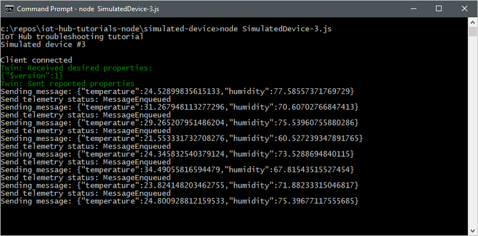

You can use **Metrics** in the portal to verify that the telemetry messages are reaching your IoT hub. Select your IoT hub in the **Resource** drop-down, select **Telemetry messages sent** as the metric, and set the time range to **Past hour**. The chart shows the aggregate count of messages sent by the simulated device:

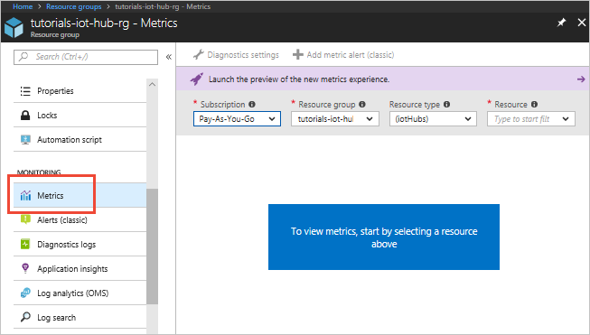

It takes a few minutes for the metrics to become available after you start the simulated device.

## Check cloud-to-device connectivity

This section shows how you can make a test direct method call to a device to check cloud-to-device connectivity. You run a simulated device on your development machine to listen for direct method calls from your hub.

In a terminal window, use the following command to run the simulated device application:

```cmd/sh
node SimulatedDevice-3.js "{your device connection string}"
```

Use a CLI command to call a direct method on the device:

```azurecli-interactive
az iot hub invoke-device-method --device-id MyTestDevice --method-name TestMethod --timeout 10 --method-payload '{"key":"value"}' --hub-name {YourIoTHubName}
```

The simulated device prints a message to the console when it receives a direct method call:

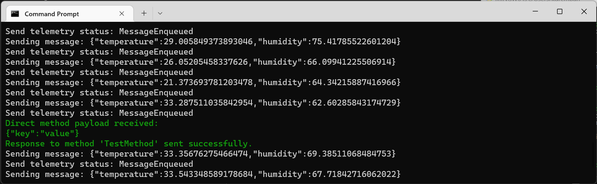

When the simulated device successfully receives the direct method call, it sends an acknowledgement back to the hub:

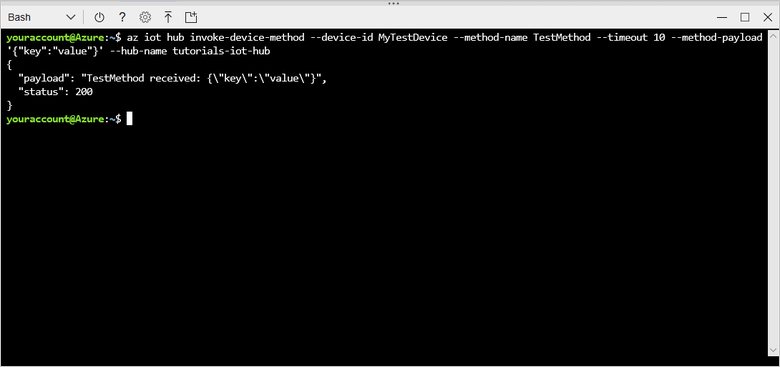

## Check twin synchronization

Devices use twins to synchronize state between the device and the hub. In this section, you use CLI commands to send _desired properties_ to a device and read the _reported properties_ sent by the device.

The simulated device you use in this section sends reported properties to the hub whenever it starts up, and prints desired properties to the console whenever it receives them.

In a terminal window, use the following command to run the simulated device application:

```cmd/sh
node SimulatedDevice-3.js "{your device connection string}"
```

To verify that the hub received the reported properties from the device, use the following CLI command:

```azurecli-interactive
az iot hub device-twin show --device-id MyTestDevice --hub-name {YourIoTHubName}
```

In the output from the command, you can see the **devicelaststarted** property in the reported properties section. This property shows the date and time you last started the simulated device.


To verify that the hub can send desired property values to the device, use the following CLI command:

```azurecli-interactive
az iot hub device-twin update --set properties.desired='{"mydesiredproperty":"propertyvalue"}' --device-id MyTestDevice --hub-name {YourIoTHubName}
```

The simulated device prints a message when it receives a desired property update from the hub:

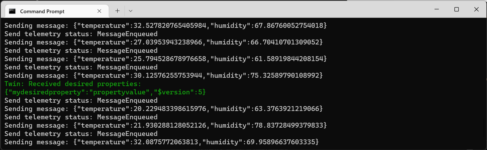

In addition to receiving desired property changes as they're made, the simulated device automatically checks for desired properties when it starts up.

## Clean up resources

If you don't need the IoT hub any longer, delete it and the resource group in the portal. To do so, select the **tutorials-iot-hub-rg** resource group that contains your IoT hub and click **Delete**.

## Next steps

In this tutorial, you've seen how to check your device keys, check device-to-cloud connectivity, check cloud-to-device connectivity, and check device twin synchronization. To learn more about how to monitor your IoT hub, visit the how-to article for IoT Hub monitoring.

> [!div class="nextstepaction"]
> [Monitor with diagnostics](iot-hub-monitor-resource-health.md)
