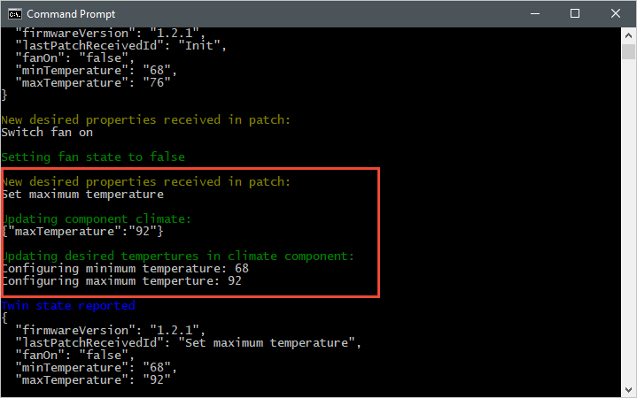
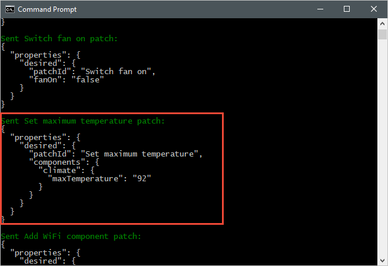
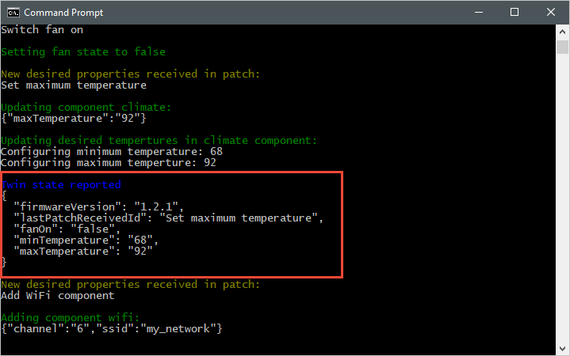
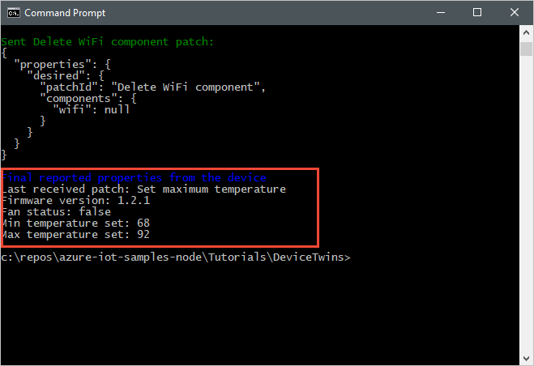

# Tutorial: Configure your devices from a back-end service

As part of the device lifecycle, you may need to configure your IoT devices from your back-end service. When you send a desired configuration to your devices, you also want to receive status and compliance updates from those devices. For example, you might set a target operational temperature range for a device or collect firmware version information from your devices.

To synchronize state information between a device and an IoT hub, you use _device twins_. A [device twin](iot-hub-devguide-device-twins.md) is a JSON document, associated with a specific device, and stored by IoT Hub in the cloud where you can [query](iot-hub-devguide-query-language.md) them. A device twin contains _desired properties_, _reported properties_, and _tags_.

* A _desired property_ is set by a back-end application and read by a device.
* A _reported property_ is set by a device and read by a back-end application. 
* A _tag_ is set by a back-end application and is never sent to a device. You use tags to organize your devices.

This tutorial shows you how to use desired and reported properties to synchronize state information.

:::image type="content" source="media/tutorial-device-twins/DeviceTwins.png" alt-text="Diagram of device twins on the device and in the cloud.":::

In this tutorial, you perform the following tasks:

> [!div class="checklist"]
>
> * Create an IoT hub and add a test device to the identity registry.
> * Use desired properties to send state information to your simulated device.
> * Use reported properties to receive state information from your simulated device.

If you don't have an Azure subscription, create a [free account](https://azure.microsoft.com/free/?WT.mc_id=A261C142F) before you begin.

## Prerequisites

* This tutorial uses the Azure CLI to create cloud resources. If you already have an IoT hub with a device registered to it, you can skip those steps. There are two ways to run CLI commands:

  * Use the Bash environment in [Azure Cloud Shell](../cloud-shell/quickstart.md). For more information, see [Azure Cloud Shell Quickstart - Bash](../cloud-shell/quickstart.md).
   [](https://shell.azure.com)
  * If you prefer to run CLI reference commands locally, [install](/cli/azure/install-azure-cli) the Azure CLI. If you're running on Windows or macOS, consider running Azure CLI in a Docker container. For more information, see [How to run the Azure CLI in a Docker container](/cli/azure/run-azure-cli-docker).

    * Sign in to the Azure CLI by using the [az login](/cli/azure/reference-index#az-login) command. 
    * When you're prompted, install Azure CLI extensions on first use. For more information about extensions, see [Use extensions with the Azure CLI](/cli/azure/azure-cli-extensions-overview).
    * Run [az version](/cli/azure/reference-index?#az-version) to find the version and dependent libraries that are installed. To upgrade to the latest version, run [az upgrade](/cli/azure/reference-index?#az-upgrade).

* The two sample applications you run in this tutorial are written using Node.js. You need Node.js v10.x.x or later on your development machine.

  * You can download Node.js for multiple platforms from [nodejs.org](https://nodejs.org).
  * You can verify the current version of Node.js on your development machine using the following command:

    ```cmd/sh
    node --version
    ```

* Clone or download the sample Node.js project from [Azure IoT samples for Node.js](https://github.com/Azure-Samples/azure-iot-samples-node).

* Make sure that port 8883 is open in your firewall. The device sample in this tutorial uses MQTT protocol, which communicates over port 8883. This port may be blocked in some corporate and educational network environments. For more information and ways to work around this issue, see [Connecting to IoT Hub (MQTT)](../iot/iot-mqtt-connect-to-iot-hub.md#connecting-to-iot-hub).

## Set up Azure resources

To complete this tutorial, your Azure subscription must contain an IoT hub with a device added to the device identity registry. The entry in the device identity registry enables the simulated device you run in this tutorial to connect to your hub.

If you don't already have an IoT hub set up in your subscription, you can set one up with the following CLI script. This script uses the name **tutorial-iot-hub** with a random number appended for the IoT hub name. You can replace this name with your own globally unique name when you run it. The script creates the resource group and hub in the **Central US** region, which you can change to a region closer to you. The script retrieves your IoT hub service connection string, which you use in the back-end sample to connect to your IoT hub:

```azurecli-interactive
let "randomIdentifier=$RANDOM*$RANDOM"  
hubname="tutorial-iot-hub-$randomIdentifier"
location=centralus

# Install the IoT extension if it's not already installed:
az extension add --name azure-iot

# Create a resource group:
az group create --name tutorial-iot-hub-rg --location $location

# Create your free-tier IoT hub. You can only have one free IoT hub per subscription.
# Change the sku to S1 to create a standard-tier hub if necessary.
az iot hub create --name $hubname --location $location --resource-group tutorial-iot-hub-rg --partition-count 2 --sku F1

# Make a note of the service connection string, you need it later:
az iot hub connection-string show --hub-name $hubname --policy-name service -o table

```

This tutorial uses a simulated device called **MyTwinDevice**. The following script adds this device to your identity registry and retrieves its connection string:

```azurecli-interactive
# Create the device in the identity registry:
az iot hub device-identity create --device-id MyTwinDevice --hub-name $hubname --resource-group tutorial-iot-hub-rg

# Retrieve the device connection string, you need this later:
az iot hub device-identity connection-string show --device-id MyTwinDevice --hub-name $hubname --resource-group tutorial-iot-hub-rg -o table

```

## Send state information to a device

You use desired properties to send state information from a back-end application to a device. In this section, you see how to:

* Configure a device to receive and process desired properties.
* Send desired properties from a back-end application to a device.

### Sample desired properties

You can structure your desired properties in any way that's convenient to your application. This example uses one top-level property called **fanOn** and groups the remaining properties into separate **components**. The following JSON snippet shows the structure of the desired properties this tutorial uses. The JSON is in the desired.json file.

[!code[Sample desired properties](~/iot-samples-node/iot-hub/Tutorials/DeviceTwins/desired.json "Sample desired properties")]

### Receive desired properties in a device application

To view the simulated device sample code that receives desired properties, navigate to the **iot-hub/Tutorials/DeviceTwins** folder in the sample Node.js project you downloaded. Then open the SimulatedDevice.js file in a text editor.

The following sections describe the code that runs on the simulated device that responds to desired property changes sent from the back end application.

#### Retrieve the device twin object

When you registered your device with the IoT hub, you got a device connection string as output. A device connection string is used by the device to authenticate with its registered identity in the cloud. The following code connects to your IoT hub using a device connection string:

[!code-javascript[Create IoT Hub client](~/iot-samples-node/iot-hub/Tutorials/DeviceTwins/SimulatedDevice.js?name=createhubclient&highlight=2 "Create IoT Hub client")]

The following code gets a twin from the client object:

[!code-javascript[Get twin](~/iot-samples-node/iot-hub/Tutorials/DeviceTwins/SimulatedDevice.js?name=gettwin&highlight=2 "Get twin")]

#### Create handlers

You can create handlers for desired property updates that respond to updates at different levels in the JSON hierarchy. For example, this handler sees all desired property changes sent to the device from a back-end application. The **delta** variable contains the desired properties sent from the solution back end:

[!code-javascript[Handle all properties](~/iot-samples-node/iot-hub/Tutorials/DeviceTwins/SimulatedDevice.js?name=allproperties&highlight=2 "Handle all properties")]

The following handler only reacts to changes made to the **fanOn** desired property:

[!code-javascript[Handle fan property](~/iot-samples-node/iot-hub/Tutorials/DeviceTwins/SimulatedDevice.js?name=fanproperty&highlight=2 "Handle fan property")]

#### Handlers for multiple properties

In the [sample desired properties](#sample-desired-properties) JSON for this tutorial, the **climate** node under **components** contains two properties, **minTemperature** and **maxTemperature**.

A device's local **twin** object stores a complete set of desired and reported properties. The **delta** sent from the back end might update just a subset of desired properties. In the following code snippet, if the simulated device receives an update to just one of **minTemperature** and **maxTemperature**, it uses the value in the local twin for the other value to configure the device:

[!code-javascript[Handle climate component](~/iot-samples-node/iot-hub/Tutorials/DeviceTwins/SimulatedDevice.js?name=climatecomponent&highlight=2 "Handle climate component")]

#### Handle insert, update, and delete operations

The desired properties sent from the back end don't indicate what operation is being performed on a particular desired property. Your code needs to infer the operation from the current set of desired properties stored locally and the changes sent from the hub.

The following snippet shows how the simulated device handles insert, update, and delete operations on the list of **components** in the desired properties. You can see how to use **null** values to indicate that a component should be deleted:

[!code-javascript[Handle components](~/iot-samples-node/iot-hub/Tutorials/DeviceTwins/SimulatedDevice.js?name=components&highlight=2,6,13 "Handle components")]

### Send desired properties from a back end application

You've seen how a device implements handlers for receiving desired property updates. This section shows you how to send desired property changes to a device from a back-end application.

To view the simulated device sample code that receives desired properties, navigate to the **iot-hub/Tutorials/DeviceTwins** folder in the sample Node.js project you downloaded. Then open the ServiceClient.js file in a text editor.

The following code snippet shows how to connect to the device identity registry and access the twin for a specific device:

[!code-javascript[Create registry and get twin](~/iot-samples-node/iot-hub/Tutorials/DeviceTwins/ServiceClient.js?name=getregistrytwin&highlight=2,6 "Create registry and get twin")]

The following snippet shows different desired property *patches* the back end application sends to the device:

[!code-javascript[Patches sent to device](~/iot-samples-node/iot-hub/Tutorials/DeviceTwins/ServiceClient.js?name=patches&highlight=2,12,26,41,56 "Patches sent to device")]

The following snippet shows how the back-end application sends a desired property update to a device:

[!code-javascript[Send desired properties](~/iot-samples-node/iot-hub/Tutorials/DeviceTwins/ServiceClient.js?name=senddesiredproperties&highlight=2 "Send desired properties")]

## Receive state information from a device

Your back-end application receives state information from a device as reported properties. A device sets the reported properties, and sends them to your hub. A back-end application can read the current values of the reported properties from the device twin stored in your hub.

### Send reported properties from a device

You can send updates to reported property values as a patch. The following snippet shows a template for the patch the simulated device sends. The simulated device updates the fields in the patch before sending it to the hub:

[!code-javascript[Reported properties patches](~/iot-samples-node/iot-hub/Tutorials/DeviceTwins/SimulatedDevice.js?name=reportedpatch&highlight=2 "Reported properties patches")]

The simulated device uses the following function to send the patch that contains the reported properties to the hub:

[!code-javascript[Send reported properties](~/iot-samples-node/iot-hub/Tutorials/DeviceTwins/SimulatedDevice.js?name=sendreportedproperties&highlight=2 "Send reported properties")]

### Process reported properties

A back-end application accesses the current reported property values for a device through the device twin. The following snippet shows you how the back-end application reads the reported property values for the simulated device:

[!code-javascript[Display reported properties](~/iot-samples-node/iot-hub/Tutorials/DeviceTwins/ServiceClient.js?name=displayreportedproperties&highlight=2 "Display reported properties")]

### Run the applications

In this section, you run the two sample applications to observe as a back-end application sends desired property updates to a simulated device application.

To run the simulated device and back-end applications, you need the device and service connection strings. You made a note of the connection strings when you created the resources at the start of this tutorial.

To run the simulated device application, open a shell or command prompt window and navigate to the **iot-hub/Tutorials/DeviceTwins** folder in the Node.js project you downloaded. Then run the following commands:

```cmd/sh
npm install
node SimulatedDevice.js "{your device connection string}"
```

To run the back-end application, open another shell or command prompt window. Then navigate to the **iot-hub/Tutorials/DeviceTwins** folder in the Node.js project you downloaded. Then run the following commands:

```cmd/sh
npm install
node ServiceClient.js "{your service connection string}"
```

#### Observe desired property updates

The following screenshot shows the output from the simulated device application and highlights how it handles an update to the **maxTemperature** desired property. You can see how both the top-level handler and the climate component handlers run:



The following screenshot shows the output from the back-end application and highlights how it sends an update to the **maxTemperature** desired property:



#### Observe reported property updates

The following screenshot shows the output from the simulated device application and highlights how it sends a reported property update to your hub:



The following screenshot shows the output from the back-end application and highlights how it receives and processes a reported property update from a device:



## Clean up resources

If you plan to complete the next tutorial, leave the resource group and the IoT hub to reuse them later.

If you don't need the IoT hub any longer, delete it and the resource group in the portal. To do so, select the **tutorial-iot-hub-rg** resource group that contains your IoT hub and select **Delete**.

Alternatively, use the CLI:

```azurecli-interactive
# Delete your resource group and its contents
az group delete --name tutorial-iot-hub-rg
```

## Next steps

In this tutorial, you learned how to synchronize state information between your devices and your IoT hub. Advance to the next tutorial to learn how to use device twins to implement the device update process.

> [!div class="nextstepaction"]
> [Implement a device update for Azure IoT Hub tutorial using the Raspberry Pi 3 B+ Reference Image](../iot-hub-device-update/device-update-raspberry-pi.md).
