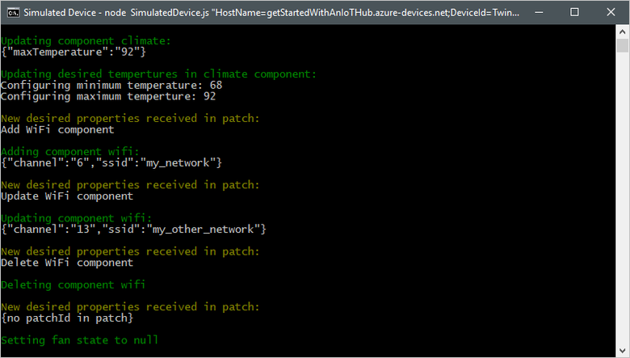

# Tutorial: Manage the state of a device from a back-end service

In addition to sending telemetry to your IoT hub, a device may report status such as its current firmware or network configuration. You may also need to configure a device from a back-end application. For example, setting a target temperature or other operational parameters.

To synchronize state information between a device and an IoT hub, you use *device twins*. A device twin is a JSON document, associated with a specific device, and stored in your IoT hub's device identity registry. A device twin contains desired properties, reported properties, and tags. A desired property is set by a back-end application and read by a device. A reported property is set by a device and read by a back-end application. A tag is set by a back-end application and is never sent to a device. This tutorial shows you how to use desired and reported properties to synchronize state information.

In this tutorial, you perform the following tasks:

> [!div class="checklist"]
> * Create an IoT hub and add a test device to the identity registry.
> * Set desired properties in your solution back-end.
> * Receive and process desired properties in a simulated device.
> * Set reported properties in your simulated device.
> * Receive and process reported properties in your solution back-end.

[!INCLUDE [cloud-shell-try-it.md](../../includes/cloud-shell-try-it.md)]

If you don’t have an Azure subscription, create a [free account](https://azure.microsoft.com/free/?WT.mc_id=A261C142F) before you begin.

## Prerequisites

The two sample applications you run in this quickstart are written using Node.js. You need Node.js v4.x.x or later on your development machine.

You can download Node.js for multiple platforms from [nodejs.org](https://nodejs.org).

You can verify the current version of Node.js on your development machine using the following command:

```cmd/sh
node --version
```

Download the sample Node.js project from https://github.com/Azure-Samples/azure-iot-samples-node/archive/master.zip and extract the ZIP archive.

## Set up resources

To complete this tutorial, you need an IoT hub with a device added to the device identity registry.

If you don't already have an IoT hub set up in your subscription, you can use the following CLI script to set one up. This script uses the name **tutorial-iot-hub** for the IoT hub, you should replace this name with your own unique name when you run the script. The script creates the resource group and hub in the **West US** region, you can change to a region closer to you:

```azurecli-interactive
hubname=tutorial-iot-hub
location=westus

# Install the IoT extension if it's not already installed:
az extension add --name azure-cli-iot-ext

# Create a resource group:
az group create --name tutorial-iot-hub-rg --location $location

# Create your free-tier IoT Hub. You can only have one free IoT Hub per subscription:
az iot hub create --name $hubname --location $location --resource-group tutorial-iot-hub-rg --sku S1

# Make a note of the service connection string, you need it later:
az iot hub show-connection-string --name $hub-name -o table

```

This tutorial uses a simulated device called **MyTwinDevice**. The following script adds this device to your identity registry and retrieves its connection string:

```azurecli-interactive
# Set the name of your IoT hub:
hubname=tutorial-iot-hub

# Install the IoT extension if it's not already installed:
az extension add --name azure-cli-iot-ext

# Create the device in the identity registry:
az iot hub device-identity create --device-id MyTwinDevice --hub-name $hubname --resource-group tutorial-iot-hub-rg

# Retrieve the device connection string, you need this later:
az iot hub device-identity show-connection-string --device-id MyTwinDevice --hub-name $hubname --resource-group tutorial-iot-hub-rg -o table

```

## Receive desired properties

You use desired properties to send state information from a back-end application to a device. In this section, you first see how to receive and process desired properties on a device, and then how to send desired properties from a back-end application.

To view the simulated device sample code that receives desired properties, navigate to the **Tutorials/DeviceTwins** folder in the sample Node.js project you downloaded. Then open the SimulatedDevice.js file in a text editor.

### Retrieve the device twin object

The following code connects to your IoT hub and gets a device twin object:

```nodejs
// Create the IoTHub client
var client = Client.fromConnectionString(connectionString, Protocol);

// Get the device twin
client.getTwin(function(err, twin) {
  ...
});
```

### Sample desired properties

The following snippet shows the structure of the desired properties JSON used in this tutorial:

```json
{
  "fanOn": "true",
  "components": {
    "system": {
      "id": "17",
      "units": "farenheit",
      "firmwareVersion": "9.75"
    },
    "wifi" : {
      "channel" : "6",
      "ssid": "my_network"
    },
    "climate" : {
      "minTemperature": "68",
      "maxTemperature": "76"
    }
  }
}
```

### Create handlers

You can create handlers for desired property updates that respond to updates at different levels in the hierarchy. For example, this handler sees all desired property changes. The **delta** variable contains the desired properties sent from the solution backend:

```nodejs
twin.on('properties.desired', function(delta) {
  ...
});
```

The following handler only reacts to changes made to the **fanOn** desired property:

```node.js
twin.on('properties.desired.fanOn', function(fanOn) {
  ...
});
```

### Handlers for multiple properties

In the example desired properties JSON shown previously, the **climate** node under **components** contains two properties, **minTemperature** and **maxTemperature**. A back-end application could send an update to one, or other, or both of these properties. In the following code snippet, when the simulated device receives an update to either value, it uses the values in the local twin to configure the device:

```nodejs
twin.on('properties.desired.components.climate', function(delta) {
    if (delta.minTemperature || delta.maxTemperature) {
      console.log(chalk.green('\nUpdating desired tempertures in climate component:'));
      console.log('Configuring minimum temperature: ' + twin.properties.desired.components.climate.minTemperature);
      console.log('Configuring maximum temperture: ' + twin.properties.desired.components.climate.maxTemperature);
    }
});
```

The local **twin** object stores a complete set of properties, a **delta** sent from the back end might update just a subset of desired properties.

### Handle insert, update, and delete operations

The desired properties sent from the back end do not indicate what operation is being performed on a particular desired property. Your code needs to infer the operation from the current set of desired properties stored locally and the changes sent from the hub.

The following snippet shows how the simulated device handles insert, update, and delete operations on the list of components in the desired properties. You can see how **null** values are used to indicate that a component should be deleted:

```nodejs
// Keep track of all the components the device knows about
var componentList = {};

// Use this internal list and compare it to the delta to infer
// if anything was added, deleted, or updated.
twin.on('properties.desired.components', function(delta) {
  if (delta === null) {
    componentList = {};
  }
  else {
    Object.keys(delta).forEach(function(key) {

      if (delta[key] === null && componentList[key]) {
        // The delta contains a null value, and the
        // device has a record of this component.
        // Must be a delete operation.
        console.log(chalk.green('\nDeleting component ' + key));
        delete componentList[key];

      } else if (delta[key]) {
        if (componentList[key]) {
          // The delta contains a component, and the
          // device has a record of it.
          // Must be an update operation.
          console.log(chalk.green('\nUpdating component ' + key + ':'));
          console.log(JSON.stringify(delta[key]));
          // Store the complete object instead of just the delta
          componentList[key] = twin.properties.desired.components[key];

        } else {
          // The delta contains a component, and the
          // device has no record of it.
          // Must be an add operation.
          console.log(chalk.green('\nAdding component ' + key + ':'));
          console.log(JSON.stringify(delta[key]));
          // Store the complete object instead of just the delta
          componentList[key] = twin.properties.desired.components[key];
        }
      }
    });
  }
});
```

### Send desired properties to a device from the back end

You've seen how a device can implement handlers for receiving desired property updates. This section shows you how to send desired property changes to a device from the back end.

To view the simulated device sample code that receives desired properties, navigate to the **Tutorials/DeviceTwins** folder in the sample Node.js project you downloaded. Then open the ServiceClient.js file in a text editor.

The following code snippet shows how to connect to the device identity registry and access the twin for a specific device:

```nodejs
var registry = Registry.fromConnectionString(connectionString);

registry.getTwin(deviceId, async (err, twin) => {
  ...
});
```

The following snippet shows an example desired properties path that changes the **fanOn** property on the device:

```nodejs
var twinPatchFanOn = {
  properties: {
    desired: {
      patchId: "Switch fan on",
      fanOn: "false",
    }
  }
};
```

The following snippet shows how the back-end application sends a desired property update to a device:

```nodejs
async function sendDesiredProperties(twin, patch) {
  twin.update(patch, (err, twin) => {
    ...
  });
}
```

### Run the applications

To run the simulated device and back-end applications, you need the device and service connection strings. You made a note of the connection strings when you created the resources in a previous step.

To run the simulated device application, open a shell or command prompt window and navigate to the **Tutorials/DeviceTwins** folder in the Node.js project you downloaded. Then run the following commands:

```cmd/sh
npm install
node SimulatedDevice.js "{your device connection string}"
```

To run the back-end application, open another shell or command prompt window. Then navigate to the **Tutorials/DeviceTwins** folder in the Node.js project you downloaded. Then run the following commands:

```cmd/sh
npm install
node ServiceClient.js "{your service connection string}"
```

The following screenshots show the output as the simulated device and back-end applications run:




## Send reported properties


## Clean up resources

If you plan to complete the next tutorial, leave the resource group and IoT hub and reuse them later.

If you don't need the IoT hub any longer, delete it and the resource group in the portal. To do so, select the **tutorial-iot-hub-rg** resource group that contains your IoT hub and click **Delete**.

Alternatively, use the CLI:

```azurecli-interactive
# Delete your resource group and its contents
az group delete --name tutorial-iot-hub-rg
```

## Next steps

In this tutorial, you learned how to synchronize state information between your devices and your IoT hub by performing the following tasks:

> [!div class="checklist"]
> * Create an IoT hub and add a test device to the identity registry.
> * Set desired properties in your solution back-end.
> * Receive and process desired properties in a simulated device.
> * Set reported properties in your simulated device.
> * Receive and process reported properties in your solution back-end.

Advance to the next tutorial to learn how to use device twins to implement a firmware update process.

> [!div class="nextstepaction"]
[Use device management to initiate a device firmware update](iot-hub-node-node-firmware-update.md)
