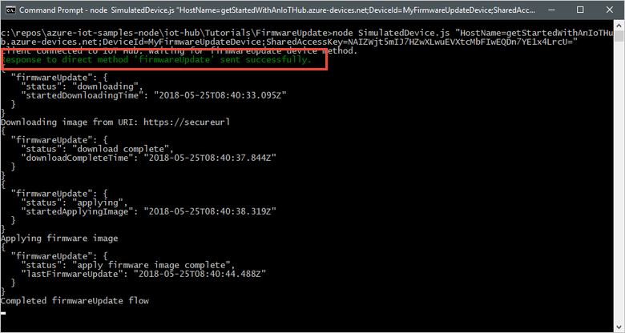
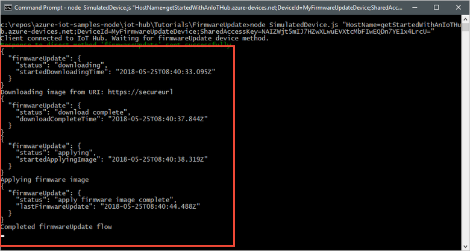

<!-- **TODO** Update publish config with repo paths before publishing! -->

# Tutorial: Implement a device firmware update process

You may need to update the firmware on the devices connected to your IoT hub. For example, you might want to add new features to the firmware or apply security patches. In many IoT scenarios, it's impractical to physically visit and then manually apply firmware updates to your devices. This tutorial shows how you can initiate and monitor the firmware update process remotely through a back-end application connected to your hub.

To initiate the firmware update process, this tutorial uses a _direct method_ to call a method on a simulated device from a back-end application. This method starts the firmware update process asynchronously on the device before sending an acknowledgemnt response. While the device is running the firmware update process, it reports its status to the back-end application using _device twin reported properties_. The back-end application monitors the reported properties sent from the device to track the firmware update process to completion:


In this tutorial, you complete the following tasks:

> [!div class="checklist"]
> * Create an IoT hub and add a test device to the device identity registry.
> * Asynchronously initiate the firmware update process on the test device.
> * Simulate the firmware update process on a device.
> * Receive status updates from the device as the firmware update progresses.

[!INCLUDE [cloud-shell-try-it.md](../../includes/cloud-shell-try-it.md)]

If you don’t have an Azure subscription, create a [free account](https://azure.microsoft.com/free/?WT.mc_id=A261C142F) before you begin.

## Prerequisites

The two sample applications you run in this quickstart are written using Node.js. You need Node.js v4.x.x or later on your development machine.

You can download Node.js for multiple platforms from [nodejs.org](https://nodejs.org).

You can verify the current version of Node.js on your development machine using the following command:

```cmd/sh
node --version
```

Download the sample Node.js project from https://github.com/Azure-Samples/azure-iot-samples-node/archive/master.zip and extract the ZIP archive.

## Set up Azure resources

To complete this tutorial, your Azure subscription must contain an IoT hub with a device added to the device identity registry. The entry in the device identity registry enables the simulated device you run in this tutorial to connect to your hub.

If you don't already have an IoT hub set up in your subscription, you can set one up with following CLI script. This script uses the name **tutorial-iot-hub** for the IoT hub, you should replace this name with your own unique name when you run it. The script creates the resource group and hub in the **Central US** region, which you can change to a region closer to you. The script retrieves your IoT hub service connection string, which you use in the back-end sample application to connect to your IoT hub:

```azurecli-interactive
hubname=tutorial-iot-hub
location=centralus

# Install the IoT extension if it's not already installed:
az extension add --name azure-cli-iot-ext

# Create a resource group:
az group create --name tutorial-iot-hub-rg --location $location

# Create your free-tier IoT Hub. You can only have one free IoT Hub per subscription:
az iot hub create --name $hubname --location $location --resource-group tutorial-iot-hub-rg --sku S1

# Make a note of the service connection string, you need it later:
az iot hub show-connection-string --hub-name $hub-name -o table

```

This tutorial uses a simulated device called **MyFirmwareUpdateDevice**. The following script adds this device to your device identity registry and retrieves its connection string:

```azurecli-interactive
# Set the name of your IoT hub:
hubname=tutorial-iot-hub

# Create the device in the identity registry:
az iot hub device-identity create --device-id MyFirmwareUpdateDevice --hub-name $hubname --resource-group tutorial-iot-hub-rg

# Retrieve the device connection string, you need this later:
az iot hub device-identity show-connection-string --device-id MyTwinDevice --hub-name $hubname --resource-group tutorial-iot-hub-rg -o table

```

## Initiate the firmware update

You use a direct method called from a back-end application to initiate the firmware update process. In this section, you see how to:

* Call a direct method from a back-end application.
* Respond to a direct method call in a device application.

### Call the direct method to initiate the firmware upgrade from the back-end application

To view the back-end application code that calls the direct method, navigate to the **iot-hub/Tutorials/FirmwareUpdate** folder in the sample Node.js project you downloaded. Then open the ServiceClient.js file in a text editor.

The back-end application uses the **waterfall** method to first initiate the firmware update process and then, after it receives a response from the device, start listening for status updates:

[!code-javascript[Service client logic](~/iot-samples-node/iot-hub/Tutorials/FirmwareUpdate/ServiceClient.js?name=appflow&highlight=3,4,5,6 "Service client logic")]

The back-end application calls the direct method on the device, waits for the response, and prints the response to the console. When the back-end application calls the **firmwareUpdate** method on the device, the method payload includes the URL the device should download the firmware from:

[!code-javascript[Initiate firmware update](~/iot-samples-node/iot-hub/Tutorials/FirmwareUpdate/ServiceClient.js?name=initiateupdate "Initiate firmware update")]

### Handle the direct method to initiate the firmware upgrade on the device

To view the simulated device code that handles the direct method call, navigate to the **iot-hub/Tutorials/FirmwareUpdate** folder in the sample Node.js project you downloaded. Then open the SimulatedDevice.js file in a text editor.

The simulated device application creates a handler for the **firmwareUpdate** direct method. In the handler, it checks the firmware URL and sends a response to the back-end application. Then, the simulated device starts the firmware update process:

[!code-javascript[Handle direct method](~/iot-samples-node/iot-hub/Tutorials/FirmwareUpdate/SimulatedDevice.js?name=handledirectmethod "Handle direct method")]

## Update the firmware

After the device has acknowledged the method call that triggers the firmware update process, it calls the **initiateFirmwareUpdateFlow** method to perform the update. This method uses the **waterfall** method to run the phases of the update process in sequence. In this example, the firmware update has two phases. The first phase downloads the image and the second phase applies the image:

[!code-javascript[Firmware update flow](~/iot-samples-node/iot-hub/Tutorials/FirmwareUpdate/SimulatedDevice.js?name=firmwareupdateflow "Firmware update flow")]

The following snippet shows the implementation of the download phase. During the download phase, the simulated device uses reported properties to send status information to the back-end application:

[!code-javascript[Download image phase](~/iot-samples-node/iot-hub/Tutorials/FirmwareUpdate/SimulatedDevice.js?name=downloadimagephase "Download image phase")]

The following snippet shows the implementation of the apply phase. During the apply phase, the simulated device uses reported properties to send status information to the back-end application:

[!code-javascript[Apply image phase](~/iot-samples-node/iot-hub/Tutorials/FirmwareUpdate/SimulatedDevice.js?name=applyimagephase "Apply image phase")]

The simulated device uses reported properties to send status updates to the back-end application during the firmware update process. The following code snippet shows how the back-end application polls the reported properties in the device twin:

[!code-javascript[Report status](~/iot-samples-node/iot-hub/Tutorials/FirmwareUpdate/ServiceClient.js?name=reportstatus "Report status")]

## Run the sample

In this section, you run two sample applications to observe as a back-end application calls the direct method to trigger the firmware update process on the simulated device.

To run the simulated device and back-end applications, you need the device and service connection strings. You made a note of the connection strings when you created the resources at the start of this tutorial.

To run the simulated device application, open a shell or command prompt window and navigate to the **iot-hub/Tutorials/FirmwareUpdate** folder in the Node.js project you downloaded. Then run the following commands:

```cmd/sh
npm install
node SimulatedDevice.js "{your device connection string}"
```

To run the back-end application, open another shell or command prompt window. Then navigate to the **iot-hub/Tutorials/FirmwareUpdate** folder in the Node.js project you downloaded. Then run the following commands:

```cmd/sh
npm install
node ServiceClient.js "{your service connection string}"
```

The following screenshot shows the output from the simulated device application and highlights how it responds to the **firmwareUpdate** direct method call from the back-end application:



The following screenshot shows the output from the back-end application and highlights how it calls the **firmwareUpdate** method and receives an immediate response from the simulated device:


The following screenshot shows the output from the simulated device application and highlights how it runs the firmware update process and sends status updates to the back-end application:



The following screenshot shows the output from the back-end application and highlights how it polls for status updates from the simulated device until the firmware update process completes:


## Clean up resources

If you plan to complete the next tutorial, leave the resource group and IoT hub and reuse them later.

If you don't need the IoT hub any longer, delete it and the resource group in the portal. To do so, select the **tutorial-iot-hub-rg** resource group that contains your IoT hub and click **Delete**.

Alternatively, use the CLI:

```azurecli-interactive
# Delete your resource group and its contents
az group delete --name tutorial-iot-hub-rg
```

## Next steps

In this tutorial, you learned how to synchronize state information between your devices and your IoT hub by performing the following tasks:

> [!div class="checklist"]
> * Create an IoT hub and add a test device to the identity registry.
> * Use desired properties to send state information to your simulated device.
> * Use reported properties to receive state information from your simulated device.

Advance to the next tutorial to learn how to use device twins to implement a firmware update process.

> [!div class="nextstepaction"]
[Use device management to initiate a device firmware update](iot-hub-node-node-firmware-update.md)
