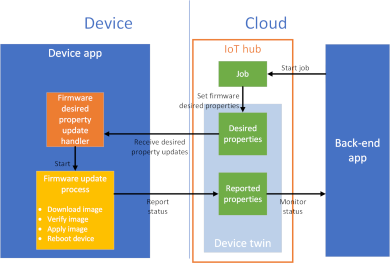
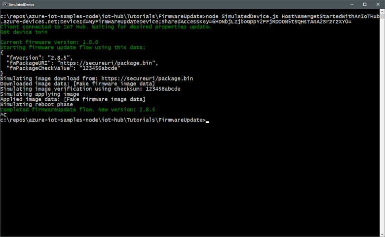
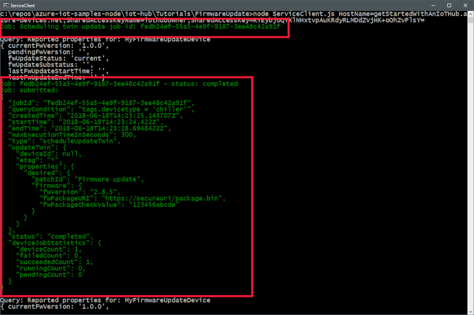
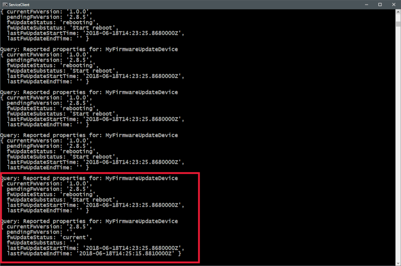

# Tutorial: Implement a device firmware update process

You may need to update the firmware on the devices connected to your IoT hub. For example, you might want to add new features to the firmware or apply security patches. In many IoT scenarios, it's impractical to physically visit and then manually apply firmware updates to your devices. This tutorial shows how you can start and monitor the firmware update process remotely through a back-end application connected to your hub.

To create and monitor the firmware update process, the back-end application in this tutorial creates a _configuration_ in your IoT hub. IoT Hub [automatic device management](iot-hub-auto-device-config.md) uses this configuration to update a set of _device twin desired properties_ on all your chiller devices. The desired properties specify the details of the firmware update that's required. While the chiller devices are running the firmware update process, they report their status to the back-end application using _device twin reported properties_. The back-end application can use the configuration to monitor the reported properties sent from the device and track the firmware update process to completion:



In this tutorial, you complete the following tasks:

> [!div class="checklist"]
> * Create an IoT hub and add a test device to the device identity registry.
> * Create a configuration to define the firmware update.
> * Simulate the firmware update process on a device.
> * Receive status updates from the device as the firmware update progresses.

[!INCLUDE [cloud-shell-try-it.md](../../includes/cloud-shell-try-it.md)]

If you don't have an Azure subscription, create a [free account](https://azure.microsoft.com/free/?WT.mc_id=A261C142F) before you begin.

## Prerequisites

The two sample applications you run in this quickstart are written using Node.js. You need Node.js v10.x.x or later on your development machine.

You can download Node.js for multiple platforms from [nodejs.org](https://nodejs.org).

You can verify the current version of Node.js on your development machine using the following command:

```cmd/sh
node --version
```

Download the sample Node.js project from https://github.com/Azure-Samples/azure-iot-samples-node/archive/master.zip and extract the ZIP archive.

Make sure that port 8883 is open in your firewall. The device sample in this tutorial uses MQTT protocol, which communicates over port 8883. This port may be blocked in some corporate and educational network environments. For more information and ways to work around this issue, see [Connecting to IoT Hub (MQTT)](iot-hub-mqtt-support.md#connecting-to-iot-hub).

## Set up Azure resources

To complete this tutorial, your Azure subscription must have an IoT hub with a device added to the device identity registry. The entry in the device identity registry enables the simulated device you run in this tutorial to connect to your hub.

If you don't already have an IoT hub set up in your subscription, you can set one up with following CLI script. This script uses the name **tutorial-iot-hub** for the IoT hub, you should replace this name with your own unique name when you run it. The script creates the resource group and hub in the **Central US** region, which you can change to a region closer to you. The script retrieves your IoT hub service connection string, which you use in the back-end sample application to connect to your IoT hub:

```azurecli-interactive
hubname=tutorial-iot-hub
location=centralus

# Install the IoT extension if it's not already installed
az extension add --name azure-iot

# Create a resource group
az group create --name tutorial-iot-hub-rg --location $location

# Create your free-tier IoT Hub. You can only have one free IoT Hub per subscription
az iot hub create --name $hubname --location $location --resource-group tutorial-iot-hub-rg --sku F1

# Make a note of the service connection string, you need it later
az iot hub show-connection-string --name $hubname --policy-name service -o table

```

This tutorial uses a simulated device called **MyFirmwareUpdateDevice**. The following script adds this device to your device identity registry, sets a tag value, and retrieves its connection string:

```azurecli-interactive
# Set the name of your IoT hub
hubname=tutorial-iot-hub

# Create the device in the identity registry
az iot hub device-identity create --device-id MyFirmwareUpdateDevice --hub-name $hubname --resource-group tutorial-iot-hub-rg

# Add a device type tag
az iot hub device-twin update --device-id MyFirmwareUpdateDevice --hub-name $hubname --set tags='{"devicetype":"chiller"}'

# Retrieve the device connection string, you need this later
az iot hub device-identity show-connection-string --device-id MyFirmwareUpdateDevice --hub-name $hubname --resource-group tutorial-iot-hub-rg -o table

```

> [!TIP]
> If you run these commands at a Windows command prompt or Powershell prompt, see the [azure-iot-cli-extension tips](https://github.com/Azure/azure-iot-cli-extension/wiki/Tips) page for information about how to quote JSON strings.

## Start the firmware update

You create an [automatic device management configuration](iot-hub-automatic-device-management.md#create-a-configuration) in the back-end application to begin the firmware update process on all devices tagged with a **devicetype** of chiller. In this section, you see how to:

* Create a configuration from a back-end application.
* Monitor the job to completion.

### Use desired properties to start the firmware upgrade from the back-end application

To view the back-end application code that creates the configuration, navigate to the **iot-hub/Tutorials/FirmwareUpdate** folder in the sample Node.js project you downloaded. Then open the ServiceClient.js file in a text editor.

The back-end application creates the following configuration:

[!code-javascript[Automatic device management configuration](~/iot-samples-node/iot-hub/Tutorials/FirmwareUpdate/ServiceClient.js?name=configuration "Automatic device management configuration")]

The configuration includes the following sections:

* `content` specifies the firmware desired properties sent to the selected devices.
* `metrics` specifies the queries to run that report the status of the firmware update.
* `targetCondition` selects the devices to receive the firmware update.
* `priorty` sets the relative priority of this configuration to other configurations.

The back-end application uses the following code to create the configuration to set the desired properties:

[!code-javascript[Create configuration](~/iot-samples-node/iot-hub/Tutorials/FirmwareUpdate/ServiceClient.js?name=createConfiguration "Create configuration")]

After it creates the configuration, the application monitors the firmware update:

[!code-javascript[Monitor firmware update](~/iot-samples-node/iot-hub/Tutorials/FirmwareUpdate/ServiceClient.js?name=monitorConfiguration "Monitor firmware update")]

A configuration reports two types of metrics:

* System metrics that report how many devices are targeted and how many devices have the update applied.
* Custom metrics generated by the queries you add to the configuration. In this tutorial, the queries report how many devices are at each stage of the update process.

### Respond to the firmware upgrade request on the device

To view the simulated device code that handles the firmware desired properties sent from the back-end application, navigate to the **iot-hub/Tutorials/FirmwareUpdate** folder in the sample Node.js project you downloaded. Then open the SimulatedDevice.js file in a text editor.

The simulated device application creates a handler for updates to the **properties.desired.firmware** desired properties in the device twin. In the handler, it carries out some basic checks on the desired properties before launching the update process:

[!code-javascript[Handle desired property update](~/iot-samples-node/iot-hub/Tutorials/FirmwareUpdate/SimulatedDevice.js?name=initiateUpdate "Handle desired property update")]

## Update the firmware

The **initiateFirmwareUpdateFlow** function runs the update. This function uses the **waterfall** function to run the phases of the update process in sequence. In this example, the firmware update has four phases. The first phase downloads the image, the second phase verifies the image using a checksum, the third phase applies the image, and the last phase reboots the device:

[!code-javascript[Firmware update flow](~/iot-samples-node/iot-hub/Tutorials/FirmwareUpdate/SimulatedDevice.js?name=firmwareupdateflow "Firmware update flow")]

During the update process, the simulated device reports on progress using reported properties:

[!code-javascript[Reported properties](~/iot-samples-node/iot-hub/Tutorials/FirmwareUpdate/SimulatedDevice.js?name=reportedProperties "Reported properties")]

The following snippet shows the implementation of the download phase. During the download phase, the simulated device uses reported properties to send status information to the back-end application:

[!code-javascript[Download image phase](~/iot-samples-node/iot-hub/Tutorials/FirmwareUpdate/SimulatedDevice.js?name=downloadimagephase "Download image phase")]

## Run the sample

In this section, you run two sample applications to observe as a back-end application creates the configuration to manage the firmware update process on the simulated device.

To run the simulated device and back-end applications, you need the device and service connection strings. You made a note of the connection strings when you created the resources at the start of this tutorial.

To run the simulated device application, open a shell or command prompt window and navigate to the **iot-hub/Tutorials/FirmwareUpdate** folder in the Node.js project you downloaded. Then run the following commands:

```cmd/sh
npm install
node SimulatedDevice.js "{your device connection string}"
```

To run the back-end application, open another shell or command prompt window. Then navigate to the **iot-hub/Tutorials/FirmwareUpdate** folder in the Node.js project you downloaded. Then run the following commands:

```cmd/sh
npm install
node ServiceClient.js "{your service connection string}"
```

The following screenshot shows the output from the simulated device application and shows how it responds to the firmware desired properties update from the back-end application:



The following screenshot shows the output from the back-end application and highlights how it creates the configuration to update the firmware desired properties:



The following screenshot shows the output from the back-end application and highlights how it monitors the firmware update metrics from the simulated device:



Because automatic device configurations run at creation time and then every five minutes, you may not see every status update sent to the back-end application. You can also view the metrics in the portal in the **Automatic device management -> IoT device configuration** section of your IoT hub:


## Clean up resources

If you plan to complete the next tutorial, leave the resource group and IoT hub and reuse them later.

If you don't need the IoT hub any longer, delete it and the resource group in the portal. To do so, select the **tutorial-iot-hub-rg** resource group that contains your IoT hub and click **Delete**.

Alternatively, use the CLI:

```azurecli-interactive
# Delete your resource group and its contents
az group delete --name tutorial-iot-hub-rg
```

## Next steps

In this tutorial, you learned how to implement a firmware update process for your connected devices. Advance to the next tutorial to learn how to use Azure IoT Hub portal tools and Azure CLI commands to test device connectivity.

> [!div class="nextstepaction"]
> [Use a simulated device to test connectivity with your IoT hub](tutorial-connectivity.md)
