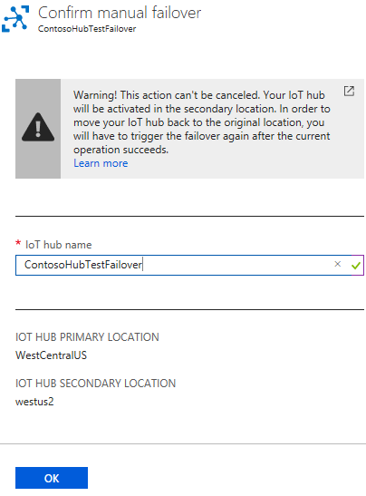

# Tutorial: Configure manual failover for an IoT Hub (public preview)

Manual failover is a feature of IoT Hubs that allows customers to change their hub's operations to a different region. Manual failover can be done in the event of a disaster, or you can do a planned failover if you want to perform testing on the feature. (any other reasons? --Robin)

In this tutorial, you perform the following tasks:

> [!div class="checklist"]
> * Using the Azure portal, create an IoT hub. 
> * Trigger a failover. 
> * See the hub running in the secondary location.
> * Trigger a failback to return the IoT hub's operations to the primary location. 
> * Confirm the hub is running correctly in the right location.

## Prerequisites

- An Azure subscription. If you don't have an Azure subscription, create a [free account](https://azure.microsoft.com/free/?WT.mc_id=A261C142F) before you begin.

- Access to the public preview (do they have to request access, and if so, how? --Robin)

## Create an IoT Hub

1. Log into the [Azure portal](https://portal.azure.com). 

2. Click **+ Create a resource** and select **Internet of Things**, then **IoT Hub**.

   

3. Select the **Basics** tab. Fill in the following fields.

    **Subscription**: select the Azure subscription you want to use.

    **Resource Group**: click **Create new** and specify **ManlFailRG** for the resource group name.

    **Region**: select a region close to you that is part of the preview. This tutorial uses `westus2`.
    
   > [!NOTE]
   > Manual failover is currently in public preview and is *not* available in the following Azure regions: East US, West US, North Europe, West Europe, Brazil South, and South Central US.

   **IoT Hub Name**: specify a name for your Iot hub. The hub name must be globally unique. 

   

   Click **Review + create**. (It uses the defaults for size and scale.) 

4. Review the information, then click **Create** to create the IoT hub. 

   

## Trigger a manual failover

1. Click **Resource groups** and then select the resource group **ManlFailRG**. Click on your hub in the list of resources. 

2. Under **Resiliency** on the IoT Hub pane, click **Manual failover (preview)**.

   

3. On the Manual failover pane, you see the **IoT Hub Primary Location** and the **IoT Hub Secondary Location**. The primary location is set to the location you specified for the IoT hub. The secondary location is the geographic partner to the primary location. You cannot change the location values. For this tutorial, the primary location is `westus2` and the secondary location is `WestCentralUS`.

   

3. At the top of the Manual failover pane, click **Initiate failover**. You see the **Confirm manual failover** pane. Fill in the IoT hub name. To initiate the failover, click **OK**.

   

   While the manual failover is being implemented, there is a banner on the Manual Failover pane that tells you a manual failover is in progress. 

   

   If you close the IoT Hub pane and open it again by clicking it on the Resource Group pane, you see a banner that tells you the hub is not active. 

   

   After it's finished, the primary and secondary regions on the Manual Failover page will be flipped and the hub will be active again. In this example, the primary location is now `WestCentralUS` and the seconday location is now `westus2`. 

   

## Trigger a failback 

After you have performed a manual failover, you can switch the hub back to the primary region -- this is called a failback. This is performed just like the manual failover. These are the steps: 

1. To trigger a failback, return to the Iot Hub pane for your Iot hub.

2. Under **Resiliency** on the IoT Hub pane, click **Manual failover (preview)**. 

3. At the top of the Manual failover pane, click **Initiate failover**. You see the **Confirm manual failover** pane. 

4. In the **Confirm manual failover** pane, fill in the IoT hub name. To initiate the failback, click OK. 

   

5. The banners will be displayed as explained in the 'Trigger a failover' section. After the failback is complete, it again shows `westus2` as the primary location and `WestCentralUS` as the secondary location, as set originally.

## Important Details 

* A failover can be planned (when the hub is fully operational) or unplanned (in the event of an extended outage for the IoT hub). 

* A failover can only be performed between Azure geo-paired regions. 

* The amount of time it takes to perform the manual failover is proportional to the number of devices that are registered for your hub. For example, if you have 100,000 devices, it might take 15 minutes, but if you have five million devices, it might take an hour or longer.

* You have to wait about an hour between requesting a failover and requesting a failback. If you try to perform the failback in a shorter amount of time, an error message is displayed.

* There is a limit of two failovers and two failbacks per day per IoT hub.

* Once the failover (or failback) operation succeeds, all runtime operations should continue to work.

* The manual failover feature will be offered to customers at no additional cost.
(what about the cosmos db cost for storing the "docs"? --Robin)

## Clean up resources 

To remove the resources you've created for this tutorial, delete the resource group. This action deletes all resources contained within the group. In this case, it removes the IoT hub and the resource group itself. 

1. Click **Resource Groups**. 

2. Locate and select the resource group **ManlFailRG**. Click on it to open it. 

3. Click **Delete resource group**. When prompted, enter the name of the resource group and click **Delete** to confirm. 

## Next steps

In this tutorial, you learned how to configure and trigger a manual failover, and how to trigger a failback by performing the following tasks.

> [!div class="checklist"]
> * Using the Azure portal, create an IoT hub. 
> * Trigger a failover. 
> * See the hub running in the secondary location.
> * Trigger a failback to return the IoT hub's operations to the primary location. 
> * Confirm the hub is running correctly in the right location.

Advance to the next tutorial to learn how to manage the state of an IoT device. 

> [!div class="nextstepaction"]
[Manage the state of an IoT device](tutorial-device-twins.md)