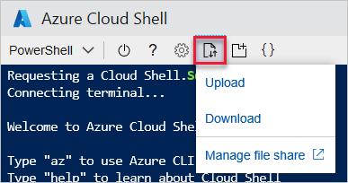
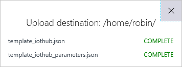

# Tutorial: Use an Azure Resource Manager template to configure IoT Hub message routing

[!INCLUDE [iot-hub-include-routing-intro](../../includes/iot-hub-include-routing-intro.md)]

[!INCLUDE [iot-hub-include-routing-create-resources](../../includes/iot-hub-include-routing-create-resources.md)]

## Message routing

[!INCLUDE [iot-hub-include-create-routing-description](../../includes/iot-hub-include-create-routing-description.md)]

## Download the template and parameters file

For the second part of this tutorial, you download and run a Visual Studio application to send messages to the IoT Hub. There is a folder in that download that contains the Azure Resource Manager template and parameters file, as well as the Azure CLI and PowerShell scripts.

Go ahead and download the [Azure IoT C# Samples](https://github.com/Azure-Samples/azure-iot-samples-csharp/archive/master.zip) now. Unzip the master.zip file. The Resource Manager template and the parameters file are in /iot-hub/Tutorials/Routing/SimulatedDevice/resources/ as **template_iothub.json** and **template_iothub_parameters.json**.

## Create your resources

You're going to use an Azure Resource Manager (RM) template to create all of your resources. The Azure CLI and PowerShell scripts can be run a few lines at a time. An RM template is deployed in one step. This article shows you the sections separately to help you understand each one. Then it will show you how to deploy the template, and create the virtual device for testing. After the template is deployed, you can view the message routing configuration in the portal.

There are several resource names that must be globally unique, such as the IoT Hub name and the storage account name. To make naming the resources easier, those resource names are set up to append a random alphanumeric value generated from the current date/time. 

If you look at the template, you'll see where variables are set up for these resources that take the parameter passed in and concatenate *randomValue* to the parameter. 

The following section explains the parameters used.

### Parameters

Most of these parameters have default values. The ones ending with **_in** are concatenated with *randomValue* to make them globally unique. 

**randomValue**: This value is generated from the current date/time when you deploy the template. This field is not in the parameters file, as it is generated in the template itself.

**subscriptionId**: This field is set for you to the subscription into which you are deploying the template. This field is not in the parameters file since it is set for you.

**IoTHubName_in**: This field is the base IoT Hub name, which is concatenated with the randomValue to be globally unique.

**location**: This field is the Azure region into which you are deploying, such as "westus".

**consumer_group**: This field is the consumer group set for messages coming through the routing endpoint. It is used to filter results in Azure Stream Analytics. For example, there is the whole stream where you get everything, or if you have data coming through with consumer_group set to **Contoso**, then you can set up an Azure Stream Analytics stream (and Power BI report) to show only those entries. This field is used in part 2 of this tutorial.

**sku_name**: This field is the scaling for the IoT Hub. This value must be S1 or above; a free tier does not work for this tutorial because it does not allow multiple endpoints.

**sku_units**: This field goes with the **sku_name**, and is the number of IoT Hub units that can be used.

**d2c_partitions**: This field is the number of partitions used for the event stream.

**storageAccountName_in**: This field is the name of the storage account to be created. Messages are routed to a container in the storage account. This field is concatenated with the randomValue to make it globally unique.

**storageContainerName**: This field is the name of the container in which the messages routed to the storage account are stored.

**storage_endpoint**: This field is the name for the storage account endpoint used by the message routing.

**service_bus_namespace_in**: This field is the name of the Service Bus namespace to be created. This value is concatenated with the randomValue to make it globally unique.

**service_bus_queue_in**: This field is the name of the Service Bus queue used for routing messages. This value is concatenated with the randomValue to make it globally unique.

**AuthRules_sb_queue**: This field is the authorization rules for the service bus queue, used to retrieve the connection string for the queue.

### Variables

These values are used in the template, and are mostly derived from parameters.

**queueAuthorizationRuleResourceId**: This field is the ResourceId for the authorization rule for the Service Bus queue. ResourceId is in turn used to retrieve the connection string for the queue.

**iotHubName**: This field is the name of the IoT Hub after having randomValue concatenated. 

**storageAccountName**: This field is the name of the storage account after having randomValue concatenated. 

**service_bus_namespace**: This field is the namespace after having randomValue concatenated.

**service_bus_queue**: This field is the Service Bus queue name after having randomValue concatenated.

**sbVersion**: THe version of the Service Bus API to use. In this case, it is "2017-04-01".

### Resources: Storage account and container

The first resource created is the storage account, along with the container to which messages are routed. The container is a resource under the storage account. It has a `dependsOn` clause for the storage account, requiring  the storage account be created before the container.

Here's what this section looks like:

```json
{
    "type": "Microsoft.Storage/storageAccounts",
    "name": "[variables('storageAccountName')]",
    "apiVersion": "2018-07-01",
    "location": "[parameters('location')]",
    "sku": {
        "name": "Standard_LRS",
        "tier": "Standard"
    },
    "kind": "Storage",
    "properties": {},
    "resources": [
        {
        "type": "blobServices/containers",
        "apiVersion": "2018-07-01",
        "name": "[concat('default/', parameters('storageContainerName'))]",
        "properties": {
            "publicAccess": "None"
            } ,
        "dependsOn": [
            "[resourceId('Microsoft.Storage/storageAccounts', variables('storageAccountName'))]"
            ]
        }
    ]
}
```

### Resources: Service Bus namespace and queue

The second resource created is the Service Bus namespace, along with the Service Bus queue to which messages are routed. The SKU is set to standard. The API version is retrieved from the variables. It is also set to activate the Service Bus namespace when it deploys this section (status:Active). 

```json
{
    "type": "Microsoft.ServiceBus/namespaces",
    "comments": "The Sku should be 'Standard' for this tutorial.",
    "sku": {
        "name": "Standard",
        "tier": "Standard"
    },
    "name": "[variables('service_bus_namespace')]",
    "apiVersion": "[variables('sbVersion')]",
    "location": "[parameters('location')]",
    "properties": {
        "provisioningState": "Succeeded",
        "metricId": "[concat('a4295411-5eff-4f81-b77e-276ab1ccda12:', variables('service_bus_namespace'))]",
        "serviceBusEndpoint": "[concat('https://', variables('service_bus_namespace'),'.servicebus.windows.net:443/')]",
        "status": "Active"
    },
    "dependsOn": []
}
```

This section creates the Service Bus queue. This part of the script has a `dependsOn` clause that ensures the namespace is created before the queue.

```json
{
    "type": "Microsoft.ServiceBus/namespaces/queues",
    "name": "[concat(variables('service_bus_namespace'), '/', variables('service_bus_queue'))]",
    "apiVersion": "[variables('sbVersion')]",
    "location": "[parameters('location')]",
    "scale": null,
    "properties": {},
    "dependsOn": [
        "[resourceId('Microsoft.ServiceBus/namespaces', variables('service_bus_namespace'))]"
    ]
}
```

### Resources: Iot Hub and message routing

Now that the storage account and Service Bus queue have been created, you create the IoT Hub that routes messages to them. The RM template uses `dependsOn` clauses so it doesn't try to create the hub before the Service Bus resources and the storage account have been created. 

Here's the first part of the IoT Hub section. This part of the template sets up the dependencies and starts with the properties.

```json
{
    "apiVersion": "2018-04-01",
    "type": "Microsoft.Devices/IotHubs",
    "name": "[variables('IoTHubName')]",
    "location": "[parameters('location')]",
    "dependsOn": [
        "[resourceId('Microsoft.Storage/storageAccounts', variables('storageAccountName'))]",
        "[resourceId('Microsoft.ServiceBus/namespaces', variables('service_bus_namespace'))]",
        "[resourceId('Microsoft.ServiceBus/namespaces/queues', variables('service_bus_namespace'), variables('service_bus_queue'))]"
    ],
    "properties": {
        "eventHubEndpoints": {}
            "events": {
                "retentionTimeInDays": 1,
                "partitionCount": "[parameters('d2c_partitions')]"
                }
            },
```

The next section is the section for the message routing configuration for the Iot Hub. First is the section for the endpoints. This part of the template sets up the routing endpoints for the Service Bus queue and the storage account, including the connection strings.

To create the connection string for the queue, you need the queueAuthorizationRulesResourcedId, which is retrieved inline. To create the connection string for the storage account, you retrieve the primary storage key and then use it in the format for the connection string.

The endpoint configuration is also where you set the blob format to `AVRO` or `JSON`.

[!INCLUDE [iot-hub-include-blob-storage-format](../../includes/iot-hub-include-blob-storage-format.md)]

 ```json
"routing": {
    "endpoints": {
        "serviceBusQueues": [
        {
            "connectionString": "[Concat('Endpoint=sb://',variables('service_bus_namespace'),'.servicebus.windows.net/;SharedAccessKeyName=',parameters('AuthRules_sb_queue'),';SharedAccessKey=',listkeys(variables('queueAuthorizationRuleResourceId'),variables('sbVersion')).primaryKey,';EntityPath=',variables('service_bus_queue'))]",
            "name": "[parameters('service_bus_queue_endpoint')]",
            "subscriptionId": "[parameters('subscriptionId')]", 
            "resourceGroup": "[resourceGroup().Name]"
        }
        ],
        "serviceBusTopics": [],
        "eventHubs": [],
        "storageContainers": [
            {
                "connectionString": 
                "[Concat('DefaultEndpointsProtocol=https;AccountName=',variables('storageAccountName'),';AccountKey=',listKeys(resourceId('Microsoft.Storage/storageAccounts', variables('storageAccountName')), providers('Microsoft.Storage', 'storageAccounts').apiVersions[0]).keys[0].value)]",
                "containerName": "[parameters('storageContainerName')]",
                "fileNameFormat": "{iothub}/{partition}/{YYYY}/{MM}/{DD}/{HH}/{mm}",
                "batchFrequencyInSeconds": 100,
                "maxChunkSizeInBytes": 104857600,
                "encoding": "avro",
                "name": "[parameters('storage_endpoint')]",
                "subscriptionId": "[parameters('subscriptionId')]",
                "resourceGroup": "[resourceGroup().Name]"
            }
        ]
    },
```

This next section is for the message routes to the endpoints. There is one set up for each endpoint, so there is one for the Service Bus queue and one for the storage account container.

Remember that the query condition for the messages being routed to storage is `level="storage"`, and the query condition for the messages being routed to the Service Bus queue is `level="critical"`.

```json
"routes": [
    {
        "name": "contosoStorageRoute",
        "source": "DeviceMessages",
        "condition": "level=\"storage\"",
        "endpointNames": [
            "[parameters('storage_endpoint')]"
            ],
        "isEnabled": true
    },
    {
        "name": "contosoSBQueueRoute",
        "source": "DeviceMessages",
        "condition": "level=\"critical\"",
        "endpointNames": [
            "[parameters('service_bus_queue_endpoint')]"
            ],
        "isEnabled": true
    }
],
```

This json shows the rest of the IoT Hub section, which contains default information and the SKU for the hub.

```json
            "fallbackRoute": {
                "name": "$fallback",
                "source": "DeviceMessages",
                "condition": "true",
                "endpointNames": [
                    "events"
                ],
                "isEnabled": true
            }
        },
        "storageEndpoints": {
            "$default": {
                "sasTtlAsIso8601": "PT1H",
                "connectionString": "",
                "containerName": ""
            }
        },
        "messagingEndpoints": {
            "fileNotifications": {
                "lockDurationAsIso8601": "PT1M",
                "ttlAsIso8601": "PT1H",
                "maxDeliveryCount": 10
            }
        },
        "enableFileUploadNotifications": false,
        "cloudToDevice": {
            "maxDeliveryCount": 10,
            "defaultTtlAsIso8601": "PT1H",
            "feedback": {
                "lockDurationAsIso8601": "PT1M",
                "ttlAsIso8601": "PT1H",
                "maxDeliveryCount": 10
            }
        }
    },
    "sku": {
        "name": "[parameters('sku_name')]",
        "capacity": "[parameters('sku_units')]"
    }
}
```

### Resources: Service Bus queue authorization rules

The Service Bus queue authorization rule is used to retrieve the connection string for the Service Bus queue. It uses a `dependsOn` clause to ensure it is not created before the Service Bus namespace and the Service Bus queue.

```json
{
    "type": "Microsoft.ServiceBus/namespaces/queues/authorizationRules",
    "name": "[concat(variables('service_bus_namespace'), '/', variables('service_bus_queue'), '/', parameters('AuthRules_sb_queue'))]",
    "apiVersion": "[variables('sbVersion')]",
    "location": "[parameters('location')]",
    "scale": null,
    "properties": {
        "rights": [
            "Send"
        ]
    },
    "dependsOn": [
        "[resourceId('Microsoft.ServiceBus/namespaces', variables('service_bus_namespace'))]",
        "[resourceId('Microsoft.ServiceBus/namespaces/queues', variables('service_bus_namespace'), variables('service_bus_queue'))]"
    ]
},
```

### Resources: Consumer group

In this section, you create a Consumer Group for the IoT Hub data to be used by the Azure Stream Analytics in the second part of this tutorial.

```json
{
    "type": "Microsoft.Devices/IotHubs/eventHubEndpoints/ConsumerGroups",
    "name": "[concat(variables('iotHubName'), '/events/',parameters('consumer_group'))]",
    "apiVersion": "2018-04-01",
    "dependsOn": [
        "[concat('Microsoft.Devices/IotHubs/', variables('iotHubName'))]"
    ]
}
```

### Resources: Outputs

If you want to send a value back to the deployment script to be displayed, you use an output section. This part of the template returns the connection string for the Service Bus queue. Returning a value isn't required, it's included as an example of how to return results to the calling script.

```json
"outputs": {
    "sbq_connectionString": {
      "type": "string",
      "value": "[Concat('Endpoint=sb://',variables('service_bus_namespace'),'.servicebus.windows.net/;SharedAccessKeyName=',parameters('AuthRules_sb_queue'),';SharedAccessKey=',listkeys(variables('queueAuthorizationRuleResourceId'),variables('sbVersion')).primaryKey,';EntityPath=',variables('service_bus_queue'))]"
    }
  }
```

## Deploy the RM template

To deploy the template to Azure, upload the template and the parameters file to Azure Cloud Shell, and then execute a script to deploy the template. Open Azure Cloud Shell and sign in. This example uses PowerShell.

To upload the files, select the **Upload/Download files** icon in the menu bar, then choose Upload.



Use the File Explorer that pops up to find the files on your local disk and select them, then choose **Open**.

After the files are uploaded, a results dialog shows something like the following image.



The files are uploaded to the share used by your Cloud Shell instance. 

Run the script to perform the deployment. The last line of this script retrieves the variable that was set up to be returned -- the Service Bus queue connection string.

These variables are set in this script.

**$RGName** is the resource group name to which to deploy the template. This field is created before deploying the template.

**$location** is the Azure location to be used for the template, such as "westus".

**deploymentname** is a name you assign to the deployment to retrieve the returning variable value.

Here's the PowerShell script. Copy this PowerShell script and paste it into the Cloud Shell window, then hit Enter to run it.

```powershell
$RGName="ContosoResources"
$location = "westus"
$deploymentname="contoso-routing"

# Remove the resource group if it already exists. 
#Remove-AzResourceGroup -name $RGName 
# Create the resource group.
New-AzResourceGroup -name $RGName -Location $location 

# Set a path to the parameter file. 
$parameterFile = "$HOME/template_iothub_parameters.json"
$templateFile = "$HOME/template_iothub.json"

# Deploy the template.
New-AzResourceGroupDeployment `
    -Name $deploymentname `
    -ResourceGroupName $RGName `
    -TemplateParameterFile $parameterFile `
    -TemplateFile $templateFile `
    -verbose

# Get the returning value of the connection string.
(Get-AzResourceGroupDeployment -ResourceGroupName $RGName -Name $deploymentname).Outputs.sbq_connectionString.value
```

If you have script errors, you can edit the script locally, upload it again to the Cloud Shell, and run the script again. After the script finishes running successfully, continue to the next step.

## Create simulated device

[!INCLUDE [iot-hub-include-create-simulated-device-portal](../../includes/iot-hub-include-create-simulated-device-portal.md)]

## View message routing in the portal

[!INCLUDE [iot-hub-include-view-routing-in-portal](../../includes/iot-hub-include-view-routing-in-portal.md)]

## Next steps

Now that you have all of the resources set up and the message routes are configured, advance to the next tutorial to learn how to process and display the information about the routed messages.

> [!div class="nextstepaction"]
> [Part 2 - View the message routing results](tutorial-routing-view-message-routing-results.md)
