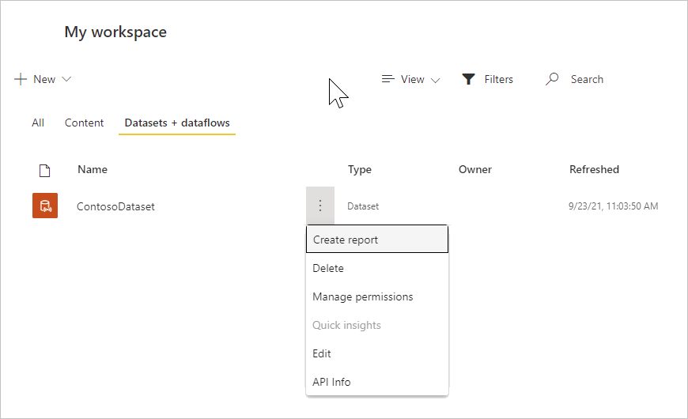
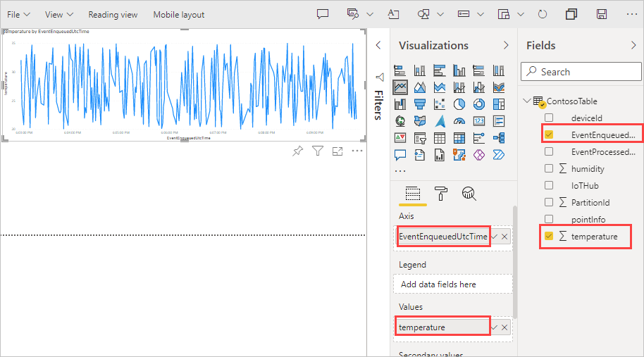
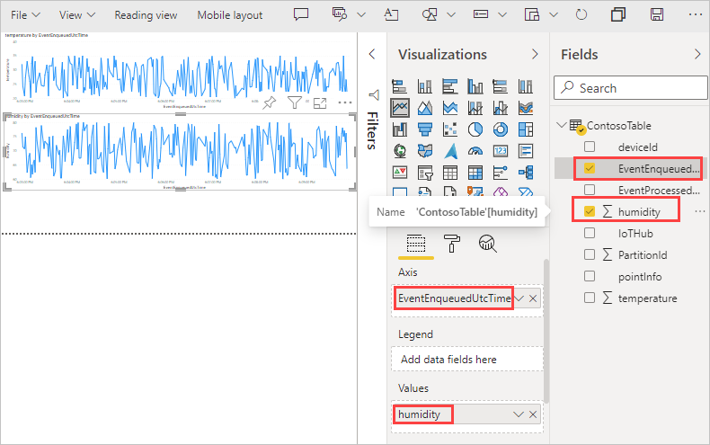

# Tutorial: Part 2 - View the routed messages

[!INCLUDE [iot-hub-include-routing-intro](../../includes/iot-hub-include-routing-intro.md)]

[!INCLUDE [updated-for-az](../../includes/updated-for-az.md)]

## Rules for routing the messages

The following are the rules for the message routing that were set up in Part 1 of this tutorial, and you see them work in this second part.

|Value |Result|
|------|------|
|level="storage" |Write to Azure Storage.|
|level="critical" |Write to a Service Bus queue. A Logic App retrieves the message from the queue and uses Office 365 to e-mail the message.|
|default |Display this data using Power BI.|

Now you create the resources to which the messages will be routed, run an app to send messages to the hub, and see the routing in action.

## Create a Logic App

The Service Bus queue is to be used for receiving messages designated as critical. Set up a Logic app to monitor the Service Bus queue, and send an e-mail when a message is added to the queue.

1. In the [Azure portal](https://portal.azure.com), select **+ Create a resource**. Put **logic app** in the search box and select Enter. From the search results displayed, select Logic App, then select **Create** to continue to the **Create logic app** pane. Fill in the fields.

   **Subscription**: Select your Azure subscription.

   **Resource group**: Select **Create new** under the Resource Group field. Specify **ContosoResources** for the name of the resource group.

   **Instance Details**
   **Type**: Select **Consumption** for the instance type.

   For **Logic App Name**, specify the name of the logic app. This tutorial uses **ContosoLogicApp**.

   **Region**: Use the location of the nearest datacenter. This tutorial uses **West US**.

   **Enable Log Analytics**: Set this toggle button to not enable the log analytics.

   

   Select **Review + Create**. It may take a few minutes for the app to deploy. When it's finished, it shows a screen giving the overview of the deployment.

1. Go to the Logic App. If you're still on the deployment page, you can select **Go To Resource**. Another way to get to the Logic App is to select **Resource groups**, select your resource group (this tutorial uses **ContosoResources**), then select the Logic App from the list of resources.

   Scroll down until you see the almost-empty tile that says **Blank Logic App +** and select it. The default tab on the screen is "For You". If this pane is blank, select **All** to see the connectors and triggers available.

1. Select **Service Bus** from the list of connectors.

   

1. This screenshot shows a list of triggers. Select the one that says **When a message is received in a queue (auto-complete)**.

   

1. Fill in the fields on the next screen with the connection information.

   **Connection Name**: ContosoConnection

   Select the Service Bus Namespace. This tutorial uses **ContosoSBNamespace**. The name of the key (RootManageSharedAccessKey) and the rights (Listen, Manage, Send) are retrieved and loaded. Select **RootManageSharedAccessKey**. The **Create** button changes to blue (active). Select it; it shows the queue selection screen.

1. Next, provide information about the queue.

   

   **Queue Name:** This field is the name of the queue from which the message is sent. Select this dropdown list and select the queue name that was set in the setup steps. This tutorial uses **contososbqueue**.

   **Queue Type:** The type of queue. Select **Main** from the dropdown list.

   Take the defaults for the other fields. Select **Save** to save the logic apps designer configuration.

1. Select **+New Step**. The **Choose an operation** pane is displayed. Select **Office 365 Outlook**. In the list, find and select **Send an Email (V2)**. Sign in to your Office 365 account.

1. Fill in the fields to be used when sending an e-mail about the message in the queue.

   

   **To:** Put in the e-mail address where the warning is to be sent.

   **Subject:** Fill in the subject for the e-mail.

   **Body**: Fill in some text for the body. Select **Add dynamic content**, it will show fields you can pick from the e-mail to include. If you don't see any, select **See More** to see more options. Select **Content** to have the body from the e-mail displayed in the error message.

1. Select **Save** to save your changes. Close the Logic app Designer.

## Set up Azure Stream Analytics

To see the data in a Power BI visualization, first set up a Stream Analytics job to retrieve the data. Remember that only the messages where the **level** is **normal** are sent to the default endpoint, and will be retrieved by the Stream Analytics job for the Power BI visualization.

### Create the Stream Analytics job

1. Put **stream** **analytics** **job** in the [Azure portal](https://portal.azure.com) search box and select **Enter**. Select **Create** to get to the Stream Analytics job screen, and then **create** again to get to the create screen.

1. Enter the following information for the job.

   **Job name**: The name of the job. The name must be globally unique. This tutorial uses **contosoJob**.

   **Subscription**: The Azure subscription you are using for the tutorial.

   **Resource group**: Use the same resource group used by your IoT hub. This tutorial uses **ContosoResources**.

   **Location**: Use the same location used in the setup script. This tutorial uses **West US**.

   

1. Select **Create** to create the job. It may take a few minutes to deploy.

   To return to the job, select **Go to resource**. You can also select **Resource groups**. This tutorial uses **ContosoResources**. Then select the resource group, then select the Stream Analytics job in the list of resources.

### Add an input to the Stream Analytics job

1. Under **Job Topology**, select **Inputs**.

1. In the **Inputs** pane, select **Add stream input** and select IoT Hub. On the screen that comes up, fill in the following fields:

   **Input alias**: This tutorial uses **contosoinputs**.

   Select **Select IoT Hub from your subscriptions**, then select your subscription from the dropdown list.

   **IoT Hub**: Select the IoT hub. This tutorial uses **ContosoTestHub**.

   **Consumer group**: Select the consumer group set up in Part 1 of this tutorial. This tutorial uses **contosoconsumers**.

   **Shared access policy name**: Select **service**. The portal fills in the Shared Access Policy Key for you.

   **Endpoint**: Select **Messaging**. (If you select Operations Monitoring, you get the telemetry data about the IoT hub rather than the data you're sending through.)

   For the rest of the fields, accept the defaults.

   

1. Select **Save**.

### Add an output to the Stream Analytics job

1. Under **Job Topology**, select **Outputs**.

1. In the **Outputs** pane, select **Add**, and then select **Power BI**. On the screen that comes up, fill in the following fields:

   **Output alias**: The unique alias for the output. This tutorial uses **contosooutputs**.

   Select **Select Group workspace from your subscriptions**. In **Group workspace**, specify **My workspace**.

   **Authentication mode**: Select **User token**.

   **Dataset name**: Name of the dataset to be used in Power BI. This tutorial uses **contosodataset**.

   **Table name**: Name of the table to be used in Power BI. This tutorial uses **contosotable**.

1. Select **Authorize**, and sign in to your Power BI account. (Signing in may take more than one try).

   

1. Select **Save**.

### Configure the query of the Stream Analytics job

1. Under **Job Topology**, select **Query**.

1. Replace `[YourInputAlias]` with the input alias of the job. This tutorial uses **contosoinputs**.

1. Replace `[YourOutputAlias]` with the output alias of the job. This tutorial uses **contosooutputs**.

   

1. Select **Save**.

1. Close the Query pane. You return to the view of the resources in the Resource Group. Select the Stream Analytics job. This tutorial calls it **contosoJob**.

### Run the Stream Analytics job

In the Stream Analytics job, select **Start** > **Now** > **Start**. Once the job successfully starts, the job status changes from **Stopped** to **Running**.

To set up the Power BI report, you need data, so you'll set up Power BI after you create the device and run the device simulation application to generate some data.

## Run simulated device app

In Part 1 of this tutorial, you set up a device to simulate using an IoT device. If you haven't already downloaded it, download it not the .NET console app that simulates the device sending device-to-cloud messages to an IoT hub, you'll download it here.

This application sends messages for each of the different message routing methods. There is also a folder in the download that contains the complete Azure Resource Manager template and parameters file, as well as the Azure CLI and PowerShell scripts.

If you didn't download the files from the repository in Part 1 of this tutorial, go ahead and download them now from [IoT Device Simulation](https://github.com/Azure-Samples/azure-iot-samples-csharp/archive/main.zip). Selecting this link downloads a repository with several applications in it; the solution for this tutorial is iot-hub/Tutorials/Routing/IoT_SimulatedDevice.sln.

Double-click on the solution file (IoT_SimulatedDevice.sln) to open the code in Visual Studio, then open Program.cs. Substitute `{your hub name}` with the IoT hub host name. The format of the IoT hub host name is **{iot-hub-name}.azure-devices.net**. For this tutorial, the hub host name is **ContosoTestHub.azure-devices.net**. Next, substitute `{your device key}` with the device key you saved earlier when setting up the simulated device.

```csharp
     static string s_myDeviceId = "Contoso-Test-Device";
     static string s_iotHubUri = "ContosoTestHub.azure-devices.net";
     // This is the primary key for the device. This is in the portal. 
     // Find your IoT hub in the portal > IoT devices > select your device > copy the key. 
     static string s_deviceKey = "{your device key}";
```

## Run and test

Run the console application. Wait a few minutes. You can see the messages being sent on the console screen of the application.

The app sends a new device-to-cloud message to the IoT hub every second. The message contains a JSON-serialized object with the device ID, temperature, humidity, and message level, which defaults to `normal`. It randomly assigns a level of `critical` or `storage`, causing the message to be routed to the storage account or to the Service Bus queue (which triggers your Logic App to send an e-mail). The default (`normal`) readings can be displayed in a BI report.

If everything is set up correctly, at this point you should see the following results:

1. You start getting e-mails about critical messages.

   

   This result means the following statements are true.

   * The routing to the Service Bus queue is working correctly.
   * The Logic App retrieving the message from the Service Bus queue is working correctly.
   * The Logic App connector to Outlook is working correctly.

1. In the [Azure portal](https://portal.azure.com), select **Resource groups** and select your Resource Group. This tutorial uses **ContosoResources**.

   Select the storage account, select **Containers**, then select the container that stores your results. This tutorial uses **contosoresults**. You should see a folder, and you can drill down through the directories until you see one or more files. Open one of those files; they contain the entries routed to the storage account.

   

This result means the following statement is true.

* The routing to the storage account is working correctly.

With the application still running, set up the Power BI visualization to see the messages coming through the default endpoint.

## Set up the Power BI visualizations

1. Sign in to your [Power BI](https://powerbi.microsoft.com/) account.

1. Select **My Workspace**. It shows at least one dataset that was created. If there's nothing there, run the **Simulated Device** application for another 5-10 minutes to stream more data. After the workspace appears, it will have a dataset called ContosoDataset. Right-click on the three vertical dots to the right of the dataset name. In the dropdown list, select **Create report**.

   

1. Look in the **Visualizations** section on the right-hand side and select **Line chart** to select a line chart in the BI report page. Drag the graphic so it fills the space horizontally. Now in the **Fields** section on the right, open ContosoTable. Select **EventEnqueuedUtcTime**. It should put it across the X-Axis. Select **temperature** and drag it into the **Values** field for temperature. This adds temperature to the chart. You should have something that looks like the following graphic:

   

1. Click in the bottom half of the chart area. Select **Line Chart** again. It creates a chart under the first one.

1. In the table, select **EventQueuedTime**, it will put it in the Axis field. Drag **humidity** to the Values field. Now you see both charts.

   

   You sent messages from the default endpoint of the IoT Hub to the Azure Stream Analytics. Then you added a Power BI report to show the data, adding two charts to represent the temperature and the humidity.

1. Select **File > Save** to save the report, entering a name for the report when prompted. Save your report in your workspace.

You can see data on both charts. This result means the following statements are true:

* The routing to the default endpoint is working correctly.
* The Azure Stream Analytics job is streaming correctly.
* The Power BI Visualization is set up correctly.

You can refresh the charts to see the most recent data by selecting the Refresh button on the top of the Power BI window.

## Clean up resources

If you want to remove all of the Azure resources you've created through both parts of this tutorial, delete the resource group. This action deletes all resources contained within the group. In this case, it removes the IoT hub, the Service Bus namespace and queue, the Logic App, the storage account, and the resource group itself. You can also remove the Power BI resources and clear the emails sent during the tutorial.

### Clean up resources in the Power BI visualization

Sign in to your [Power BI](https://powerbi.microsoft.com/) account. Go to your workspace. This tutorial uses **My Workspace**. To remove the Power BI visualization, go to DataSets and select the trash can icon to delete the dataset. This tutorial uses **contosodataset**. When you remove the dataset, the report is removed as well.

### Use the Azure CLI to clean up resources

To remove the resource group, use the [az group delete](/cli/azure/group#az-group-delete) command. `$resourceGroup` was set to **ContosoResources** back at the beginning of this tutorial.

```azurecli-interactive
az group delete --name $resourceGroup
```

### Use PowerShell to clean up resources

To remove the resource group, use the [Remove-AzResourceGroup](/powershell/module/az.resources/remove-azresourcegroup) command. `$resourceGroup` was set to **ContosoResources** back at the beginning of this tutorial.

```azurepowershell-interactive
Remove-AzResourceGroup -Name $resourceGroup
```

### Clean up test emails

You may also want to delete the quantity of emails in your inbox that were generated through the Logic App while the device application was running.

## Next steps

In this two-part tutorial, you learned how to use message routing to route IoT Hub messages to different destinations by performing the following tasks.

**Part I: Create resources, set up message routing**
> [!div class="checklist"]
> * Create the resources--an IoT hub, a storage account, a Service Bus queue, and a simulated device.
> * Configure the endpoints and message routes in IoT Hub for the storage account and Service Bus queue.

**Part II: Send messages to the hub, view routed results**
> [!div class="checklist"]
> * Create a Logic App that is triggered and sends e-mail when a message is added to the Service Bus queue.
> * Download and run an app that simulates an IoT Device sending messages to the hub for the different routing options.
> 
> * Create a Power BI visualization for data sent to the default endpoint.
> 
> * View the results ...
> * ...in the Service Bus queue and e-mails.
> * ...in the storage account.
> * ...in the Power BI visualization.

Advance to the next tutorial to learn how to manage the state of an IoT device.
> [!div class="nextstepaction"]
> [Set up and use metrics and diagnostics with an IoT Hub](tutorial-use-metrics-and-diags.md)

