# Tutorial: Part 2 - View the routed messages

[!INCLUDE [iot-hub-include-routing-intro](../../includes/iot-hub-include-routing-intro.md)]

[!INCLUDE [updated-for-az](../../includes/updated-for-az.md)]

## Rules for routing the messages

These are the rules for the message routing; these were set up in part 1 of this tutorial, and you see them work in this second part.

|value |Result|
|------|------|
|level="storage" |Write to Azure Storage.|
|level="critical" |Write to a Service Bus queue. A Logic App retrieves the message from the queue and uses Office 365 to e-mail the message.|
|default |Display this data using Power BI.|

Now you create the resources to which the messages will be routed, run an app to send messages to the hub, and see the routing in action.

## Create a Logic App  

The Service Bus queue is to be used for receiving messages designated as critical. Set up a Logic app to monitor the Service Bus queue, and send an e-mail when a message is added to the queue.

1. In the [Azure portal](https://portal.azure.com), select **+ Create a resource**. Put **logic app** in the search box and click Enter. From the search results displayed, select Logic App, then select **Create** to continue to the **Create logic app** pane. Fill in the fields.

   **Name**: This field is the name of the logic app. This tutorial uses **ContosoLogicApp**.

   **Subscription**: Select your Azure subscription.

   **Resource group**: Select **Use existing** and select your resource group. This tutorial uses **ContosoResources**.

   **Location**: Use your location. This tutorial uses **West US**.

   **Log Analytics**: This toggle should be turned off.

   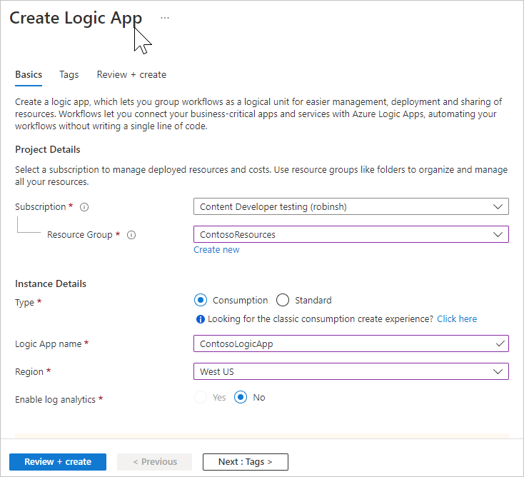

   Select **Create**.

2. Now go to the Logic App. The easiest way to get to the Logic App is to select **Resource groups**, select your resource group (this tutorial uses **ContosoResources**), then select the Logic App from the list of resources. The Logic Apps Designer page appears (you might have to scroll over to the right to see the full page). On the Logic Apps Designer page, scroll down until you see the tile that says **Blank Logic App +** and select it. The default tab is "For You". If this pane is blank, select **All** to see all of the connectors and triggers available.

3. Select **Service Bus** from the list of connectors.

   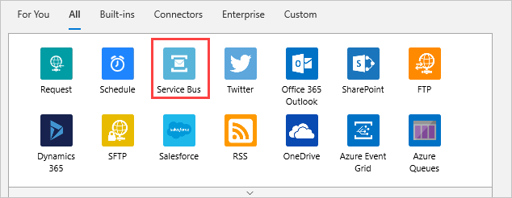

4. A list of triggers is displayed. Select **When a message is received in a queue (auto-complete) / Service Bus**.

   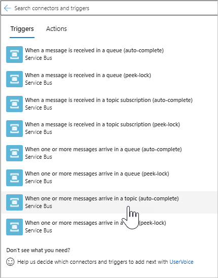

5. On the next screen, fill in the Connection Name. This tutorial uses **ContosoConnection**.

   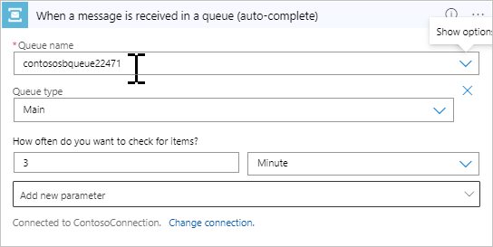

   Select the Service Bus namespace. This tutorial uses **ContosoSBNamespace**. When you select the namespace, the portal queries the Service Bus namespace to retrieve the keys. Select **RootManageSharedAccessKey** and select **Create**.

   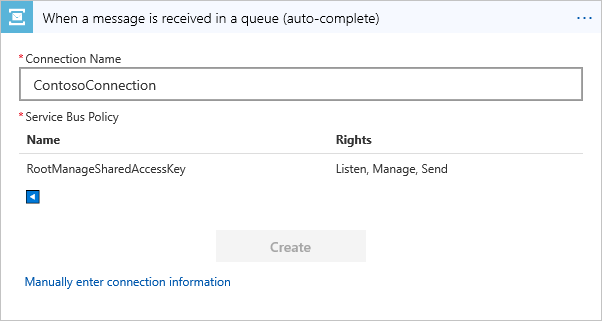

6. On the next screen, select the name of the queue (this tutorial uses **contososbqueue**) from the dropdown list. You can use the defaults for the rest of the fields.

   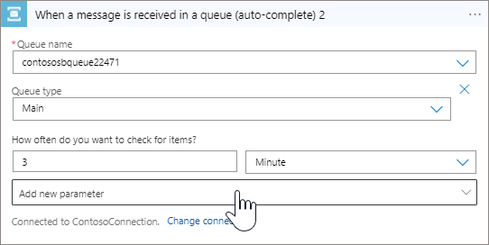

7. Now set up the action to send an e-mail when a message is received in the queue. In the Logic Apps Designer, select **+ New step** to add a step, then select **All** to see all of the options available. In the **Choose an action** pane, find and select **Office 365 Outlook**. On the triggers screen, select **Send an e-mail / Office 365 Outlook**.  

   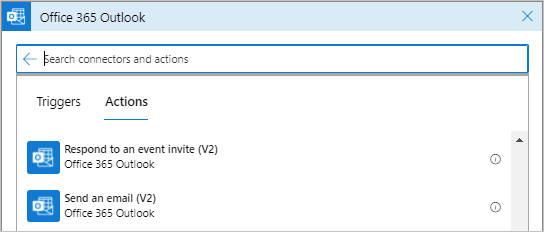

8. Sign in to your Office 365 account to set up the connection. If this times out, just try again. Specify the e-mail addresses for the recipient(s) of the e-mails. Also specify the subject, and type what message you'd like the recipient to see in the body. For testing, fill in your own e-mail address as the recipient.

   Select **Add dynamic content** to show the content from the message that you can include. Select **Content** -- it will include the message in the e-mail.

   

9. Select **Save**. Then close the Logic App Designer.

## Set up Azure Stream Analytics

To see the data in a Power BI visualization, first set up a Stream Analytics job to retrieve the data. Remember that only the messages where the **level** is **normal** are sent to the default endpoint, and will be retrieved by the Stream Analytics job for the Power BI visualization.

### Create the Stream Analytics job

1. In the [Azure portal](https://portal.azure.com), select **Create a resource** > **Internet of Things** > **Stream Analytics job**.

2. Enter the following information for the job.

   **Job name**: The name of the job. The name must be globally unique. This tutorial uses **contosoJob**.

   **Subscription**: The Azure subscription you are using for the tutorial.

   **Resource group**: Use the same resource group used by your IoT hub. This tutorial uses **ContosoResources**.

   **Location**: Use the same location used in the setup script. This tutorial uses **West US**.

   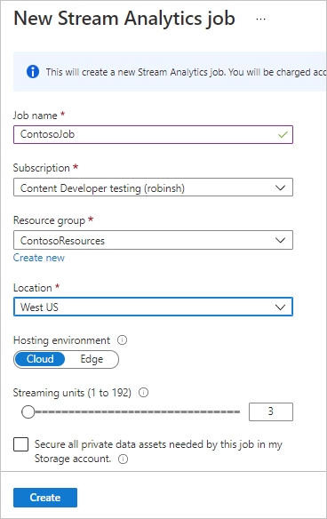

3. Select **Create** to create the job. To get back to the job, select **Resource groups**. This tutorial uses **ContosoResources**. Select the resource group, then select the Stream Analytics job in the list of resources.

### Add an input to the Stream Analytics job

4. Under **Job Topology**, select **Inputs**.

5. In the **Inputs** pane, select **Add stream input** and select IoT Hub. On the screen that comes up, fill in the following fields:

   **Input alias**: This tutorial uses **contosoinputs**.

   **Select IoT Hub from your subscription**: Select this radio button option.

   **Subscription**: Select the Azure subscription you're using for this tutorial.

   **IoT Hub**: Select the IoT Hub. This tutorial uses **ContosoTestHub**.

   **Endpoint**: Select **Messaging**. (If you select Operations Monitoring, you get the telemetry data about the IoT hub rather than the data you're sending through.) 

   **Shared access policy name**: Select **service**. The portal fills in the Shared Access Policy Key for you.

   **Consumer group**: Select the consumer group set up in step 1 of this tutorial. This tutorial uses **contosoconsumers**.
   
   For the rest of the fields, accept the defaults. 

   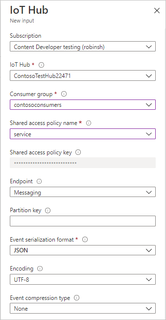

6. Select **Save**.

### Add an output to the Stream Analytics job

1. Under **Job Topology**, select **Outputs**.

2. In the **Outputs** pane, select **Add**, and then select **Power BI**. On the screen that comes up, fill in the following fields:

   **Output alias**: The unique alias for the output. This tutorial uses **contosooutputs**. 

   **Dataset name**: Name of the dataset to be used in Power BI. This tutorial uses **contosodataset**. 

   **Table name**: Name of the table to be used in Power BI. This tutorial uses **contosotable**.

   Accept the defaults for the rest of the fields.

3. Select **Authorize**, and sign in to your Power BI account. (This may take more than one try).

   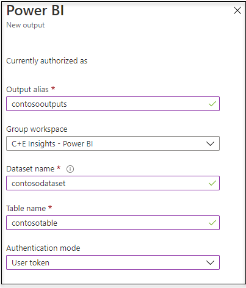

4. Select **Save**.

### Configure the query of the Stream Analytics job

1. Under **Job Topology**, select **Query**.

2. Replace `[YourInputAlias]` with the input alias of the job. This tutorial uses **contosoinputs**.

3. Replace `[YourOutputAlias]` with the output alias of the job. This tutorial uses **contosooutputs**.

   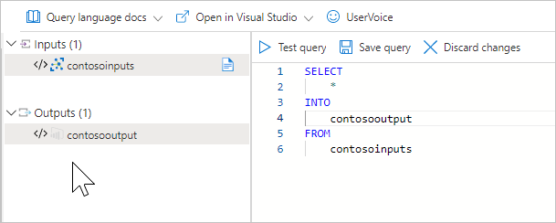

4. Select **Save**.

5. Close the Query pane. You return to the view of the resources in the Resource Group. Select the Stream Analytics job. This tutorial calls it **contosoJob**.

### Run the Stream Analytics job

In the Stream Analytics job, select **Start** > **Now** > **Start**. Once the job successfully starts, the job status changes from **Stopped** to **Running**.

To set up the Power BI report, you need data, so you'll set up Power BI after creating the device and running the device simulation application.

## Run simulated device app

In the part 1 of this tutorial, you set up a device to simulate using an IoT device. In this section, you download the .NET console app that simulates that device sending device-to-cloud messages to an IoT hub, assuming you didn't already download the app and resources in part 1 of this tutorial.

This application sends messages for each of the different message routing methods. There is also a folder in the download that contains the complete Azure Resource Manager template and parameters file, as well as the Azure CLI and PowerShell scripts.

If you didn't download the files from the repository in step 1 of this tutorial, go ahead and download them now from [IoT Device Simulation](https://github.com/Azure-Samples/azure-iot-samples-csharp/archive/master.zip). Selecting this link downloads a repository with several applications in it; the solution you are looking for is iot-hub/Tutorials/Routing/IoT_SimulatedDevice.sln. 

Double-click on the solution file (IoT_SimulatedDevice.sln) to open the code in Visual Studio, then open Program.cs. Substitute `{iot hub hostname}` with the IoT hub host name. The format of the IoT hub host name is **{iot-hub-name}.azure-devices.net**. For this tutorial, the hub host name is **ContosoTestHub.azure-devices.net**. Next, substitute `{device key}` with the device key you saved earlier when setting up the simulated device. 

   ```csharp
        static string myDeviceId = "contoso-test-device";
        static string iotHubUri = "ContosoTestHub.azure-devices.net";
        // This is the primary key for the device. This is in the portal. 
        // Find your IoT hub in the portal > IoT devices > select your device > copy the key. 
        static string deviceKey = "{your device key here}";
   ```

## Run and test

Run the console application. Wait a few minutes. You can see the messages being sent on the console screen of the application.

The app sends a new device-to-cloud message to the IoT hub every second. The message contains a JSON-serialized object with the device ID, temperature, humidity, and message level, which defaults to `normal`. It randomly assigns a level of `critical` or `storage`, causing the message to be routed to the storage account or to the Service Bus queue (which triggers your Logic App to send an e-mail). The default (`normal`) readings will be displayed in the BI report you set up next.

If everything is set up correctly, at this point you should see the following results:

1. You start getting e-mails about critical messages.

   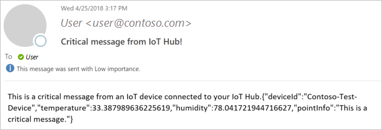

   This result means the following statements are true. 

   * The routing to the Service Bus queue is working correctly.
   * The Logic App retrieving the message from the Service Bus queue is working correctly.
   * The Logic App connector to Outlook is working correctly. 

2. In the [Azure portal](https://portal.azure.com), select **Resource groups** and select your Resource Group. This tutorial uses **ContosoResources**. Select the storage account, select **Blobs**, then select the Container. This tutorial uses **contosoresults**. You should see a folder, and you can drill down through the directories until you see one or more files. Open one of those files; they contain the entries routed to the storage account. 

   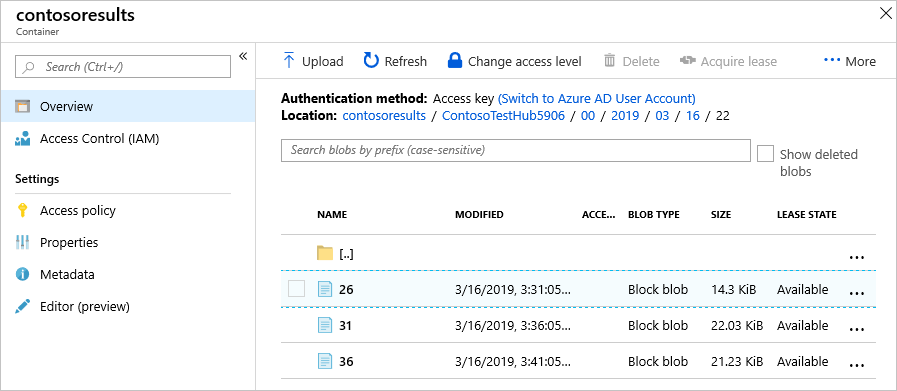

This result means the following statement is true.

   * The routing to the storage account is working correctly.

Now with the application still running, set up the Power BI visualization to see the messages coming through the default routing.

## Set up the Power BI visualizations

1. Sign in to your [Power BI](https://powerbi.microsoft.com/) account.

2. Go to **Workspaces** and select the workspace that you set when you created the output for the Stream Analytics job. This tutorial uses **My Workspace**. 

3. Select **Datasets**. If you don't have any datasets, wait a few minutes and check again.

   You should see the listed dataset that you specified when you created the output for the Stream Analytics job. This tutorial uses **contosodataset**. (It may take 5-10 minutes for the dataset to show up the first time.)

4. Under **ACTIONS**, select the first icon to create a report.

   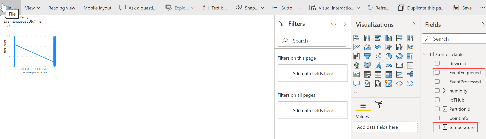

5. Create a line chart to show real-time temperature over time.

   * On the report creation page, add a line chart by selecting the line chart icon.

     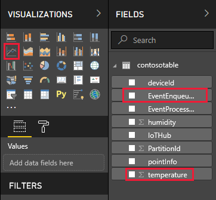

   * On the **Fields** pane, expand the table that you specified when you created the output for the Stream Analytics job. This tutorial uses **contosotable**.

   * Drag **EventEnqueuedUtcTime** to **Axis** on the **Visualizations** pane.

   * Drag **temperature** to **Values**.

   A line chart is created. The x-axis displays date and time in the UTC time zone. The y-axis displays temperature from the sensor.

6. Create another line chart to show real-time humidity over time. To set up the second chart, follow the same steps above and place **EventEnqueuedUtcTime** on the x-axis and **humidity** on the y-axis.

   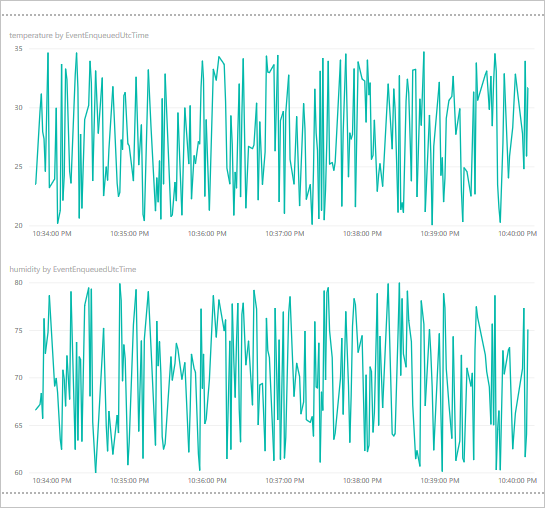

7. Select **Save** to save the report.

You should be able to see data on both charts. This result means the following statements are true:

   * The routing to the default endpoint is working correctly.
   * The Azure Stream Analytics job is streaming correctly.
   * The Power BI Visualization is set up correctly.

You can refresh the charts to see the most recent data by selecting the Refresh button on the top of the Power BI window. 

## Clean up resources 

If you want to remove all of the resources you've created through both parts of this tutorial, delete the resource group. This action deletes all resources contained within the group. In this case, it removes the IoT hub, the Service Bus namespace and queue, the Logic App, the storage account, and the resource group itself. 

### Clean up resources in the Power BI visualization

Sign in to your [Power BI](https://powerbi.microsoft.com/) account. Go to your workspace. This tutorial uses **My Workspace**. To remove the Power BI visualization, go to DataSets and select the trash can icon to delete the dataset. This tutorial uses **contosodataset**. When you remove the dataset, the report is removed as well.

### Use the Azure CLI to clean up resources

To remove the resource group, use the [az group delete](https://docs.microsoft.com/cli/azure/group?view=azure-cli-latest#az-group-delete) command. `$resourceGroup` was set to **ContosoResources** back at the beginning of this tutorial.

```azurecli-interactive
az group delete --name $resourceGroup
```

### Use PowerShell to clean up resources

To remove the resource group, use the [Remove-AzResourceGroup](https://docs.microsoft.com/powershell/module/az.resources/remove-azresourcegroup) command. `$resourceGroup` was set to **ContosoResources** back at the beginning of this tutorial.

```azurepowershell-interactive
Remove-AzResourceGroup -Name $resourceGroup
```

## Next steps

In this 2-part tutorial, you learned how to use message routing to route IoT Hub messages to different destinations by performing the following tasks.  

**Part I: Create resources, set up message routing**
> [!div class="checklist"]
> * Create the resources -- an IoT hub, a storage account, a Service Bus queue, and a simulated device.
> * Configure the endpoints and message routes in IoT Hub for the storage account and Service Bus queue.

**Part II: Send messages to the hub, view routed results**
> [!div class="checklist"]
> * Create a Logic App that is triggered and sends e-mail when a message is added to the Service Bus queue.
> * Download and run an app that simulates an IoT Device sending messages to the hub for the different routing options.
> * Create a Power BI visualization for data sent to the default endpoint.
> * View the results ...
> * ...in the Service Bus queue and e-mails.
> * ...in the storage account.
> * ...in the Power BI visualization.

Advance to the next tutorial to learn how to manage the state of an IoT device. 

> [!div class="nextstepaction"]
> [Set up and use metrics and diagnostics with an IoT Hub](tutorial-use-metrics-and-diags.md)
