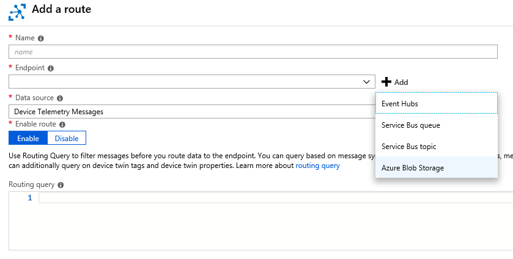
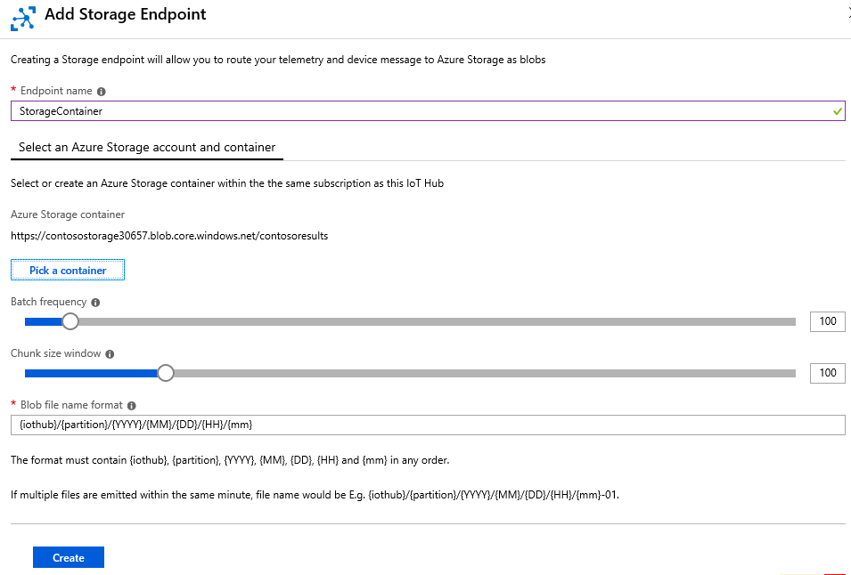
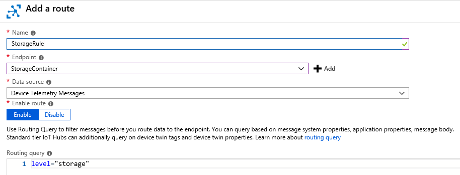
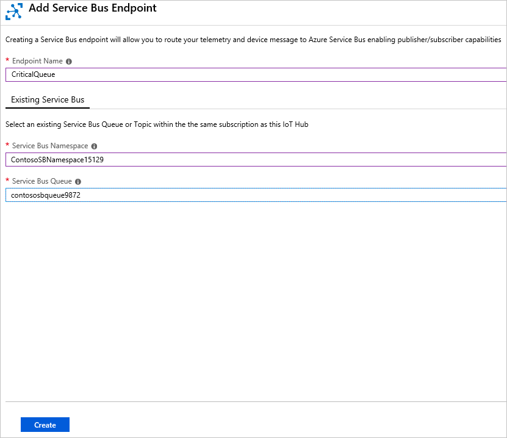
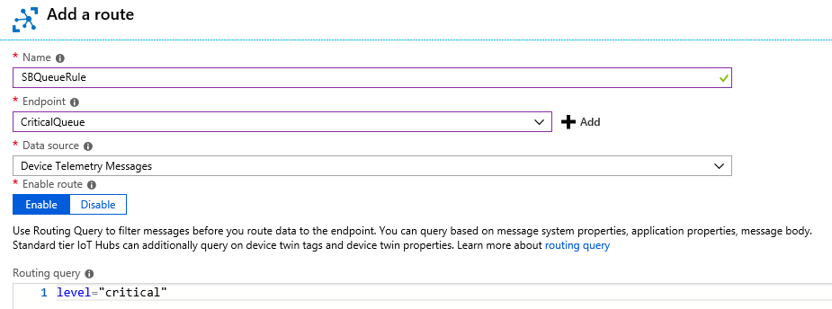
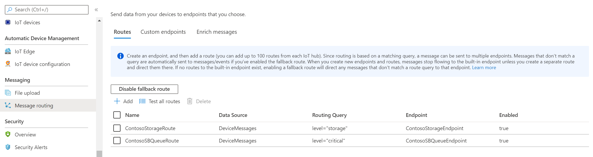
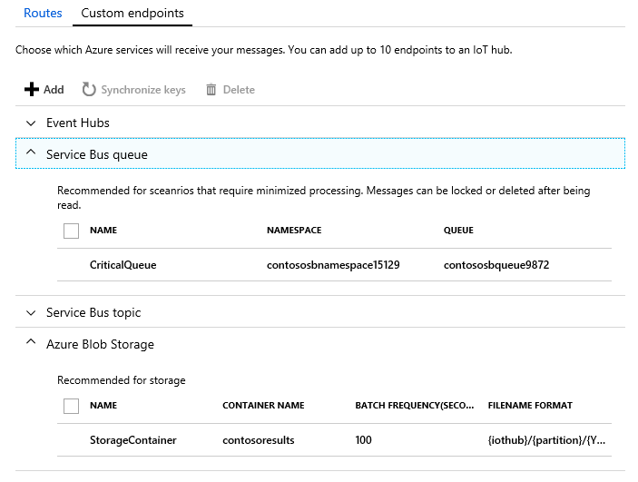

# Tutorial: Use the Azure CLI and Azure portal to configure IoT Hub message routing

[!INCLUDE [iot-hub-include-routing-intro](../../includes/iot-hub-include-routing-intro.md)]

[!INCLUDE [iot-hub-include-routing-create-resources](../../includes/iot-hub-include-routing-create-resources.md)]

## Use the Azure CLI to create the base resources

This tutorial uses the Azure CLI to create the base resources, then uses the [Azure portal](https://portal.azure.com) to show how to configure message routing and set up the virtual device for testing.

Copy and paste the script below into Cloud Shell and press Enter. It runs the script one line at a time. This will create the base resources for this tutorial, including the storage account, IoT Hub, Service Bus Namespace, and Service Bus queue.

There are several resource names that must be globally unique, such as the IoT Hub name and the storage account name. To make this easier, those resource names are appended with a random alphanumeric value called *randomValue*. The randomValue is generated once at the top of the script and appended to the resource names as needed throughout the script. If you don't want it to be random, you can set it to an empty string or to a specific value.

> [!TIP]
> A tip about debugging: this script uses the continuation symbol (the backslash `\`) to make the script more readable. If you have a problem running the script, make sure your Cloud Shell session is running `bash` and that there are no spaces after any of the backslashes.
>

```azurecli-interactive
# This retrieves the subscription id of the account 
#   in which you're logged in.
# This field is used to set up the routing queries.
subscriptionID=$(az account show --query id)

# Concatenate this number onto the resources that have to be globally unique.
# You can set this to "" or to a specific value if you don't want it to be random.
# This retrieves a random value.
randomValue=$RANDOM

# Set the values for the resource names that 
#   don't have to be globally unique.
location=westus
resourceGroup=ContosoResources
iotHubConsumerGroup=ContosoConsumers
containerName=contosoresults

# Create the resource group to be used
#   for all the resources for this tutorial.
az group create --name $resourceGroup \
    --location $location

# The IoT hub name must be globally unique, 
#   so add a random value to the end.
iotHubName=ContosoTestHub$randomValue 
echo "IoT hub name = " $iotHubName

# Create the IoT hub.
az iot hub create --name $iotHubName \
    --resource-group $resourceGroup \
    --sku S1 --location $location

# Add a consumer group to the IoT hub for the 'events' endpoint.
az iot hub consumer-group create --hub-name $iotHubName \
    --name $iotHubConsumerGroup

# The storage account name must be globally unique, 
#   so add a random value to the end.
storageAccountName=contosostorage$randomValue
echo "Storage account name = " $storageAccountName

# Create the storage account to be used as a routing destination.
az storage account create --name $storageAccountName \
    --resource-group $resourceGroup \
    --location $location \
    --sku Standard_LRS

# Get the primary storage account key. 
#    You need this to create the container.
storageAccountKey=$(az storage account keys list \
    --resource-group $resourceGroup \
    --account-name $storageAccountName \
    --query "[0].value" | tr -d '"') 

# See the value of the storage account key.
echo "storage account key = " $storageAccountKey

# Create the container in the storage account. 
az storage container create --name $containerName \
    --account-name $storageAccountName \
    --account-key $storageAccountKey \
    --public-access off

# The Service Bus namespace must be globally unique, 
#   so add a random value to the end.
sbNamespace=ContosoSBNamespace$randomValue
echo "Service Bus namespace = " $sbNamespace

# Create the Service Bus namespace.
az servicebus namespace create --resource-group $resourceGroup \
    --name $sbNamespace \
    --location $location

# The Service Bus queue name must be globally unique, 
#   so add a random value to the end.
sbQueueName=ContosoSBQueue$randomValue
echo "Service Bus queue name = " $sbQueueName

# Create the Service Bus queue to be used as a routing destination.
az servicebus queue create --name $sbQueueName \
    --namespace-name $sbNamespace \
    --resource-group $resourceGroup

```

Now that the base resources are set up, you can configure the message routing in the [Azure portal](https://portal.azure.com).

## Set up message routing

[!INCLUDE [iot-hub-include-create-routing-description](../../includes/iot-hub-include-create-routing-description.md)]

### Route to a storage account

Now set up the routing for the storage account. You go to the Message Routing pane, then add a route. When adding the route, define a new endpoint for the route. After this routing is set up, messages where the **level** property is set to **storage** are written to a storage account automatically. 

[!INCLUDE [iot-hub-include-blob-storage-format](../../includes/iot-hub-include-blob-storage-format.md)]

1. In the [Azure portal](https://portal.azure.com), select **Resource Groups**, then select your resource group. This tutorial uses **ContosoResources**.

2. Select the IoT hub under the list of resources. This tutorial uses **ContosoTestHub**.

3. Select **Message Routing**. In the **Message Routing** pane, select +**Add**. On the **Add a Route** pane, select +**Add** next to the Endpoint field to show the supported endpoints, as displayed in the following picture:

   

4. Select **Blob storage**. You see the **Add a storage endpoint** pane.

   

5. Enter a name for the endpoint. This tutorial uses **ContosoStorageEndpoint**.

6. Select **Pick a container**. This takes you to a list of your storage accounts. Select the one you set up in the preparation steps. This tutorial uses **contosostorage**. It shows a list of containers in that storage account. **Select** the container you set up in the preparation steps. This tutorial uses **contosoresults**. You return to the **Add a storage endpoint** pane and see the selections you made.

7. Set the encoding to AVRO or JSON. For the purpose of this tutorial, use the defaults for the rest of the fields. This field will be greyed out if the region selected does not support JSON encoding.,

   > [!NOTE]
   > You can set the format of the blob name using the **Blob file name format**. The default is `{iothub}/{partition}/{YYYY}/{MM}/{DD}/{HH}/{mm}`. The format must contain {iothub}, {partition}, {YYYY}, {MM}, {DD}, {HH}, and {mm} in any order.
   >
   > For example, using the default blob file name format, if the hub name is ContosoTestHub, and the date/time is October 30, 2018 at 10:56 a.m., the blob name will look like this: `ContosoTestHub/0/2018/10/30/10/56`.
   > 
   > The blobs are written in the Avro format.
   >

8. Select **Create** to create the storage endpoint and add it to the route. You return to the **Add a route** pane.

9. Now complete the rest of the routing query information. This query specifies the criteria for sending messages to the storage container you just added as an endpoint. Fill in the fields on the screen.

   **Name**: Enter a name for your routing query. This tutorial uses **ContosoStorageRoute**.

   **Endpoint**: This shows the endpoint you just set up.

   **Data source**: Select **Device Telemetry Messages** from the dropdown list.

   **Enable route**: Be sure this field is set to `enabled`.
   
   **Routing query**: Enter `level="storage"` as the query string.

     

   Select **Save**. When it finishes, it returns to the Message Routing pane, where you can see your new routing query for storage. Close the Routes pane, which returns you to the Resource group page.

### Route to a Service Bus queue

Now set up the routing for the Service Bus queue. You go to the Message Routing pane, then add a route. When adding the route, define a new endpoint for the route. After this route is set up, messages where the **level** property is set to **critical** are written to the Service Bus queue, which triggers a Logic App, which then sends an e-mail with the information.

1. On the Resource group page, select your IoT hub, then select **Message Routing**.

2. In the **Message Routing** pane, select +**Add**.

3. On the **Add a Route** pane, Select +**Add** next to the Endpoint field. Select **Service Bus Queue**. You see the **Add Service Bus Endpoint** pane.

   

4. Fill in the fields:

   **Endpoint Name**: Enter a name for the endpoint. This tutorial uses **ContosoSBQueueEndpoint**.
   
   **Service Bus Namespace**: Use the dropdown list to select the service bus namespace you set up in the preparation steps. This tutorial uses **ContosoSBNamespace**.

   **Service Bus queue**: Use the dropdown list to select the Service Bus queue. This tutorial uses **contososbqueue**.

5. Select **Create** to add the Service Bus queue endpoint. You return to the **Add a route** pane.

6. Now you complete the rest of the routing query information. This query specifies the criteria for sending messages  to the Service Bus queue you just added as an endpoint. Fill in the fields on the screen. 

   **Name**: Enter a name for your routing query. This tutorial uses **ContosoSBQueueRoute**. 

   **Endpoint**: This shows the endpoint you just set up.

   **Data source**: Select **Device Telemetry Messages** from the dropdown list.

   **Routing query**: Enter `level="critical"` as the query string. 

   

7. Select **Save**. When it returns to the Routes pane, you see both of your new routes, as displayed here.

   

8. You can see the custom endpoints you set up by selecting the **Custom Endpoints** tab.

   

9. Close the Message Routing pane, which returns you to the Resource group pane.

## Create a simulated device

[!INCLUDE [iot-hub-include-create-simulated-device-portal](../../includes/iot-hub-include-create-simulated-device-portal.md)]

## Next steps

Now that you have the resources set up and the message routes configured, advance to the next tutorial to learn how to send messages to the IoT hub and see them be routed to the different destinations. 

> [!div class="nextstepaction"]
> [Part 2 - View the message routing results](tutorial-routing-view-message-routing-results.md)
