# Tutorial: Send device data to Azure Storage using IoT Hub message routing

Use [message routing](iot-hub-devguide-messages-d2c.md) in Azure IoT Hub to send telemetry data from your IoT devices to Azure services such as blob storage, Service Bus Queues, Service Bus Topics, and Event Hubs. Every IoT hub has a default built-in endpoint that is compatible with Event Hubs. You can also create custom endpoints and route messages to other Azure services by defining  [routing queries](iot-hub-devguide-routing-query-syntax.md). Each message that arrives at the IoT hub is routed to all endpoints whose routing queries it matches. If a message doesn't match any of the defined routing queries, it is routed to the default endpoint.

In this tutorial, you perform the following tasks:

> [!div class="checklist"]
>
> * Create an IoT hub and send device messages to it.
> * Create a storage account.
> * Create a custom endpoint for the storage account and route messages to it from the IoT hub.
> * View device messages in the storage account blob.

## Prerequisites

* An Azure subscription. If you don't have an Azure subscription, create a [free account](https://azure.microsoft.com/free/?WT.mc_id=A261C142F) before you begin.

* An IoT hub in your Azure subscription. If you don't have a hub yet, you can follow the steps in [Create an IoT hub](iot-hub-create-through-portal.md).

* This tutorial uses sample code from [Azure IoT SDK for C#](https://github.com/Azure/azure-iot-sdk-csharp).

  * Download or clone the SDK repo to your development machine.
  * Have .NET Core 3.0.0 or greater on your development machine. Check your version by running `dotnet --version` and [Download .NET](https://dotnet.microsoft.com/download) if necessary.

* Make sure that port 8883 is open in your firewall. The sample in this tutorial uses MQTT protocol, which communicates over port 8883. This port may be blocked in some corporate and educational network environments. For more information and ways to work around this issue, see [Connecting to IoT Hub (MQTT)](../iot/iot-mqtt-connect-to-iot-hub.md#connecting-to-iot-hub).

* Optionally, install [Azure IoT Explorer](https://github.com/Azure/azure-iot-explorer). This tool helps you observe the messages as they arrive at your IoT hub. This article uses Azure IoT Explorer.

# [Azure portal](#tab/portal)

There are no other prerequisites for the Azure portal.

# [Azure CLI](#tab/cli)

[!INCLUDE [azure-cli-prepare-your-environment-no-header](~/articles/reusable-content/azure-cli/azure-cli-prepare-your-environment-no-header.md)]

---

## Register a device and send messages to IoT Hub

Register a new device in your IoT hub.

# [Azure portal](#tab/portal)

1. Sign in to the [Azure portal](https://portal.azure.com) and navigate to your IoT hub.

1. Select **Devices** from the **Device management** section of the menu.

1. Select **Add device**.

   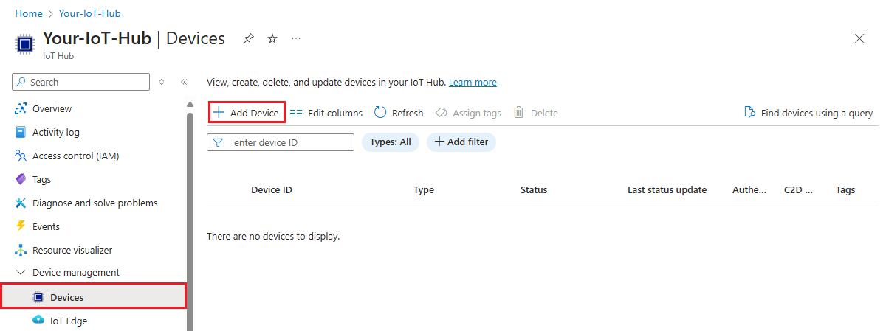

1. Provide a device ID and select **Save**.

1. The new device should be in the list of devices now. If it's not, refresh the page. Select the device ID to open the device details page.

1. Copy one of the device keys and save it. You'll use this value to configure the sample code that generates simulated device telemetry messages.

   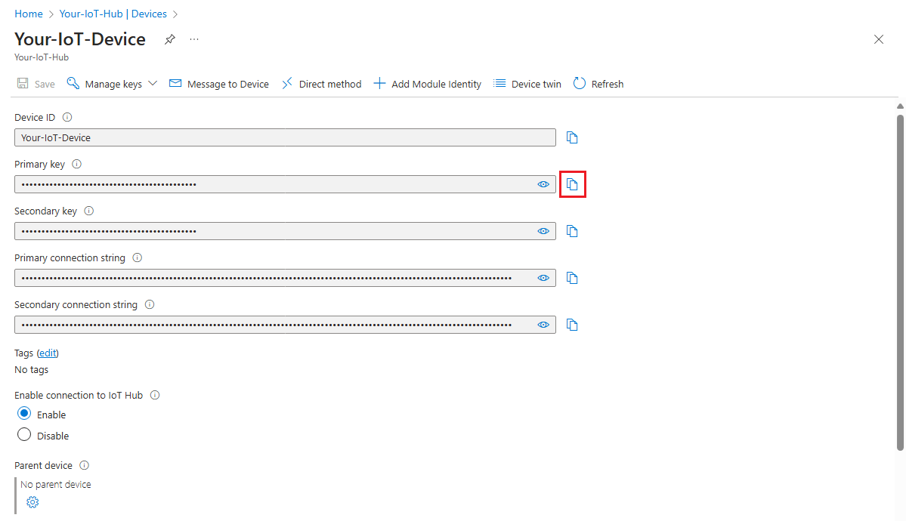

# [Azure CLI](#tab/cli)

>[!TIP]
>Many of the CLI commands used throughout this tutorial use the same parameters. For your convenience, we have you define local variables that can be called as needed. Be sure to run all the commands in the same session, or else you will have to redefine the variables.

1. Define variables for your IoT hub and device.

   *IOTHUB_NAME*: Replace this placeholder with the name of your IoT hub.

   *DEVICE_NAME*: Replace this placeholder with any name you want to use for the device in this tutorial.

   ```azurecli-interactive
   hubName=IOTHUB_NAME
   deviceName=DEVICE_NAME
   ```

1. Run the [az iot hub device-identity create](/cli/azure/iot/hub/device-identity#az-iot-hub-device-identity-create) command in your CLI shell. This command creates the device identity.

   ```azurecli-interactive
   az iot hub device-identity create --device-id $deviceName --hub-name $hubName
   ```

1. From the device-identity output, copy the **primaryKey** value without the surrounding quotation marks and save it. You'll use this value to configure the sample code that generates simulated device telemetry messages.

---

Now that you have a device ID and key, use the sample code to start sending device telemetry messages to IoT Hub.

>[!TIP]
>If you're following the Azure CLI steps for this tutorial, run the sample code in a separate session. That way, you can allow the sample code to continue running while you follow the rest of the CLI steps.

1. If you didn't as part of the prerequisites, download or clone the [Azure IoT SDK for C# repo](https://github.com/Azure/azure-iot-sdk-csharp) from GitHub now.
1. From the folder where you downloaded or cloned the SDK, navigate to the `azure-iot-sdk-csharp\iothub\device\samples\how to guides\HubRoutingSample` folder.
1. Install the Azure IoT C# SDK and necessary dependencies as specified in the `HubRoutingSample.csproj` file:

   ```console
   dotnet restore
   ```

1. In an editor of your choice, open the `Parameters.cs` file. This file shows the parameters that are supported by the sample. Only the `PrimaryConnectionString` parameter will be used in this article when running the sample. Review the code in this file. No changes are needed.

1. Build and run the sample code using the following command:

   Replace `<myDevicePrimaryConnectionString>` with your primary connection string from your device in your IoT hub.

    ```cmd
    dotnet run --PrimaryConnectionString <myDevicePrimaryConnectionString>
    ```

1. You should start to see messages printed to output as they are sent to IoT Hub. Leave this program running during the tutorial.

## Configure IoT Explorer to view messages

Configure IoT Explorer to connect to your IoT hub and read messages as they arrive at the built-in endpoint.

First, retrieve the connection string for your IoT hub.

# [Azure portal](#tab/portal)

1. In the Azure portal, navigate to your IoT hub.
1. Select **Shared access policies** from the **Security settings** section of the menu.
1. Select the **iothubowner** policy.

   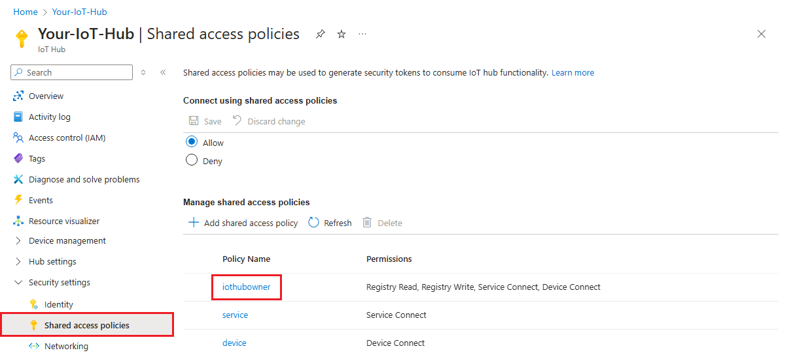

1. Copy the **Primary connection string**.

   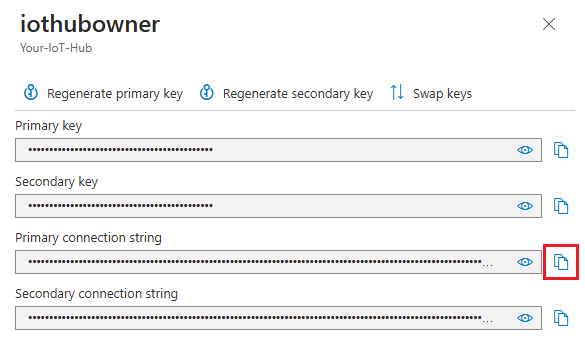

# [Azure CLI](#tab/cli)

1. Run the [az iot hub connection-string show](/cli/azure/iot/hub/connection-string#az-iot-hub-connection-string-show) command:

   ```azurecli-interactive
   az iot hub connection-string show --hub-name $hubName
   ```

2. Copy the connection string without the surrounding quotation marks.

---

Now, use that connection string to configure IoT Explorer for your IoT hub.

1. Open IoT Explorer on your development machine.
1. Select **Add connection**.

   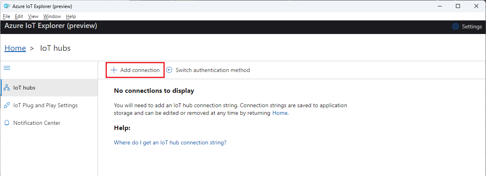

1. Paste your hub's connection string into the text box.
1. Select **Save**.
1. Once you connect to your IoT hub, you should see a list of devices. Select the device ID that you created for this tutorial.
1. Select **Telemetry**.
1. With your device still running, select **Start**. If your device isn't running you won't see telemetry.

   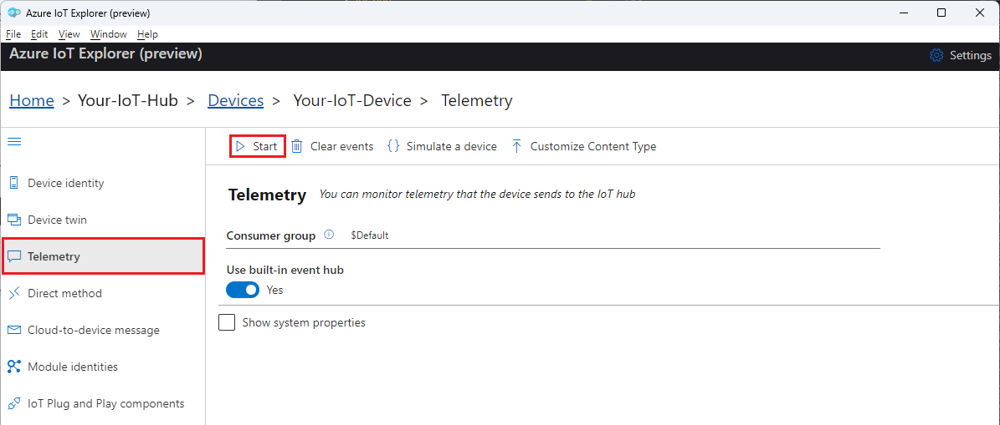

1. You should see the messages arriving from your device, with the most recent displayed at the top.

   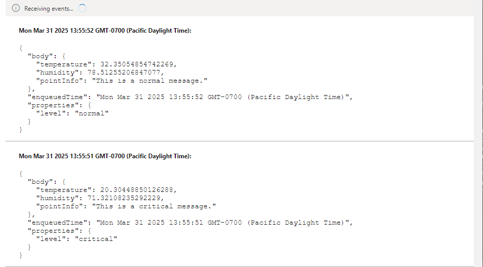

   Watch the incoming messages for a few moments to verify that you see three different types of messages: normal, storage, and critical. After seeing this, you can stop your device.

These messages are all arriving at the default built-in endpoint for your IoT hub. In the next sections, we're going to create a custom endpoint and route some of these messages to storage based on the message properties. Those messages will stop appearing in IoT Explorer because messages only go to the built-in endpoint when they don't match any other routes in IoT hub.

## Set up message routing

You're going to route messages to different resources based on properties attached to the message by the simulated device. Messages that aren't custom routed are sent to the default endpoint (messages/events).

The sample app for this tutorial assigns a **level** property to each message it sends to IoT hub. Each message is randomly assigned a level of **normal**, **storage**, or **critical**.

The first step is to set up the endpoint to which the data will be routed. The second step is to set up the message route that uses that endpoint. After setting up the routing, you can view endpoints and message routes in the portal.

### Create a storage account

Create an Azure Storage account and a container within that account, which will hold the device messages that are routed to it.

# [Azure portal](#tab/portal)

1. In the Azure portal, search for **Storage accounts**.

1. Select **Create**.

1. Provide the following values for your storage account:

   | Parameter | Value |
   | --------- | ----- |
   | **Subscription** | Select the same subscription that contains your IoT hub. |
   | **Resource group** | Select the same resource group that contains your IoT hub. |
   | **Storage account name** | Provide a globally unique name for your storage account. |
   | **Performance** | Accept the default **Standard** value. |

   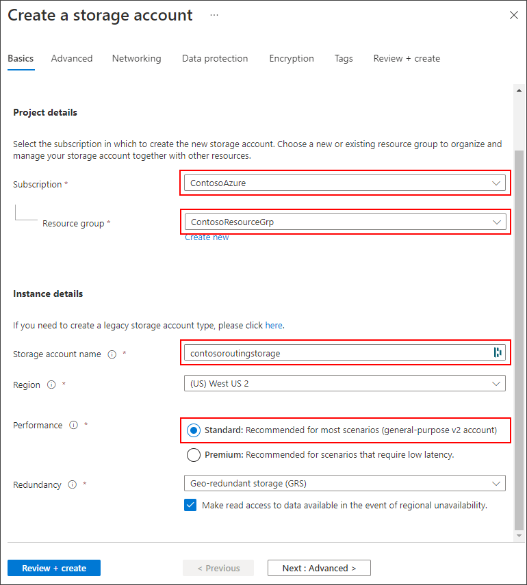

1. You can accept all the other default values by selecting **Review + create**.

1. After validation completes, select **Create**.

1. After the deployment is complete, select **Go to resource**.

1. In the storage account menu, select **Containers** from the **Data storage** section.

1. Select **+ Container** to create a new container.

   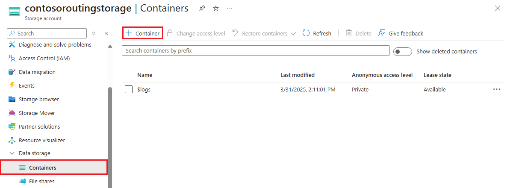

1. Provide a name for your container and select **Create**.

# [Azure CLI](#tab/cli)

1. Define the variables for your storage account and container.

   *GROUP_NAME*: Replace this placeholder with the name of the resource group that contains your IoT hub.

   *STORAGE_NAME*: Replace this placeholder with a name for your storage account. Storage account names must be lowercase and globally unique.

   *CONTAINER_NAME*: Replace this placeholder with a name for your container.

   ```azurecli-interactive
   resourceGroup=GROUP_NAME
   storageName=STORAGE_NAME
   containerName=CONTAINER_NAME
   ```

1. Use the [az storage account create](/cli/azure/storage/account#az-storage-account-create) command to create a standard general-purpose v2 storage account.

   ```azurecli-interactive
   az storage account create --name $storageName --resource-group $resourceGroup
   ```

1. Use the [az storage container create](/cli/azure/storage/container#az-storage-container-create) to add a container to your storage account.

   ```azurecli-interactive
   az storage container create --auth-mode login --account-name $storageName --name $containerName
   ```

---

### Route to a storage account

Now set up the routing for the storage account. In this section you define a new endpoint that points to the storage account you created. Then, create a route that filters for messages where the **level** property is set to **storage**, and route those to the storage endpoint.

[!INCLUDE [iot-hub-include-blob-storage-format](../../includes/iot-hub-include-blob-storage-format.md)]

# [Azure portal](#tab/portal)

1. In the [Azure portal](https://portal.azure.com), go to your IoT hub.

1. In the resource menu under **Hub settings**,  select **Message routing** then select **Add**.

   :::image type="content" source="media/tutorial-routing/message-routing-add.png" alt-text="Screenshot that shows location of the Add button, to add a new route in your IoT hub.":::

1. On the **Endpoint** tab, create a Storage endpoint by providing the following information:

   | Parameter | Value |
   | --------- | ----- |
   | **Endpoint type** | Select **Storage**. |
   | **Endpoint name** | Provide a unique name for this endpoint. |
   | **Azure Storage container** | Select **Pick a container**. Follow the prompts to select the storage account and container that you created in the previous section. |
   | **Encoding** | Select **JSON**. If this field is greyed out, then your storage account region doesn't support JSON. In that case, continue with the default **AVRO**. |

   :::image type="content" source="media/tutorial-routing/add-storage-endpoint.png" alt-text="Screenshot that shows the Add a storage endpoint pane with the correct options selected.":::

1. Accept the default values for the rest of the parameters and select **Create + next**.

1. On the **Route** tab, provide the following information to create a route that points to the Storage endpoint you created:

   | Parameter | Value |
   | -------- | ----- |
   | **Name** | Create a name for your route. |
   | **Data source** | Verify that **Device Telemetry Messages** is selected from the dropdown list. |
   | **Enable route** | Verify that this field is checked. |
   | **Routing query** | Enter `level="storage"` as the query string. |

   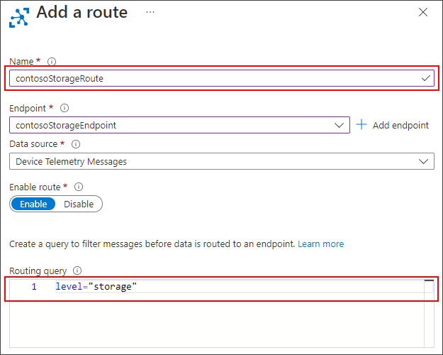

1. Select **Create + skip enrichments**.

# [Azure CLI](#tab/cli)

1. Configure the variables that you need for the endpoint and route commands.

   *ENDPOINT_NAME*: Provide a name for the endpoint that represents your storage container.

   *ROUTE_NAME*: Provide a name for the route that filters messages for the storage endpoint

   ```azurecli-interactive
   endpointName=ENDPOINT_NAME
   routeName=ROUTE_NAME
   ```

1. Use the [az iot hub routing-endpoint create](/cli/azure/iot/hub/routing-endpoint#az-iot-hub-routing-endpoint-create) command to create a custom endpoint that points to the storage container you made in the previous section.

   ```azurecli-interactive
   az iot hub routing-endpoint create \
     --connection-string $(az storage account show-connection-string --name $storageName --query connectionString -o tsv) \
     --endpoint-name $endpointName \
     --endpoint-resource-group $resourceGroup \
     --endpoint-subscription-id $(az account show --query id -o tsv) \
     --endpoint-type azurestoragecontainer
     --hub-name $hubName \
     --container $containerName \
     --resource-group $resourceGroup \
     --encoding json
   ```

1. Use the [az iot hub route create](/cli/azure/iot/hub/route#az-iot-hub-route-create) command to create a route that passes any message where `level=storage` to the storage container endpoint.

   ```azurecli-interactive
   az iot hub route create \
     --name $routeName \
     --hub-name $hubName \
     --resource-group $resourceGroup \
     --source devicemessages \
     --endpoint-name $endpointName \
     --enabled true \
     --condition 'level="storage"'
   ```

---

## View routed messages

Once the route is created in IoT Hub and enabled, it will immediately start routing messages that meet its query condition to the storage endpoint.

### Monitor the built-in endpoint with IoT Explorer

Return to the IoT Explorer session on your development machine. Recall that the IoT Explorer monitors the built-in endpoint for your IoT hub. That means that now you should be seeing only the messages that are *not* being routed by the custom route we created.

Start the sample again by running the code. Watch the incoming messages for a few moments and you should only see messages where `level` is set to `normal` or `critical`.

### View messages in the storage container

Verify that the messages are arriving in the storage container.

1. In the [Azure portal](https://portal.azure.com), navigate to your storage account.

1. Select **Containers** from the **Data storage** section of the menu.

1. Select the container that you created for this tutorial.

1. There should be a folder with the name of your IoT hub. Drill down through the file structure until you get to a **.json** file.

   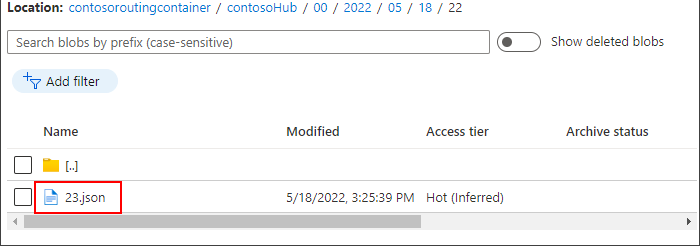

1. Select the JSON file, then select **Download** to download the JSON file. Confirm that the file contains messages from your device that have the `level` property set to `storage`.

1. Stop running the sample.

## Clean up resources

If you want to remove all of the Azure resources you used for this tutorial, delete the resource group. This action deletes all resources contained within the group. If you don't want to delete the entire resource group, use the Azure portal to locate and delete the individual resources.

If you intend to continue to the next tutorial, keep the resources that you created here.

# [Azure portal](#tab/portal)

1. In the Azure portal, navigate to the resource group that contains the IoT hub and storage account for this tutorial.
1. Review all the resources that are in the resource group to determine which ones you want to clean up.
   * If you want to delete all the resource, select **Delete resource group**.
   * If you only want to delete certain resource, use the check boxes next to each resource name to select the ones you want to delete. Then select **Delete**.

# [Azure CLI](#tab/cli)

1. Use the [az resource list](/cli/azure/resource#az-resource-list) command to view all the resources in your resource group.

   ```azurecli-interactive
   az resource list --resource-group $resourceGroup --output table
   ```

1. Review all the resources that are in the resource group to determine which ones you want to clean up.

   * If you want to delete all the resources, use the [az group delete](/cli/azure/group#az-group-delete) command.

     ```azurecli-interactive
     az group delete --name $resourceGroup
     ```

   * If you only want to delete certain resources, use the [az resource delete](/cli/azure/resource#az-resource-delete) command. For example:

     ```azurecli-interactive
     az resource delete --resource-group $resourceGroup --name $storageName
     ```

---

## Next steps

In this tutorial you learned how to create a custom endpoint for an Azure resource and then create a route to send device messages to that endpoint. Continue to the next tutorial to learn how to enrich messages with extra data that can be used to simplify downstream processing

> [!div class="nextstepaction"]
> [Use Azure IoT Hub message enrichments](tutorial-message-enrichments.md)
