# Tutorial: Set up and use metrics and diagnostic logs with an IoT hub

If you have an IoT Hub solution running in production, you want to set up some metrics and enable diagnostic logs. Then if a problem occurs, you have data to look at that will help you diagnose the problem and fix it more quickly. In this article, you'll see how to enable the diagnostic logs, and how to check them for errors. You'll also set up some metrics to watch, and alerts that fire when the metrics hit a certain boundary. For example, you could have an e-mail sent to you when the number of telemetry messages sent exceeds a specific boundary, or when the number of messages used gets close to the quota of messages allowed per day for the IoT Hub. 

An example use case is a gas station where the pumps are IoT devices that send communicate with an IoT hub. Credit cards are validated, and the final transaction is written to a data store. If the IoT devices stop connecting to the hub and sending messages, it is much more difficult to fix if you have no visibility into what's going on.

This tutorial uses the Azure sample from the [IoT Hub Routing](tutorial-routing.md) to send messages to the IoT hub.

In this tutorial, you perform the following tasks:

> [!div class="checklist"]
> * Using Azure CLI, create an IoT hub, a simulated device, and a storage account.  
> * Enable diagnostic logs.
> * Enable metrics.
> * Set up alerts for those metrics. 
> * Download and run an app that simulates an IoT device sending messages to the hub. 
> * Run the app until the alerts begin to fire. 
> * View the metrics results and check the diagnostic logs. 

## Prerequisites

- An Azure subscription. If you don't have an Azure subscription, create a [free account](https://azure.microsoft.com/free/?WT.mc_id=A261C142F) before you begin.

- Install [Visual Studio](https://www.visualstudio.com/). 

- An email account capable of receiving mail.

- Make sure that port 8883 is open in your firewall. The device sample in this tutorial uses MQTT protocol, which communicates over port 8883. This port may be blocked in some corporate and educational network environments. For more information and ways to work around this issue, see [Connecting to IoT Hub (MQTT)](iot-hub-mqtt-support.md#connecting-to-iot-hub).


[!INCLUDE [cloud-shell-try-it.md](../../includes/cloud-shell-try-it.md)]

## Set up resources

For this tutorial, you need an IoT hub, a storage account, and a simulated IoT device. These resources can be created using Azure CLI or Azure PowerShell. Use the same resource group and location for all of the resources. Then at the end, you can remove everything in one step by deleting the resource group.

These are the required steps.

1. Create a [resource group](../azure-resource-manager/management/overview.md). 

2. Create an IoT hub.

3. Create a standard V1 storage account with Standard_LRS replication.

4. Create a device identity for the simulated device that sends messages to your hub. Save the key for the testing phase.

### Set up resources using Azure CLI

Copy and paste this script into Cloud Shell. Assuming you are already logged in, it runs the script one line at a time. The new resources are created in the resource group ContosoResources.

The variables that must be globally unique have `$RANDOM` concatenated to them. When the script is run and the variables are set, a random numeric string is generated and concatenated to the end of the fixed string, making it unique.

```azurecli-interactive

# This is the IOT Extension for Azure CLI.
# You only need to install this the first time.
# You need it to create the device identity. 
az extension add --name azure-iot

# Set the values for the resource names that don't have to be globally unique.
# The resources that have to have unique names are named in the script below
#   with a random number concatenated to the name so you can probably just
#   run this script, and it will work with no conflicts.
location=westus
resourceGroup=ContosoResources
iotDeviceName=Contoso-Test-Device 

# Create the resource group to be used
#   for all the resources for this tutorial.
az group create --name $resourceGroup \
    --location $location

# The IoT hub name must be globally unique, so add a random number to the end.
iotHubName=ContosoTestHub$RANDOM
echo "IoT hub name = " $iotHubName

# Create the IoT hub in the Free tier.
az iot hub create --name $iotHubName \
    --resource-group $resourceGroup \
    --sku F1 --location $location

# The storage account name must be globally unique, so add a random number to the end.
storageAccountName=contosostoragemon$RANDOM
echo "Storage account name = " $storageAccountName

# Create the storage account.
az storage account create --name $storageAccountName \
    --resource-group $resourceGroup \
    --location $location \
    --sku Standard_LRS

# Create the IoT device identity to be used for testing.
az iot hub device-identity create --device-id $iotDeviceName \
    --hub-name $iotHubName 

# Retrieve the information about the device identity, then copy the primary key to
#   Notepad. You need this to run the device simulation during the testing phase.
az iot hub device-identity show --device-id $iotDeviceName \
    --hub-name $iotHubName

```

>[!NOTE]
>When creating the device identity, you may get the following error: *No keys found for policy iothubowner of IoT Hub ContosoTestHub*. To fix this error, update the Azure CLI IoT Extension and then run the last two commands in the script again. 
>
>Here is the command to update the extension. Run this in your Cloud Shell instance.
>
>```cli
>az extension update --name azure-iot
>```

## Enable the diagnostic logs 

[Diagnostic logs](../azure-monitor/platform/platform-logs-overview.md) are disabled by default when you create a new IoT hub. In this section, enable the diagnostic logs for your hub.

1. First, if you're not already on your hub in the portal, click **Resource groups** and click on the resource group Contoso-Resources. Select the hub from the list of resources displayed. 

2. Look for the **Monitoring** section in the IoT Hub blade. Click **Diagnostic settings**. 

   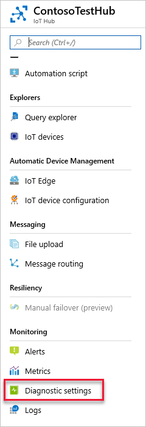


3. Make sure the subscription and resource group are correct. Under **Resource Type**, uncheck **Select All**, then look for and check **IoT Hub**. (It puts the checkmark next to *Select All* again, just ignore it.) Under **Resource**, select the hub name. Your screen should look like this image: 

   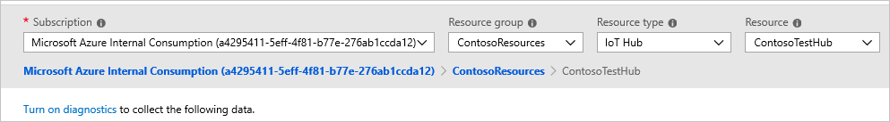

4. Now click **Turn on diagnostics**. The Diagnostics settings pane is displayed. Specify the name of your diagnostic logs settings as "diags-hub".

5. Check **Archive to a storage account**. 

   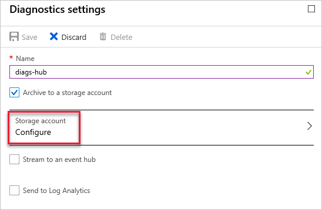

    Click **Configure** to see the **Select a storage account** screen, select the right one (*contosostoragemon*), and click **OK** to return to the Diagnostics settings pane. 

   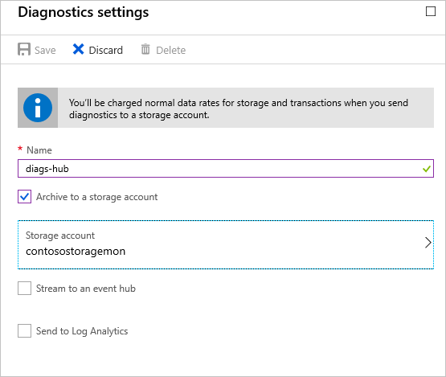

6. Under **LOG**, check **Connections** and **Device Telemetry**, and set the **Retention (days)** to 7 days for each. Your Diagnostic settings screen should now look like this image:

   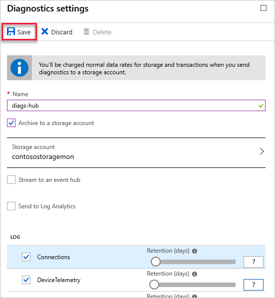

7. Click **Save** to save the settings. Close the Diagnostics settings pane.

Later, when you look at the diagnostic logs, you'll be able to see the connect and disconnect logging for the device. 

## Set up metrics 

Now set up some metrics to watch for when messages are sent to the hub. 

1. In the settings pane for the IoT hub, click on the **Metrics** option in the **Monitoring** section.

2. At the top of the screen, click **Last 24 hours (Automatic)**. In the dropdown that appears, select **Last 4 hours** for **Time Range**, and set **Time Granularity** to **1 minute**, local time. Click **Apply** to save these settings. 

   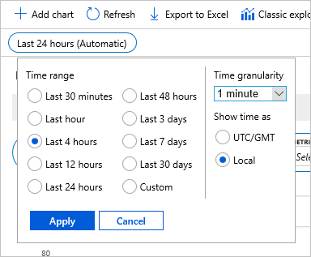

3. There is one metric entry by default. Leave the resource group as the default, and the metric namespace. In the **Metric** dropdown list, select **Telemetry messages sent**. Set **Aggregation** to **Sum**.

   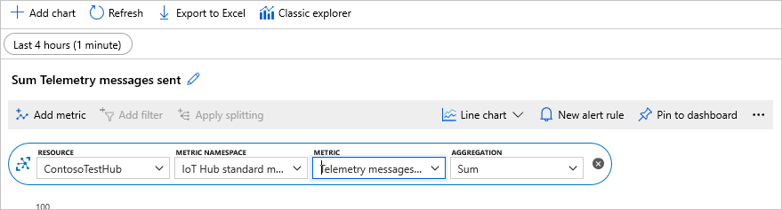


4. Now click **Add metric** to add another metric to the chart. Select your resource group (**ContosoTestHub**). Under **Metric**, select **Total number of messages used**. For **Aggregation**, select **Avg**. 

   Now your screen shows the minimized metric for *Telemetry messages sent*, plus the new metric for *Total number of messages used*.

   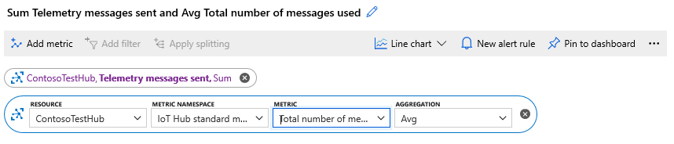

   Click **Pin to dashboard**. It will pin it to the dashboard of your Azure portal so you can access it again. If you don't pin it to the dashboard, your settings are not retained.

## Set up alerts

Go to the hub in the portal. Click **Resource Groups**, select *ContosoResources*, then select IoT Hub *ContosoTestHub*. 

IoT Hub has not been migrated to the [metrics in Azure Monitor](/azure/azure-monitor/platform/data-collection#metrics) yet; you have to use [classic alerts](/azure/azure-monitor/platform/alerts-classic.overview).

1. Under **Monitoring**, click **Alerts** This shows the main alert screen. 

   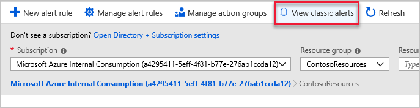

2. To get to the classic alerts from here, click **View classic alerts**. 

    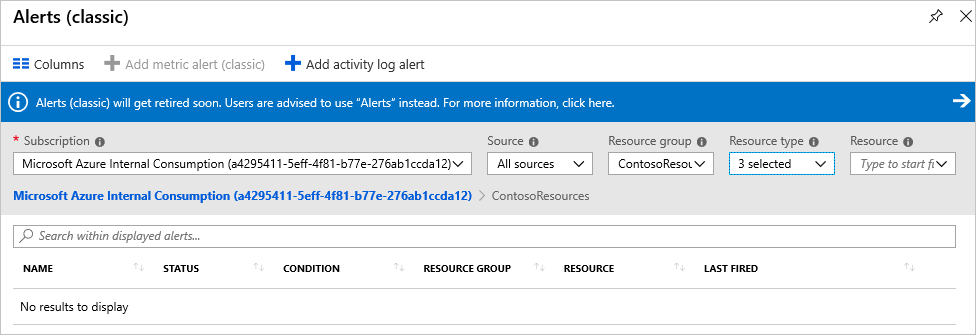

    Fill in the fields: 

    **Subscription**: Leave this field set to your current subscription.

    **Source**: Set this field to *Metrics*.

    **Resource group**: Set this field to your current resource group, *ContosoResources*. 

    **Resource type**: Set this field to IoT Hub. 

    **Resource**: Select your IoT hub, *ContosoTestHub*.

3. Click **Add metric alert (classic)** to set up a new alert.

    Fill in the fields:

    **Name**: Provide a name for your alert rule, such as *telemetry-messages*.

    **Description**: Provide a description of your alert, such as *alert when there are 1000 telemetry messages sent*. 

    **Source**: Set this to *Metrics*.

    **Subscription**, **Resource group**, and **Resource** should be set to the values you selected on the **View classic alerts** screen. 

    Set **Metric** to *Telemetry messages sent*.

    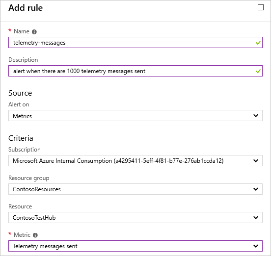

4. After the chart, set the following fields:

   **Condition**: Set to *Greater than*.

   **Threshold**: Set to 1000.

   **Period**: Set to *Over the last 5 minutes*.

   **Notification email recipients**: Put your e-mail address here. 

   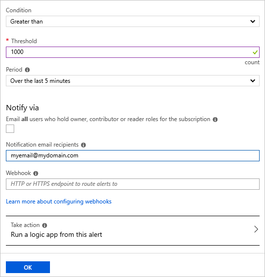

   Click **OK** to save the alert. 

5. Now set up another alert for the *Total number of messages used*. This metric is useful if you want to send an alert when the number of messages used is approaching the quota for the IoT hub -- to let you know the hub will soon start rejecting messages.

   On the **View classic alerts** screen, click **Add metric alert (classic)**, then fill in these fields on the **Add rule** pane.

   **Name**: Provide a name for your alert rule, such as *number-of-messages-used*.

   **Description**: Provide a description of your alert, such as *alert when getting close to quota*.

   **Source**: Set this field to *Metrics*.

    **Subscription**, **Resource group**, and **Resource** should be set to the values you selected on the **View classic alerts** screen. 

    Set **Metric** to *Total number of messages used*.

6. Under the chart, fill in the following fields:

   **Condition**: Set to *Greater than*.

   **Threshold**: Set to 1000.

   **Period**: Set this field to *Over the last 5 minutes*. 

   **Notification email recipients**: Put your e-mail address here. 

   Click **OK** to save the rule. 

5. You should now see two alerts in the classic alerts pane: 

   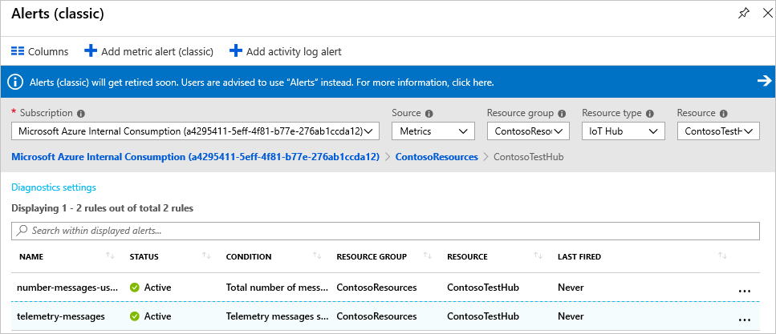

6. Close the alerts pane. 
    
    With these settings, you will get an alert when the number of messages sent is greater than 400 and when the total number of messages used exceeds NUMBER.

## Run Simulated Device app

Earlier in the script setup section, you set up a device to simulate using an IoT device. In this section, you download a .NET console app that simulates a device that sends device-to-cloud messages to an IoT hub.  

Download the solution for the [IoT Device Simulation](https://github.com/Azure-Samples/azure-iot-samples-csharp/archive/master.zip). This link downloads a repo with several applications in it; the solution you are looking for is in iot-hub/Tutorials/Routing/.

Double-click on the solution file (SimulatedDevice.sln) to open the code in Visual Studio, then open Program.cs. Substitute `{iot hub hostname}` with the IoT hub host name. The format of the IoT hub host name is **{iot-hub-name}.azure-devices.net**. For this tutorial, the hub host name is **ContosoTestHub.azure-devices.net**. Next, substitute `{device key}` with the device key you saved earlier when setting up the simulated device. 

   ```csharp
        static string myDeviceId = "contoso-test-device";
        static string iotHubUri = "ContosoTestHub.azure-devices.net";
        // This is the primary key for the device. This is in the portal. 
        // Find your IoT hub in the portal > IoT devices > select your device > copy the key. 
        static string deviceKey = "{your device key here}";
   ```

## Run and test 

In Program.cs, change the `Task.Delay` from 1000 to 10, which reduces the amount of time between sending messages from 1 second to .01 seconds. Shortening this delay increases the number of messages sent.

```csharp
await Task.Delay(10);
```

Run the console application. Wait a few minutes (10-15). You can see the messages being sent from the simulated device to the hub on the console screen of the application.

### See the metrics in the portal

Open your metrics from the Dashboard. Change the time values to *Last 30 minutes* with a time granularity of *1 minute*. It shows the telemetry messages sent and the total number of messages used on the chart, with the most recent numbers at the bottom of the chart.

   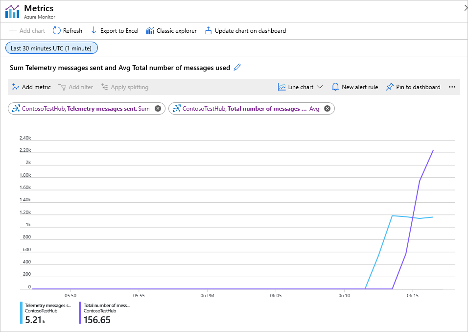

### See the alerts

Go back to alerts. Click **Resource groups**, select *ContosoResources*, then select the hub *ContosoTestHub*. In the properties page displayed for the hub, select **Alerts**, then **View classic alerts**. 

When the number of messages sent exceeds the limit, you start getting e-mail alerts. To see if there are any active alerts, go to your hub and select **Alerts**. It will show you the alerts that are active, and if there are any warnings. 

   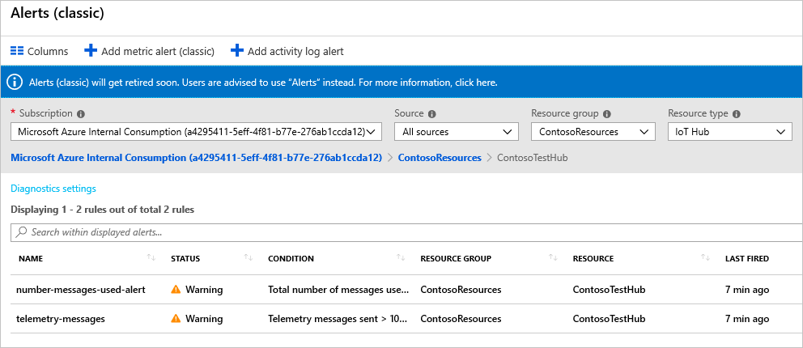

Click on the alert for telemetry messages. It shows the metric result and a chart with the results. Also, the e-mail sent to warn you of the alert firing looks like this image:

   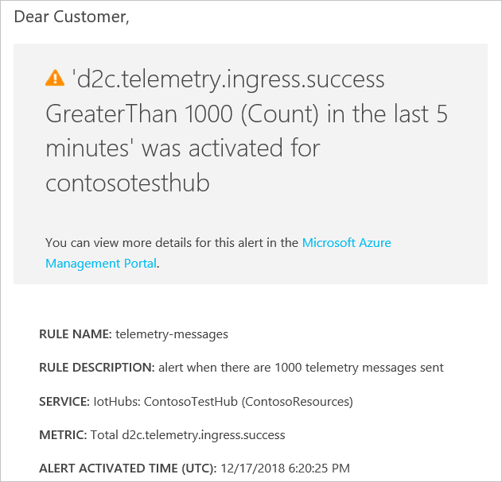

### See the diagnostic logs

You set up your diagnostic logs to be exported to blob storage. Go to your resource group and select your storage account *contosostoragemon*. Select Blobs, then open container *insights-logs-connections*. Drill down until you get to the current date and select the most recent file. 

   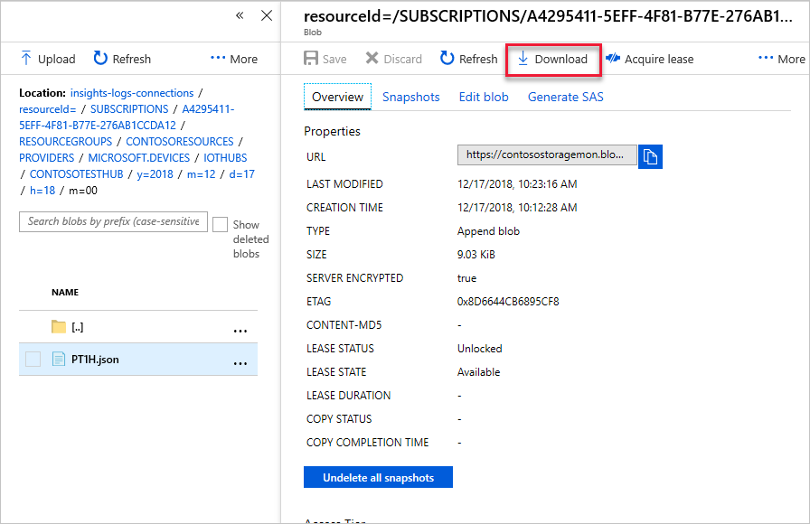

Click **Download** to download it and open it. You see the logs of the device connecting and disconnecting as it sends messages to the hub. Here a sample:

``` json
{ 
  "time": "2018-12-17T18:11:25Z", 
  "resourceId": 
    "/SUBSCRIPTIONS/your-subscription-id/RESOURCEGROUPS/CONTOSORESOURCES/PROVIDERS/MICROSOFT.DEVICES/IOTHUBS/CONTOSOTESTHUB", 
  "operationName": "deviceConnect", 
  "category": "Connections", 
  "level": "Information", 
  "properties": 
      {"deviceId":"Contoso-Test-Device",
       "protocol":"Mqtt",
       "authType":null,
       "maskedIpAddress":"73.162.215.XXX",
       "statusCode":null
       }, 
  "location": "westus"
}
{ 
   "time": "2018-12-17T18:19:25Z", 
   "resourceId": 
     "/SUBSCRIPTIONS/your-subscription-id/RESOURCEGROUPS/CONTOSORESOURCES/PROVIDERS/MICROSOFT.DEVICES/IOTHUBS/CONTOSOTESTHUB", 
    "operationName": "deviceDisconnect", 
    "category": "Connections", 
    "level": "Error", 
    "resultType": "404104", 
    "resultDescription": "DeviceConnectionClosedRemotely", 
    "properties": 
        {"deviceId":"Contoso-Test-Device",
         "protocol":"Mqtt",
         "authType":null,
         "maskedIpAddress":"73.162.215.XXX",
         "statusCode":"404"
         }, 
    "location": "westus"
}
```

## Clean up resources 

To remove all of the resources you've created in this tutorial, delete the resource group. This action deletes all resources contained within the group. In this case, it removes the IoT hub, the storage account, and the resource group itself. If you have pinned metrics to the dashboard, you will have to remove those manually by clicking on the three dots in the upper right-hand corner of each and selecting **Remove**.

To remove the resource group, use the [az group delete](https://docs.microsoft.com/cli/azure/group?view=azure-cli-latest#az-group-delete) command.

```azurecli-interactive
az group delete --name $resourceGroup
```

## Next steps

In this tutorial, you learned how to use metrics and diagnostic logs by performing the following tasks:

> [!div class="checklist"]
> * Using Azure CLI, create an IoT hub, a simulated device, and a storage account.  
> * Enable diagnostic logs. 
> * Enable metrics.
> * Set up alerts for those metrics. 
> * Download and run an app that simulates an IoT device sending messages to the hub. 
> * Run the app until the alerts begin to fire. 
> * View the metrics results and check the diagnostic logs. 

Advance to the next tutorial to learn how to manage the state of an IoT device. 

> [!div class="nextstepaction"]
> [Configure your devices from a back-end service](tutorial-device-twins.md)
