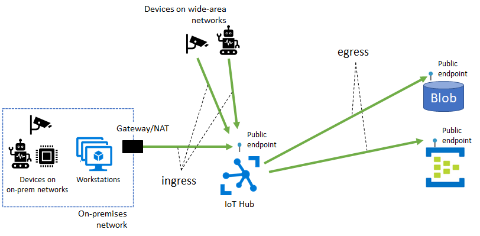
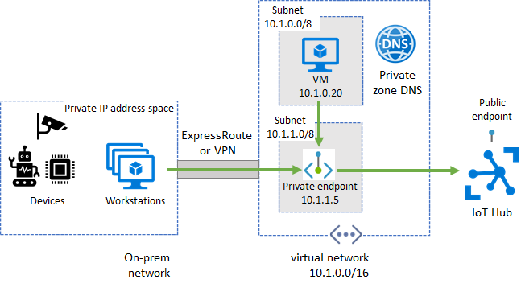

# IoT Hub support for virtual networks with Private Link and Managed Identity

By default, IoT Hub's hostnames map to a public endpoint with a publicly routable IP address over the internet. Different customers share this IoT Hub public endpoint, and IoT devices in over wide-area networks and on-premises networks can all access it.



IoT Hub features including [message routing](./iot-hub-devguide-messages-d2c.md), [file upload](./iot-hub-devguide-file-upload.md), and [bulk device import/export](./iot-hub-bulk-identity-mgmt.md) also require connectivity from IoT Hub to a customer-owned Azure resource over its public endpoint. These connectivity paths collectively make up the egress traffic from IoT Hub to customer resources.

You might want to restrict connectivity to your Azure resources (including IoT Hub) through a VNet that you own and operate. These reasons include:

* Introducing network isolation for your IoT hub by preventing connectivity exposure to the public internet.

* Enabling a private connectivity experience from your on-premises network assets ensuring that your data and traffic 
is transmitted directly to Azure backbone network.

* Preventing exfiltration attacks from sensitive on-premises networks. 

* Following established Azure-wide connectivity patterns using [private endpoints](../private-link/private-endpoint-overview.md).

This article describes how to achieve these goals using [Azure Private Link](../private-link/private-link-overview.md) for ingress connectivity to IoT Hub and using trusted Microsoft services exception for egress connectivity from IoT Hub to other Azure resources.

## Ingress connectivity to IoT Hub using Azure Private Link

A private endpoint is a private IP address allocated inside a customer-owned VNet via which an Azure resource is reachable. Through Azure Private Link, you can set up a private endpoint for your IoT hub to allow services inside your VNet to reach IoT Hub without requiring traffic to be sent to IoT Hub's public endpoint. Similarly, your on-premises devices can use [Virtual Private Network (VPN)](../vpn-gateway/vpn-gateway-about-vpngateways.md) or [ExpressRoute](https://azure.microsoft.com/services/expressroute/) peering to gain connectivity to your VNet and your IoT Hub (via its private endpoint). As a result, you can restrict or completely block off connectivity to your IoT hub's public endpoints by using [IoT Hub IP filter](./iot-hub-ip-filtering.md) and [configuring routing not to send any data to the built-in endpoint](#built-in-event-hub-compatible-endpoint-doesnt-support-access-over-private-endpoint). This approach keeps connectivity to your Hub using the private endpoint for devices. The main focus of this setup is for devices inside an on-premises network. This setup isn't advised for devices deployed in a wide-area network.



Before proceeding ensure that the following prerequisites are met:

* You've [created an Azure VNet](../virtual-network/quick-create-portal.md) with a subnet in which the private endpoint will be created.

* For devices that operate in on-premises networks, set up [Virtual Private Network (VPN)](../vpn-gateway/vpn-gateway-about-vpngateways.md) or [ExpressRoute](https://azure.microsoft.com/services/expressroute/) private peering into your Azure VNet.

### Set up a private endpoint for IoT Hub ingress

1. In Azure portal, select **Networking**, **Private endpoint connections**, and click the **+ Private endpoint**.

    :::image type="content" source="media/virtual-network-support/private-link.png" alt-text="Screenshot showing where to add private endpoint for IoT Hub":::

1. Provide the subscription, resource group, name, and region to create the new private endpoint in. Ideally, private endpoint should be created in the same region as your hub.

1. Click **Next: Resource**, and provide the subscription for your IoT Hub resource, and select **"Microsoft.Devices/IotHubs"** as resource type, your IoT Hub name as **resource**, and **iotHub** as target subresource.

1. Click **Next: Configuration** and provide your virtual network and subnet to create the private endpoint in. Select the option to integrate with Azure private DNS zone, if desired.

1. Click **Next: Tags**, and optionally provide any tags for your resource.

1. Click **Review + create** to create your private link resource.

### Built-in Event Hub compatible endpoint doesn't support access over private endpoint

The [built-in Event Hub compatible endpoint](iot-hub-devguide-messages-read-builtin.md) doesn't support access over private endpoint. When configured, an IoT hub's private endpoint is for ingress connectivity only. Consuming data from built-in Event Hub compatible endpoint can only be done over the public internet. 

IoT Hub's [IP filter](iot-hub-ip-filtering.md) also doesn't control public access to the built-in endpoint. To completely block public network access to your IoT hub, you must: 

1. Configure private endpoint access for IoT Hub
1. Turn off public network access by using IP filter to block all IP
1. Turn off the built-in Event Hub endpoint by [setting up routing to not send data to it](iot-hub-devguide-messages-d2c.md)
1. Turn off the [fallback route](iot-hub-devguide-messages-d2c.md#fallback-route)
1. Configure egress to other Azure resources using [trusted Microsoft service](#egress-connectivity-from-iot-hub-to-other-azure-resources)

### Pricing for Private Link

For pricing details, see [Azure Private Link pricing](https://azure.microsoft.com/pricing/details/private-link).

## Egress connectivity from IoT Hub to other Azure resources

IoT Hub can connect to your Azure blob storage, event hub, service bus resources for [message routing](./iot-hub-devguide-messages-d2c.md), [file upload](./iot-hub-devguide-file-upload.md), and [bulk device import/export](./iot-hub-bulk-identity-mgmt.md) over the resources' public endpoint. Binding your resource to a VNet blocks connectivity to the resource by default. As a result, this configuration prevents IoT Hub's from working sending data to your resources. To fix this issue, enable connectivity from your IoT Hub resource to your storage account, event hub, or service bus resources via the **trusted Microsoft service** option.

### Turn on managed identity for IoT Hub

To allow other services to find your IoT hub as a trusted Microsoft service, it must have a system-assigned managed identity.

1. Navigate to **Identity** in your IoT Hub portal

1. Under **Status**, select **On**, then click **Save**.

    :::image type="content" source="media/virtual-network-support/managed-identity.png" alt-text="Screenshot showing how to turn on managed identity for IoT Hub":::

### Pricing for managed identity

Trusted Microsoft first party services exception feature is free of charge. Charges for the provisioned storage accounts, event hubs, or service bus resources apply separately.

### Egress connectivity to storage account endpoints for routing

IoT Hub can route messages to a customer-owned storage account. To allow the routing functionality to access a storage account while firewall restrictions are in place, your IoT Hub needs to have a [managed identity](#turn-on-managed-identity-for-iot-hub). Once a managed identity is provisioned, follow the steps below to give RBAC permission to your hub's resource identity to access your storage account.

1. In the Azure portal, navigate to your storage account's **Access control (IAM)** tab and click **Add** under the **Add a role assignment** section.

2. Select **Storage Blob Data Contributor** ([*not* Contributor or Storage Account Contributor](../storage/common/storage-auth-aad-rbac-portal.md#rbac-roles-for-blobs-and-queues)) as **role**, **Azure AD user, group, or service principal** as **Assigning access to** and select your IoT Hub's resource name in the drop-down list. Click the **Save** button.

3. Navigate to the **Firewalls and virtual networks** tab in your storage account and enable **Allow access from selected networks** option. Under the **Exceptions** list, check the box for **Allow trusted Microsoft services to access this storage account**. Click the **Save** button.

4. On your IoT Hub's resource page, navigate to **Message routing** tab.

5. Navigate to **Custom endpoints** section and click **Add**. Select **Storage** as the endpoint type.

6. On the page that shows up, provide a name for your endpoint, select the container that you intend to use in your blob storage, provide encoding, and file name format. Select **System Assigned** as the **Authentication type** to your storage endpoint. Click the **Create** button.

Now your custom storage endpoint is set up to use your hub's system assigned identity, and it has permission to access your storage resource despite its firewall restrictions. You can now use this endpoint to set up a routing rule.

### Egress connectivity to event hubs endpoints for routing

IoT Hub can be configured to route messages to a customer-owned event hubs namespace. To allow the routing functionality to access an event hubs resource while firewall restrictions are in place, your IoT Hub needs to have a managed identity. Once a managed identity is created, follow the steps below to give RBAC permission to your hub's resource identity to access your event hubs.

1. In the Azure portal, navigate to your event hubs **Access control (IAM)** tab and click **Add** under the **Add a role assignment** section.

2. Select **Event Hubs Data Sender** as **role**, **Azure AD user, group, or service principal** as **Assigning access to** and select your IoT Hub's resource name in the drop-down list. Click the **Save** button.

3. Navigate to the **Firewalls and virtual networks** tab in your event hubs and enable **Allow access from selected networks** option. Under the **Exceptions** list, check the box for **Allow trusted Microsoft services to access event hubs**. Click the **Save** button.

4. On your IoT Hub's resource page, navigate to **Message routing** tab.

5. Navigate to **Custom endpoints** section and click **Add**. Select **Event hubs** as the endpoint type.

6. On the page that shows up, provide a name for your endpoint, select your event hubs namespace and instance and click the **Create** button.

Now your custom event hubs endpoint is set up to use your hub's system assigned identity, and it has permission to access your event hubs resource despite its firewall restrictions. You can now use this endpoint to set up a routing rule.

### Egress connectivity to service bus endpoints for routing

IoT Hub can be configured to route messages to a customer-owned service bus namespace. To allow the routing functionality to access a service bus resource while firewall restrictions are in place, your IoT Hub needs to have a managed identity. Once a managed identity is provisioned, follow the steps below to give RBAC permission to your hub's resource identity to access your service bus.

1. In the Azure portal, navigate to your service bus' **Access control (IAM)** tab and click **Add** under the **Add a role assignment** section.

2. Select **Service bus Data Sender** as **role**, **Azure AD user, group, or service principal** as **Assigning access to** and select your IoT Hub's resource name in the drop-down list. Click the **Save** button.

3. Navigate to the **Firewalls and virtual networks** tab in your service bus and enable **Allow access from selected networks** option. Under the **Exceptions** list, check the box for **Allow trusted Microsoft services to access this service bus**. Click the **Save** button.

4. On your IoT Hub's resource page, navigate to **Message routing** tab.

5. Navigate to **Custom endpoints** section and click **Add**. Select **Service bus queue** or **Service Bus topic** (as applicable) as the endpoint type.

6. On the page that shows up, provide a name for your endpoint, select your service bus' namespace and queue or topic (as applicable). Click the **Create** button.

Now your custom service bus endpoint is set up to use your hub's system assigned identity, and it has permission to access your service bus resource despite its firewall restrictions. You can now use this endpoint to set up a routing rule.

### Egress connectivity to storage accounts for file upload

IoT Hub's file upload feature allows devices to upload files to a customer-owned storage account. To allow the file upload to function, both devices and IoT Hub need to have connectivity to the storage account. If firewall restrictions are in place on the storage account, your devices need to use any of the supported storage account's mechanism (including [private endpoints](../private-link/create-private-endpoint-storage-portal.md), [service endpoints](../virtual-network/virtual-network-service-endpoints-overview.md), or [direct firewall configuration](../storage/common/storage-network-security.md)) to gain connectivity. Similarly, if firewall restrictions are in place on the storage account, IoT Hub needs to be configured to access the storage resource via the trusted Microsoft services exception. For this purpose, your IoT Hub must have a managed identity. Once a managed identity is provisioned, follow the steps below to give RBAC permission to your hub's resource identity to access your storage account.

1. In the Azure portal, navigate to your storage account's **Access control (IAM)** tab and click **Add** under the **Add a role assignment** section.

2. Select **Storage Blob Data Contributor** ([*not* Contributor or Storage Account Contributor](../storage/common/storage-auth-aad-rbac-portal.md#rbac-roles-for-blobs-and-queues)) as **role**, **Azure AD user, group, or service principal** as **Assigning access to** and select your IoT Hub's resource name in the drop-down list. Click the **Save** button.

3. Navigate to the **Firewalls and virtual networks** tab in your storage account and enable **Allow access from selected networks** option. Under the **Exceptions** list, check the box for **Allow trusted Microsoft services to access this storage account**. Click the **Save** button.

4. On your IoT Hub's resource page, navigate to **File upload** tab.

5. On the page that shows up, select the container that you intend to use in your blob storage, configure the **File notification settings**, **SAS TTL**, **Default TTL**, and **Maximum delivery count** as desired. Select **System Assigned** as the **Authentication type** to your storage endpoint. Click the **Create** button.

Now your storage endpoint for file upload is set up to use your hub's system assigned identity, and it has permission to access your storage resource despite its firewall restrictions.

### Egress connectivity to storage accounts for bulk device import/export

IoT Hub supports the functionality to [import/export](./iot-hub-bulk-identity-mgmt.md) devices' information in bulk from/to a customer-provided storage blob. To allow bulk import/export feature to function, both devices and IoT Hub need to have connectivity to the storage account.

This functionality requires connectivity from IoT Hub to the storage account. To access a service bus resource while firewall restrictions are in place, your IoT Hub needs to have a managed identity. Once a managed identity is provisioned, follow the steps below to give RBAC permission to your hub's resource identity to access your service bus.

1. In the Azure portal, navigate to your storage account's **Access control (IAM)** tab and click **Add** under the **Add a role assignment** section.

2. Select **Storage Blob Data Contributor** ([*not* Contributor or Storage Account Contributor](../storage/common/storage-auth-aad-rbac-portal.md#rbac-roles-for-blobs-and-queues)) as **role**, **Azure AD user, group, or service principal** as **Assigning access to** and select your IoT Hub's resource name in the drop-down list. Click the **Save** button.

3. Navigate to the **Firewalls and virtual networks** tab in your storage account and enable **Allow access from selected networks** option. Under the **Exceptions** list, check the box for **Allow trusted Microsoft services to access this storage account**. Click the **Save** button.

You can now use the Azure IoT REST APIs for [creating import export jobs](https://docs.microsoft.com/rest/api/iothub/service/jobclient/getimportexportjobs) for information on how to use the bulk import/export functionality. You will need to provide the `storageAuthenticationType="identityBased"` in your request body and use `inputBlobContainerUri="https://..."` and `outputBlobContainerUri="https://..."` as the input and output URLs of your storage account, respectively.

Azure IoT Hub SDKs also support this functionality in the service client's registry manager. The following code snippet shows how to initiate an import job or export job in using the C# SDK.

```csharp
// Call an import job on the IoT Hub
JobProperties importJob = 
await registryManager.ImportDevicesAsync(
  JobProperties.CreateForImportJob(inputBlobContainerUri, outputBlobContainerUri, null, StorageAuthenticationType.IdentityBased), 
  cancellationToken);

// Call an export job on the IoT Hub to retrieve all devices
JobProperties exportJob = 
await registryManager.ExportDevicesAsync(
    JobProperties.CreateForExportJob(outputBlobContainerUri, true, null, StorageAuthenticationType.IdentityBased),
    cancellationToken);
```

To use this version of the Azure IoT SDKs with virtual network support for C#, Java, and Node.js:

1. Create an environment variable named `EnableStorageIdentity` and set its value to `1`.

2. Download the SDK:  [Java](https://aka.ms/vnetjavasdk) | [C#](https://aka.ms/vnetcsharpsdk) | [Node.js](https://aka.ms/vnetnodesdk)
 
For Python, download our limited version from GitHub.

1. Navigate to the [GitHub release page](https://aka.ms/vnetpythonsdk).

2. Download the following file, which you'll find at the bottom of the release page under the header named **assets**.
    > *azure_iot_hub-2.2.0_limited-py2.py3-none-any.whl*

3. Open a terminal and navigate to the folder with the downloaded file.

4. Run the following command to install the Python Service SDK with support for virtual networks:
    > pip install ./azure_iot_hub-2.2.0_limited-py2.py3-none-any.whl


## Next steps

Use the links below to learn more about IoT Hub features:

* [Message routing](./iot-hub-devguide-messages-d2c.md)
* [File upload](./iot-hub-devguide-file-upload.md)
* [Bulk device import/export](./iot-hub-bulk-identity-mgmt.md) 
