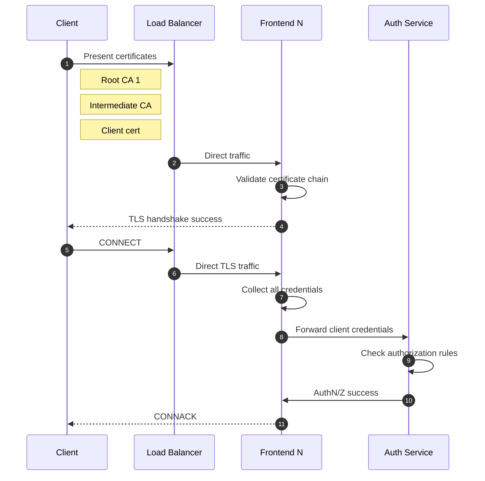

# Configure Azure IoT MQ authentication

[!INCLUDE [public-preview-note](../includes/public-preview-note.md)]

E4K supports multiple authentication methods for clients, and you can configure each listener to have its own authentication system with **BrokerAuthentication** resources.

For example:

* The following BrokerAuthentication resource enables username/password and SAT authentication for the listener named "my-listener".
* The username/password method uses the secret "credentials" as the password database.

```yaml
apiVersion: az-edge.com/v1alpha4 
kind: BrokerAuthentication 
metadata: 
  name: "my-authn-methods"
  namespace: {} 
spec: 
  listenerRef: 
    - "my-listener"
  authenticationMethods: 
    - usernamePassword: 
        passwordDatabase: credentials 
    - sat: 
        audiences: ["azedge-dmqtt"]
```

Also:

* A BrokerListener can be linked to up to one BrokerAuthentication resource
* But, a BrokerAuthentication resource can be linked to multiple BrokerListener resources
* Each BrokerAuthentication resource can support multiple authentication methods as once

## Authentication flow

The order of authentication methods in the array determines how E4K authenticates clients. E4K tries to authenticate the client's credentials using the first specified method and iterates through the array until it finds a match or reaches the end.

For each method, E4K first checks if the client's credentials are *relevant* for that method. For example, [SAT authentication](#service-account-token) requires a username starting with `sat://`, and [X.509 authentication](#certificate) requires a client certificate. If the client's credentials are relevant, E4K then verifies if they are valid.

Specifically, for [custom authentication](#custom), E4K treats failure to communicate with the custom authentication server as *credentials not relevant*. This lets E4K fall back to other methods if the custom server is unreachable.

The authentication flow ends when:

* One of these conditions is true:
  * The client's credentials are relevant and valid for one of the methods.
  * The client's credentials are not relevant for any of the methods.
  * The client's credentials are relevant but invalid for any of the methods.
* E4K either grants or denies access to the client based on the outcome of the authentication flow.

With multiple authentication methods, E4K has a fall back mechanism. For example:

```yaml
apiVersion: az-edge.com/v1alpha4 
kind: BrokerAuthentication 
metadata: 
  name: "my-authn-methods"
  namespace: {} 
spec: 
  listenerRef: 
    - "my-listener" 
  authenticationMethods: 
    - custom: 
        # ...
    - sat: 
        # ...
    - usernamePassword:
        # ...
```

The example above specifies custom, SAT, and [username-password authentication](#username-and-password). When a client connects, E4K attempts to authenticate the client by using the specified methods in the given order **custom > SAT > username-password**.

1. First, E4K checks if the client's credentials are valid for custom authentication. Since custom authentication relies on an external server to determine validity of credentials, the broker considers all credentials relevant to custom auth and forwards them to the custom authentication server.

2. If the custom authentication server responds with `Pass` or `Fail` result, the authentication flow ends. However, if the custom authentication server isn't available, then E4K falls back to the remaining specified methods, with SAT being next.

3. Finally, E4K tries to authenticate the credentials as SAT credentials. If the MQTT username starts with `sat://`, E4K evaluates the MQTT password as a SAT. Otherwise, the broker falls back to username-password and check if the provided MQTT username and password are valid according to the password database.

If the custom authentication server is unavailable and all subsequent methods determined that the provided credentials are not relevant, then the broker denies the client connection.

## Disable authentication

For testing, disable authentication by changing it in the listener configuration.

```yaml {hl_lines=8}
apiVersion: az-edge.com/v1alpha4
kind: BrokerListener
metadata:
  name: "my-listener"
  namespace: {}
spec:
  brokerRef: "my-broker"
  authenticationEnabled: false
  authorizationEnabled: false
  port: 1883
```

## Configure an authentication method

To learn more about each of the authentication options:

# [Username and password](#tab/userpass)

Each client has the following required properties:

- Username
- Password ([PBKDF2 encoded](https://en.wikipedia.org/wiki/PBKDF2))
- [Attributes for authorization](./howto-configure-authorization.md)

For example, start with a `clients.toml` with identities and PBKDF2 encoded passwords.

```toml
# Credential #1
# username: client1
# password: password
# salt: "HqJwOCHweNk1pLryiu3RsA"
[client1]
password = "$pbkdf2-sha512$i=100000,l=64$HqJwOCHweNk1pLryiu3RsA$KVSvxKYcibIG5S5n55RvxKRTdAAfCUtBJoy5IuFzdSZyzkwvUcU+FPawEWFPn+06JyZsndfRTfpiEh+2eSJLkg"

[client1.attributes]
floor = "floor1"
site = "site1"

# Credential #2
# username: client2
# password: password2
# salt: "+H7jXzcEbq2kkyvpxtxePQ"
[client2]
password = "$pbkdf2-sha512$i=100000,l=64$+H7jXzcEbq2kkyvpxtxePQ$jTzW6fSesiuNRLMIkDDAzBEILk7iyyDZ3rjlEwQap4UJP4TaCR+EXQXNukO7qNJWlPPP8leNnJDCBgX/255Ezw"

[client2.attributes]
floor = "floor2"
site = "site1"
```

To encode the password using PBKDF2, download and install [CLI]() tool to generate PBKDF2 password hashes from Windows, macOS or Linux machines.

```bash
az edge e4k get-password-hash --phrase TestPassword
```

The output shows the PBKDF2 password hash to copy:

```json
{
  "hash": "$pbkdf2-sha512$i=210000,l=64$4SnaHtmi7m++00fXNHMTOQ$rPT8BWv7IszPDtpj7gFC40RhhPuP66GJHIpL5G7SYvw+8rFrybyRGDy+PVBYClmdHQGEoy0dvV+ytFTKoYSS4A"
}
```

Then, import the TOML file as a Kubernetes secret  called "credentials" using kubectl.

```bash
kubectl create secret generic credentials --from-file=passwords.toml=./clients.toml
```

Finally, include a reference to the secret in the BrokerAuthentication CR:

```yaml
apiVersion: az-edge.com/v1alpha4 
kind: BrokerAuthentication 
metadata: 
  name: "up-only" 
  namespace: {} 
spec: 
  listenerRef: 
    - "my-listener" 
  authenticationMethods: 
    - usernamePassword: 
        passwordDatabase: credentials 
```

It may take a few minutes for the changes to take effect.

# [Certificate](#tab/cert)

## Prerequisites

- E4K configured with [TLS enabled](../pub-sub-mqtt/concept-brokerlistener.md).
- [Step-CLI](https://smallstep.com/docs/step-cli/installation/)
- Client certificates and the issuing certificate chain in PEM files. If you don't have any, use Step CLI to generate some.
- Familiarity with public key cryptography and terms like root CA, private key, and intermediate certificates.

Both EC and RSA keys are supported, but all certificates in the chain must use the same key algorithm. If you are importing your own CA certificates, ensure that the client certificate uses the same key algorithm as the CAs.


## Enable X.509 client authentication

To enable X.509 client authentication, [TLS must first be enabled](../pub-sub-mqtt/concept-brokerlistener.md). Then, add `x509` as one of the authentication methods as part of a Broker Authentication resource:

```yaml
apiVersion: az-edge.com/v1alpha4 
kind: BrokerAuthentication 
metadata: 
  name: "x509-auth-only" 
  namespace: {} 
spec: 
  listenerRef: 
    - "my-secure-listener" 
  authenticationMethods: 
    - x509: 
        trustedClientCaCert: client-ca-configmap
        attributes: x509-attributes
```

### Required: trusted root CA certificate

When authentication method is set to X.509, a trusted root CA certificate **must** be specified for the broker to successfully deploy.

To import a root certificate that can be used to validate client certificates, first import the certificate PEM, base 64 encoded, as a config map under the key `client_ca.pem` exactly. Client certificates must be rooted in this CA for E4K to authenticate them.

```bash
kubectl create configmap client-ca-configmap \
--from-file=client_ca.pem=my-root-file.pem
```

To check the root CA certificate is properly imported, run `kubectl describe configmap`. The result show the same base64 encoding of the PEM certificate file.

```console
$ kubectl describe configmap client-ca-configmap
Name:         client-ca-configmap
Namespace:    default

Data
====
client_ca.pem:
----
-----BEGIN CERTIFICATE-----
MIIBmzCCAUGgAwIBAgIQVAZ2I0ydpCut1imrk+fM3DAKBggqhkjOPQQDAjAsMRAw
...
t2xMXcOTeYiv2wnTq0Op0ERKICHhko2PyCGGwnB2Gg==
-----END CERTIFICATE-----


BinaryData
====
```

### Import certificate-to-attribute mapping

To use authorization policies for clients using properties on the X.509 certificates, create a certificate-to-attribute mapping TOML file and import it as a Kubernetes secret.

```bash
kubectl create secret generic x509-attributes --from-file=./attributes.toml 
```

To learn about the attributes file syntax, see [Authorize clients that use X.509 authentication](./howto-configure-authorization.md).

## Connect mosquitto client to E4K with X.509 client certificate

A client like mosquitto needs three files in order to be able to connect to E4K with TLS and X.509 client authentication.

```bash {hl_lines="3-5"}
mosquitto_pub -q 1 -t foo -d -V mqttv5 -m "42" -i thermostat \
-h "<E4K_EXTERNAL_IP>" \
--cert thermostat_cert.pem \
--key thermostat_key.pem \
--cafile trusted_and_inter.pem
```

Here:

- The `--cert` parameters specifies the client certificate PEM file.
- The `--key` parameter specifies the client private key PEM file.
- The third parameter `--cafile` is the most complex: the trusted certificate database, used for two purposes:
  - When mosquitto client connects to E4K over TLS, it validates the server certificate. It searches for root certificates in the database to create a trusted chain to the server certificate. Because of this, the server root certificate needs to be copied into this file.
  - When the E4K requests a client certificate from mosquitto client, it also requires a valid certificate chain to send to the server. The `--cert` parameter tells mosquitto which certificate to send, but it's not enough. E4K can't verify this certificate alone because it also needs the intermediate certificate. Mosquitto uses the database file to build the necessary certificate chain. To support this, the database file needs to contain both the intermediate and root certificates.

To learn more with an full example, see [Setup TLS, X.509 client authentication, and authorization with E4K]().

## Understand E4K X.509 client authentication flow



1. When X.509 client authentication is turned on, connecting clients must present its client certificate and any intermediate certificates to let E4K build a certificate chain rooted to one of its configured trusted certificate.
1. The load balancer directs the communication to one of the frontend brokers.
1. Once the frontend broker received the client certificate, it tries to build a certificate chain that is rooted to one of the configured certificates it has (required for TLS handshake). If the frontend broker successfully built a chain, and the presented chain is verified (e.g. the certificates are not expired), then it finishes the TLS handshake, and going forward the connecting client is able to send MQTT packets to the frontend through the just built TLS channel.
1. Now, the TLS channel is open, but the client authentication/authorization isn't finished yet.
1. The client then sends a CONNECT packet to E4K.
1. The CONNECT packet is routed to a frontend again.
1. The frontend collects all credentials the client presented so far, like username/password fields, authentication data from the CONNECT packet, and the client certificate chain presented during the TLS handshake.
1. The frontend sends these credentials to the authentication service. The authentication service checks the certificate chain once again and collects the subject names of all the certificates in the chain.
1. The authentication service uses its [configured authorization rules](./howto-configure-authorization.md) to determine what attributes the connecting clients has. These attributes determine what operations the client can execute, including the CONNECT packet itself.
1. Authentication service returns decision to frontend broker.
1. Now, the frontend broker knows the client attributes and if it is allowed to connect. If it is, then the MQTT connection is completed and the client can continue to send and receive MQTT packets determined by its authorization rules.

# [Service Account Token](#tab/sat)

Kubernetes Service Account Tokens (SATs) are JSON Web Tokens associated with Kubernetes Service Accounts. Clients present SATs to the E4K MQTT broker to authenticate themselves.

Specifically, E4K uses *bound service account tokens* which are detailed in [this blog post](https://cloud.google.com/blog/products/containers-kubernetes/kubernetes-bound-service-account-tokens). Here are the salient features (from the blog post):

 Launched in Kubernetes 1.13, and becoming the default format in 1.21, bound tokens address all of the limited functionality of legacy tokens, and more:
>
> * The tokens themselves are much harder to steal and misuse; they are time-bound, audience-bound, and object-bound.
> * They adopt a standardized format: OpenID Connect (OIDC), with full OIDC Discovery, making it easier for service providers to accept them.
> * They are distributed to pods more securely, using a new Kubelet projected volume type.

The broker verifies tokens using the [Kubernetes Token Review API](https://kubernetes.io/docs/reference/kubernetes-api/authentication-resources/token-review-v1/).

## Enable Service Account Token (SAT) authentication

Modify the `authenticationMethods` setting in a Broker Authentication resource to specify `sat` as a valid authentication method. The `audiences` specifies the list of valid audiences for tokens. Choose unique values that identify the E4K's broker service. You must specify at least one audience, and all SATs must match one of the specified audiences.

```yaml
apiVersion: az-edge.com/v1alpha4 
kind: BrokerAuthentication 
metadata: 
  name: "sat-only"
  namespace: {} 
spec: 
  listenerRef: 
    - "my-listener"
  authenticationMethods: 
    - sat: 
        audiences: ["azedge-dmqtt"]
```

Enable the Kubernetes `TokenRequestProjection` feature to specify `audiences` (default since 1.21). If this feature isn't enabled, SATs cannot be used.

Apply your changes with either `kubectl apply`.

## Create a Service Account

To create SATs, first create a Service Account. The command below creates a Service Account called `mqtt-client`.

```bash
kubectl create serviceaccount mqtt-client
```

## Add attributes for authorization

Clients authentication via SAT must have their SATs annotated with attributes in order to be used with custom authorization policies. To learn more, see [Authorize clients that use Kubernetes Service Account Tokens](./howto-configure-authentication.md).

## Test SAT authentication

SAT authentication may only be used from a pod in the same cluster as E4K. The command below creates a pod that has the mosquitto client and mounts the SAT created in the previous steps into the pod.

The `serviceAccountName` field in the pod configuration must match the Service Account associated with the token being used.

The `serviceAccountToken.audience` field in the pod configuration must be one of the `audiences` configured in the D-MQTT broker's `authenticationMethods`.

```bash {hl_lines=[7,16,17,18,19,20,21,22]}
cat <<EOF | kubectl apply -f -
apiVersion: v1
kind: Pod
metadata:
  name: mqtt-client
spec:
  serviceAccountName: mqtt-client
  containers:
  - image: efrecon/mqtt-client
    name: mqtt-client
    command: ["sleep", "infinity"]
    volumeMounts:
    - name: mqtt-client-token
      mountPath: /var/run/secrets/tokens
  volumes:
  - name: mqtt-client-token
    projected:
      sources:
      - serviceAccountToken:
          path: mqtt-client-token
          audience: azedge-dmqtt
          expirationSeconds: 86400
EOF
```

Once the pod has been created, start a shell in the pod:

```bash
kubectl exec --stdin --tty mqtt-client -- sh
```

The token is mounted at the path specified in the config (`/var/run/secrets/tokens` in the example above). Retrieve it and use it to authenticate.

```bash
token=$(cat /var/run/secrets/tokens/mqtt-client-token)

mosquitto_pub -h azedge-dmqtt-frontend -V mqttv5 -t "test" -m "test" -u '$sat' -P "$token"
```

The MQTT username must be set to `$sat`. The MQTT password should be set to the SAT.

# [Custom](#tab/custom)

Extend client authentication beyond the provided authentication methods with custom authentication. It's "pluggable" since the service can be anything as long as it adheres to the API.

When a client connects to E4K and custom authentication is enabled, E4K delegates the verification of client credentials to a custom authentication server with an HTTP request along with all credentials the client presents. The custom authentication server responds with approval or denial for the client with the client's [attributes for authorization](./howto-configure-authorization.md).

| Feature | Supported |
|---|:---:|
| Custom authentication API and sample | ✅ |
| Additional client info (IP, port, TLS, MQTT version) | 🔜 |
| Custom authorization API | 🔜 |

## Create custom authentication service

The custom authentication server is implemented and deployed separately from E4K.

### Sample

A sample custom authentication server and instructions are available. Use this sample as a template can and starting point for implementing your own custom authentication logic.



### API

The API between E4K and the custom authentication server follow the [API specification for custom authentication]().

### HTTPS with TLS encryption is required

E4K sends requests containing sensitive client credentials to the custom authentication server. To protect these credentials, communication between E4K and custom authentication server must be encrypted with TLS.

Therefore, the custom authentication server must present a server certificate, and E4K must have a trusted root CA certificate for validating the server certificate. Optionally, the custom authentication server may require E4K to present a client certificate to authenticate itself.

## Enable custom authentication on E4K

Modify the `authenticationMethods` setting in a BrokerAuthentication resource to specify `custom` as a valid authentication method. Then, specify the parameters required to communicate with a custom authentication server.

This example shows all possible parameters; the exact parameters required depend on each custom server's requirements.

```yaml
apiVersion: az-edge.com/v1alpha4 
kind: BrokerAuthentication 
metadata: 
  name: "custom-auth"
  namespace: {} 
spec: 
  listenerRef: 
    - "my-listener" 
  authenticationMethods: 
    - custom: 
        # Endpoint for custom authentication requests. Required.
        endpoint: "https://auth-server-template"
        # Trusted CA certificate for validating custom authentication server certificate.
        # Required unless the server certificate is publicly-rooted.
        caCert: "custom-auth-ca"
        # Authentication between E4K with the custom authentication server.
        # The broker may present X.509 credentials or no credentials to the server.
        auth:
          x509:
            secret: "custom-auth-client-cert"
            namespace: "default"
        # Optional additional HTTP headers that the broker will send to the
        # custom authentication server.
        headers:
          header_key: "header_value"
```

---