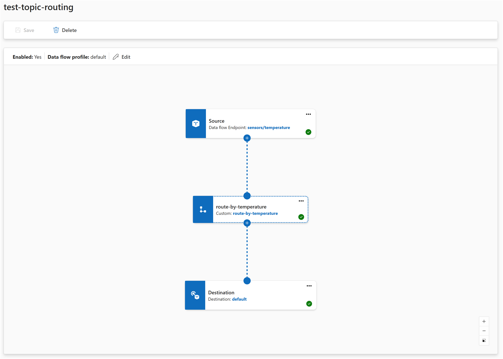

# Data flow graphs overview

[!INCLUDE [kubernetes-management-preview-note](../includes/kubernetes-management-preview-note.md)]

Data flow graphs give you a flexible way to process data as it moves through Azure IoT Operations. A standard [data flow](overview-dataflow.md) follows a fixed enrich, filter, map sequence. A data flow graph lets you compose transforms in any order, branch into parallel paths, and aggregate data over time windows.

A data flow graph is defined by the `DataflowGraph` Kubernetes custom resource. Inside it, you wire together sources, transforms, and destinations to build processing pipelines that match your scenario.

> [!IMPORTANT]
> Data flow graphs currently support only MQTT, Kafka, and OpenTelemetry endpoints. Other endpoint types like Data Lake, Microsoft Fabric OneLake, Azure Data Explorer, and Local Storage aren't supported. For more information, see [Known issues](../troubleshoot/known-issues.md#data-flow-graphs-only-support-specific-endpoint-types).

## Data flows vs. data flow graphs

Azure IoT Operations provides two ways to process data in a pipeline:

| Capability | Data flows | Data flow graphs |
|-----------|-----------|-----------------|
| Pipeline shape | Fixed: enrich, filter, map | Flexible: any order, branching, merging |
| Transform types | Map, filter, enrich | Map, filter, branch, concat, window, enrich |
| Time-based aggregation | Not available | Window transforms with tumbling windows |
| Conditional routing | Not available | Branch and concat transforms |
| Endpoint support | All endpoint types | MQTT, Kafka, and OpenTelemetry only |

For new projects that use supported endpoint types, we recommend data flow graphs. Data flows remain fully supported for all scenarios, and they support the full range of endpoint types.

## Available transforms

Each transform is a pre-built processing step that you configure with rules and chain with other transforms inside a `DataflowGraph` resource.

| Transform | What it does | Learn more |
|-----------|-------------|------------|
| **Map** | Rename, restructure, compute, and copy fields | [Transform data with map](howto-dataflow-graphs-map.md) |
| **Filter** | Drop messages that match a condition | [Filter and route data](howto-dataflow-graphs-filter-route.md) |
| **Branch** | Route each message to a `true` or `false` path based on a condition | [Filter and route data](howto-dataflow-graphs-filter-route.md#branch-transform) |
| **Concat** | Merge two or more paths back into one | [Filter and route data](howto-dataflow-graphs-filter-route.md#merge-paths-with-concat) |
| **Window** | Collect messages over a time interval, then aggregate | [Aggregate data over time](howto-dataflow-graphs-window.md) |

All transforms share an [expression language](concept-dataflow-graphs-expressions.md) for operators, functions, and field references. You can also [enrich](howto-dataflow-graphs-enrich.md) messages with external data from a state store in map, filter, and branch transforms.

## How transforms compose

Transforms connect in sequence inside a `DataflowGraph` resource: **Source > Transform A > Transform B > … > Destination**.

Branch transforms split the flow into parallel paths, and concat transforms merge them back.

You can chain any number of transforms in any order. A pipeline with a single map transform is as valid as one that filters, branches, maps each path differently, merges, and then aggregates over a time window.

## How configuration works

Each transform in a data flow graph references a pre-built artifact pulled from a container registry. You configure the transform by passing rules as JSON through the `configuration` section of the graph resource.

A default registry endpoint named `default` pointing to `mcr.microsoft.com` is created automatically when you deploy Azure IoT Operations. The built-in transforms use this endpoint to pull artifacts from Microsoft Container Registry. No extra registry setup is needed.

Here's a complete example that reads temperature data from an MQTT topic, converts Celsius to Fahrenheit with a map transform, and publishes the result:

# [Operations experience](#tab/portal)



In the Operations experience:

1. Select **Data flow graph** > **Create data flow graph**.
1. Add a **source** with the default endpoint and topic `telemetry/temperature`.
1. Add a **map** transform. Configure a rule with input `temperature`, output `temperature_f`, and expression `cToF($1)`.
1. Add a **destination** with the default endpoint and topic `telemetry/converted`.
1. Connect: source → map → destination.
1. Select **Save**.

# [Bicep](#tab/bicep)

```bicep
resource dataflowGraph 'Microsoft.IoTOperations/instances/dataflowProfiles/dataflowGraphs@2025-10-01' = {
  name: 'temperature-conversion'
  parent: dataflowProfile
  properties: {
    profileRef: dataflowProfileName
    mode: 'Enabled'
    nodes: [
      {
        nodeType: 'Source'
        name: 'sensors'
        sourceSettings: {
          endpointRef: 'default'
          dataSources: [ 'telemetry/temperature' ]
        }
      }
      {
        nodeType: 'Graph'
        name: 'convert'
        graphSettings: {
          registryEndpointRef: 'default'
          artifact: 'azureiotoperations/graph-dataflow-map:1.0.0'
          configuration: [
            {
              key: 'rules'
              value: '{"map":[{"inputs":["temperature"],"output":"temperature_f","expression":"cToF($1)"}]}'
            }
          ]
        }
      }
      {
        nodeType: 'Destination'
        name: 'output'
        destinationSettings: {
          endpointRef: 'default'
          dataDestination: 'telemetry/converted'
        }
      }
    ]
    nodeConnections: [
      { from: { name: 'sensors' }, to: { name: 'convert' } }
      { from: { name: 'convert' }, to: { name: 'output' } }
    ]
  }
}
```

# [Kubernetes (preview)](#tab/kubernetes)

```yaml
apiVersion: connectivity.iotoperations.azure.com/v1
kind: DataflowGraph
metadata:
  name: temperature-conversion
  namespace: azure-iot-operations
spec:
  profileRef: default
  nodes:
    - nodeType: Source
      name: sensors
      sourceSettings:
        endpointRef: default
        dataSources:
          - telemetry/temperature

    - nodeType: Graph
      name: convert
      graphSettings:
        registryEndpointRef: default
        artifact: azureiotoperations/graph-dataflow-map:1.0.0
        configuration:
          - key: rules
            value: |
              {
                "map": [
                  {
                    "inputs": ["temperature"],
                    "output": "temperature_f",
                    "expression": "cToF($1)"
                  }
                ]
              }

    - nodeType: Destination
      name: output
      destinationSettings:
        endpointRef: default
        dataDestination: telemetry/converted

  nodeConnections:
    - from: { name: sensors }
      to: { name: convert }
    - from: { name: convert }
      to: { name: output }
```

---

The pipeline defines three elements: a source, a transform (indicated by `nodeType: Graph`), and a destination. The connections describe how data flows between them. The transform's `configuration` passes rules as a JSON string under the `rules` key.

In the how-to articles that follow, examples focus on the transform rules themselves. For a step-by-step guide to creating a data flow graph, see [Create a data flow graph](howto-create-dataflow-graph.md).

## Built-in transforms vs. WASM transforms

Data flow graphs support two kinds of transforms:

- **Built-in transforms** are pre-built by Microsoft (map, filter, branch, concat, window). You configure them with rules. No coding required.
- **WASM transforms** are custom WebAssembly modules that developers build and deploy. Use them when you need logic that the built-in transforms don't cover.

Both kinds of transforms run inside the same `DataflowGraph` resource and can be mixed in a single pipeline. For information on building and deploying custom transforms, see [Use WASM transforms in data flow graphs](howto-dataflow-graph-wasm.md).

## Error handling

When a transform encounters an error while processing a message (for example, a missing field or an invalid expression), the message is dropped and an error is logged. The pipeline continues processing subsequent messages.

Common causes of processing errors:

- A field referenced in a rule's `inputs` doesn't exist in the message.
- A filter or branch expression returns a non-boolean value.
- An expression references an incompatible data type (for example, using a JSON object in arithmetic).
- A state store used for enrichment is unreachable.

To monitor for processing errors, check the pod logs for the data flow graph or use the metrics endpoints. For more information, see [Configure observability and monitoring](../configure-observability-monitoring/howto-configure-observability.md).

## Performance guidance

Each transform in the pipeline adds processing overhead. Keep these guidelines in mind:

- **Prefer fewer transforms with more rules.** If you have many transformation rules that operate on the same structure, put them in a single map transform rather than creating separate transforms for each rule.
- **Use multiple transforms when the logic is distinct.** Separate transforms make sense when different processing steps are fundamentally different (filtering vs. mapping vs. aggregating).
- **Keep related rules together.** A single map transform can handle field renaming, restructuring, computed fields, and metadata transformations all at once.

## Prerequisites

To use data flow graphs, you need:

- An Azure IoT Operations instance deployed on an Arc-enabled Kubernetes cluster. For more information, see [Deploy Azure IoT Operations](../deploy-iot-ops/howto-deploy-iot-operations.md).
- The default registry endpoint that points to `mcr.microsoft.com`, which is created automatically during deployment.

## Next steps

- [Data flows vs. data flow graphs](overview-dataflow-comparison.md)
- [Create a data flow graph](howto-create-dataflow-graph.md)
- [Transform data with map](howto-dataflow-graphs-map.md)
- [Filter and route data](howto-dataflow-graphs-filter-route.md)
- [Aggregate data over time](howto-dataflow-graphs-window.md)
- [Enrich with external data](howto-dataflow-graphs-enrich.md)
- [Expressions reference](concept-dataflow-graphs-expressions.md)
- [Route messages to different topics](howto-dataflow-graphs-topic-routing.md)
- [Expressions reference](concept-dataflow-graphs-expressions.md)
- [Use WASM transforms in data flow graphs](howto-dataflow-graph-wasm.md)
