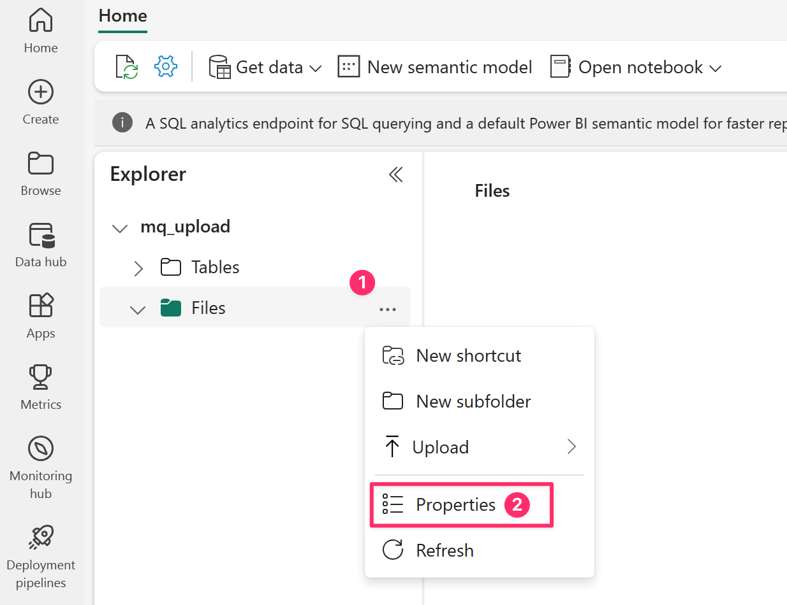

# Configure dataflow endpoints for Microsoft Fabric OneLake

[!INCLUDE [public-preview-note](../includes/public-preview-note.md)]

To send data to Microsoft Fabric OneLake in Azure IoT Operations Preview, you can configure a dataflow endpoint. This configuration allows you to specify the destination endpoint, authentication method, table, and other settings.

## Prerequisites

- An instance of [Azure IoT Operations Preview](../deploy-iot-ops/howto-deploy-iot-operations.md)
- A [configured dataflow profile](howto-configure-dataflow-profile.md)
- **Microsoft Fabric OneLake**. See the following steps to create a workspace and lakehouse.
  - [Create a workspace](/fabric/get-started/create-workspaces). The default *my workspace* isn't supported.
  - [Create a lakehouse](/fabric/onelake/create-lakehouse-onelake).

## Create a Microsoft Fabric OneLake dataflow endpoint

To configure a dataflow endpoint for Microsoft Fabric OneLake, we suggest using the managed identity of the Azure Arc-enabled Kubernetes cluster. This approach is secure and eliminates the need for secret management.

# [Portal](#tab/portal)

:::image type="content" source="media/howto-configure-fabric-endpoint/create-fabric-endpoint.png" alt-text="Screenshot using operations portal to create a Microsoft Fabric OneLake dataflow endpoint.":::

# [Kubernetes](#tab/kubernetes)

1. Get the managed identity of the Azure IoT Operations Preview Arc extension.

1. In the Microsoft Fabric workspace you created, select **Manage access** > **+ Add people or groups**.

1. Search for the Azure IoT Operations Preview Arc extension by its name, and select the app ID GUID value that you found in the previous step.

1. Select **Contributor** as the role, then select **Add**.

1. Create the *DataflowEndpoint* resource and specify the managed identity authentication method.

    ```yaml
    apiVersion: connectivity.iotoperations.azure.com/v1beta1
    kind: DataflowEndpoint
    metadata:
      name: fabric
    spec:
      endpointType: FabricOneLake
      fabricOneLakeSettings:
        # The default Fabric OneLake host URL in most cases
        host: https://onelake.dfs.fabric.microsoft.com
        oneLakePathType: Tables
        authentication:
          method: SystemAssignedManagedIdentity
          systemAssignedManagedIdentitySettings: {}
        names:
          workspaceName: <EXAMPLE-WORKSPACE-NAME>
          lakehouseName: <EXAMPLE-LAKEHOUSE-NAME>
    ```

---

## Configure dataflow destination

Once the endpoint is created, you can use it in a dataflow by specifying the endpoint name in the dataflow's destination settings. 

# [Portal](#tab/portal)

:::image type="content" source="media/howto-configure-fabric-endpoint/dataflow-mq-fabric.png" alt-text="Screenshot using operations portal to create a dataflow with a MQTT source and Azure Data Explorer destination.":::

# [Kubernetes](#tab/kubernetes)

```yaml
apiVersion: connectivity.iotoperations.azure.com/v1beta1
kind: Dataflow
metadata:
  name: my-dataflow
  namespace: azure-iot-operations
spec:
  profileRef: default
  mode: Enabled
  operations:
    - operationType: Source
      sourceSettings:
        endpointRef: mq
        dataSources:
          *
    - operationType: Destination
      destinationSettings:
        endpointRef: fabric
```

---

For more information about dataflow destination settings, see [Create a dataflow](howto-create-dataflow.md).

> [!NOTE]
> Using the Fabric OneLake dataflow endpoint as a source in a dataflow isn't supported. You can use the endpoint as a destination only.

To customize the endpoint settings, see the following sections for more information.

### Fabric OneLake host URL

Use the `host` setting to specify the Fabric OneLake host URL. Usually, it's `https://onelake.dfs.fabric.microsoft.com`.

```yaml
fabricOneLakeSettings:
  host: https://onelake.dfs.fabric.microsoft.com
```

However, if this host value doesn't work and you're not getting data, try checking for the URL from the Properties of one of the precreated lakehouse folders.



The host value should look like `https://xyz.dfs.fabric.microsoft.com`.

To learn more, see [Connecting to Microsoft OneLake](/fabric/onelake/onelake-access-api).

### OneLake path type

Use the `oneLakePathType` setting to specify the type of path in the Fabric OneLake. The default value is `Tables`, which is used for the Tables folder in the lakehouse typically in Delta Parquet format.

```yaml
fabricOneLakeSettings:
  oneLakePathType: Tables
```

Another possible value is `Files`. Use this value for the Files folder in the lakehouse, which is unstructured and can be in any format.

```yaml
fabricOneLakeSettings:
  oneLakePathType: Files
```

### Available authentication methods

The following authentication methods are available for Microsoft Fabric OneLake dataflow endpoints.

#### System-assigned managed identity

Using the system-assigned managed identity is the recommended authentication method for Azure IoT Operations. Azure IoT Operations creates the managed identity automatically and assigns it to the Azure Arc-enabled Kubernetes cluster. It eliminates the need for secret management and allows for seamless authentication with Azure Data Explorer.

Before you create the dataflow endpoint, assign a role to the managed identity that grants permission to write to the Fabric lakehouse. To learn more, see [Give access to a workspace](/fabric/get-started/give-access-workspaces).

In the *DataflowEndpoint* resource, specify the managed identity authentication method. In most cases, you don't need to specify other settings. This configuration creates a managed identity with the default audience.

```yaml
fabricOneLakeSettings:
  authentication:
    method: SystemAssignedManagedIdentity
    systemAssignedManagedIdentitySettings:
      {}
```

If you need to override the system-assigned managed identity audience, you can specify the `audience` setting.

```yaml
fabricOneLakeSettings:
  authentication:
    method: SystemAssignedManagedIdentity
    systemAssignedManagedIdentitySettings:
      audience: https://contoso.onelake.dfs.fabric.microsoft.com
```

#### User-assigned managed identity

To use a user-assigned managed identity, specify the `UserAssignedManagedIdentity` authentication method and provide the `clientId` and `tenantId` of the managed identity.

```yaml
fabricOneLakeSettings:
  authentication:
    method: UserAssignedManagedIdentity
    userAssignedManagedIdentitySettings:
      clientId: <ID>
      tenantId: <ID>
```

## Advanced settings

You can set advanced settings for the Fabric OneLake endpoint, such as the batching latency and message count.

# [Portal](#tab/portal)

:::image type="content" source="media/howto-configure-fabric-endpoint/fabric-advanced.png" alt-text="Screenshot using operations portal to set Azure Data Explorer advanced settings.":::

# [Kubernetes](#tab/kubernetes)

Use the `batching` settings to configure the maximum number of messages and the maximum latency before the messages are sent to the destination. This setting is useful when you want to optimize for network bandwidth and reduce the number of requests to the destination.

| Field | Description | Required |
| ----- | ----------- | -------- |
| `latencySeconds` | The maximum number of seconds to wait before sending the messages to the destination. The default value is 60 seconds. | No |
| `maxMessages` | The maximum number of messages to send to the destination. The default value is 100000 messages. | No |

For example, to configure the maximum number of messages to 1000 and the maximum latency to 100 seconds, use the following settings.

```yaml
fabricOneLakeSettings:
  batching:
    latencySeconds: 100
    maxMessages: 1000
```