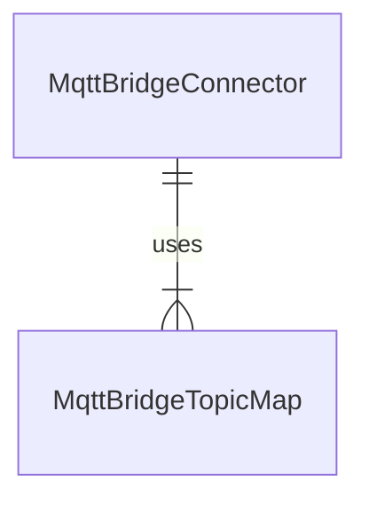

# Connect MQTT bridge cloud connector to other MQTT brokers

[!INCLUDE [public-preview-note](../includes/public-preview-note.md)]

You can use the Azure IoT MQ MQTT bridge to connect to Azure Event Grid or other MQTT brokers. MQTT bridging is the process of connecting two MQTT brokers together so that they can exchange messages.

- When two brokers are bridged, messages published on one broker are automatically forwarded to the other and vice versa.
- MQTT bridging helps to create a network of MQTT brokers that communicate with each other, and expand MQTT infrastructure by adding additional brokers as needed.
- MQTT bridging is useful for multiple physical locations, sharing MQTT messages and topics between edge and cloud, or when you want to integrate MQTT with other messaging systems.

To bridge to another broker, Azure IoT MQ must know the remote broker endpoint URL, what MQTT version, how to authenticate, and what topics to map. To maximize composability and flexibility in a Kubernetes-native fashion, these are configured as custom Kubernetes resources ([CRDs](https://kubernetes.io/docs/concepts/extend-kubernetes/api-extension/custom-resources/)) called **MqttBridgeConnector** and **MqttBridgeTopicMap**. This guide walks through how to create the MQTT bridge connector using these resources.

1. Create a YAML file that defines [MqttBridgeConnector](#configure-mqttbridgeconnector) resource. You can use the YAML provided as an example, but make sure to change the `namespace` to match the one that has Azure IoT MQ deployed, and the `remoteBrokerConnection.endpoint` to match your remote broker endpoint URL.

1. Create a YAML file that defines [MqttBridgeTopicMap](#configure-mqttbridgetopicmap) resource. You can use the YAML provided as an example, but make sure to change the `namespace` to match the one that has Azure IoT MQ deployed, and the `mqttBridgeConnectorRef` to match the name of the MqttBridgeConnector resource you created in the earlier step.

1. Deploy the MQTT bridge connector and topic map with `kubectl apply -f <filename>`.

   ```console
   $ kubectl apply -f my-mqtt-bridge.yaml 
   mqttbridgeconnectors.az-edge.com "my-mqtt-bridge" created
   $ kubectl apply -f my-topic-map.yaml
   mqttbridgetopicmaps.az-edge.com "my-topic-map" created
   ```

Once deployed (use `kubectl get pods` to check), messages start flowing from/to your endpoint.

## Configure MqttBridgeConnector

The MqttBridgeConnector resource defines the MQTT bridge connector that can communicate with a remote broker. It includes the following components:

- One or more MQTT bridge connector instances. Each instance is a container running the MQTT bridge connector.
- A remote broker connection.
- An optional local broker connection.

The following example shows a minimal configuration for bridging to an Azure Event Grid MQTT broker. It uses system-assigned managed identity for authentication and TLS encryption.

```yaml
apiVersion: az-edge.com/v1alpha4
kind: MqttBridgeConnector
metadata:
  name: "my-mqtt-bridge"
  namespace: <SAME NAMESPACE AS BROKER> 
spec:
  image: 
    repository: alicesprings.azurecr.io/mqttbridge 
    tag: 0.6.0
    pullPolicy: IfNotPresent
  protocol: v5
  bridgeInstances: 1
  clientIdPrefix: "factory-gateway-"
  logLevel: "debug"
  remoteBrokerConnection:
    endpoint: "example.westeurope-1.ts.eventgrid.azure.net:8883"
    tls:
      tlsEnabled: true
    authentication:
      systemAssignedManagedIdentity:
        audience: https://eventgrid.azure.net
  ## Uncomment to customize local broker connection
  # localBrokerConnection:
  #   endpoint: "azedge-dmqtt-frontend:1883"
  #   tls:
  #     tlsEnabled: false
  #   authentication:
  #     kubernetes: {}
```

The following table describes the fields in the *MqttBridgeConnector* resource:

| Field | Required | Description |
| --- | --- | --- |
| `image` | Yes | The image of the Kafka connector. You can specify the `pullPolicy`, `repository`, and `tag` of the image. Proper values are shown in example above. |
| `protocol` | Yes | MQTT protocol version. Can be `v5` or `v3`. See [MQTT v3.1.1 support](#mqtt-v311-support). |
| `bridgeInstances` | No | Number of instances for the bridge connector. Default is 1. See [Number of instances](#number-of-instances). |
| `clientIdPrefix` | No | The prefix for the dynamically generated client ID. Default is no prefix. See [Client ID configuration](#client-id-configuration). |
| `logLevel` | No | Log level. Can be `debug` or `info`. Default is `info`. |
| `remoteBrokerConnection` | Yes | Connection details of the remote broker to bridge to. See [Remote broker connection](#remote-broker-connection). |
| `localBrokerConnection` | No | Connection details of the local broker to bridge to. Defaults to shown value. See [Local broker connection](#local-broker-connection). |

### MQTT v3.1.1 support

The bridge connector can be configured to use MQTT v3.1.1 with both the local broker connection (Azure IoT MQ). and remote broker connection. However, this breaks shared subscriptions if the remote broker doesn't support it. If you plan to use shared subscriptions, leave it as default *v5*.

### Number of instances

For high availability and scale, configure the MQTT bridge connector to use multiple instances. Message flow and routes are automatically balanced between different instances.

```yaml
spec:
  bridgeInstances: 2
```

### Client ID configuration

Azure IoT MQ generates a client ID for each MqttBridgeConnector client, using a prefix that you specify, in the format of `{clientIdPrefix}-{routeName}`. This is important for Azure IoT MQ to mitigate message loss and avoid conflicts or collisions with existing client IDs since MQTT specification allows only one connection per client ID.

For example:

```yaml
kind: MqttBridgeConnector
# ...
spec:
  clientIdPrefix: "client-"
#...
kind: MqttBridgeTopicMap
#...
spec:
  routes:
    - direction: remote-to-local
      name: "route1"
      qos: 1
      source: "command"
    - direction: local-to-remote
      name: "route2"
      qos: 1
      source: "report"
```

In the example, the client IDs are: *client-route1* and *client-route2*.

### Remote broker connection

The `remoteBrokerConnection` field defines the connection details to bridge to the remote broker. It includes the following fields:

| Field | Required | Description |
| --- | --- | --- |
| `endpoint` | Yes | Remote broker endpoint URL with port. For example, `example.westeurope-1.ts.eventgrid.azure.net:8883`. |
| `tls` | Yes | Specifies if connection is encrypted with TLS and trusted CA certificate. See [TLS support](#tls-support) |
| `authentication` | Yes | Authentication details for Azure IoT MQ to use with the broker. Must be one of the following: system-assigned managed identity, X.509, or basic (username/password). See [Authentication](#authentication). |

#### Authentication

The `authentication` field defines the authentication method for Azure IoT MQ to use with the remote broker. It includes the following fields:

| Field | Required | Description |
| --- | --- | --- |
| `systemAssignedManagedIdentity` | No | Authenticate with system-assigned managed identity. See [Managed identity](#managed-identity). |
| `x509` | No | Authentication details using X.509 certificates. See [X.509](#x509). |
| `basic` | No | Authenticate with username/password. See [Username/password](#usernamepassword). |

#### Managed identity

The `systemAssignedManagedIdentity` field includes the following fields:

| Field | Required | Description |
| --- | --- | --- |
| `audience` | Yes | The audience for the token. Required if using managed identity. For Event Grid, it's `https://eventgrid.azure.net`. |

If Azure IoT MQ is deployed as an Azure Arc extension, it gets a [system-assignment managed identity](/azure/active-directory/managed-identities-azure-resources/overview) by default. It's the recommended way for Azure IoT MQ to interact with Azure resources, including Event Grid MQTT broker, because it allows you to avoid credential management and retain high availability.

To use managed identity for authentication with Azure resources, first [assign](/azure/role-based-access-control/role-assignments-portal) an appropriate Azure RBAC role like [MQTT Broker Publisher](#system-assigned-managed-identity) to Azure IoT MQ's managed identity provided by Arc.

Then, specify and *MQTTBridgeConnector* with managed identity as the authentication method:

```yaml
spec:
  remoteBrokerConnection:
    authentication:
      systemAssignedManagedIdentity:
        audience: https://eventgrid.azure.net
```

When you use managed identity, the client ID isn't configurable, and equates to the Azure IoT MQ Azure Arc extension Azure Resource Manager resource ID within Azure.

The system-assigned managed identity is provided by Azure Arc. The certificate associated with the managed identity must be renewed at least every 90 days to avoid a manual recovery process. To learn more, see [How do I address expired Azure Arc-enabled Kubernetes resources?](/azure/azure-arc/kubernetes/faq#how-do-i-address-expired-azure-arc-enabled-kubernetes-resources)

#### X.509

The `x509` field includes the following fields:

| Field | Required | Description |
| --- | --- | --- |
| `clientCertKeySecret` | Yes | The Kubernetes secret containing the client certificate and private key. |

Many MQTT brokers, like Event Grid, support X.509 authentication. Azure IoT MQ's MQTT bridge can present a client X.509 certificate and negotiate the TLS communication. Use a Kubernetes secret to store the X.509 client certificate, private key and intermediate CA.

```bash
kubectl create secret generic bridge-client-secret \
--from-file=client_cert.pem=mqttbridge.pem \
--from-file=client_key.pem=mqttbridge.key \
--from-file=client_intermediate_certs.pem=intermediate.pem
```

And reference it with  `clientCertKeySecret`:

```yaml
spec:
  remoteBrokerConnection:
    authentication:
      x509:
        clientCertKeySecret: "bridge-client-cert"
```

#### Username/password 

The `basic` field includes the following fields:

| Field | Required | Description |
| --- | --- | --- |
| `anonymous` | Yes | Boolean value defining whether to use anonymous authentication. |
| `k8sSecretName` | No | The Kubernetes secret containing the username and password. |
| `usernameKey` | No | The key in the Kubernetes secret that contains the username. |
| `passwordKey` | No | The key in the Kubernetes secret that contains the password. |

Many MQTT brokers, like HiveMQ, support username/password authentication. Azure IoT MQ's MQTT bridge can present a username and password to authenticate with the remote broker. Use a Kubernetes secret to store the username and password. The secret should be in the same namespace as the MqttBridgeConnector CR.

```bash 
kubectl create secret generic bridge-user-pass \
  --from-literal=username=value1 \
  --from-literal=password=value2
```  

Then, reference it with `k8sSecretName`, `usernameKey`, and `passwordKey`:

```yaml
spec:
  remoteBrokerConnection:
    authentication:
      basic:
        anonymous: false
        k8sSecretName: "bridge-user-pass"
        passwordKey: "password"
        usernameKey: "username"
```

### Local broker connection

The `localBrokerConnection` field defines the connection details to bridge to the local broker. 

| Field | Required | Description |
| --- | --- | --- |
| `endpoint` | Yes | Remote broker endpoint URL with port. |
| `tls` | Yes | Specifies if connection is encrypted with TLS and trusted CA certificate. See [TLS support](#tls-support) |
| `authentication` | Yes | Authentication details for Azure IoT MQ to use with the broker. The two supported methods are: Kubernetes service account token (SAT) and basic (username/password) authentication. To use SAT, specify `kubernetes: {}`. To use basic authentication, follow the format in [Username/password](#usernamepassword).

By default, if not configured, the MQTT bridge connector authenticates with Azure IoT MQ broker with Kubernetes SAT via the 1883 port and TLS disabled.

```console
$ kubectl describe crd mqttbridgeconnector
...
Local Broker Connection:
  Default:
    Authentication:
      Kubernetes:
        Secret Path:                 /var/run/serviceaccount/localbroker
        Service Account Token Name:  sat-token
    Endpoint:                        azedge-dmqtt-frontend:1883
    Tls:
      Tls Enabled:                  false
      Trusted Ca Certificate:       <nil>
      Trusted Ca Certificate Name:  <nil>
```

If you configured, on Azure IoT MQ broker listener:

- Only non-SAT authentication like username/password,
- Port numbers other than 1883, or
- TLS

Then MqttBridgeConnector local broker connection setting must be configured to match. The deployment YAML for the *MqttBridgeConnector* must have `localBrokerConnection` at the same level as `remoteBrokerConnection`. For example, to use TLS with SAT authentication:

```yaml
spec:
  localBrokerConnection:
    endpoint: "azedge-dmqtt-frontend:8883"
    tls:
      tlsEnabled: true
      trustedCaCertificateName: "test-ca-configmap"
    authentication:
      kubernetes: {}
```

In this example, `trustedCaCertifcateName` is the *ConfigMap* you create for the root CA of Azure IoT MQ, like the [ConfigMap for the root ca of the remote broker](#tls-support). If you used cert-manager to create the root ca for Azure IoT MQ, the root CA can be obtained. For more information on obtaining the root CA, see [Configure TLS with automatic certificate management to secure MQTT communication](../manage-mqtt-connectivity/howto-configure-tls-auto.md). 

### TLS support

The `tls` field defines the TLS configuration for the remote or local broker connection. It includes the following fields:

| Field | Required | Description |
| --- | --- | --- |
| `tlsEnabled` | Yes | Whether TLS is enabled or not. |
| `trustedCaCertificateName` | No | The CA certificate to trust when connecting to the broker. Required if TLS is enabled. |

TLS encryption support is available for both remote and local broker connections.

- For remote broker connection: if TLS is enabled, a trusted CA certificate should be specified as a Kubernetes ConfigMap reference. If not, the TLS handshake is likely to fail unless the remote endpoint is widely trusted A trusted CA certificate is already in the OS certificate store. For example, Event Grid uses widely trusted CA root so specifying isn't required.
- For local (Azure IoT MQ) broker connection: if TLS is enabled for Azure IoT MQ broker listener, CA certificate that issued the listener server certificate should be specified as a Kubernetes configmap reference.

When specifying a trusted CA is required, create a *ConfigMap* containing the public potion of the CA and specify the configmap name in the `trustedCaCertificateName` property. For example:

```bash
kubectl create configmap client-ca-configmap --from-file ~/.step/certs/root_ca.crt
```

## Configure MqttBridgeTopicMap

The *MqttBridgeTopicMap* resource defines the topic mapping between the local and remote brokers. It must be used along with a *MqttBridgeConnector* resource. It includes the following components:

- The name of the MqttBridgeConnector resource to link to.
- A list of routes for bridging.
- An optional shared subscription configuration.

A *MqttBridgeConnector* can use multiple *MqttBridgeTopicMaps* linked with it. When a *MqttBridgeConnector* resource is deployed, Azure IoT MQ operator starts scanning the namespace for any *MqttBridgeTopicMaps* linked with it and automatically manage message flow among the *MqttBridgeConnector* instances. Then, once deployed, the *MqttBridgeTopicMap* is linked with the *MqttBridgeConnector*. Each *MqttBridgeTopicMap* can be linked with only one *MqttBridgeConnector*.



The following example shows a MqttBridgeTopicMap configuration for bridging messages from the remote topic `my-remote-topic` to the local topic `my-local-topic`:

```yaml
apiVersion: az-edge.com/v1alpha4
kind: MqttBridgeTopicMap
metadata:
  name: "my-topic-map"
  namespace: <SAME NAMESPACE AS BROKER> 
spec:
  # Name of the MqttBridgeConnector resource to link to. Required.
  mqttBridgeConnectorRef: "my-mqtt-bridge"
  # A list of routes for bridging. Required.
  routes:
      # Direction of message flow. Required.
    - direction: remote-to-local
      # Name of the route. Required
      name: "first-route"
      # MQTT quality of service (QoS). Optional
      qos: 0
      # Source MQTT topic. Can have wildcards. Required.
      source: "my-remote-topic"
      # Target MQTT topic. Cannot have wildcards.
      # Optional, if not specified it would be same as source.
      target: "my-local-topic"
      # Shared subscription configuration. Optional.
      # Activates a configured number of clients for additional scale.
      sharedSubscription:
        # Number of clients to use for shared subscription.
        groupMinimumShareNumber: 3
        # Shared subscription group name.
        groupName: "group1"
    - direction: local-to-remote
      name: "second-route"
      qos: 1
      source: "my-local-topic"
      target: "my-remote-topic"
```

The following table describes the fields in the MqttBridgeTopicMap resource:

| Fields | Required | Description |
| --- | --- | --- |
| `mqttBridgeConnectorRef` | Yes | Name of the `MqttBridgeConnector` resource to link to. |
| `routes` | Yes | A list of routes for bridging. See [Routes](#routes). |

### Routes

A *MqttBridgeTopicMap* can have multiple routes. The `routes` field defines the list of routes. It includes the following fields:

| Fields | Required | Description |
| --- | --- | --- |
| `direction` | Yes | Direction of message flow. It can be `remote-to-local` or `local-to-remote`. See [Direction](#direction). |
| `name` | Yes | Name of the route. |
| `qos` | No | MQTT quality of service (QoS). Defaults to 1. |
| `source` | Yes | Source MQTT topic. Can have wildcards like `#` and `+`. See [Wildcards in the source topic](#wildcards-in-the-source-topic). |
| `target` | No | Target MQTT topic. Cannot have wildcards. If not specified, it would be the same as the source. See [Reference source topic in target](#reference-source-topic-in-target). |
| `sharedSubscription` | No | Shared subscription configuration. Activates a configured number of clients for additional scale. See [Shared subscriptions](#shared-subscriptions). |

### Direction

For example, if the direction is local-to-remote, Azure IoT MQ publishes all messages on the specified local topic to the remote topic:

```yaml
routes:
  - direction: local-to-remote
    name: "send-alerts"
    source: "alerts"
    target: "factory/alerts"
```

If the direction is reversed, Azure IoT MQ receives messages from a remote broker. Here, the target is omitted and all messages from the `commands/factory` topic on the remote broker is published on the same topic locally.

```yaml
routes:
  - direction: remote-to-local
    name: "receive-commands"
    source: "commands/factory"
```

### Wildcards in the source topic

To bridge from non-static topics, use wildcards to define how the topic patterns should be matched and the rule of the topic name translation. For example, to bridge all messages in all sub-topics under `telemetry`, use the multi-level `#` wildcard:

```yaml
routes:
  - direction: local-to-remote
    name: "wildcard-source"
    source: "telemetry/#"
    target: "factory/telemetry"
```

In the example, if a message is published to *any* topic under `telemetry`, like `telemetry/furnace/temperature`, Azure IoT MQ publishes it to the remote bridged broker under the static `factory/telemetry` topic.

For single-level topic wildcard, use `+` instead, like `telemetry/+/temperature`.

The MQTT bridge connector must know the exact topic in the target broker either remote or Azure IoT MQ without any ambiguity. Wildcards are only available as part of `source` topic.

### Reference source topic in target

To reference the entire source topic, omit the target topic configuration in the route completely. Wildcards are supported.

For example, any message published under topic `my-topic/#`, like `my-topic/foo` or `my-topic/bar`, are bridged to the remote broker under the same topic:

```yaml
routes:
  - direction: local-to-remote
    name: "target-same-as-source"
    source: "my-topic/#"
    # No target
```

Other methods of source topic reference aren't supported.

<!-- ### Bridge all topics

To create an MQTT bridge that publishes all messages from Azure IoT MQ to the target broker with matching topics and vice versa, use the `#` wildcard and omit the target topic configuration.

```yaml
routes:
  - direction: both # local-to-remote or remote-to-local also work for unidirectional bridging
    name: "bridge-all"
    source: "#"
``` -->

### Shared subscriptions

The `sharedSubscription` field defines the shared subscription configuration for the route. It includes the following fields:

| Fields | Required | Description |
| --- | --- | --- |
| `groupMinimumShareNumber` | Yes | Number of clients to use for shared subscription. |
| `groupName` | Yes | Shared subscription group name. |

Shared subscriptions help Azure IoT MQ create more clients for the MQTT bridge. You can set up a different shared subscription for each route. Azure IoT MQ subscribes to messages from the source topic and sends them to one client at a time using round robin. Then, the client publishes the messages to the bridged broker.

For example, if you set up a route with shared subscription and set the `groupMinimumShareNumber` as *3*:

```yaml
routes:
    - direction: local-to-remote
      qos: 1
      source: "shared-sub-topic"
      target: "remote/topic"
      sharedSubscription:
        groupMinimumShareNumber: 3
        groupName: "sub-group"
```

Azure IoT MQ's MQTT bridge creates three subscriber clients no matter how many instances. Only one client gets each message from `$share/sub-group/shared-sub-topic`. Then, the same client publishes the message to the bridged remote broker under topic `remote/topic`. The next message goes to a next client.

This helps you balance the message traffic for the bridge between multiple clients with different IDs. This is useful if your bridged broker limits how many messages each client can send.

## Azure Event Grid MQTT broker support

[Event Grid MQTT Broker](/azure/event-grid/mqtt-overview) requires each set of client credential like an X.509 certificate to be registered ahead of time in the registry, and then multiple clients with different client IDs can connect without you having to registry them again.

This support works well with MQTTBridgeConnector's dynamic client ID and shared subscription systems to scale out connector instances for increased throughput and redundancy.

### System-assigned managed identity

System-assigned managed identity is recommended for Arc-connected clusters. To minimize credential management, using the system-assigned managed identity and Azure RBAC is the recommended way to bridge Azure IoT MQ with Event Grid MQTT broker. To set up:

1. Deploy Azure IoT MQ on an Arc-connected Kubernetes cluster as an Arc extension.

1. Using `az k8s-extension show`, find the principal ID for the Azure IoT MQ Arc extension. For example:

   ```console {hl_lines=[5]}
   $ az k8s-extension show -n my-e4k-extension -c friendly-broccoli -g jlian-arc -t connectedClusters
   {
    ...
     "identity": {
       "principalId": "c2d41722-b23a-4d5c-bc93-a9e3eb21ead1",
       "tenantId": null,
       "type": "SystemAssigned"
     },
     "isSystemExtension": false,
     "name": "my-e4k-extension",
     ...
   }
   ```

1. The following is a temporary requirement. Create a custom role with `Microsoft.EventGrid/topicSpaces/subscribe/action` and/or `Microsoft.EventGrid/topicSpaces/publish/action` DataActions as appropriate. You might have to create the custom role at the resource group level. For example:

   ```json
   {
     "Name": "EventGridMQTTBrokerPublisher",
     "IsCustom": true,
     "Description": "Allows publishing to Event Grid MQTT broker",
     "Actions": [
       "Microsoft.EventGrid/topicSpaces/subscribe/action",
       "Microsoft.EventGrid/topicSpaces/publish/action"
     ],
     "NotActions": [],
     "AssignableScopes": [
       "/subscriptions/00000000-0000-0000-0000-000000000000/resourceGroups/jlian-arc"
     ]
   }
   ```

   <!--  -->

1. At the Event Grid resource, [assign](/azure/role-based-access-control/role-assignments-portal) the roles to the Azure IoT MQ Arc extension managed identity. Choose **User, group, or service principal** when searching for the extension identity. Verify the object ID matches the ID from earlier.

1. Create an MQTTBridgeConnector and choose [managed identity](#managed-identity) as the authentication method

1. Create MqttBridgeTopicMaps and deploy the MQTT bridge with `kubectl`.

### With X.509 authentication

In Event Grid:

1. Prepare a certificate authority (CA) certificate `ca.pem` have it sign a client certificate `e4k.pem`.
1. In Event Grid, [upload the `ca.pem` CA certificate](https://github.com/Azure/MQTTBrokerPrivatePreview/tree/main/Azure%20Portal#create-ca-certificates).
1. [Register a client](https://github.com/Azure/MQTTBrokerPrivatePreview/tree/main/Azure%20Portal#create-clients) and upload the client certificate `e4k.pem` for it.
1. Configure client attributes, grouping, and permission bindings as needed.

On your Kubernetes cluster:

1. Create a secret with using `e4k.pem` and the corresponding private key. Include the intermediate cert if available.

   ```bash
   kubectl create secret generic e4k-client-cert \
   --from-file=client_cert.pem=e4k.pem \
   --from-file=client_key.pem=e4k.key \
   --from-file=client_intermediate_certs.pem=intermediate.pem
   ```

1. Create a *MqttBridgeConnector* with X.509 authentication method and refer to the secret you just created for `e4k.pem`.

   ```yaml
   apiVersion: az-edge.com/v1alpha4
   kind: MqttBridgeConnector
   metadata:
     name: mqtt-bridge-to-azure
     namespace: <SAME NAMESPACE AS BROKER> 
   spec:
     protocol: v5
     image:
       repository: alicesprings.azurecr.io/mqttbridge
       tag: 0.6.0
       pullPolicy: IfNotPresent
     bridgeInstances: 1
     remoteBrokerConnection:
       endpoint: "example.westeurope-1.ts.eventgrid.azure.net:8883"
       tls:
         tlsEnabled: true
       authentication:
         x509:
           clientCertKeySecret: "bridge-client-cert"
   ```

1. Create *Topic Maps* and deploy the MQTT bridge with `kubectl`.

Once deployed, the messages should start flowing to your Event Grid MQTT broker.

### Maximum client sessions per authentication name

If `bridgeInstances` is set higher than `1`, configure the Event Grid MQTT broker **Configuration** > **Maximum client sessions per authentication name** to match the number of instances. This prevents issues like *error 151 quota exceeded*.

### Per-connection limit

If using managed identity isn't possible, keep the [per-connection limits for Event Grid MQTT broker](https://github.com/Azure/MQTTBrokerPrivatePreview#mqtt-messages-limits) in mind when designing your setup. At the time of publishing, the limit is 100 messages/second each direction for a connection. To increase the MQTT bridge throughput, use shared subscriptions to increase the number of clients serving each route.

<!-- ### Client registry and authorization policy sync

Azure IoT MQ supports client registry and authorization policy sync with Event Grid's permission bindings only when Azure IoT MQ can authenticate to Event Grid with managed identity and was given the correct level of permission (Contributor or above, including write access on the resource).

To learn more, see [TODO](/docs/mqtt-broker/authorization/). -->

## Bridge from another broker to Azure IoT MQ

Azure IoT MQ is a compliant MQTT broker and other brokers can bridge to it with the appropriate authentication and authorization credentials. For example, see MQTT bridge documentation for [HiveMQ](https://www.hivemq.com/docs/bridge/4.8/enterprise-bridge-extension/bridge-extension.html), [VerneMQ](https://docs.vernemq.com/configuring-vernemq/bridge), [EMQX](https://www.emqx.io/docs/en/v5/data-integration/data-bridge-mqtt.html), and [Mosquitto](https://mosquitto.org/man/mosquitto-conf-5.html).

## Related content

- [Publish and subscribe MQTT messages using Azure IoT MQ](../manage-mqtt-connectivity/overview-iot-mq.md)
