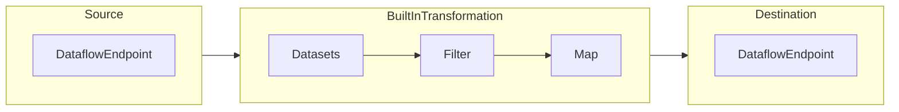

# Configure dataflows in Azure IoT Operations

[!INCLUDE [public-preview-note](../includes/public-preview-note.md)]

A dataflow is the path that data takes from the source to the destination with optional transformations. You can configure the dataflow by creating a *Dataflow* custom resource. A dataflow is made up of three parts: the **source**, the **transformation**, and the **destination**. 



To define the source and destination, you need to configure the dataflow endpoints. The transformation is optional and can include operations like enriching the data, filtering the data, and mapping the data to another field. 

This article shows you how to create a dataflow with an example, including the source, transformation, and destination.

## Prerequisites

- **Azure IoT Operations**. See [Deploy Azure IoT Operations Preview](../deploy-iot-ops/howto-deploy-iot-operations.md).
- **Dataflow profile**. See [Configure dataflow profile](howto-configure-dataflow-profile.md).
- **Dataflow endpoint**. For example, create a dataflow endpoint for the [built-in MQTT broker](./howto-configure-mqtt-endpoint.md#azure-iot-operations-built-in-mqtt-broker).

  ```yaml
  apiVersion: connectivity.iotoperations.azure.com/v1beta1
  kind: DataflowEndpoint
  metadata:
    name: mq
    namespace: azure-iot-operations
  spec:
    endpointType: Mqtt
    mqttSettings:
      authentication:
        method: ServiceAccountToken
        serviceAccountTokenSettings: {}
  ```

  You can use this endpoint for both the source and destination. Or, you can try other endpoints like Kafka, Event Hubs, or Azure Data Lake Storage. To learn how to configure each type of dataflow endpoint, see [Configure dataflow endpoints](howto-configure-dataflow-endpoint.md).

## Create dataflow

With endpoints created, you can use them to create a dataflow. Recall that a dataflow is made up of three parts: the source, the transformation, and the destination. The overall structure of a dataflow configuration is as follows:

```yaml
apiVersion: connectivity.iotoperations.azure.com/v1beta1
kind: Dataflow
metadata:
  name: my-dataflow
  namespace: azure-iot-operations
spec:
  profileRef: default
  mode: Enabled
  operations:
    - operationType: Source
      sourceSettings:
        # See source configuration section
    - operationType: BuiltInTransformation
      builtInTransformationSettings:
        # See transformation configuration section
    - operationType: Destination
      destinationSettings:
        # See destination configuration section
```

<!-- TODO: link to API reference -->

Review the following sections to learn how to configure the operation types of the dataflow.

## Configure a source with a dataflow endpoint to get data

To configure a source for the dataflow, specify the endpoint reference and data source. You can specify a list of data sources for the endpoint which are MQTT or Kafka topics.

For example, to configure a source using the MQTT endpoint created earlier and two MQTT topic filters, use the following configuration:

```yaml
sourceSettings:
  endpointRef: mq
  dataSources:
    - thermostats/+/telemetry/temperature/#
    - humidifiers/+/telemetry/humidity/#
```

Because `dataSources` allows you to specify MQTT or Kafka topics without modifying the endpoint configuration, you can reuse the endpoint for multiple dataflows even if the topics are different. To learn more, see [Reuse dataflow endpoints](./howto-configure-dataflow-endpoint.md#reuse-endpoints).

<!-- TODO: link to API reference -->

### Use Asset as a source

You can use an [asset](../discover-manage-assets/overview-manage-assets.md) as the source for the dataflow. This is only available in the Azure IoT Operations portal.

<!-- TODO: details -->

### Specify schema to deserialize data

If the source data has optional fields or fields with different types, specify a deserialization schema to ensure consistency. For example, the data might have fields that are not present in all messages. Without the schema, the transformation can't handle these fields as they would have empty values. With the schema, you can specify default values or ignore the fields.

```yaml
spec:
  operations:
  - operationType: Source
    sourceSettings:
      serializationFormat: Json
      schemaRef: aio-sr://exampleNamespace/exampleAvroSchema:1.0.0
```

> [!NOTE]
> The only supported serialization format is JSON. The schema is optional.

To specify the schema, create the file and store it in the schema registry.

```yaml
{
  "type": "record",
  "name": "Temperature",
  "fields": [
    {"name": "deviceId", "type": "string"},
    {"name": "temperature", "type": "float"}
  ]
}
```

<!-- TODO: link to schema registry docs -->

### Shared subscriptions

<!-- TODO: may not be final -->

To use shared subscriptions with MQTT sources, you can specify the shared subscription topic in the form of `$shared/<subscription-group>/<topic>` .

```yaml
sourceSettings:
  dataSources:
    - $shared/myGroup/thermostats/+/telemetry/temperature/#
```

> [!NOTE]
> If the instance count in the [dataflow profile](howto-configure-dataflow-profile.md) is greater than 1, then the shared subscription topic must be used.

<!-- TODO: Details -->

## Configure transformation to process data

The transformation operation is where you can transform the data from the source before you send it to the destination. Transformations are optional. If you don't need to make changes to the data, don't include the transformation operation in the dataflow configuration. Multiple transformations are chained together in stages regardless of the order in which they're specified in the configuration. The order of the stages is always

1. **Enrich**: Add additional data to the source data given a dataset and condition to match.
1. **Filter**: Filter the data based on a condition.
1. **Map**: Move data from one field to another with an optional conversion.

```yaml
builtInTransformationSettings:
  datasets:
    # ...
  filter:
    # ...
  map:
    # ...
```

<!-- TODO: link to API reference -->

### Enrich: Add reference data

To enrich the data, you can use the reference dataset in the Azure IoT Operations [distributed state store (DSS)](../create-edge-apps/concept-about-state-store-protocol.md). The dataset is used to add extra data to the source data based on a condition. The condition is specified as a field in the source data that matches a field in the dataset.

<!-- TODO: link to API reference -->

Key names in the distributed state store correspond to a dataset in the dataflow configuration.

For example, you could use the `deviceId` field in the source data to match the `asset` field in the dataset:

```yaml
builtInTransformationSettings:
  datasets:
  - key: assetDataset
    inputs:
      - $source.deviceId # ------------- $1
      - $context(assetDataset).asset # - $2
    expression: $1 == $2
```

If the dataset has a record with the `asset` field, similar to:

```json
{
  "asset": "thermostat1",
  "location": "room1",
  "manufacturer": "Contoso"
}
```

The data from the source with the `deviceId` field matching `thermostat1` has the `location` and `manufacturer` fields available in `filter` and `map` stages.

You can load sample data into the DSS by using the [DSS set tool sample](https://github.com/Azure-Samples/explore-iot-operations/tree/main/samples/dss_set).

For more information about condition syntax, see [Enrich data by using dataflows](concept-dataflow-enrich.md) and [Convert data using dataflows](concept-dataflow-conversions.md).

### Filter: Filter data based on a condition

To filter the data on a condition, you can use the `filter` stage. The condition is specified as a field in the source data that matches a value.

<!-- TODO: link to API reference -->

For example, you could use the `temperature` field in the source data to filter the data:

```yaml
builtInTransformationSettings:
  filter:
    - inputs:
      - temperature ? $last # - $1
      expression: "$1 > 20"
```

If the `temperature` field is greater than 20, the data is passed to the next stage. If the `temperature` field is less than or equal to 20, the data is filtered.

### Map: Move data from one field to another

To map the data to another field with optional conversion, you can use the `map` operation. The conversion is specified as a formula that uses the fields in the source data.

<!-- TODO: link to API reference -->

For example, you could use the `temperature` field in the source data to convert the temperature to Celsius and store it in the `temperatureCelsius` field. You could also enrich the source data with the `location` field from the contextualization dataset:

```yaml
builtInTransformationSettings:
  map:
    - inputs:
      - temperature # - $1
      output: temperatureCelsius
      expression: "($1 - 32) * 5/9"
    - inputs:
      - $context(assetDataset).location  
      output: location
```

To learn more, see [Map data by using dataflows](concept-dataflow-mapping.md) and [Convert data by using dataflows](concept-dataflow-conversions.md).

### Serialize data according to a schema

If you want to serialize the data before sending it to the destination, you need to specify a schema and serialization format. Otherwise, the data will be serialized in JSON with the types inferred. Remember that storage endpoints like Microsoft Fabric or Azure Data Lake require a schema to ensure data consistency.

```yaml
builtInTransformationSettings:
  serializationFormat: Parquet
  schemaRef: aio-sr://exampleNamespace/exampleParquetSchema:1.0.0
```

To specify the schema, you can create a Schema CR with the schema definition.

<!-- TODO: link to schema registry docs -->


```json
{
  "type": "record",
  "name": "Temperature",
  "fields": [
    {"name": "deviceId", "type": "string"},
    {"name": "temperatureCelsius", "type": "float"}
    {"name": "location", "type": "string"}
  ]
}
```

Supported serialization formats are JSON, Parquet, and Delta.

## Configure destination with a dataflow endpoint to send data

To configure a destination for the dataflow, specify the endpoint reference and data destination. You can specify a list of data destinations for the endpoint which are MQTT or Kafka topics.

For example, to configure a destination using the MQTT endpoint created earlier and a static MQTT topic, use the following configuration:

```yaml
destinationSettings:
  endpointRef: mq
  dataDestination: factory
```

If you've created storage endpoints like Microsoft Fabric, use the data destination field to specify the table or container name:

```yaml
destinationSettings:
  endpointRef: adls
  dataDestination: telemetryTable
```

## Example

The following example is a dataflow configuration that uses the MQTT endpoint for the source and destination. The source filters the data from the MQTT topics `thermostats/+/telemetry/temperature/#` and `humidifiers/+/telemetry/humidity/#`. The transformation converts the temperature to Fahrenheit and filters the data where the temperature is less than 100000. The destination sends the data to the MQTT topic `factory`.

```yaml
apiVersion: connectivity.iotoperations.azure.com/v1beta1
kind: Dataflow
metadata:
  name: my-dataflow
  namespace: azure-iot-operations
spec:
  profileRef: default
  mode: Enabled
  operations:
    - operationType: Source
      sourceSettings:
        endpointRef: mq
        dataSources:
          - thermostats/+/telemetry/temperature/#
          - humidifiers/+/telemetry/humidity/#
    - operationType: builtInTransformation
      builtInTransformationSettings:
        filter:
          - inputs:
              - 'temperature.Value'
              - '"Tag 10".Value'
            expression: "$1*$2<100000"
        map:
          - inputs:
              - '*'
            output: '*'
          - inputs:
              - temperature.Value
            output: TemperatureF
            expression: cToF($1)
          - inputs:
              - '"Tag 10".Value'
            output: 'Tag 10'
    - operationType: Destination
      destinationSettings:
        endpointRef: mq
        dataDestination: factory
```

<!-- TODO: add links to examples in the reference docs -->

## Verify a dataflow is working

Best to follow one of the tutorials to verify the dataflow is working.

<!-- TODO: add links to the tutorials -->

## Manage dataflows

After you've created a dataflow, you can manage it using the Azure IoT Operations portal or by updating the Dataflow CR.

### Enable/disable dataflow

To enable or disable a dataflow, you can use the Azure IoT Operations portal or by updating the Dataflow CR.

```yaml
spec:
  mode: Disabled
```

### View dataflow health status and metrics

You can view the health status and metrics of the dataflow in the Azure IoT Operations portal.

<!-- TODO: link to relevant observability docs -->

### Delete dataflow

To delete a dataflow, you can use the Azure IoT Operations portal or by deleting the Dataflow CR.

```bash
kubectl delete dataflow my-dataflow
```

### Export dataflow configuration

To export the dataflow configuration, you can use the Azure IoT Operations portal or by exporting the Dataflow CR.

```bash
kubectl get dataflow my-dataflow -o yaml > my-dataflow.yaml
```