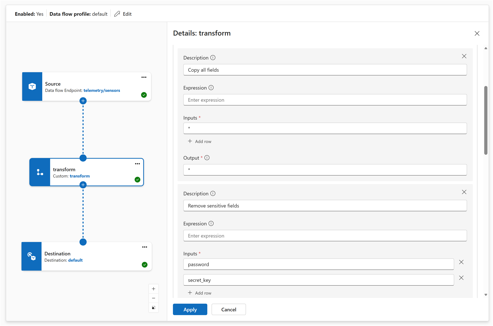

# Transform data with map in data flow graphs

[!INCLUDE [kubernetes-management-preview-note](../includes/kubernetes-management-preview-note.md)]

A map transform takes each incoming message and produces an output message based on your rules. You can rename fields, reorganize them into new structures, compute derived values, or remove unwanted fields. Wildcard rules let you copy all fields at once.

For an overview of data flow graphs and how transforms compose in a pipeline, see [Data flow graphs overview](concept-dataflow-graphs.md).

## Prerequisites

- An Azure IoT Operations instance deployed on an Arc-enabled Kubernetes cluster. For more information, see [Deploy Azure IoT Operations](../deploy-iot-ops/howto-deploy-iot-operations.md).
- A default registry endpoint named `default` that points to `mcr.microsoft.com` is automatically created during deployment. The built-in transforms use this endpoint.

## How map rules work

Each map rule has four parts:

| Property | Required | Description |
|----------|----------|-------------|
| `inputs` | Yes | List of field paths to read from the incoming message. |
| `output` | Yes | Field path where the result is written in the output message. |
| `expression` | No | Formula applied to the input values. If omitted, the first input value is copied directly. |
| `description` | No | Human-readable label for the rule, included in error messages. |

Inputs are assigned positional variables based on their order: the first input is `$1`, the second is `$2`, and so on. Use these variables in the `expression`.

## Rename a field

To rename `BirthDate` to `DateOfBirth`, map one input to a different output path. No expression is needed. The value copies as-is.

# [Operations experience](#tab/portal)

In the map transform configuration, add a rule:

| Setting | Value |
|---------|-------|
| **Input** | `BirthDate` |
| **Output** | `DateOfBirth` |

# [Bicep](#tab/bicep)

```bicep
{
  inputs: [
    'BirthDate'
  ]
  output: 'DateOfBirth'
}
```

# [Kubernetes (preview)](#tab/kubernetes)

```yaml
- inputs:
    - BirthDate
  output: DateOfBirth
```

---

## Restructure fields

Use dot notation in the output path to move fields into a nested structure.

# [Operations experience](#tab/portal)

Add two rules:

| Input | Output |
|-------|--------|
| `Name` | `Employee.Name` |
| `BirthDate` | `Employee.DateOfBirth` |

# [Bicep](#tab/bicep)

```bicep
{
  inputs: [ 'Name' ]
  output: 'Employee.Name'
}
{
  inputs: [ 'BirthDate' ]
  output: 'Employee.DateOfBirth'
}
```

# [Kubernetes (preview)](#tab/kubernetes)

```yaml
- inputs:
    - Name
  output: Employee.Name

- inputs:
    - BirthDate
  output: Employee.DateOfBirth
```

---

Given this input:

```json
{
  "Name": "Grace Owens",
  "BirthDate": "19840202",
  "Position": "Analyst"
}
```

These two rules produce:

```json
{
  "Employee": {
    "Name": "Grace Owens",
    "DateOfBirth": "19840202"
  }
}
```

Only fields listed in a rule's output appear in the result. The `Position` field isn't included because no rule maps it.

## Combine multiple inputs

When you list multiple inputs, their positional variables let you merge them in an expression.

# [Operations experience](#tab/portal)

Add a rule:

| Setting | Value |
|---------|-------|
| **Inputs** | `Position`, `Office` |
| **Output** | `Employment.Position` |
| **Expression** | `$1 + ", " + $2` |

# [Bicep](#tab/bicep)

```bicep
{
  inputs: [ 'Position', 'Office' ]
  output: 'Employment.Position'
  expression: '$1 + ", " + $2'
}
```

# [Kubernetes (preview)](#tab/kubernetes)

```yaml
- inputs:
    - Position     # $1
    - Office       # $2
  output: Employment.Position
  expression: "$1 + \", \" + $2"
```

---

Given `Position: "Analyst"` and `Office: "Kent, WA"`, the output is `"Analyst, Kent, WA"`.

## Transform values with expressions

Use the `expression` field to apply built-in functions or arithmetic.

# [Operations experience](#tab/portal)

Add a compute rule. For example, to convert Celsius to Fahrenheit:

| Setting | Value |
|---------|-------|
| **Input** | `temperature` |
| **Output** | `temperature_f` |
| **Expression** | `cToF($1)` |

To scale a sensor reading to a 0-100 range, use the expression `scale($1, 0, 4095, 0, 100)`.

# [Bicep](#tab/bicep)

```bicep
{
  inputs: [ 'temperature' ]
  output: 'temperature_f'
  expression: 'cToF($1)'
}
```

To scale a sensor reading:

```bicep
{
  inputs: [ 'raw_pressure' ]
  output: 'pressure_pct'
  expression: 'scale($1, 0, 4095, 0, 100)'
}
```

# [Kubernetes (preview)](#tab/kubernetes)

```yaml
- inputs:
    - temperature     # $1
  output: temperature_f
  expression: "cToF($1)"
```

To scale a sensor reading:

```yaml
- inputs:
    - raw_pressure     # $1
  output: pressure_pct
  expression: "scale($1, 0, 4095, 0, 100)"
```

---

For the complete list of operators, functions, and advanced features, see [Expressions reference](concept-dataflow-graphs-expressions.md).

## Copy all fields with wildcards

When the output should closely match the input with only a few changes, use a wildcard rule to copy every field at once. Then add rules to override, add, or remove specific fields.

# [Operations experience](#tab/portal)

Add a passthrough rule that copies all fields. Set the input to `*` and the output to `*`.

# [Bicep](#tab/bicep)

```bicep
{
  inputs: [ '*' ]
  output: '*'
}
```

# [Kubernetes (preview)](#tab/kubernetes)

```yaml
- inputs:
    - '*'
  output: '*'
```

---

### Wildcard rule requirements

- A wildcard rule must be the **first rule** in your map configuration.
- Only one wildcard rule is allowed per map transform.
- The asterisk matches one or more path segments and must represent a complete segment. Patterns like `partial*` aren't supported.

### Prefix wildcards

You can scope the wildcard to a specific prefix. To flatten all fields from `ColorProperties` to the root level:

# [Operations experience](#tab/portal)

Add a rule with input `ColorProperties.*` and output `*`.

# [Bicep](#tab/bicep)

```bicep
{
  inputs: [ 'ColorProperties.*' ]
  output: '*'
}
```

# [Kubernetes (preview)](#tab/kubernetes)

```yaml
- inputs:
    - 'ColorProperties.*'
  output: '*'
```

---

Given:

```json
{
  "ColorProperties": {
    "Hue": "blue",
    "Saturation": "90%",
    "Brightness": "50%"
  }
}
```

The output is:

```json
{
  "Hue": "blue",
  "Saturation": "90%",
  "Brightness": "50%"
}
```

## Remove fields from the output

Set the `output` to an empty string to exclude specific fields. This approach is typically used after a wildcard rule: copy everything, then remove what you don't need.

# [Operations experience](#tab/portal)

1. Add a passthrough rule to copy all fields.
1. Add a remove rule and select the fields to exclude (for example, `password` and `internal_id`).

# [Bicep](#tab/bicep)

```bicep
{
  inputs: [ '*' ]
  output: '*'
}
{
  inputs: [ 'password', 'internal_id' ]
  output: ''
}
```

# [Kubernetes (preview)](#tab/kubernetes)

```yaml
- inputs:
    - '*'
  output: '*'

- inputs:
    - password
    - internal_id
  output: ""
```

---

No expression is allowed on a removal rule.

## Override wildcards for specific fields

When a wildcard rule and a specific rule both match the same field, the more specific rule takes precedence.

# [Operations experience](#tab/portal)

1. Add a passthrough rule to copy all fields.
1. Add a compute rule for `temperature` with the expression `cToF($1)`.

The map transform applies the specific rule to `temperature` and copies all other fields as-is.

# [Bicep](#tab/bicep)

```bicep
{
  inputs: [ '*' ]
  output: '*'
}
{
  inputs: [ 'temperature' ]
  output: 'temperature'
  expression: 'cToF($1)'
}
```

# [Kubernetes (preview)](#tab/kubernetes)

```yaml
- inputs:
    - '*'
  output: '*'

- inputs:
    - temperature     # $1
  output: temperature
  expression: "cToF($1)"
```

---

## Use metadata fields

You can read from and write to message metadata like MQTT topics and user properties. See [Metadata fields](concept-dataflow-graphs-expressions.md#metadata-fields) in the expressions reference.

# [Operations experience](#tab/portal)

Add a rule with input `region` and output `$metadata.user_property.region` to write a field value to an MQTT user property.

# [Bicep](#tab/bicep)

```bicep
{
  inputs: [ '*' ]
  output: '*'
}
{
  inputs: [ 'region' ]
  output: '$metadata.user_property.region'
}
```

# [Kubernetes (preview)](#tab/kubernetes)

```yaml
- inputs:
    - '*'
  output: '*'

- inputs:
    - region
  output: $metadata.user_property.region
```

---

For a complete example of dynamic topic routing, see [Route messages to different topics](howto-dataflow-graphs-topic-routing.md).

## Use last known value and defaults

When sensor data arrives intermittently, you can fill in missing fields with the last known value or a static default. See [Last known value](concept-dataflow-graphs-expressions.md#last-known-value) and [Default values](concept-dataflow-graphs-expressions.md#default-values) in the expressions reference.

# [Operations experience](#tab/portal)

Add a rule for the `temperature` field and enable **Last known value**. Set a default value of `0` as a fallback.

# [Bicep](#tab/bicep)

```bicep
{
  inputs: [ 'temperature ? $last ?? 0' ]
  output: 'temperature'
}
```

# [Kubernetes (preview)](#tab/kubernetes)

```yaml
- inputs:
    - temperature ? $last ?? 0     # $1
  output: temperature
```

---

This rule uses the current value when present, falls back to the last known value, and uses `0` if neither is available.

## Enrich with external data

You can augment messages with data from an external state store by configuring datasets. For example, look up a device's metadata by its ID and include it in the output. For details, see [Enrich with external data](howto-dataflow-graphs-enrich.md).

## Data flow graph exclusive features

Data flow graphs support several features that aren't available in data flow `builtInTransformation` mappings.

### Default values for missing fields

Use the `?? <default>` syntax on an input to provide a static fallback when a field is missing. This is simpler than writing an `if` expression to check for empty values.

# [Operations experience](#tab/portal)

In the map transform configuration, set the input to include the `??` syntax followed by the default value. For example, enter `temperature ?? 0` as the input field to use `0` when the temperature field is missing.

# [Bicep](#tab/bicep)

```bicep
{
  inputs: [ 'temperature ?? 0' ]
  output: 'temperature'
}
```

# [Kubernetes (preview)](#tab/kubernetes)

```yaml
- inputs:
    - temperature ?? 0
  output: temperature
```

---

For details on supported default types and combining defaults with last known values, see [Default values](concept-dataflow-graphs-expressions.md#default-values) in the expressions reference.

### Regex functions

Data flow graphs support regular expression matching and replacement:

- `str::regex_matches(string, pattern)`: Returns true if the string matches the regex pattern.
- `str::regex_replace(string, pattern, replacement)`: Replaces all regex matches with the replacement string.

These functions are useful in filter expressions or for cleaning and transforming string data. For the full list of string functions, see [String functions](concept-dataflow-graphs-expressions.md#string-functions) in the expressions reference.

## Full configuration example

Here's a complete map configuration that copies all fields, removes sensitive data, restructures a field, and computes a derived value:

# [Operations experience](#tab/portal)



In the Operations experience, create a data flow graph and add a map transform. In the map configuration panel, add rules to:

1. **Copy all fields** with a wildcard passthrough.
1. **Remove sensitive fields** by setting the output to empty for `password` and `secret_key`.
1. **Restructure** the `BirthDate` field to `Employee.DateOfBirth`.
1. **Compute** a Fahrenheit conversion using the formula `cToF($1)` on the `temperature` field.
1. **Merge** the `Position` and `Office` fields with the formula `$1 + ", " + $2`.

# [Bicep](#tab/bicep)

```bicep
resource dataflowGraph 'Microsoft.IoTOperations/instances/dataflowProfiles/dataflowGraphs@2025-10-01' = {
  name: 'temperature-map-example'
  parent: dataflowProfile
  properties: {
    profileRef: dataflowProfileName
    mode: 'Enabled'
    nodes: [
      {
        nodeType: 'Source'
        name: 'sensors'
        sourceSettings: {
          endpointRef: 'default'
          dataSources: [
            'telemetry/sensors'
          ]
        }
      }
      {
        nodeType: 'Graph'
        name: 'transform'
        graphSettings: {
          registryEndpointRef: 'default'
          artifact: 'azureiotoperations/graph-dataflow-map:1.0.0'
          configuration: [
            {
              key: 'rules'
              value: '{"map":[{"inputs":["*"],"output":"*","description":"Copy all fields"},{"inputs":["password","secret_key"],"output":"","description":"Remove sensitive fields"},{"inputs":["BirthDate"],"output":"Employee.DateOfBirth","description":"Restructure birth date"},{"inputs":["temperature"],"output":"temperature_f","expression":"cToF($1)","description":"Convert Celsius to Fahrenheit"},{"inputs":["Position","Office"],"output":"Employment.Position","expression":"$1 + \\", \\" + $2","description":"Merge position and office"}]}'
            }
          ]
        }
      }
      {
        nodeType: 'Destination'
        name: 'output'
        destinationSettings: {
          endpointRef: 'default'
          dataDestination: 'telemetry/processed'
        }
      }
    ]
    nodeConnections: [
      {
        from: { name: 'sensors' }
        to: { name: 'transform' }
      }
      {
        from: { name: 'transform' }
        to: { name: 'output' }
      }
    ]
  }
}
```

# [Kubernetes (preview)](#tab/kubernetes)

The rules configuration is a JSON string placed as the `value` for the `rules` key in a `DataflowGraph` transform node's `configuration` section:

```json
{
  "map": [
    {
      "inputs": ["*"],
      "output": "*",
      "description": "Copy all fields"
    },
    {
      "inputs": ["password", "secret_key"],
      "output": "",
      "description": "Remove sensitive fields"
    },
    {
      "inputs": ["BirthDate"],
      "output": "Employee.DateOfBirth",
      "description": "Restructure birth date"
    },
    {
      "inputs": ["temperature"],
      "output": "temperature_f",
      "expression": "cToF($1)",
      "description": "Convert Celsius to Fahrenheit"
    },
    {
      "inputs": ["Position", "Office"],
      "output": "Employment.Position",
      "expression": "$1 + \", \" + $2",
      "description": "Merge position and office"
    }
  ]
}
```

For the full `DataflowGraph` resource structure, see [Data flow graphs overview](concept-dataflow-graphs.md#how-configuration-works).

---

## Next steps

- [Filter and route data](howto-dataflow-graphs-filter-route.md)
- [Aggregate data over time](howto-dataflow-graphs-window.md)
- [Enrich with external data](howto-dataflow-graphs-enrich.md)
- [Route messages to different topics](howto-dataflow-graphs-topic-routing.md)
- [Expressions reference](concept-dataflow-graphs-expressions.md)
