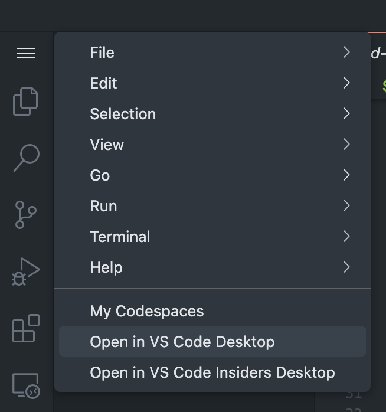

Use GitHub Codespaces to try Azure IoT Operations on a Kubernetes cluster without installing anything on your local machine. Use the **explore-iot-operations** codespace that is preconfigured with:

- [K3s](https://k3s.io/) running in [K3d](https://k3d.io/) for a lightweight Kubernetes cluster
- [Azure CLI](/cli/azure/install-azure-cli)
- [Kubectl](https://kubernetes.io/docs/tasks/tools/) for managing Kubernetes resources
- Other useful tools like [Helm](https://helm.sh/) and [k9s](https://k9scli.io/)

> [!IMPORTANT]
> Codespaces are easy to set up quickly and tear down later, but they're not suitable for performance evaluation or scale testing. Use GitHub Codespaces for exploration only.

To get started with your codespace:

1. Create the codespace, entering your Azure details to store them as environment variables for the terminal.

   

1. Once the codespace is ready, select the menu button at the top left, then select **Open in VS Code Desktop**.

   
