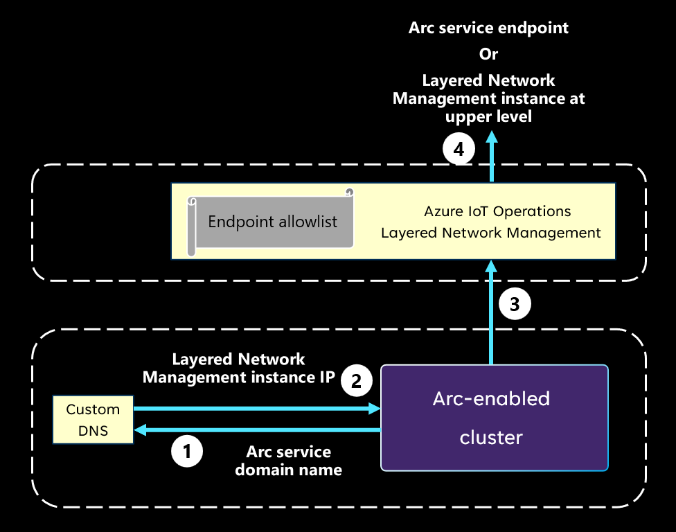

# How does Azure IoT Operations Preview work in layered network?

[!INCLUDE [public-preview-note](../includes/public-preview-note.md)]

## Industrial scenario for the Azure IoT Operations Preview

In the basic architecture described in [Azure IoT Operations Preview Architecture Overview](../get-started/overview-iot-operations.md#architecture-overview), all the Azure IoT Operations Preview components are deployed to a single internet-connected cluster. In this type of environment, component-to-component and component-to-Azure connections are enabled by default.

However, in many industrial scenarios, computing units for different purposes are located in separate networks. For example:
- Assets and servers on the factory floor
- Data collecting and processing solutions in the data center 
- Business logic applications with information workers

In some cases, the network design includes a single isolated network that is located behind the firewall or is physically disconnected from the internet. In other cases, a more complicated layered network topology is configured, such as the [ISA-95](https://www.isa.org/standards-and-publications/isa-standards/isa-standards-committees/isa95)/[Purdue Network architecture](https://en.wikipedia.org/wiki/Purdue_Enterprise_Reference_Architecture).

Azure IoT Layered Network Management Preview is designed for facilitating connections between Azure and clusters in different kinds of isolated network environments. Enabling Azure IoT Operations to function in top-level isolated layers and nested isolated layers as needed.

## How does Layered Network Management Preview work?

The following diagram describes the mechanism to redirect traffic from an isolated network to Azure Arc. It explains the underlying logic. For information on specific steps to achieve this mechanism, see [Configure Azure IoT Layered Network Management Preview](howto-configure-l4-cluster-layered-network.md).

1. When an Arc agent or extension is attempting to connect to its corresponding cloud side service, it uses the DNS to resolve the domain name of the target service endpoint.

1. The custom DNS returns the **IP address of the Layered Network Management instance** at the upper level instead of the real IP address of the service endpoint.
1. The Arc extension initiates a connection to the Layered Network Management instance with its IP address.
1. If the Layered Network Management instance is at the internet facing level, it forwards the traffic to the target Arc service endpoint. If the Layered Network Management instance isn't at the top level, it forwards the traffic to the next Layered Network Management instance, and so on.
> [!NOTE]
> Layered Network Management only forwards internet traffic when the destination is on the allowlist.

## Example of Azure IoT Operations Preview in layered network

The following diagram is an example of Azure IoT Operations being deployed to multiple clusters in multiple network layers. Based on the Purdue Network paradigm, level 4 is the enterprise network, level 3 is the operation and control layer, and level 2 is the controller system layer. Moreover, in our prototypical network, only level 4 has direct internet access.

:::image type="content" source="./media/concept-iot-operations-in-layered-network/iot-operations-in-purdue-network.png" alt-text="Diagram of IoT Operations deployed in Purdue Network architecture." lightbox="./media/concept-iot-operations-in-layered-network/iot-operations-in-purdue-network.png":::

In the pictured example, Azure IoT Operations is deployed to level 2 through 4. At level 3 and level 4, the **Layered Network Management services** are configured to receive and forward the network traffic from the layer that is one level below. With this forwarding mechanism, all the clusters illustrated in this deployment are able to connect to Azure and become Arc-enabled. The connection to Arc enables users to manage any Arc-enabled endpoint such as the servers, the cluster and the Arc-enabled service workloads from the cloud. 

With extra configurations, the Layered Network Management service can also direct east-west traffic. This route enables Azure IoT Operations components to send data to other components at upper level and form data pipelines from the bottom layer to the cloud. 
In a multi-layer network, the Azure IoT Operations components can be deployed across layers based on your architecture and data flow needs. This example provides some general ideas of where individual components will be placed.
- The **OPC UA Broker** may locate at the lower layer that is closer to your assets and OPC UA servers. This is also true for the **Akri** agent.
- The data shall be transferred towards the cloud side through the **MQ** components in each layer.
- The **Data Processor** is generally placed at the top layer as the most likely layer to have significant compute capacity and as a final stop for the data to get prepared before being sent to the cloud.

## Next steps

- To understand how to set up a cluster in an isolated environment for Azure IoT Operations scenarios, see [Configure Layered Network Management service to enable Azure IoT Operations Preview in an isolated network](howto-configure-aks-edge-essentials-layered-network.md).

