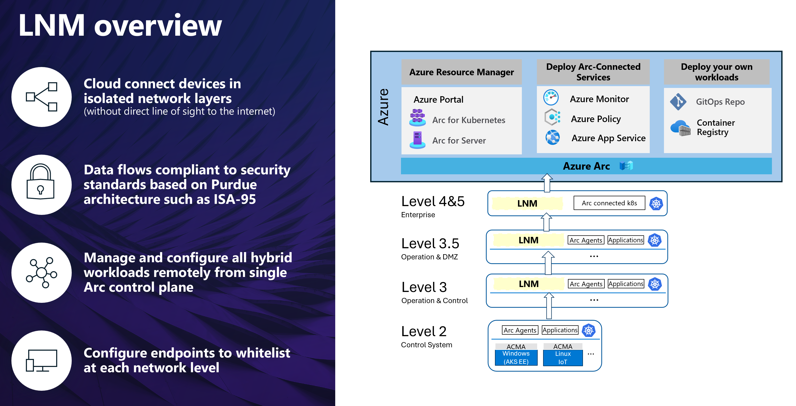

# What is Azure IoT Layered Network Management?

[!INCLUDE [public-preview-note](../includes/public-preview-note.md)]

Azure IoT Layered Network Management is a Kubernetes-based solution that provides secure communication between devices and the cloud through **isolated network environments** based on the *[ISA-95](https://www.isa.org/standards-and-publications/isa-standards/isa-standards-committees/isa95)/[Purdue Network architecture](http://www.pera.net/)*. The solution is deployed and managed as a component of Azure IoT Operations on Arc-enabled Kubernetes clusters.

Layered Network Management provides several benefits including:

* Kubernetes-based configuration and compatibility with IP and NIC mapping for crossing levels
* Ability to connect devices in isolated networks at scale to [Azure Arc](/azure/azure-arc/) for application lifecycle management and configuration of previously isolated resources remotely from a single Azure control plane
* Security and governance across network levels for devices and services with URL allowlists and connection auditing for deterministic network configurations
* Kubernetes observability tooling for previously isolated devices and applications across levels
* Default compatibility with all Azure IoT Operations service connections

## Isolated Network Environment for deploying Layered Network Management

There are several ways to configure Layered Network Management to bridge the connection between clusters in the isolated network and services on Azure. The following list are example network environments and cluster scenarios for Layered Network Management.

- **A simplified virtual machine and network** - This scenario uses an [Azure AKS](https://learn.microsoft.com/en-us/azure/aks/) cluster and an Azure Linux VM. You need an Azure subscription the following resources:
  - An [AKS cluster](/azure/aks/concepts-clusters-workloads) for layer 4 and 5.
  - An [Azure Linux VM](/azure/virtual-machines/) for layer 3. 
- **A simplified physically isolated network** - Requires three physical devices (IoT/PC/server) and a wireless access point.
  - The wireless access point is used for setting up a local network and **doesn't** provide internet access.
  - Level 4 cluster - A single node cluster hosted on a dual NIC physical machine, connects to internet and the local network.
  - Level 3 cluster - Another single node cluster hosted on a physical machine. This device (cluster) only connects to the local network.
  - DNS server - A DNS server setup in the local network. It provides custom domain name resolution and point the network request to the IP of level 4 cluster.
- **ISA-95 network** - You should try deploying Layered Network Management to an ISA-95 network or a preproduction environment.

## Key features

Layered Network Management supports the Azure IoT Operations components in an isolated network environment. The following table summarizes supported features and integration:

| Layered Network Management features | Status |
|------------------------------------------------------------------------------------------|:---:|
|Forward TLS traffic|Public preview|
|Traffic Auditing - Basic: Source/destination IP addresses and header values|Supported|
|Allowlist management through [Kubernetes Custom Resource](https://kubernetes.io/docs/concepts/extend-kubernetes/api-extension/custom-resources/)|Public preview|
|Installation: Integrated install experience of Layered Network Management and other Azure IoT Operations components|Public preview|
|Reverse Proxy for OSI Layer4 (TCP)|Public preview|
|Support East-West traffic forwarding for Azure IoT Operations components (manual setup)|Public Preview|
|Installation: Layered Network Management deployed as an Arc extension|Public Preview|
<!-- |Traffic Auditing - Basic: Send a copy of the traffic (encrypted) to a configured application|Post Public Preview|
|Azure Arc portal experience for Layered Network Management|Post Public Preview|
|Forward Proxy for OSI Layer7 (HTTP, HTTPS / MQTT over WebSockets)|Post Public Preview|
|TLS terminating proxy for OSI Layer7 (HTTPS / MQTT over WebSockets)|Post Public Preview| -->

## Related content

[Configure Azure IoT Layered Network Management Environment](howto-configure-layered-network.md)
[Configure Azure IoT MQ in an Isolated Network](howto-configure-mq-layered-network.md)

