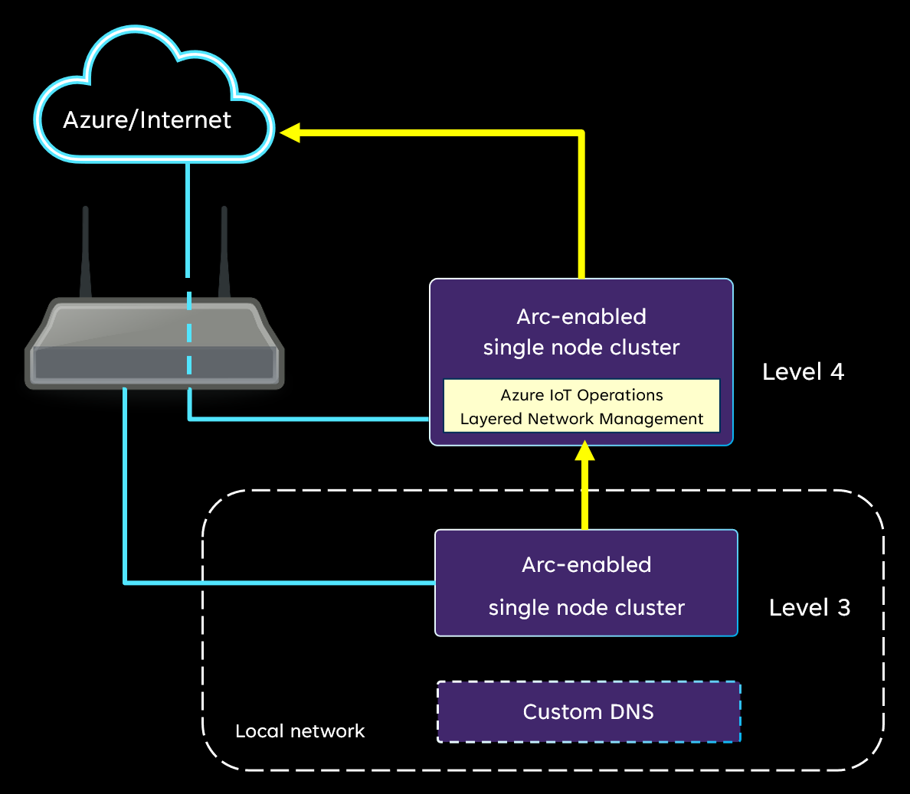
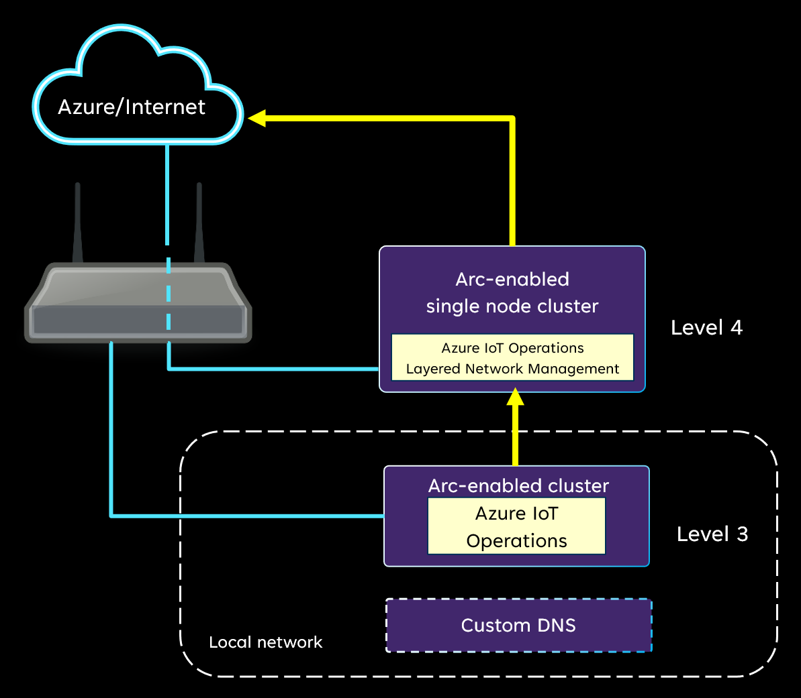

# Configure Layered Network Management Preview to use Azure IoT Operations Preview in an isolated network

[!INCLUDE [public-preview-note](../includes/public-preview-note.md)]

This walkthrough is an example of deploying Azure IoT Operations Preview to a special environment that's different than the default [Azure IoT Operations scenario](../get-started-end-to-end-sample/quickstart-deploy.md). By default, Azure IoT Operations is deployed to an Arc-enabled cluster that has direct internet access. In this scenario, you deploy Azure IoT Operations to an isolated network environment. The hardware and cluster must meet the prerequisites of Azure IoT Operations and there are additional configurations for the network, host OS, and cluster. As a result, the Azure IoT Operations components run and connect to Arc through the Azure IoT Layered Network Management Preview service.

>[!IMPORTANT]
> This is an advanced scenario for Azure IoT Operations. You should complete the following quickstarts to get familiar with the basic concepts before you start this advanced scenario.
> - [Deploy Azure IoT Layered Network Management to an AKS cluster](howto-deploy-aks-layered-network.md)
> - [Deployment overview - Azure IoT Operations Preview](../deploy-iot-ops/overview-deploy.md)
> - [Prepare your Kubernetes cluster - Azure IoT Operations Preview](../deploy-iot-ops/howto-prepare-cluster.md)
> - [Deploy Azure IoT Operations Preview to an Arc-enabled Kubernetes cluster - Azure IoT Operations Preview](../deploy-iot-ops/howto-deploy-iot-operations.md)
>
> You can't migrate a previously deployed Azure IoT Operations from its original network to an isolated network. For this scenario, follow the steps to begin with creating new clusters.

In this example, you Arc-enable AKS Edge Essentials or K3S clusters in the isolated layer of an ISA-95 network environment using the Layered Network Management service running in one level above.
The network and cluster architecture are described as follows:
- A level 4 single-node cluster running on a host machine with direct access to the internet.
- A custom DNS in the local network. See the [Configure custom DNS](howto-configure-layered-network.md#configure-custom-dns) for the options. To set up the environment quickly, you should use the *CoreDNS* approach instead of a DNS server.
- The level 3 cluster that is blocked from accessing internet. It connects to the Layered Network Management service as a proxy for all the Azure Arc related traffic.

For more information, see [Example of logical segmentation with minimum hardware](howto-configure-layered-network.md#example-of-logical-segmentation-with-minimum-hardware).

### Configure level 4 Kubernetes cluster and Layered Network Management Preview

After you configure the network, you need to configure the level 4 Kubernetes cluster. Complete the steps in [Configure IoT Layered Network Management level 4 cluster](./howto-configure-l4-cluster-layered-network.md). In the article, you:

- Set up a Windows 11 machine and configure AKS Edge Essentials or set up K3S Kubernetes on an Ubuntu machine.
- Deploy and configure the Layered Network Management service to run on the cluster.

You need to identify the **local IP** of the host machine. In later steps, you direct traffic from level 3 to this IP address with a custom DNS.

After you complete this section, the Layered Network Management service is ready for forwarding network traffic from level 3 to Azure.

### Configure the custom DNS

In the local network, you need to set up the mechanism to redirect all the network traffic to the Layered Network Management service. Use the steps in [Configure custom DNS](howto-configure-layered-network.md#configure-custom-dns). In the article: 
- If you choose the *CoreDNS* approach (only applicable for K3s cluster in L3), you can skip to *Configure and Arc enable level 3 cluster* and configure the CoreDNS before your Arc-enable the level 3 cluster.
- If you choose to use a *DNS server*, follow the steps to set up the DNS server before you move to the next section in this article.

### Configure and Arc enable level 3 cluster

The next step is to set up an Arc-enabled cluster in level 3 that's compatible for deploying Azure IoT Operations. You can choose either the AKS Edge Essentials or K3S as the Kubernetes platform.

# [K3S Cluster](#tab/k3s)

- Follow the [Prepare your Azure Arc-enabled Kubernetes cluster](../deploy-iot-ops/howto-prepare-cluster.md) to setup and Arc-enable your K3s cluster.
  1. In addition, you need to configure the custom DNS for this cluster.
      - If you choose to use a local DNS server, and have completed the steps in previous section. You can proceed the cluster setup.
      - If you choose to use CoreDNS, you need to completet the **Create a cluster** section with internet access, then configure the [CoreDNS](howto-configure-layered-network.md#configure-custom-dns) for this cluster.
  1. Proceed to Arc-enable the cluster.

# [AKS Edge Essentials](#tab/aksee)

- Follow the [Prepare your Azure Arc-enabled Kubernetes cluster](../deploy-iot-ops/howto-prepare-cluster.md) to setup and Arc-enable your AKS Edge Essentials cluster.
  1. You will have to complete the **DNS server** configuration from previous section before start.
  1. For the step of **Get the `objectID`** you shall run the command on a different machine that have internet access.

---

### Verification

Once the Azure Arc enablement of the level 3 cluster is complete, go to your resource group in the Azure portal. You should see a **Kubernetes - Azure Arc** resource with the name you specified.

1. Open the resource overview page. 
1. Verify **status** of the cluster is **online**.

For more information, see [Access Kubernetes resources from Azure portal](/azure/azure-arc/kubernetes/kubernetes-resource-view).

## Deploy Azure IoT Operations Preview

Once your level 3 cluster is Arc-enabled, you can deploy IoT Operations to the cluster. All IoT Operations components are deployed to the level 3 cluster and connect to Arc through the Layered Network Management service. The data pipeline also routes through the Layered Network Management service.

You can now follow the steps in [Deploy Azure IoT Operations Preview to an Arc-enabled Kubernetes cluster](../deploy-iot-ops/howto-deploy-iot-operations.md) to deploy IoT Operations to the level 3 cluster.

## Next steps

Once IoT Operations is deployed, you can try the following tutorials. The Azure IoT Operations in your level 3 cluster works as described in the tutorials.

- [Tutorial: Add OPC UA assets to your Azure IoT Operations Preview cluster](../end-to-end-tutorials/tutorial-add-assets.md)
- [Tutorial: Send asset telemetry to the cloud using the data lake connector for MQTT broker](../end-to-end-tutorials/tutorial-upload-telemetry-to-cloud.md)
