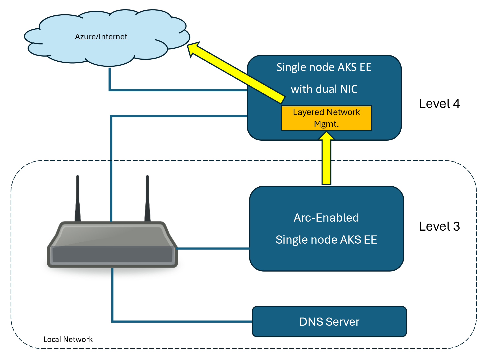

# Configure AKS Edge Essentials in Azure IoT Layered Network Management

[!INCLUDE [public-preview-note](../includes/public-preview-note.md)]

You can Arc-enable AKS Edge Essentials clusters in an ISA-95 network environment* using the Azure IoT Layered Network Management service. In this article, you deploy an example level 4 cluster that can:
- Directly access the internet
- A dual network interface card (NIC) host that allows the level 4 cluster to be visible to the level 3 local network. 
- A custom DNS that resolves the DNS server in the local network
- The level 3 Azure AKS Edge Essentials cluster connects to the Layered Network Management service as a proxy for all the Azure Arc related traffic.



## Configure network environment

Complete the steps in [Configure isolated network with physical segmentation](./howto-configure-layered-network.md#configure-isolated-network-with-physical-segmentation) to configure your Wi-Fi access point, local network, and DNS server.

When configuring the DNS server, you need to point the Arc related domains to **local network IP of the level 4 machine**. For example:

```
address=/.login.microsoft.com/<local network IP of the level 4 machine>
```

## Configure level 4 AKS Edge Essentials and Layered Network Management

Complete the steps in [Configure IoT Layered Network Management Level 4 Cluster](./howto-configure-l4-cluster-layered-network.md). When following the steps in the document, you need to:
- Configure the level 4 AKS Edge Essentials
- Complete the steps to deploy the Layered Network Management service.

After you complete the steps, the Layered Network Management service should be configured and running. The service is ready for forwarding network traffic from level 3.

## Configure and Arc enable level 3 AKS Edge Essentials

Complete the steps in [Configure IoT Layered Network Management Level 3 Cluster](./howto-configure-l3-cluster-layered-network.md). When following the steps in the document, you need to:
- Complete the AKS EE path for Kubernetes setup.
- For the DNS server setting, provide the local network IP of the DNS server that you configured in the earlier step.
- Complete the steps to connect the AKS Edge Essentials cluster to Azure Arc.

## Verification

Once the Azure Arc enablement of the level 3 cluster is complete, Navigate to your resource group in the Azure portal.- You should see a **Kubernetes - Azure Arc** resource with the name you specified.

1. Open the resource overview page. 
1. Verify **status** of the cluster is **online**.

For more information, see [Access Kubernetes resources from Azure portal](/azure/azure-arc/kubernetes/kubernetes-resource-view)

## Related content

[Configure Azure IoT MQ in an Isolated Network](howto-configure-mq-layered-network.md)
