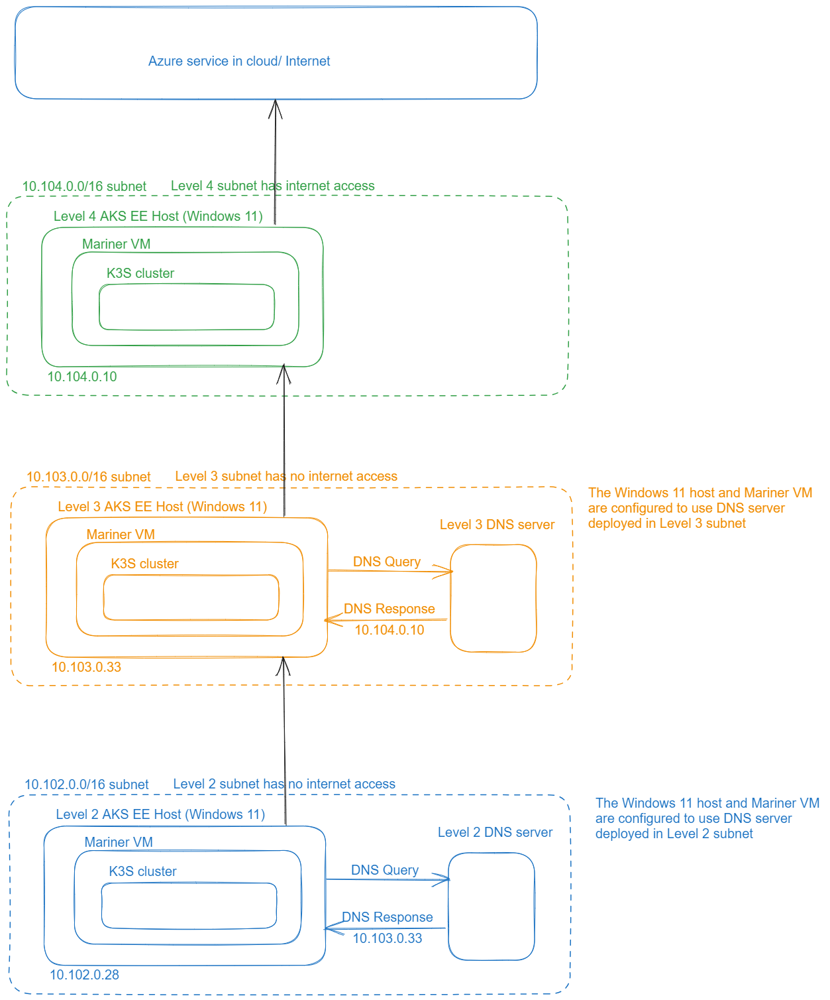

# Create sample network environment for Azure IoT Layered Network Management

[!INCLUDE [public-preview-note](../includes/public-preview-note.md)]

To use Azure IoT Layered Network Management service, you need to configure an isolated network environment. For example the [ISA-95](https://www.isa.org/standards-and-publications/isa-standards/isa-standards-committees/isa95)/[Purdue Network architecture](http://www.pera.net/). This page provides few examples for setting up a test environment depends on the how you want to achieve the isloation.
- *Physical segmentation* - The networks are physically separated. In this case, the Layered Network Management needs to be deployed to a dual NIC (Network Interface Card) host to connect to both the internet-facing network and the isolated network.
- *Logical segmentation* - The network is logically segmented with configurations such as VLAN, subnet or firewall. The Layered Network Management has a single endpoint and configured to be visiable to its own network layer and the isolated layer.

Both approach requires you to configure a custom DNS in the isolated network layer to direct the network traffic to the Layered Network Management instance in upper layer.

> [!IMPORTANT]
> The network environments outlined in Layered Network Management documentation are examples for testing the Layered Network Management. It's not a recommendation of how you build your network and cluster topology for productional usage.

## Configure isolated network with physical segmentation

The following example configuration is a simple isolated network with minimum physical devices.


- The wireless access point is used for setting up a local network and doesn't provide internet access.
- **Level 4 cluster** is a single node cluster hosted on a dual network interface card (NIC) physical machine that connects to internet and the local network.
- **Level 3 cluster** is a single node cluster hosted on a physical machine. This device cluster only connects to the local network.

Layered Network Management is deployed to the dual NIC cluster. The cluster in the local network connects to Layered Network Management as a proxy to access Azure and Arc services. In addition, it would need a custom DNS in the local network to provide domain name resolution and point the traffic to Layered Network Management. For more information, see [Configure custom DNS](#configure-custom-dns).

## Configure Isolated Network with logical segmentation

The following diagram illustrates an isolated network environment where each level is logically segmented with subnets. In this test environment, there are multiple clusters one at each level. The clusters can be AKS Edge Essentials or K3S. The Kubernetes cluster in the level 4 network has direct internet access. The Kubernetes clusters in level 3 and below don't have internet access.



The multiple levels of networks in this test setup are accomplished using subnets within a network:

- **Level 4 subnet (10.104.0.0/16)** - This subnet has access to the internet. All the requests are sent to the destinations on the internet. This subnet has a single Windows 11 machine with the IP address 10.104.0.10.
- **Level 3 subnet (10.103.0.0/16)** - This subnet doesn't have access to the internet and is configured to only have access to the IP address 10.104.0.10 in Level 4. This subnet contains a Windows 11 machine with the IP address 10.103.0.33 and a Linux machine that hosts a DNS server. The DNS server is configured using the steps in [Configure custom DNS](#configure-custom-dns). All the domains in the DNS configuration must be mapped to the address 10.104.0.10.
- **Level 2 subnet (10.102.0.0/16)** - Like Level 3, this subnet doesn't have access to the internet. It's configured to only have access to the IP address 10.103.0.33 in Level 3. This subnet contains a Windows 11 machine with the IP address 10.102.0.28 and a Linux machine that hosts a DNS server. There's one Windows 11 machine (node) in this network with IP address 10.102.0.28. All the domains in the DNS configuration must be mapped to the address 10.103.0.33.

Please refer to the following examples for setup this type of network environment.

### Example of logical isolated network with minimum hardware
In this example, both machines are connect to an AP (Access Point) which connects to the internet. The level 4 host machine can access internet. The level 3 host is blocked for accessing internet with AP's configuration (e.g. firewall, client control...). As both machines are in the same network, Layered Network Management instance hosted on level 4 cluster is by defauly visible to the level 3 machine and cluster.
An additional custom DNS needs to be setup in the local network to provide domain name resolution and point the traffic to Layered Network Management. For more information, see [Configure custom DNS](#configure-custom-dns).

### Example of logical isolated network in Azure

## Configure custom DNS

A custom DNS is needed for level 3 and below. It ensures that DNS resolution for network traffic originating within the cluster is pointed to the parent level Layered Network Management instance. In an existing or production environment, incorporate the following DNS resolutions into your DNS design. If you want to set up a test environment for Layered Network Management service and Azure IoT Operations, you can refer to one of the following examples.

# [CoreDNS](#tab/coredns)

### Configure CoreDNS

While the DNS setup can be achieved many different ways, this example uses an extension mechanism provided by CoreDNS to add the allowlisted URLs to be resolved by CoreDNS. CoreDNS is the default DNS server for K3S clusters.

### Create configmap from level 4 Layered Network Management
After the level 4 cluster and Layered Network Management are ready, perform the following steps.
1. Confirm the IP address of Layered Network Management service with the following command:
    ```bash
    kubectl get services
    ```
    The output should look like the following. The IP address of the service is `20.81.111.118`.

    ```Output
    NAME          TYPE           CLUSTER-IP     EXTERNAL-IP     PORT(S)                      AGE
    lnm-level4   LoadBalancer   10.0.141.101   20.81.111.118   80:30960/TCP,443:31214/TCP   29s
    ```

1. View the config maps with following command:
    
    ```bash
    kubectl get cm
    ```
    
    The output should look like the following example:
    
    ```Output
    NAME                           DATA   AGE
    aio-lnm-level4-config          1      50s
    aio-lnm-level4-client-config   1      50s
    ```

1. Customize the `aio-lnm-level4-client-config`. This configuration is needed as part of the level 3 setup to forward traffic from the level 3 cluster to the top level Layered Network Management instance.

    ```bash
    # set the env var PARENT_IP_ADDR to the ip address of level 4 LNM instance.
      export PARENT_IP_ADDR="20.81.111.118"
    
    # run the script to generate a config map yaml
      kubectl get cm aio-lnm-level4-client-config -o yaml | yq eval '.metadata = {"name": "coredns-custom", "namespace": "kube-system"}' -| sed 's/PARENT_IP/'"$PARENT_IP_ADDR"'/' > configmap-custom-level4.yaml
    ```

    This step creates a file named `configmap-custom-level4.yaml`

### Configure level 3 CoreDNS of K3S
After setting up the K3S cluster and moving it to the level 3 isolated layer, configure the level 3 K3S's CoreDNS with the customized client-config that was previously generated.

1. Copy the `configmap-custom-level4.yaml` to the level 3 host, or to the system where you're remotely accessing the cluster.
1. Run the following commands:
    ```bash
    # Create a config map called coredns-custom in the kube-system namespace
    kubectl apply -f configmap-custom-level4.yaml
    
    # Restart coredns
    kubectl rollout restart deployment/coredns -n kube-system
    
    # validate DNS resolution
    kubectl run -it --rm --restart=Never busybox --image=busybox:1.28 -- nslookup east.servicebus.windows.net
    
    # You should see the following output.
    kubectl run -it --rm --restart=Never busybox --image=busybox:1.28 -- nslookup east.servicebus.windows.net
    Server:    10.43.0.10
    Address 1: 10.43.0.10 kube-dns.kube-system.svc.cluster.local
    
    Name:      east.servicebus.windows.net
    Address 1: 20.81.111.118
    pod "busybox" deleted
    
    # Note: confirm that the resolved ip addresss matches the ip address of the level 4 Layered Network Management instance.
    ```

1. The previous step sets the DNS configuration to resolve the allowlisted URLs inside the cluster to level 4. To ensure that DNS outside the cluster is doing the same, you need to configure systemd-resolved to forward traffic to CoreDNS inside the K3S cluster. Run the following commands on the K3S host:
    Create the following directory:
    ```bash
        sudo mkdir /etc/systemd/resolved.conf.d
    ```

    Create a file named `lnm.conf` with the following contents. The IP address should be the level 3 cluster IP address of the kube-dns service that is running in the kube-system namespace.

    ```bash
    [Resolve]
    DNS=<PUT KUBE-DNS SERVICE IP HERE> 
    DNSStubListener=no
    ```

    Restart the DNS resolver:
    ```bash
    sudo systemctl restart systemd-resolved
    ```

# [DNS Server](#tab/dnsserver)

### Configure the DNS server

A custom DNS is only needed for levels 3 and below. This example uses a [dnsmasq](https://dnsmasq.org/) server, running on Ubuntu for DNS resolution.

1. Install an Ubuntu machine in the local network.
1. Enable the *dnsmasq* service on the Ubuntu machine.

    ```bash
    apt update
    apt install dnsmasq
    systemctl status dnsmasq
    ```
1. Modify the `/etc/dnsmasq.conf` file as shown to route these domains to the upper level.
    - Change the IPv4 address from 10.104.0.10 to respective destination address for that level. In this case, the IP address of the Layered Network Management service in the parent level.
    - Verify the `interface` where you're running the *dnsmasq* and change the value as needed.

    The following configuration only contains the necessary endpoints for enabling Azure IoT Operations.

    ```conf
    # Add domains which you want to force to an IP address here.
    address=/management.azure.com/10.104.0.10
    address=/dp.kubernetesconfiguration.azure.com/10.104.0.10
    address=/.dp.kubernetesconfiguration.azure.com/10.104.0.10
    address=/login.microsoftonline.com/10.104.0.10
    address=/.login.microsoft.com/10.104.0.10
    address=/.login.microsoftonline.com/10.104.0.10
    address=/login.microsoft.com/10.104.0.10
    address=/mcr.microsoft.com/10.104.0.10
    address=/.data.mcr.microsoft.com/10.104.0.10
    address=/gbl.his.arc.azure.com/10.104.0.10
    address=/.his.arc.azure.com/10.104.0.10
    address=/k8connecthelm.azureedge.net/10.104.0.10
    address=/guestnotificationservice.azure.com/10.104.0.10
    address=/.guestnotificationservice.azure.com/10.104.0.10
    address=/sts.windows.nets/10.104.0.10
    address=/k8sconnectcsp.azureedge.net/10.104.0.10
    address=/.servicebus.windows.net/10.104.0.10
    address=/servicebus.windows.net/10.104.0.10
    address=/obo.arc.azure.com/10.104.0.10
    address=/.obo.arc.azure.com/10.104.0.10
    address=/adhs.events.data.microsoft.com/10.104.0.10
    address=/dc.services.visualstudio.com/10.104.0.10
    address=/go.microsoft.com/10.104.0.10
    address=/onegetcdn.azureedge.net/10.104.0.10
    address=/www.powershellgallery.com/10.104.0.10
    address=/self.events.data.microsoft.com/10.104.0.10
    address=/psg-prod-eastus.azureedge.net/10.104.0.10
    address=/.azureedge.net/10.104.0.10
    address=/api.segment.io/10.104.0.10
    address=/nw-umwatson.events.data.microsoft.com/10.104.0.10
    address=/sts.windows.net/10.104.0.10
    address=/.azurecr.io/10.104.0.10
    address=/.blob.core.windows.net/10.104.0.10
    address=/global.metrics.azure.microsoft.scloud/10.104.0.10
    address=/.prod.hot.ingestion.msftcloudes.com/10.104.0.10
    address=/.prod.microsoftmetrics.com/10.104.0.10
    address=/global.metrics.azure.eaglex.ic.gov/10.104.0.10

    # --address (and --server) work with IPv6 addresses too.
    address=/guestnotificationservice.azure.com/fe80::20d:60ff:fe36:f83
    address=/.guestnotificationservice.azure.com/fe80::20d:60ff:fe36:f833
    address=/.servicebus.windows.net/fe80::20d:60ff:fe36:f833
    address=/servicebus.windows.net/fe80::20d:60ff:fe36:f833

    # If you want dnsmasq to listen for DHCP and DNS requests only on
    # specified interfaces (and the loopback) give the name of the
    # interface (eg eth0) here.
    # Repeat the line for more than one interface.
    interface=enp1s0

    listen-address=::1,127.0.0.1,10.102.0.72

    no-hosts
    ```

1. As an alternative, you can put `address=/#/<IP of upper level Layered Network Management service>` in the IPv4 address section. For example:

    ```conf
    # Add domains which you want to force to an IP address here.
    address=/#/<IP of upper level Layered Network Management service>

    # --address (and --server) work with IPv6 addresses too.
    address=/#/fe80::20d:60ff:fe36:f833

    # If you want dnsmasq to listen for DHCP and DNS requests only on
    # specified interfaces (and the loopback) give the name of the
    # interface (eg eth0) here.
    # Repeat the line for more than one interface.
    interface=enp1s0

    listen-address=::1,127.0.0.1,10.102.0.72

    no-hosts
    ```

1. Restart the *dnsmasq* service to apply the changes.

    ```bash
    sudo systemctl restart dnsmasq
    systemctl status dnsmasq
    ```

---

## Related content

[What is Azure IoT Layered Network Management?](./overview-layered-network.md)
