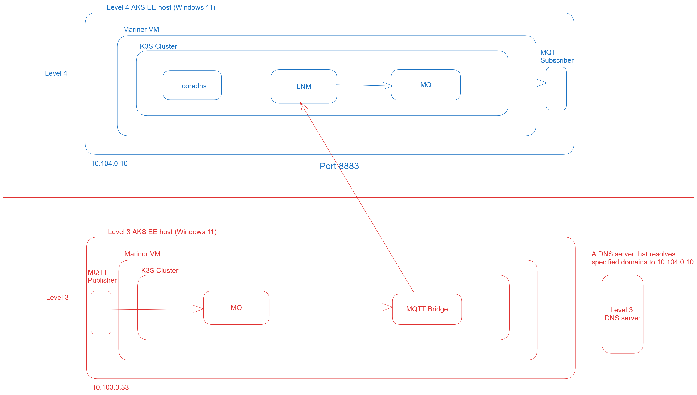

# Configure Azure IoT MQ in an isolated network

[!INCLUDE [public-preview-note](../includes/public-preview-note.md)]

You can use Azure IoT Layered Network Management for deploying Azure IoT MQ in an isolated network. You can send MQTT messages from a client on level 3 to a client on level 4.



## Prerequisites
You need to set up two clusters in a basic isolated network environment to try this MQ scenario.
- A level 4 cluster that is internet facing.
- A level 3 cluster in the isolated network and connects to Arc through the Layered Network Management service at level 4.

You can use the following steps to configure the prerequisites.

1. [Create sample network environment](./howto-configure-layered-network.md). You should use physical machines. You also need to set up the DNS server.
1. [Configure IoT Layered Network Management level 4 cluster](./howto-configure-l4-cluster-layered-network.md).
1. [Configure IoT Layered Network Management level 3 cluster](./howto-configure-l3-cluster-layered-network.md).

After the level 4 and level 3 cluster are both Arc-enabled, configure Iot MQ and MQTT bridge.

## Level 4 configuration

### Deploy MQ on level 4

1. Run the following command to deploy IoT MQ. This command installs the MQ Operator and Health Manager.

    ```bash
    helm install e4k "oci://e4kpreview.azurecr.io/helm/az-e4k" --version 0.5.0
    ```

1. To set up the CR for IoT MQ, create `mq-cr.yaml` file with the following content. Run 'kubectl apply -f mq-cr.yaml` and wait until all pods are ready.

    ```yaml
    apiVersion: mq.iotoperations.azure.com/v1beta1
    kind: Broker
    metadata:
      name: "my-broker"
      namespace: default
    spec:
      authImage:
        pullPolicy: Always
        repository: mcr.microsoft.com/azureiotoperations/dmqtt-authentication
        tag: 0.1.0-preview
      brokerImage:
        pullPolicy: Always
        repository: mcr.microsoft.com/azureiotoperations/dmqtt-pod
        tag: 0.1.0-preview
      healthManagerImage:
        pullPolicy: Always
        repository: mcr.microsoft.com/azureiotoperations/dmqtt-operator
        tag: 0.1.0-preview
      mode: distributed
      cardinality:
        frontend:
          replicas: 1
        backendChain:
          replicas: 1
          partitions: 2
          workers: 1
      diagnostics:
        diagnosticServiceEndpoint: azedge-diagnostics-service:9700
        enableMetrics: true
        enableTracing: true
        logLevel: info,hyper=off,kube_client=off,tower=off,conhash=off,h2=off
        enableSelfCheck: true
    ---
    apiVersion: mq.iotoperations.azure.com/v1beta1
    kind: BrokerListener
    metadata:
      name: "az-mqtt-non-tls-listener"
      namespace: default
    spec:
      brokerRef: "my-broker"
      authenticationEnabled: false
      authorizationEnabled: false
      port: 1883
    ---
    apiVersion: mq.iotoperations.azure.com/v1beta1
    kind: DiagnosticService
    metadata:
      name: azedge-diagnostics-service
      namespace: default
    spec:
      image:
        pullPolicy: Always
        repository: alicesprings.azurecr.io/diagnostics-service
        tag: 0.1.0
      logFormat: "text"
    ```

### Create TLS server certificate of MQ on level 4

Follow the steps in [Configure TLS with manual certificate management to secure MQTT communication](../manage-mqtt-connectivity/howto-configure-tls-manual.md). When creating the certificate, use `aio-mq-dmqtt-frontend.level-4.com` as one of the Subject Alternative Names (SANs) Set the SAN using the step CLI *--san** option.

### Deploy TLS Listener for MQ on level 4

1. Use the TLS certificate created in the earlier step.
1. To create the CR for TLS listener, create a file `mq-tls-listener.yaml` with follow content:

    ```yaml
    apiVersion: mq.iotoperations.azure.com/v1beta1
    kind: BrokerListener
    metadata:
      name: "tls-listener-manual"
      namespace: default
    spec:
      brokerRef: "my-broker"
      authenticationEnabled: false
      port: 8883
      tls:
        manual:
          secretName: "my-secret"
    ```

1. Run `kubectl apply -f mq-listener.yaml`.

### Configure CoreDNS on level 4 Cluster

To direct incoming traffic from MQTT bridge at level 3 to the in-cluster IoT MQ service, you need to modify the *coreDNS* running on level 4.

> [!IMPORTANT]
> The *coreDNS* configuration might reset after a Kubernetes service restart. If your changes are reset, you need to set the *configmap* again.

1. Run the following command:

    ```bash
    kubectl edit configmap -n kube-system coredns
    ```

1. Modify the *coredns* configuration as follows:

    ```yaml
    apiVersion: v1
    metadata:
      name: coredns
      namespace: kube-system
    data:
      Corefile: |

        # Here aio-mq-dmqtt-frontend.level-4.com is the san name used while creating the certificate.
        # If you used any other name, specify that name here. Copy just this server block to your coredns configmap

        aio-mq-dmqtt-frontend.level-4.com:53 {
            hosts {
                10.43.164.168 aio-mq-dmqtt-frontend.level-4.com
                fallthrough
            }
        }

    ```

    This configuration resolves `aio-mq-dmqtt-frontend.level-4.com` to the `ClusterIP` 10.43.164.168 of the `aio-mq-dmqtt-frontend` service. Make sure to use correct *ClusterIP* address in this configuration.

## Level 3 configuration

On level 3, you need to deploy IoT MQ and MQTT Bridge. MQTT Bridge is the component that receives MQTT message on a topic and sends them to another IoT MQ. You configure the MQTT bridge to pass messages from level 3 to level 4 MQ on a specified topic.

### Deploy IoT MQ on level 3

1. Run the following command to deploy IoT MQ. This command installs the MQ Operator and Health Manager.

    ```bash
    helm install e4k "oci://e4kpreview.azurecr.io/helm/az-e4k" --version 0.1.0
    ```

1. To set up the CR for IoT MQ, create `mq-cr.yaml` file with the following content. Run `kubectl apply -f mq-cr.yaml` and wait until all pods are ready.

    ```yaml
    apiVersion: mq.iotoperations.azure.com/v1beta1
    kind: Broker
    metadata:
      name: "my-broker"
      namespace: level3
    spec:
      authImage:
        pullPolicy: Always
        repository: mcr.microsoft.com/azureiotoperations/dmqtt-authentication
        tag: 0.1.0
      brokerImage:
        pullPolicy: Always
        repository: mcr.microsoft.com/azureiotoperations/dmqtt-pod
        tag: 0.1.0
      healthManagerImage:
        pullPolicy: Always
        repository: mcr.microsoft.com/azureiotoperations/dmqtt-operator
        tag: 0.1.0
      mode: distributed
      cardinality:
        frontend:
          replicas: 1
        backendChain:
          replicas: 1
          partitions: 2
          workers: 1
      diagnostics:
        diagnosticServiceEndpoint: azedge-diagnostics-service:9700
        enableMetrics: true
        enableTracing: true
        logLevel: info,hyper=off,kube_client=off,tower=off,conhash=off,h2=off
        enableSelfCheck: true
    ---
    apiVersion: mq.iotoperations.azure.com/v1beta1
    kind: BrokerListener
    metadata:
      name: "az-mqtt-non-tls-listener"
      namespace: default
    spec:
      brokerRef: "my-broker"
      authenticationEnabled: false
      authorizationEnabled: false
      port: 1883
    ---
    apiVersion: mq.iotoperations.azure.com/v1beta1
    kind: DiagnosticService
    metadata:
      name: azedge-diagnostics-service
      namespace: default
    spec:
      image:
        pullPolicy: Always
        repository: mcr.microsoft.com/azureiotoperations/diagnostics-service
        tag: 0.1.0
      logFormat: "text"
    ```

#### Deploy and configure MQTT Bridge on level 3

Use the guidance in [Connect MQTT bridge cloud connector to other MQTT brokers](../connect-to-cloud/howto-configure-mqtt-bridge.md) to create the MQTT bridge. 

For **MqttBridgeConnector**, in `remoteBrokerConnection` section of the yaml file, specify the name of the MQ service as follows:

```yaml
remoteBrokerConnection:
  # Remote broker endpoint URL with port.
  endpoint: "aio-mq-dmqtt-frontend.level-4.com:8883"
  # Specifies if connection is encrypted with TLS and trusted CA cert
  tls:
    # TLS enabled or not.
    tlsEnabled: true
    trustedCaCertificateName: "ca-cert-configmap"
```

For **MqttBridgeTopicMap**, use the following example content of yaml file for testing end to end message delivery.

```yaml
apiVersion: mq.iotoperations.azure.com/v1beta1
kind: MqttBridgeTopicMap
metadata:
  name: "my-topic-map"
  namespace: level3
spec:
  mqttBridgeConnectorRef: "my-bridge"
  routes:
    - direction: local-to-remote
      name: "send-to-l4"
      source: "tol4"
      target: "froml3"
      qos: 1
    - direction: remote-to-local
      name: "receive-from-l4"
      source: "froml4"
      target: "tol3"
      qos: 1
```

## Testing

You can use Mosquitto clients for testing end-to-end message delivery. Download and install the [Mosquitto client](https://mosquitto.org/download/) on both level 4 and level 3. You also need to port-forward the IoT MQ service on localhost so that Mosquitto clients can access them locally.

### Subscribe to a topic in level 4

1. Run the following command to port-forward the MQ service:

    ```bash
    kubectl port-forward service/aio-mq-dmqtt-frontend 12345:mqtt-1883
    ```

1. Run the following command to subscribe to a topic. The topic you're subscribing to is **froml3** as specified in `MqttBridgeTopicMap` earlier.

    ```bash
    mosquitto_sub -d -h localhost -p 12345 -i "my-client" -t "froml3"
    ```

### Publish to a topic from level 3

1. Run the following command to port-forward the IoT MQ service.

    ```bash
    kubectl port-forward -n level3 service/aio-mq-dmqtt-frontend 12345:mqtt-1883
    ```

1. Publish a message with the following command. You're publishing to topic **tol4** as specified in `MqttBridgeTopicMap`.

    ```bash
    mosquitto_pub -d -h localhost -p 12345 -i "my-client-l3" -t "tol4" -m "Test"
    ```

### Subscribe to a topic in level 3

Run the following command to subscribe to the **tol3** topic as specified in **MqttBridgeTopicMap** earlier.

```bash
mosquitto_sub -d -h localhost -p 12345 -i "my-client-l3-sub" -t "tol3"
```

#### Publish to a topic from level 4

Run the following command to publish a message to topic **froml4** as specified in **MqttBridgeTopicMap**.

```bash
mosquitto_pub -d -h localhost -p 12345 -i "my-client-l4-pub" -t "froml4" -m "Test
```

## Related content

- [Create sample network environment](./howto-configure-layered-network.md)
