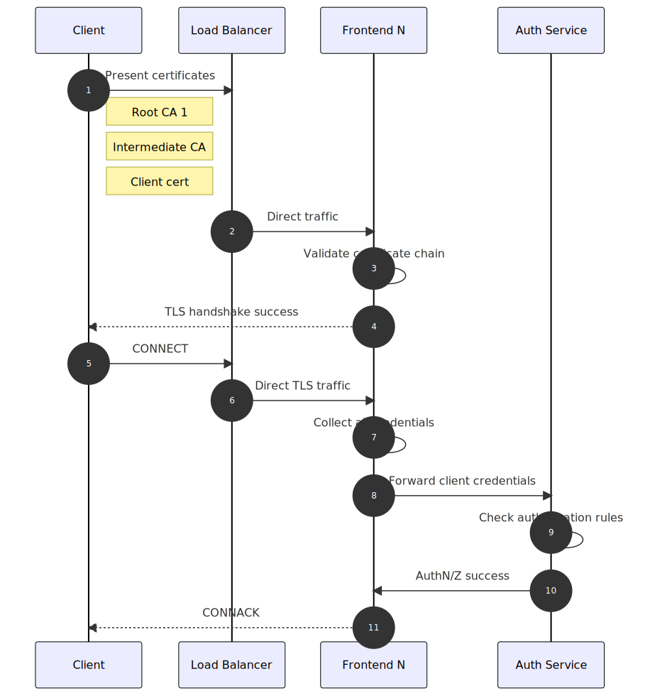

# Configure MQTT broker authentication

[!INCLUDE [public-preview-note](../includes/public-preview-note.md)]

MQTT broker supports multiple authentication methods for clients, and you can configure each listener to have its own authentication system with *BrokerAuthentication* resources.

## Default BrokerAuthentication resource

Azure IoT Operations Preview deploys a default BrokerAuthentication resource named `authn` linked with the default listener named `listener` in the `azure-iot-operations` namespace. It's configured to only use Kubernetes Service Account Tokens (SATs) for authentication. To inspect it, run:

```bash
kubectl get brokerauthentication authn -n azure-iot-operations -o yaml
```

The output shows the default BrokerAuthentication resource, with metadata removed for brevity:

```yaml
apiVersion: mqttbroker.iotoperations.azure.com/v1beta1
kind: BrokerAuthentication
metadata:
  name: authn
  namespace: azure-iot-operations
spec:
  authenticationMethods:
  - method: ServiceAccountToken
    serviceAccountToken:
      audiences:
      - aio-mq
```

To change the configuration, modify the `authenticationMethods` setting in this BrokerAuthentication resource or create new brand new BrokerAuthentication resource with a different name. Then, deploy it using `kubectl apply`.

## Relationship between BrokerListener and BrokerAuthentication

The following rules apply to the relationship between BrokerListener and BrokerAuthentication:

* Each BrokerListener can have multiple ports. Each port can be linked to a BrokerAuthentication resource. 
* Each BrokerAuthentication can support multiple authentication methods at once

## Authentication flow

The order of authentication methods in the array determines how MQTT broker authenticates clients. MQTT broker tries to authenticate the client's credentials using the first specified method and iterates through the array until it finds a match or reaches the end.

For each method, MQTT broker first checks if the client's credentials are *relevant* for that method. For example, SAT authentication requires a username starting with `K8S-SAT`, and X.509 authentication requires a client certificate. If the client's credentials are relevant, MQTT broker then verifies if they're valid. For more information, see the [Configure authentication method](#configure-authentication-method) section.

For custom authentication, MQTT broker treats failure to communicate with the custom authentication server as *credentials not relevant*. This behavior lets MQTT broker fall back to other methods if the custom server is unreachable.

The authentication flow ends when:

* One of these conditions is true:
  * The client's credentials are relevant and valid for one of the methods.
  * The client's credentials aren't relevant for any of the methods.
  * The client's credentials are relevant but invalid for any of the methods.
* MQTT broker either grants or denies access to the client based on the outcome of the authentication flow.

With multiple authentication methods, MQTT broker has a fallback mechanism. For example:

```yaml
apiVersion: mqttbroker.iotoperations.azure.com/v1beta1
kind: BrokerAuthentication
metadata: 
  name: authn
  namespace: azure-iot-operations
spec:
  authenticationMethods:
    - method: Custom
      custom:
        # ...
    - method: ServiceAccountToken
      serviceAccountToken:
        # ...
    - method: x509Credentials
      x509Credentials:
        # ...
```

The earlier example specifies custom and SAT. When a client connects, MQTT broker attempts to authenticate the client using the specified methods in the given order *custom* then *SAT*.

1. MQTT broker checks if the client's credentials are valid for custom authentication. Since custom authentication relies on an external server to determine validity of credentials, the broker considers all credentials relevant to custom auth and forwards them to the custom authentication server.

1. If the custom authentication server responds with `Pass` or `Fail` result, the authentication flow ends. However, if the custom authentication server isn't available, then MQTT broker falls back to the remaining specified methods, with SAT being next.

1. MQTT broker tries to authenticate the credentials as SAT credentials. If the MQTT username starts with `K8S-SAT`, MQTT broker evaluates the MQTT password as a SAT.

If the custom authentication server is unavailable and all subsequent methods determined that the provided credentials aren't relevant, then the broker denies the client connection.

## Disable authentication

For testing, you can disable authentication by omitting `authenticationRef` in the `ports` setting of a BrokerListener resource.

## Configure authentication method

To learn more about each of the authentication options, see the following sections:

## X.509 client certificate

### Prerequisites

- MQTT broker configured with [TLS enabled](howto-configure-brokerlistener.md).
- [Step-CLI](https://smallstep.com/docs/step-cli/installation/)
- Client certificates and the issuing certificate chain in PEM files. If you don't have any, use Step CLI to generate some.
- Familiarity with public key cryptography and terms like root CA, private key, and intermediate certificates.

Both EC and RSA keys are supported, but all certificates in the chain must use the same key algorithm. If you're importing your own CA certificates, ensure that the client certificate uses the same key algorithm as the CAs.

### Import trusted client root CA certificate

A trusted root CA certificate is required to validate the client certificate. To import a root certificate that can be used to validate client certificates, first import the certificate PEM as ConfigMap under the key `client_ca.pem`. Client certificates must be rooted in this CA for MQTT broker to authenticate them.

```bash
kubectl create configmap client-ca --from-file=client_ca.pem -n azure-iot-operations
```

To check the root CA certificate is properly imported, run `kubectl describe configmap`. The result shows the same base64 encoding of the PEM certificate file.

```console
$ kubectl describe configmap client-ca -n azure-iot-operations
Name:         client-ca
Namespace:    azure-iot-operations

Data
====
client_ca.pem:
----
-----BEGIN CERTIFICATE-----
MIIBmzCCAUGgAwIBAgIQVAZ2I0ydpCut1imrk+fM3DAKBggqhkjOPQQDAjAsMRAw
...
t2xMXcOTeYiv2wnTq0Op0ERKICHhko2PyCGGwnB2Gg==
-----END CERTIFICATE-----


BinaryData
====
```

### Certificate attributes

X509 attributes can be specified in the *BrokerAuthentication* resource. For example, every client that has a certificate issued by the root CA `CN = Contoso Root CA Cert, OU = Engineering, C = US` or an intermediate CA `CN = Contoso Intermediate CA` receives the attributes listed.

```yaml
apiVersion: mqttbroker.iotoperations.azure.com/v1beta1
kind: BrokerAuthentication
metadata: 
  name: authn
  namespace: azure-iot-operations
spec:
  authenticationMethods:
    - method: x509Credentials
      x509Credentials:
        authorizationAttributes:
          root:
            subject = "CN = Contoso Root CA Cert, OU = Engineering, C = US"
            attributes:
              organization = contoso
          intermediate:
            subject = "CN = Contoso Intermediate CA"
            attributes:
              city = seattle
              foo = bar
          smart-fan:
            subject = "CN = smart-fan"
            attributes:
              building = 17
```

In this example, every client that has a certificate issued by the root CA `CN = Contoso Root CA Cert, OU = Engineering, C = US` or an intermediate CA `CN = Contoso Intermediate CA` receives the attributes listed. In addition, the smart fan receives attributes specific to it.

The matching for attributes always starts from the leaf client certificate and then goes along the chain. The attribute assignment stops after the first match. In previous example, even if `smart-fan` has the intermediate certificate `CN = Contoso Intermediate CA`, it doesn't get the associated attributes.

Authorization rules can be applied to clients using X.509 certificates with these attributes.

### Enable X.509 client authentication

Finally, once the trusted client root CA certificate and the certificate-to-attribute mapping are imported, enable X.509 client authentication by adding `x509` as one of the authentication methods as part of a BrokerAuthentication resource linked to a TLS-enabled listener. For example:

```yaml
spec:
  authenticationMethods:
    - method: x509Credentials
      x509Credentials:
        trustedClientCaCert: client-ca
        attributes:
          secretName: x509-attributes
```

### Connect mosquitto client to MQTT broker with X.509 client certificate

A client like mosquitto needs three files to be able to connect to MQTT broker with TLS and X.509 client authentication. For example:

```bash
mosquitto_pub -q 1 -t hello -d -V mqttv5 -m world -i thermostat \
-h "<IOT_MQ_EXTERNAL_IP>" \
--cert thermostat_cert.pem \
--key thermostat_key.pem \
--cafile chain.pem
```

In the example:

- The `--cert` parameter specifies the client certificate PEM file.
- The `--key` parameter specifies the client private key PEM file.
- The third parameter `--cafile` is the most complex: the trusted certificate database, used for two purposes:
  - When mosquitto client connects to MQTT broker over TLS, it validates the server certificate. It searches for root certificates in the database to create a trusted chain to the server certificate. Because of this, the server root certificate needs to be copied into this file.
  - When the MQTT broker requests a client certificate from mosquitto client, it also requires a valid certificate chain to send to the server. The `--cert` parameter tells mosquitto which certificate to send, but it's not enough. MQTT broker can't verify this certificate alone because it also needs the intermediate certificate. Mosquitto uses the database file to build the necessary certificate chain. To support this, the `cafile` must contain both the intermediate and root certificates.

### Understand MQTT broker X.509 client authentication flow



The following are the steps for client authentication flow:

1. When X.509 client authentication is turned on, connecting clients must present its client certificate and any intermediate certificates to let MQTT broker build a certificate chain rooted to one of its configured trusted certificates.
1. The load balancer directs the communication to one of the frontend brokers.
1. Once the frontend broker received the client certificate, it tries to build a certificate chain that's rooted to one of the configured certificates. The certificate is required for a TLS handshake. If the frontend broker successfully built a chain and the presented chain is verified, it finishes the TLS handshake. The connecting client is able to send MQTT packets to the frontend through the built TLS channel.
1. The TLS channel is open, but the client authentication or authorization isn't finished yet.
1. The client then sends a CONNECT packet to MQTT broker.
1. The CONNECT packet is routed to a frontend again.
1. The frontend collects all credentials the client presented so far, like username and password fields, authentication data from the CONNECT packet, and the client certificate chain presented during the TLS handshake.
1. The frontend sends these credentials to the authentication service. The authentication service checks the certificate chain once again and collects the subject names of all the certificates in the chain.
1. The authentication service uses its [configured authorization rules](./howto-configure-authorization.md) to determine what attributes the connecting clients has. These attributes determine what operations the client can execute, including the CONNECT packet itself.
1. Authentication service returns decision to frontend broker.
1. The frontend broker knows the client attributes and if it's allowed to connect. If so, then the MQTT connection is completed and the client can continue to send and receive MQTT packets determined by its authorization rules.

## Kubernetes Service Account Tokens

Kubernetes Service Account Tokens (SATs) are JSON Web Tokens associated with Kubernetes Service Accounts. Clients present SATs to the MQTT broker to authenticate themselves.

MQTT broker uses *bound service account tokens* that are detailed in the [What GKE users need to know about Kubernetes' new service account tokens](https://cloud.google.com/blog/products/containers-kubernetes/kubernetes-bound-service-account-tokens) post. Here are the salient features from the post:

Launched in Kubernetes 1.13, and becoming the default format in 1.21, bound tokens address all of the limited functionality of legacy tokens, and more:

* The tokens themselves are harder to steal and misuse; they're time-bound, audience-bound, and object-bound.
* They adopt a standardized format: OpenID Connect (OIDC), with full OIDC Discovery, making it easier for service providers to accept them.
* They're distributed to pods more securely, using a new Kubelet projected volume type.

The broker verifies tokens using the [Kubernetes Token Review API](https://kubernetes.io/docs/reference/kubernetes-api/authentication-resources/token-review-v1/). Enable Kubernetes `TokenRequestProjection` feature to specify `audiences` (default since 1.21). If this feature isn't enabled, SATs can't be used.

### Create a service account

To create SATs, first create a service account. The following command creates a service account called `mqtt-client`.

```bash
kubectl create serviceaccount mqtt-client -n azure-iot-operations
```

### Add attributes for authorization

Clients authentication via SAT can optionally have their SATs annotated with attributes to be used with custom authorization policies. To learn more, see [Authorize clients that use Kubernetes Service Account Tokens](./howto-configure-authentication.md).

### Enable Service Account Token (SAT) authentication

Modify the `authenticationMethods` setting in a BrokerAuthentication resource to specify `ServiceAccountToken` as a valid authentication method. The `audiences` specifies the list of valid audiences for tokens. Choose unique values that identify the MQTT broker service. You must specify at least one audience, and all SATs must match one of the specified audiences.

```yaml
spec:
  authenticationMethods:
    - method: ServiceAccountToken
      serviceAccountToken:
        audiences:
        - aio-mq
        -  my-audience
```

Apply your changes with `kubectl apply`. It might take a few minutes for the changes to take effect.

### Test SAT authentication

SAT authentication must be used from a client in the same cluster as MQTT broker. Only enhanced authentication fields are permitted. Set authentication method to `K8S-SAT` and authentication data to the token.

The following command specifies a pod that has the mosquitto client and mounts the SAT created in the previous steps into the pod. 

```yaml
apiVersion: v1
kind: Pod
metadata:
  name: mqtt-client
  namespace: azure-iot-operations
spec:
  serviceAccountName: mqtt-client
  containers:
  - image: efrecon/mqtt-client
    name: mqtt-client
    command: ["sleep", "infinity"]
    volumeMounts:
    - name: mqtt-client-token
      mountPath: /var/run/secrets/tokens
  volumes:
  - name: mqtt-client-token
    projected:
      sources:
      - serviceAccountToken:
          path: mqtt-client-token
          audience: my-audience
          expirationSeconds: 86400
```

Here, the `serviceAccountName` field in the pod configuration must match the service account associated with the token being used. Also, The `serviceAccountToken.audience` field in the pod configuration must be one of the `audiences` configured in the BrokerAuthentication resource.

Once the pod is created, start a shell in the pod:

```bash
kubectl exec --stdin --tty mqtt-client -n azure-iot-operations -- sh
```

Inside the pod's shell, run the following command to publish a message to the broker:

```bash
mosquitto_pub --host aio-mq-dmqtt-frontend --port 8883 --message "hello" --topic "world" --debug --cafile /var/run/certs/ca.crt -D CONNECT authentication-method 'K8S-SAT' -D CONNECT authentication-data $(cat /var/run/secrets/tokens/mq-sat)
```

The output should look similar to the following:

```Output
Client (null) sending CONNECT
Client (null) received CONNACK (0)
Client (null) sending PUBLISH (d0, q0, r0, m1, 'world', ... (5 bytes))
Client (null) sending DISCONNECT
```

The mosquitto client uses the service account token mounted at `/var/run/secrets/tokens/mq-sat` to authenticate with the broker. The token is valid for 24 hours. The client also uses the default root CA cert mounted at `/var/run/certs/ca.crt` to verify the broker's TLS certificate chain.

### Refresh service account tokens

Service account tokens are valid for a limited time and configured with `expirationSeconds`. However, Kubernetes [automatically refreshes the token before it expires](https://kubernetes.io/docs/reference/access-authn-authz/service-accounts-admin/). The token is refreshed in the background, and the client doesn't need to do anything other than to fetch it again.

For example, if the client is a pod that uses the token mounted as a volume, like in the [test SAT authentication](#test-sat-authentication) example, then the latest token is available at the same path `/var/run/secrets/tokens/mqtt-client-token`. When making a new connection, the client can fetch the latest token and use it to authenticate. The client should also have a mechanism to handle MQTT unauthorized errors by fetching the latest token and retrying the connection.

## Custom authentication

Extend client authentication beyond the provided authentication methods with custom authentication. It's *pluggable* since the service can be anything as long as it adheres to the API. 

When a client connects to MQTT broker and custom authentication is enabled, MQTT broker delegates the verification of client credentials to a custom authentication server with an HTTP request along with all credentials the client presents. The custom authentication server responds with approval or denial for the client with the client's [attributes for authorization](./howto-configure-authorization.md).

### Create custom authentication service

The custom authentication server is implemented and deployed separately from MQTT broker.

A sample custom authentication server and instructions are available on [GitHub](https://github.com/Azure-Samples/explore-iot-operations/tree/main/samples/auth-server-template). Use this sample as a template can and starting point for implementing your own custom authentication logic.

#### API

The API between MQTT broker and the custom authentication server follow the API specification for custom authentication. The OpenAPI specification is available on [GitHub](https://github.com/Azure-Samples/explore-iot-operations/blob/main/samples/auth-server-template/api/0.5.0.yaml).

#### HTTPS with TLS encryption is required

MQTT broker sends requests containing sensitive client credentials to the custom authentication server. To protect these credentials, communication between MQTT broker and custom authentication server must be encrypted with TLS.

The custom authentication server must present a server certificate, and MQTT broker must have a trusted root CA certificate for validating the server certificate. Optionally, the custom authentication server might require MQTT broker to present a client certificate to authenticate itself.

### Enable custom authentication for a listener

Modify the `authenticationMethods` setting in a BrokerAuthentication resource to specify `custom` as a valid authentication method. Then, specify the parameters required to communicate with a custom authentication server.

This example shows all possible parameters. The exact parameters required depend on each custom server's requirements.

```yaml
spec:
  authenticationMethods:
    - custom:
        # Endpoint for custom authentication requests. Required.
        endpoint: https://auth-server-template
        # Trusted CA certificate for validating custom authentication server certificate.
        # Required unless the server certificate is publicly-rooted.
        caCert: custom-auth-ca
        # Authentication between MQTT broker with the custom authentication server.
        # The broker may present X.509 credentials or no credentials to the server.
        auth:
          x509:
            secretName: custom-auth-client-cert
            namespace: azure-iot-operations
        # Optional additional HTTP headers that the broker will send to the
        # custom authentication server.
        headers:
          header_key: header_value
```

## Client disconnect after credentials expire

MQTT broker disconnects clients when their credentials expire. Disconnect after credential expiration applies to all clients that connect to the MQTT broker frontends including:

- Clients authenticated with SATs disconnect when their SAT expires
- Clients authenticated with X.509 disconnect when their client certificate expires
- Clients authenticated with custom authentication disconnect based on the expiry time returned from the custom authentication server.

On disconnect, the client's network connection is closed. The client won't receive an MQTT DISCONNECT packet, but the broker logs a message that it disconnected the client.

MQTT v5 clients authenticated with SATs and custom authentication can reauthenticate with a new credential before their initial credential expires. X.509 clients cannot reauthenticate and must re-establish the connection since authentication is done at the TLS layer.

Clients can reauthenticate by sending an MQTT v5 AUTH packet.

SAT clients send an AUTH client with the fields `method: K8S-SAT`, `data: <token>`.
Custom authentication clients set the method and data field as required by the custom authentication server.

Successful reauthentication updates the client's credential expiry with the expiry time of its new credential, and the broker responds with a *Success AUTH* packet. Failed authentication due to transient issues cause the broker to respond with a *ContinueAuthentication AUTH* packet. For example, the custom authentication server being unavailable. The client can try again later. Other authentication failures cause the broker to send a DISCONNECT packet and close the client's network connection.

## Related content

- About [BrokerListener resource](howto-configure-brokerlistener.md)
- [Configure authorization for a BrokerListener](./howto-configure-authorization.md)
- [Configure TLS with manual certificate management](./howto-configure-tls-manual.md)
- [Configure TLS with automatic certificate management](./howto-configure-tls-auto.md)
