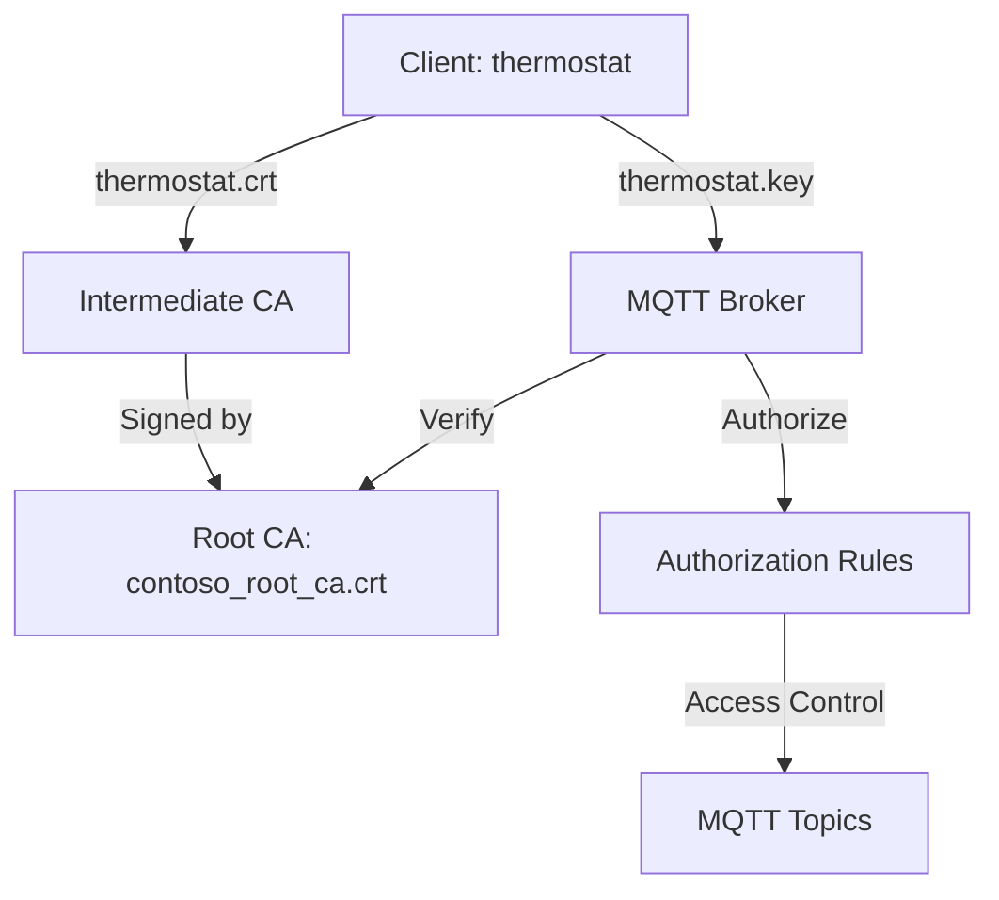

# Tutorial: TLS, X.509 client authentication, and attribute-based access control (ABAC) authorization with Azure IoT Operations MQTT broker

[!INCLUDE [kubernetes-management-preview-note](../includes/kubernetes-management-preview-note.md)]

This tutorial guides you through setting up the Azure IoT Operations MQTT broker with TLS encryption and X.509 client authentication. It includes step-by-step instructions and scripts for creating certificates for both the broker and clients. The tutorial explains how to configure the MQTT broker with different root certificate authorities (CAs) for the client and broker. It also covers setting up an attribute-based access control (ABAC) authorization policy based on the client certificate chain. Finally, the tutorial uses the Mosquito client to test various scenarios to ensure the setup works correctly.

The tutorial simulates an environment where Azure IoT Operations is installed in a Contoso factory, with devices manufactured by Fabrikam. To make TLS and X.509 authentication work:

- Azure IoT Operations MQTT broker, installed in a Contoso factory, must trust the Fabrikam root CA
- Fabrikam sensors, like thermostats, must trust the Contoso root CA
- Each entity must have its own leaf certificate issued by the correct root CA



## Prerequisites

To follow this tutorial, you need:

- Azure IoT Operations deployed without an existing load balancer listener.
- A Kubernetes cluster with port forwarding enabled for port 8883, allowing localhost access to the broker listener.
- Kubectl access to the cluster to create Kubernetes secrets and config maps.
- [Step CLI](https://smallstep.com/docs/step-cli/) to create certificates.
- [Mosquitto client](https://mosquitto.org/download/) to publish and subscribe to MQTT messages.

We recommend using the [quickstart codespace](../get-started-end-to-end-sample/quickstart-deploy.md), which already meets all these requirements. The quickstart codespace simplifies the setup process by providing these components out of the box.

Additionally, familiarity with public key cryptography and terms like root CA, private key, and intermediate certificates is useful.

## Prepare server-side certificates and full chain

First, create a server-side root CA. This CA is separate from the client-side root CA which is created later. To keep the separation clear, we name everything server side "Contoso". To make later steps easier, we skip the password for encrypting the private key. This practice is only acceptable in a tutorial setting.

```bash
step certificate create "Contoso Root CA" \
contoso_root_ca.crt contoso_root_ca.key \
--profile root-ca \
--no-password --insecure
```

Then, create an intermediate CA signed by this root CA.

```bash
step certificate create "Contoso Intermediate CA 1" \
contoso_intermediate_ca.crt contoso_intermediate_ca.key \
--profile intermediate-ca \
--ca ./contoso_root_ca.crt --ca-key ./contoso_root_ca.key \
--no-password --insecure
```

Lastly, use this intermediate CA to sign a server certificate for MQTT broker's broker frontend. Here, `localhost` is the Subject Alternative Name (SAN) used for the tutorial.

```bash
step certificate create mqtts-endpoint \
mqtts-endpoint.crt mqtts-endpoint.key \
--profile leaf \
--ca ./contoso_intermediate_ca.crt --ca-key ./contoso_intermediate_ca.key \
--bundle \
--san localhost \
--not-after 2400h --no-password --insecure
```

With the `--bundle` flag, the server certificate is bundled with the signing intermediate certificate. TLS handshake requires the bundle to verify the full chain.

> [!TIP]
> To simplify the tutorial, we use `localhost` as the Subject Alternative Name (SAN). 
> 
> If you don't have localhost port forwarding set up, [create the listener](#listener) first. Then, retrieve the external IP using `kubectl get service mqtts-endpoint -n azure-iot-operations`, and use that IP as the SAN when creating the server certificate and the secret. The broker waits for the secret to be created before fully starting the listener, so the order of operations is flexible.

## Prepare client-side certificates and full chain

Similarly, create the root CA for Fabrikam and the intermediate CA.

```bash
step certificate create --profile root-ca "Fabrikam Root CA" \
fabrikam_root_ca.crt fabrikam_root_ca.key \
--no-password --insecure
```

```bash
step certificate create "Fabrikam Intermediate CA 1" \
fabrikam_intermediate_ca.crt fabrikam_intermediate_ca.key \
--profile intermediate-ca \
--ca ./fabrikam_root_ca.crt --ca-key ./fabrikam_root_ca.key \
--no-password --insecure
```

Then, generate client certificates for a thermostat, hygrometer, heater, and lightbulb.

```bash
# Create a client certificate for the thermostat
step certificate create thermostat thermostat.crt thermostat.key \
--ca ./fabrikam_intermediate_ca.crt --ca-key ./fabrikam_intermediate_ca.key --bundle \
--not-after 2400h --no-password --insecure

# Create a client certificate for the hygrometer
step certificate create hygrometer hygrometer.crt hygrometer.key \
--ca ./fabrikam_intermediate_ca.crt --ca-key ./fabrikam_intermediate_ca.key --bundle \
--not-after 2400h --no-password --insecure

# Create a client certificate for the heater
step certificate create heater heater.crt heater.key \
--ca ./fabrikam_intermediate_ca.crt --ca-key ./fabrikam_intermediate_ca.key --bundle \
--not-after 2400h --no-password --insecure

# Create a client certificate for the lightbulb
step certificate create lightbulb lightbulb.crt lightbulb.key \
--ca ./fabrikam_intermediate_ca.crt --ca-key ./fabrikam_intermediate_ca.key --bundle \
--not-after 2400h --no-password --insecure
```

## Configure Kubernetes

Import the newly generated server certificate and private key into a Kubernetes secret. This secret is used to configure a TLS listener for MQTT broker later.

```bash
kubectl create secret tls broker-server-cert -n azure-iot-operations \
--cert mqtts-endpoint.crt \
--key mqtts-endpoint.key
```

Also, create a config map to contain the Fabrikam (client-side) root CA. This config map is required for MQTT broker to trust it for X.509 authentication.

```bash
kubectl create configmap fabrikam-ca -n azure-iot-operations \
--from-file=client_ca.pem=fabrikam_root_ca.crt
```

## Configure MQTT broker

The next steps configure the MQTT broker with TLS encryption and X.509 client authentication. The tutorial uses the Azure portal to configure the MQTT broker.

### Authentication

To allow clients to authenticate using X.509 certificates issued by the Fabrikam root CA, create an authentication policy that trusts the Fabrikam root CA certificate and maps the client certificates to authorization attributes for ABAC.

1. In the Azure portal, navigate to your IoT Operations instance.
1. Under **Components**, select **MQTT Broker**.
1. Select the **Authentication** tab.
1. Select **Create authentication policy**.
1. For **Policy name**, enter `x509-auth`.
1. Add a new method by selecting **Add method**.
1. Choose the method type **X.509** from the dropdown list then select **Add details** to configure the method.
1. In the **X.509 authentication details** pane, specify the Fabrikam trusted CA certificate ConfigMap name `fabrikam-ca` and the attributes.

    ```json
    {
      "trustedClientCaCert": "fabrikam-ca",
      "authorizationAttributes": {
        "thermostat": {
          "subject": "CN = thermostat",
          "attributes": {
            "group": "thermostat_group"
          }
        },
        "hygrometer": {
          "subject": "CN = hygrometer",
          "attributes": {
            "group": "hygrometer_group"
          }
        },
        "intermediate": {
          "subject": "CN = Fabrikam Intermediate CA 1",
          "attributes": {
            "manufacturer": "fabrikam"
          }
        }
      }
    }
    ```

1. Select **Apply** then **Add** to save the changes.

:::image type="content" source="media/tutorial-tls-and-x509/client-ca-x509.png" alt-text="Screenshot showing how to use Azure portal to create MQTT broker X.509 authentication method.":::

### Listener

With the authentication policy in place, create a listener that uses the X.509 authentication policy. Also, since X.509 authentication requires TLS, configure the listener to use the Contoso server certificate and private key created earlier.

1. In the Azure portal, navigate to your IoT Operations instance.
1. Under **Components**, select **MQTT Broker**.
1. Select **MQTT broker listener for LoadBalancer** > **Create**. Enter the following settings:

    | Setting        | Description                                                                                   |
    | -------------- | --------------------------------------------------------------------------------------------- |
    | Name           | Enter `mqtts-endpoint`.                                                          |
    | Service name   | Name of the Kubernetes service. Leave empty to use the listener name `mqtts-endpoint` as service name.         |
    | Service type   | **LoadBalancer** already selected.                                                            |

1. Under **Ports**, enter the following settings for the first port:

    | Setting        | Description           |
    | -------------- | --------------------- |
    | Port           | Enter 8883            |
    | Authentication | Choose **x509-auth**    |
    | Authorization  | Choose **None**       |
    | Protocol       | Choose **MQTT**       |
    | TLS            | Select **Add**        |

1. In the **TLS configuration** pane, enter the following settings:

    | Setting        | Description           |
    | -------------- | --------------------- |
    | TLS Mode       | Choose **Manual**  |
    | Issuer name    | Enter `broker-server-cert` |

1. Select **Apply** and **Create listener**.

:::image type="content" source="media/tutorial-tls-and-x509/broker-listener-tls.png" alt-text="Screenshot showing Azure portal method to set a listener with TLS port.":::

After a minute or two, the `mqtts-endpoint` LoadBalancer service is created. 

```console
$ kubectl get service mqtts-endpoint -n azure-iot-operations
NAME             TYPE           CLUSTER-IP     EXTERNAL-IP   PORT(S)          AGE
mqtts-endpoint   LoadBalancer   10.43.28.140   XXX.XX.X.X    8883:30988/TCP   104s
```

Instead of using the external IP, we use `localhost` for the tutorial. 

> [!TIP]
> The codespace configuration automatically sets up port forwarding for 8883. To setup other environments, use `kubectl port-forward` to forward the port.
> 
> ```bash
> kubectl port-forward svc/mqtts-endpoint 8883:8883 -n azure-iot-operations
> ```

## Use a single Mosquito client to publish messages over TLS

From the same folder as the certificate files: `contoso_root_ca.crt`, `thermostat.crt`, and `thermostat.key`, use Mosquito client to publish a message. The `--cafile contoso_root_ca.crt` flag is for Mosquito to perform server certificate verification.

```bash
mosquitto_pub -t "example/topic" -m "example temperature measurement" -i thermostat \
-q 1 -V mqttv5 -d \
-h localhost \
--key thermostat.key \
--cert thermostat.crt \
--cafile contoso_root_ca.crt
```

The publish succeeds because Mosquito uses a client certificate that is rooted in `fabrikam_root_ca.crt`. The MQTT broker trusts this certificate because the `x509-auth` authentication policy created earlier. Additionally, the MQTT broker currently allows authenticated clients to publish to any topic.

```console
Client thermostat sending CONNECT
Client thermostat received CONNACK (0)
Client thermostat sending PUBLISH (d0, q1, r0, m1, 'example/topic', ... (31 bytes))
Client thermostat received PUBACK (Mid: 1, RC:0)
Client thermostat sending DISCONNECT
```

## Configure authorization to MQTT topics for multiple clients using X.509

To restrict access to MQTT topics based on the client certificate attributes, create an authorization policy that maps the client certificate attributes to allowed actions on specific topics.

The provided command is using the `mosquitto_pub` utility to publish a message to an MQTT broker with TLS encryption and client certificate authentication. Here's a breakdown of the command and the authorization system being set up:

### Command Breakdown
- `mosquitto_pub`: The command-line utility to publish messages to an MQTT broker.
- `-t "example/topic"`: Specifies the topic to which the message is published.
- `-m "example temperature measurement"`: The message payload.
- `-i thermostat`: The client ID used to identify the publisher.
- `-q 1`: Quality of Service level 1, ensuring the message is delivered at least once.
- `-V mqttv5`: Specifies the MQTT version 5.
- `-d`: Enables debug mode for detailed output.
- `-h localhost`: The hostname of the MQTT broker.
- `--key thermostat.key`: The client's private key file.
- `--cert thermostat.crt`: The client's certificate file.
- `--cafile contoso_root_ca.crt`: The CA certificate file to verify the broker's certificate.

### Authorization System
1. **Certificates Created**:
   - **Client Certificate (thermostat.crt)**: Issued to the client (thermostat) and signed by an intermediate CA.
   - **Client Private Key (thermostat.key)**: Corresponding private key for the client certificate.
   - **Intermediate CA Certificate**: Signed by the root CA, used to sign client certificates.
   - **Root CA Certificate (contoso_root_ca.crt)**: The trusted root certificate used to verify the chain of trust.

2. **Attributes Mapping**:
   - **Client Certificate Attributes**: Includes details like Common Name (CN), Organization (O), and Organizational Unit (OU) that can be used for authorization.
   - **Intermediate CA**: Ensures that client certificates are issued by a trusted entity.

3. **Authorization Rules**:
   - The MQTT broker uses the client certificate to authenticate the client.
   - The broker verifies the certificate chain up to the root CA.
   - Authorization rules can be defined based on certificate attributes (e.g., CN, O, OU) to control access to specific topics.

### Mermaid Diagram


### Explanation
1. The client (thermostat) uses its certificate (`thermostat.crt`) and private key (`thermostat.key`) to authenticate with the MQTT broker.
2. The broker verifies the client's certificate against the intermediate CA, which is in turn verified against the root CA (`contoso_root_ca.crt`).
3. The broker applies authorization rules based on the client's certificate attributes to control access to MQTT topics.

This setup ensures secure communication and controlled access to the MQTT broker using TLS and client certificate authentication.

1. In the Azure portal, navigate to your IoT Operations instance.
1. Under **Components**, select **MQTT Broker**.
1. Select the **Authorization** tab.
1. Select **Create authorization policy**.
1. For **Policy name**, enter `abac-authz`.
1. Under **Rules**, enter the following rules:

    ```json
    [
      {
        "principals": {
          "attributes": [
            {
              "group": "thermostat_group"
            }
          ]
        },
        "brokerResources": [
          {
            "method": "Connect"
          },
          {
            "method": "Publish",
            "topics": [
              "telemetry/temperature"
            ]
          }
        ]
      },
      {
        "principals": {
          "attributes": [
            {
              "group": "hygrometer_group"
            }
          ]
        },
        "brokerResources": [
          {
            "method": "Connect"
          },
          {
            "method": "Publish",
            "topics": [
              "telemetry/humidity"
            ]
          }
        ]
      },
      {
        "principals": {
          "attributes": [
            {
              "manufacturer": "fabrikam"
            }
          ]
        },
        "brokerResources": [
          {
            "method": "Connect"
          },
          {
            "method": "Publish",
            "topics": [
              "health/heartbeat"
            ]
          }
        ]
      },
      {
        "principals": {
          "usernames": [
            "heater"
          ]
        },
        "brokerResources": [
          {
            "method": "Connect"
          },
          {
            "method": "Subscribe",
            "topics": [
              "telemetry/temperature",
              "telemetry/humidity"
            ]
          }
        ]
      }
    ]
    ```
    
1. Select **Add** to save the changes.

:::image type="content" source="media/tutorial-tls-and-x509/abac-authz.png" alt-text="Screenshot showing Azure portal for setting up an authorization policy.":::

Then, update the MQTT broker listener to use the new authorization policy.

1. Select the **Listeners** tab.
1. Select the **mqtts-endpoint** listener.
1. Under **Ports** > **8883** > **Authorization**, choose **abac-authz**.
1. Select **Save**.

:::image type="content" source="media/tutorial-tls-and-x509/link-port-to-authz.png" alt-text="Screenshot showing Azure portal for linking a port to an authorization policy.":::

## Publish messages to a restricted topic

In this section, we test out the newly applied authorization policies.

First, connect with `thermostat` and try to publish on topic `telemetry/humidity`:

```bash
mosquitto_pub -t "telemetry/humidity" -m "example temperature measurement" -i thermostat \
-q 1 -V mqttv5 -d \
-h localhost \
--key thermostat.key \
--cert thermostat.crt \
--cafile contoso_root_ca.crt
```

Since `thermostat` is part of `thermostat_group`, which isn't allowed to publish to the humidity topic, the publish fails.

```console {hl_lines=5}
Client thermostat sending CONNECT
Client thermostat received CONNACK (0)
Client thermostat sending PUBLISH (d0, q1, r0, m1, 'telemetry/humidity', ... (6 bytes))
Client thermostat received PUBACK (Mid: 1, RC:135)
Warning: Publish 1 failed: Not authorized.
```

Change to publish to `telemetry/temperature`, which is allowed and the publish succeeds. Leave the command running.

```bash
mosquitto_pub -t "telemetry/temperature" -m "example temperature measurement" -i thermostat \
-q 1 -V mqttv5 -d \
-h localhost \
--repeat 10000 \
--repeat-delay 3 \
--key thermostat.key \
--cert thermostat.crt \
--cafile contoso_root_ca.crt
```

## Subscribe to messages on restricted topics

In a separate terminal session, connect with `heater` to subscribe to `health/heartbeat`.

```bash
mosquitto_sub -q 1 -t "health/heartbeat" -d -V mqttv5 \
-i heater \
-h localhost \
--key heater.key \
--cert heater.crt \
--cafile contoso_root_ca.crt
```

Since `heater` is not authorized to subscribe to the heartbeat topic, the subscription fails. Here, code 135 means [not authorized](https://docs.oasis-open.org/mqtt/mqtt/v5.0/mqtt-v5.0.html#_Toc471483680:~:text=not%20accept%20it.-,135,The%20Client%20is%20not%20authorized%20to%20make%20this%20subscription.,-143).

```text {hl_Lines="5"}
Client heater sending CONNECT
Client heater received CONNACK (0)
Client heater sending SUBSCRIBE (Mid: 1, Topic: health/heartbeat, QoS: 1, Options: 0x00)
Client heater received SUBACK
Subscribed (mid: 1): 135
```

Switch the subscription topic to `telemetry/temperature`, which `thermostat` is still sending messages to.

```bash
mosquitto_sub -q 1 -t "telemetry/temperature" -d -V mqttv5 \
-i heater \
-h localhost \
--key heater.key \
--cert heater.crt \
--cafile contoso_root_ca.crt
```

Now `heater` starts to receive messages because it's authorized with its [username](./howto-configure-authorization.md#using-username-for-authorization).

In *another* separate terminal session, publish messages to `health/heartbeat` with `lightbulb`:

```bash
mosquitto_pub -q 1 -t "health/heartbeat" -m "example heartbeat" -d -V mqttv5 \
-i lightbulb \
-h localhost \
--repeat 100 \
--repeat-delay 3 \
--key lightbulb.key \
--cert lightbulb.crt \
--cafile contoso_root_ca.crt
```

The publish succeeds because `lightbulb` has an intermediate certificate with `CN = Fabrikam Intermediate CA 1`, which is mapped to the attribute `manufacturer=fabrikam`. Clients with that attribute can publish on `health/heartbeat`. When the client starts sending messages, `heater` started earlier doesn't receive anything.

## Clean up resources

To clean up the resources created in this tutorial, delete the listener and the authentication and authorization policies.

1. In the Azure portal, navigate to your IoT Operations instance.
1. Under **Components**, select **MQTT Broker**.
1. Select the **Listeners** tab.
1. Select the checkbox next to **mqtts-endpoint** listener.
1. Select **Delete**.
1. Confirm the deletion.
1. Select the **Authentication** tab.
1. Select the checkbox next to **x509-auth**.
1. Select **Delete**.
1. Confirm the deletion.
1. Select the **Authorization** tab.
1. Select the checkbox next to **abac-authz**.
1. Select **Delete**.
1. Confirm the deletion.

Also, delete the Kubernetes secret and config map.

```bash
kubectl delete secret broker-server-cert -n azure-iot-operations
kubectl delete configmap fabrikam-ca -n azure-iot-operations
```

Finally, delete the certificates and keys generated earlier.

```bash
rm contoso_root_ca.crt contoso_root_ca.key contoso_intermediate_ca.crt contoso_intermediate_ca.key mqtts-endpoint.crt mqtts-endpoint.key
rm fabrikam_root_ca.crt fabrikam_root_ca.key fabrikam_intermediate_ca.crt fabrikam_intermediate_ca.key thermostat.crt thermostat.key hygrometer.crt hygrometer.key heater.crt heater.key lightbulb.crt lightbulb.key
````