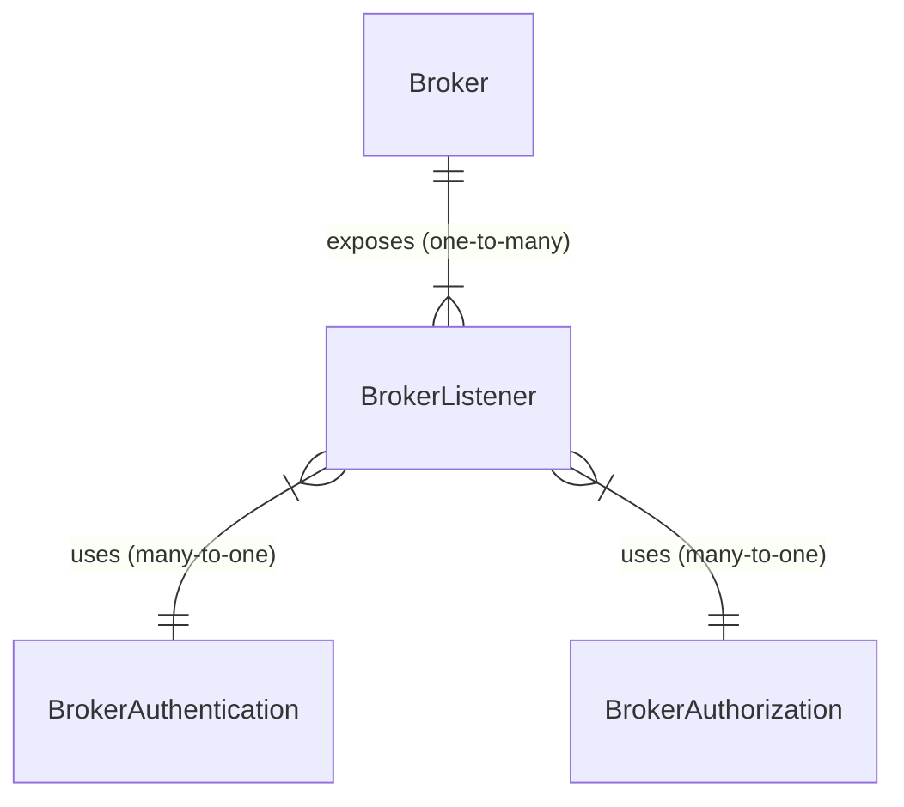

# Publish and subscribe MQTT messages using Azure IoT MQ

<!-- 2. Overview ------------------------------------------------------------------------

Required: Lead with an overview that briefly describes what the feature does. Provide
links to more detailed information about the feature. Consider including a video or
image that provides a high-level view of how the feature works.

-->

Azure IoT MQ is a distributed MQTT broker that provides the messaging pipeline for Azure IoT Operations. It's a set of Kubernetes services that aggregates data from on-premises assets, provides highly available edge compute, and enables bi-directional data flow with a variety of services in the cloud.

<!-- 3. Use cases -----------------------------------------------------------------------

Optional: List a few key scenarios that you can use the feature in.

-->

## Use cases
TODO: Add use cases

<!-- 4. Article body --------------------------------------------------------------------

Required: In a series of H2 sections, provide basic information about how the feature
works. Consider including:

- A *Requirements* section. List the software, networking components, tools, and
product or service versions that you need to run the feature.
- A *Considerations* section. Explain which configuration settings to use to optimize
feature performance.
- Examples. Show practical ways to use the feature, or provide code for implementing
the feature.

-->

## Messaging layer

- Supports publish-subscribe semantics and [event-driven application architecture](/azure/architecture/guide/architecture-styles/event-driven)
- Seamlessly integrates up to tens of thousands of downstream IoT devices
- Configurable to work offline for up to months at a time
- Highly efficient and tunable resource consumption
- Minimal dependencies and operationally simple
- Fully standards-compliant and using industry standards
- Secure bi-directional edge and cloud data plane with an optional remote control plane
- In-depth observability and mature tooling for self-help troubleshooting

## MQTT compliant

Message Queue Telemetry Transport (MQTT) has emerged as the *lingua franca* among protocols in the IoT space. MQTT's simple design allows a single broker to serve tens of thousands of clients simultaneously, with a lightweight publish-subscribe topic creation and management.

Azure IoT MQ uses the [MQTT](https://mqtt.org/) protocol as the underpinning for the messaging layer.

Many IoT devices support MQTT natively out-of-the-box, with the long tail of IoT protocols being rationalized into MQTT by downstream translation gateways.

Azure IoT MQ features a fully standards-compliant MQTT Broker that supports both MQTT 3.1.1 and MQTT 5. 

## Highly available and scalable

Kubernetes can horizontally scale workloads to run in multiple instances. This redundancy means additional capacity to serve requests and reliability in case any instance goes down. Kubernetes has self-healing built in, and instances are recovered automatically.

In addition to Kubernetes being an elastic scaling technology, it's also a standard for DevOps. If MQTT is the lingua franca among IoT protocols, Kubernetes is the lingua franca for computing infrastructure layer. By adopting Kubernetes, you can use the same CI/CD pipeline, tools, monitoring, app packaging, employee skilling everywhere. The result is a single end-to-end system from cloud computing, on-premises servers, and smaller IoT-class devices on the factory floor. You can spend less time dealing with infrastructure or DevOps and focus on your business.

Azure IoT MQ focuses on the unique edge-native, data-plane value it can provide to the K8s ecosystem while fitting seamlessly into it. It brings high performance and scalable messaging platform plane built around MQTT, and seamless integration to other scalable Kubernetes workloads and Azure.

## Azure Arc integration

Microsoft's hybrid platform is anchored around Kubernetes with Azure Arc as a single control plane. It provides a management plane that projects existing non-Azure, on-premises, or other-cloud resources into Azure Resource Manager. The result is a single control pane to manage virtual machines, Kubernetes clusters, and databases not running in Azure data centers.

[Azure Arc diagram]

Azure Arc supports deploying native Kubernetes resources via an open-source technology called Flux which uses a GitOps deployment paradigm. This mechanism can be used to deploy and manage Azure IoT MQ just like any other Kubernetes workload. Azure IoT MQ invests in deeper Arc integration in the form of an **Azure IoT MQ Arc extension** that allows customers to deploy and manage the Azure IoT MQ runtime using native Azure Resource Manager gestures. Workload modules can continue to be deployed via GitOps.

## Cloud connectors

You may have different messaging requirements for your cloud scenario. For example, IoT Hub supports three different protocols and provides SDKs that work with extremely constrained devices. Alternately, Event Hubs provides a simpler messaging solution at a lower cost. You may use Kafka as a solution because you want portability between cloud providers. There isn't one cloud messaging platform today.

To provide flexibility, Azure IoT MQ provides Azure Connectors to Event Hubs, IoT Hub, and the Azure IoT MQ component. IoT MQ is extensible so that you can choose your preferred cloud messaging solution that works with your solution.

## Offline operation

You may operate edge computing in remote locations. For example, you may operate an ocean-going vessel, offshore oil rigs, and even satellites using Azure Space SDK. Cloud connectivity at these locations is unreliable, intermittent, and expensive. You must rely on your edge computing infrastructure to reliably act on real-time data. For example, recognizing a crack in a pipe from an aerial view or predicting equipment failure before it happens.

Azure IoT has extended offline support provides store-and-forward capability to messages received from clients that are meant for the cloud. Also, it facilitates communication between clients and enforces access control without any cloud connectivity. It offers dashboards and a user interface simplified local operation like the [Kubernetes local UI](https://kubernetes.io/docs/tasks/access-application-cluster/web-ui-dashboard/) and troubleshooting via industry-standard tools like [Prometheus and Grafana](https://www.rabbitmq.com/prometheus.html). Azure IoT MQ doesn't require connection to the internet if you choose.

## Dapr programming model

[Dapr](https://dapr.io/) simplifies *plumbing* between distributed applications by exposing common distributed application capabilities, such as state management, service-to-service invocation, and publish-subscribe messaging. Dapr components lie beneath the building blocks and provide the concrete implementation for each capability. Customers can focus on business logic and let Dapr handle distributed application details.

[Dapr publish-subscribe stack]

Azure IoT MQ provides a Dapr publish-subscribe building block that you can use the sidecar to swap a different broker directly to Azure IoT MQ's MQTT broker with no code changes. For example, you could switch to the Mosquito broker.

## Custom authentication

Azure IoT MQ provides an extensible interface for custom authentication for downstream devices connecting to the cluster. You can use different authentication methods starting from username and password to X.509 authentication. You can choose the authentication method based on your scenario.

## Secure by default

Azure IoT MQ offers a centralized method for authorization using role and attribute-based access control (RBAC/ABAC). You can define policies like *allow all devices on floor 2 to publish to the temperature topic* and avoid additional management since the evaluation is dynamic. You can sync these policies with Azure RBAC/ABAC.

## Architecture

The MQTT broker has three layers: 

- Stateless front-end layer that handles client requests
- Load-balancer that routes requests and connects the broker to others
- Stateful and sharded back-end layer that stores and processes data

The back-end layer partitions data by different keys, such as client ID for client sessions, and topic name for topic messages. It uses chain replication to replicate data within each partition. For data that's shared by all partitions, it uses a single chain that spans all the partitions.

[Architecture diagram]

- **Fault tolerance and isolation**: Message publishing continues if back-end nodes fail and prevents failures from propagating to the rest of the system
- **Failure recovery**: Automatic failure recovery without operator intervention
- **No message loss**: Delivery of messages if at least one front-end node and one back-end node is running
- **Elastic scaling**: Horizontal scaling of publishing and subscribing throughput to support edge and cloud deployments
- **Consistent performance at scale**: Limit message latency overhead due to chain-replication
- **Operational simplicity**: Minimum dependency on external components to simplify maintenance and complexity

## Configuration using custom resource definitions (CRDs)

IoT MQ distributed MQTT broker is composed of several Kubernetes custom resources that define different aspects of the broker's behavior and functionality.

- The main custom resource is broker, which defines the global settings for the broker, such as the name, namespace, cardinality, and diagnostic settings.
- A broker resource can expose one or more *BrokerListener* resources associated with it, which define the port and TLS settings for each listener. A listener is a network endpoint that accepts MQTT connections from clients.
- Each *BrokerListener* can have up to one *BrokerAuthentication* and *BrokerAuthorization*. They determine which clients can connect to the listener and what actions they can perform on the broker. Multiple *BrokerListeners* can have the same *BrokerAuthentication* or *BrokerAuthorization*, but not the inverse.

The association between the custom resources is done by specifying the **name** of the parent resource with `brokerRef` or `listenerRef` fields in the child resource's spec.

<!-- 5. Availability and pricing information --------------------------------------------

Optional: Discuss the feature's availability and pricing.

- If the feature isn't available in all regions, provide a link to a list of supported
regions.
- If customers are charged for using the feature, provide a link to pricing information.

Don't hard-code specific regions or costs. Instead, provide links to sites that manage
and maintain that information.

--->

[Availability and pricing information]
TODO: Add your availability and pricing information

<!-- 6. Limitations ---------------------------------------------------------------------

Optional: List the feature's constraints, limitations, and known issues in an H2
section. If possible, also include the following information:

- State that upcoming releases address the known issues.
- Describe workarounds for limitations.
- Discuss the environments that the feature works best in.

Use an H2 header of *Limitations* or *Known issues.*

--->

## Limitations
TODO: Add your Limitations

<!-- 7. Next steps ----------------------------------------------------------------------

Optional: In an H2 section called *Next steps*, list resources such as the following
types of material:

- A quickstart, get-started guide, or tutorial that explains how to get started with the
feature
- An overview of the product or service that the feature's a part of
- Reference information for the feature, product, or service

--->

## Next steps
TODO: Add your next steps