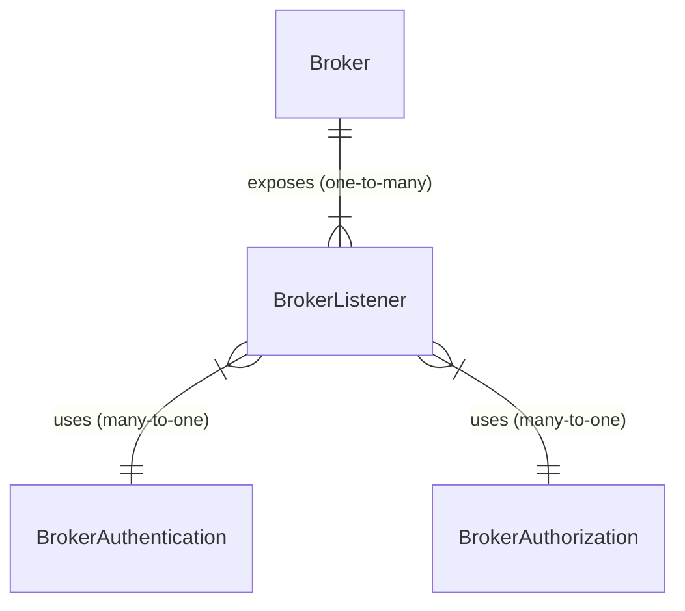

# What is Azure IoT MQ

<!-- 2. Overview ------------------------------------------------------------------------

Required: Lead with an overview that briefly describes what the feature does. Provide
links to more detailed information about the feature. Consider including a video or
image that provides a high-level view of how the feature works.

-->

Azure IoT MQ is a distributed MQTT broker that provides the messaging pipeline for Azure IoT Operations. It's a set of Kubernetes services that aggregates data from on-premises assets, provides highly available edge compute, and enables bi-directional data flow with a variety of services in the cloud.

<!-- 3. Use cases -----------------------------------------------------------------------

Optional: List a few key scenarios that you can use the feature in.

-->

## Use cases
TODO: Add use cases

<!-- 4. Article body --------------------------------------------------------------------

Required: In a series of H2 sections, provide basic information about how the feature
works. Consider including:

- A *Requirements* section. List the software, networking components, tools, and
product or service versions that you need to run the feature.
- A *Considerations* section. Explain which configuration settings to use to optimize
feature performance.
- Examples. Show practical ways to use the feature, or provide code for implementing
the feature.

-->

## Messaging layer
IoT-focused and edge-optimized

## MQTT compliant
MQTT specification compliance
Support for MQTT 3.1.1 and 5.0

## Highly available and scalable
Native Kubernetes integration

## Azure Arc integration
Remote management

## Cloud connectors
Azure Connectors for bi-directional cloud and edge communication

## Offline operation
Support for intermittent cloud connectivity or fully offline operation

## Dapr programming model

## Custom authentication
for connecting external IoT devices

## Secure by default
with flexible attribute-based access control

[Architecture diagram]

The MQTT broker has three layers: 

- Stateless front-end layer that handles client requests
- Load-balancer that routes requests and connects the broker to others
- Stateful and sharded back-end layer that stores and processes data

The back-end layer partitions data by different keys, such as client id for client sessions, and topic name for topic messages. It uses chain replication to replicate data within each partition. For data that's shared by all partitions, it uses a single chain that spans all the partitions.

- **Fault tolerance and isolation**: Message publishing continues if back-end nodes fail and prevents failures from propagating to the rest of the system
- **Failure recovery**: Automatic failure recovery without operator intervention
- **No message loss**: Delivery of messages if at least one front-end node and one back-end node is running
- **Elastic scaling**: Horizontal scaling of publishing and subscribing throughput to support edge and cloud deployments
- **Consistent performance at scale**: Limit message latency overhead due to chain-replication
- **Operational simplicity**: Minimum dependency on external components to simplify maintenance and complexity

## Configuration using custom resource definitions (CRDs)

IoT MQ distributed MQTT broker is composed of several Kubernetes custom resources that define different aspects of the broker's behavior and functionality.

- The main custom resource is [broker](), which defines the global settings for the broker, such as the name, namespace, cardinality, and diagnostic settings.
- A broker resource can expose one or more [BrokerListener]() resources associated with it, which define the port and TLS settings for each listener. A listener is a network endpoint that accepts MQTT connections from clients.
- Each *BrokerListener* can have up to one [BrokerAuthentication]() and [BrokerAuthorization](). They determine which clients can connect to the listener and what actions they can perform on the broker. Multiple *BrokerListeners* can have the same *BrokerAuthentication* or *BrokerAuthorization*, but not the inverse.

The association between the custom resources is done by specifying the **name** of the parent resource with `brokerRef` or `listenerRef` fields in the child resource's spec.

<!-- 5. Availability and pricing information --------------------------------------------

Optional: Discuss the feature's availability and pricing.

- If the feature isn't available in all regions, provide a link to a list of supported
regions.
- If customers are charged for using the feature, provide a link to pricing information.

Don't hard-code specific regions or costs. Instead, provide links to sites that manage
and maintain that information.

--->

[Availability and pricing information]
TODO: Add your availability and pricing information

<!-- 6. Limitations ---------------------------------------------------------------------

Optional: List the feature's constraints, limitations, and known issues in an H2
section. If possible, also include the following information:

- State that upcoming releases address the known issues.
- Describe workarounds for limitations.
- Discuss the environments that the feature works best in.

Use an H2 header of *Limitations* or *Known issues.*

--->

## Limitations
TODO: Add your Limitations

<!-- 7. Next steps ----------------------------------------------------------------------

Optional: In an H2 section called *Next steps*, list resources such as the following
types of material:

- A quickstart, get-started guide, or tutorial that explains how to get started with the
feature
- An overview of the product or service that the feature's a part of
- Reference information for the feature, product, or service

--->

## Next steps
TODO: Add your next steps