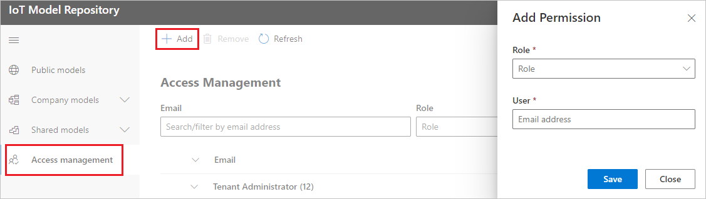
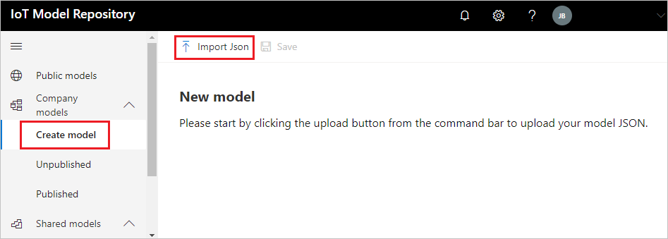
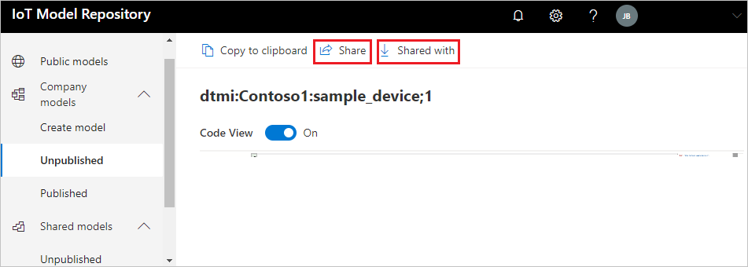
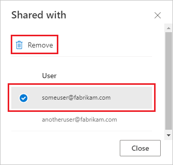
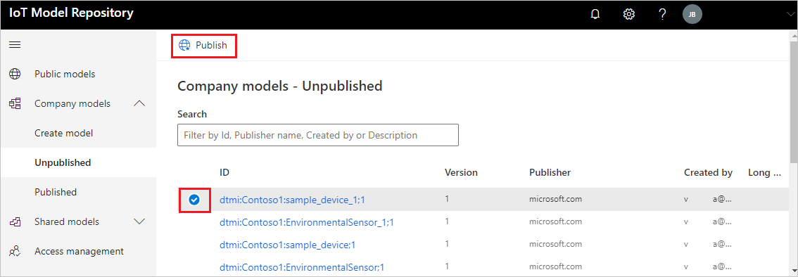

# Manage models in the repository

The Azure IoT Model Repository stores the interfaces that define and compose models. The model repository makes the models and interfaces discoverable and consumable by solution developers.

You use the [Azure IoT Model Repository portal](https://aka.ms/iotmodelrepo) to manage models in the repository.  

## Public and Private models

Interfaces can be public or private.

Private interfaces are maintained by your company. Access to private interfaces is controlled through role-based access control (RBAC) both on your organization's Azure AD tenant and on individual interfaces. Tenant roles determine who can create and publish interfaces in your organization. Roles on individual interfaces allow the creator of a private interface to share it with a limited audience of your partners.

Once an interface has been published, it is public. Public interfaces are available through anonymous authentication and can be read by any user or service principal. The [common interfaces](./concepts-common-interfaces.md) published by Microsoft are examples of public interfaces.

For an overview of the model repository including RBAC, see [Understand the Azure IoT Model Repository](concepts-model-repository.md).

## Model repository sign-in

Use your Microsoft _work account_ to sign in to the [Azure IoT Model Repository portal](https://aka.ms/iotmodelrepo). The portal checks your membership with the Microsoft Partner Center when you sign in:

- If you're the first user from your organization to sign in to the portal, you're granted the _Tenant Administrator_ role. This role allows you to assign roles to other users in your company (Azure Active Directory tenant).
- If you're not the first user from your organization to sign in to the portal, you're granted _ReadTenantModels_ permission. This enables you to read your company's interfaces as well as all public interfaces. You can be assigned other roles by a _Tenant Administrator_.
- If your organization isn't a member of the [Microsoft Partner Center](https://docs.microsoft.com/partner-center/), you can't publish your models.
- If you see a notification message that your Microsoft Partner Network ID is missing, you should [create a Partner Center account](https://docs.microsoft.com/partner-center/mpn-create-a-partner-center-account). When your account is approved, you can return to the portal and publish your models. For more information, see the [Partner Center FAQ](https://support.microsoft.com/help/4340639/partner-center-account-faqs).

## Manage tenant roles

 By default, users can read their company's private interfaces, interfaces that have been shared with them by other companies, and all public interfaces. Tenant administrators can add users to tenant roles so that they can create private interfaces, publish private interfaces, or manage roles for other users.

To add a user to a tenant role:

1. Sign-in to the [Azure IoT Model Repository portal](https://aka.ms/iotmodelrepo).

2. Select **Access management** on the left pane, then select **+Add**. On the **Add Permission** pane, type the work address of the user you want to add to the role.

    

3. Choose the role you want to add the user to from the **Role** dropdown. Then select **Save**.

    

## Create an interface

To create an interface in the model repository, you must be a member of the tenant  _Creator_ role.

1. Sign-in to the [Azure IoT Model Repository portal](https://aka.ms/iotmodelrepo).

2. Expand **Company Models** on the left pane and select **Create model**. Then select **Import Json**.

    

3. Select the file you want to upload. If the portal successfully validates your interface, select **Save**.

## Share a private interface

You can share private interfaces that you have created with external users. In this way, you can allow your partners to view and develop solutions with your private interfaces.

If you're the creator of an interface, the **Share** and **Shared with** buttons will be active when you view the interface in your Company models.

- To share the interface with an external user, select **Share**. In the **Share model** pane, enter the email address of the external user and select **Save**.

- To see the users who you have shared the model with, select **Shared with**.

- To stop sharing the interface with a specific user, select the user from the list of users on the **Shared with** pane. Then select **Remove** and confirm your choice when prompted.

    

## Publish an interface

To publish an interface, you must be a member of the tenant _Publisher_ role.

1. Sign-in to the [Azure IoT Model Repository portal](https://aka.ms/iotmodelrepo).

2. Expand **Company Models** on the left pane and select the interface you want to publish. Then select **Publish**.

    

    > [!NOTE]
    > If you get a notification saying that that you don't have a Microsoft Partner (MPN) ID, follow the registration steps in the notification. For more information, see [Model repository sign-in](#model-repository-sign-in).

## Next steps

The suggested next step is to review the [IoT Plug and Play architecture](concepts-architecture.md).
