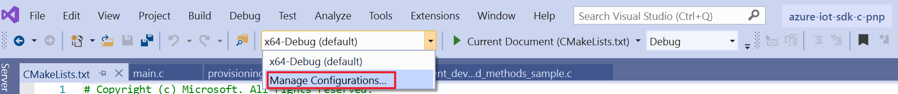

# Use Azure IoT Device Workbench extension in Visual Studio Code

The Azure IoT Device Workbench Visual Studio Code extension provides an integrated environment to author device capability models (DCM) and interfaces, publish to model repositories, and generate skeleton C code to implement the device application.

This article shows you how to:

- Generate device code and application project.
- Use the generated code in your device project.
- Iterate by regenerating the skeleton code.

To learn more about using the Device Workbench extension to develop IoT devices, see [https://github.com/microsoft/vscode-iot-workbench](https://github.com/microsoft/vscode-iot-workbench).

## Prerequisites

Install [Visual Studio Code](https://code.visualstudio.com/).

Use the following steps to install the extension in VS Code.

1. In VS Code, select **Extensions** tab.
1. Search for and install **Azure IoT Device Workbench** from the marketplace.

## Generate device code and project

In VS Code, use **Ctrl+Shift+P** to open the command palette, enter **IoT Plug and Play**, and select **Generate Device Code Stub** to configure the skeleton code and project type. The following list describes each step in detail:

- **DCM file to be used for generating the code**. To generate the skeleton device code, open the folder that contains the DCM and interface files it implements. If the code generator can't find an interface that a DCM requires, it downloads it from the model repository as needed.

- **Device code language**. Currently, the code generator only supports ANSI C.

- **Project name**. The project name is used as the folder name for the generated code and other project files. The folder is, by default, placed next to the DCM file. To avoid having to manually copy the generated code folder whenever you update your DCM and regenerate the device code, keep your DCM file in the same folder as the project folder.

- **Project type**. The code generator also generates a project file so that you can integrate the code into your own project or into the device SDK project. Currently, the supported project types are:

    - **CMake Project**: for a device project that uses [CMake](https://cmake.org/) as build system. This option generates a `CMakeLists.txt` file in the same folder as the C code.
    - **MXChip IoT DevKit project**: for a device project that runs on an [MXChip IoT DevKit](https://aka.ms/iot-devkit) device. This option generates an Arduino project that you can [use in VS Code](https://docs.microsoft.com/azure/iot-hub/iot-hub-arduino-iot-devkit-az3166-get-started) or in the Arduino IDE to build and run on an IoT DevKit device.

- **Method to connect to Azure IoT**. The generated files also contain code to configure the device to connect to Azure IoT Hub. You can choose to connect directly to [Azure IoT Hub](https://docs.microsoft.com/azure/iot-hub) or use the [Device Provisioning Service](https://docs.microsoft.com/azure/iot-dps).

    - **Via IoT Hub device connection string**: specify the device connection string for the device application to connect to IoT Hub directly.
    - **Via DPS symmetric key**: specify the **Scope ID**, **Registration ID**, and **SaS Key** for the device application that are required to connect to IoT Hub or IoT Central using DPS.

The code generator tries to use DCM and interface files located in the local folder. If the interface files aren't in the local folder, the code generator looks for them in the public model repository or company model repository. [Common interface files](./concepts-common-interfaces.md) are stored in the public model repository.

After code generation finishes, the extension opens a new VS Code window with the code. If you open a generated file such as **main.c**, you may find that IntelliSense reports that it can't open the C SDK source files. To enable the correct IntelliSense and code navigation, use the following steps to include the C SDK source:

1. In VS Code, use **Ctrl+Shift+P** to open the command palette, type and select **C/C++: Edit Configurations (JSON)** to open the **c_cpp_properties.json** file.

1. Add the path of the device SDK in the `includePath` section:

    ```json
    "includePath": [
        "${workspaceFolder}/**",
        "{path_of_device_c_sdk}/**"
    ]
    ```

1. Save the file.

## Use the generated code

The following instructions describe how to use the generated code in your own device project on different development machine platforms. The instructions assume you're using an IoT Hub device connection string with the generated code:

### Linux

To build the device code together with the device C SDK using CMake in a Linux environment such as Ubuntu or Debian:

1. Open a terminal application.

1. Install **GCC**, **Git**, `cmake`, and all dependencies using the `apt-get` command:

    ```sh
    sudo apt-get update
    sudo apt-get install -y git cmake build-essential curl libcurl4-openssl-dev libssl-dev uuid-dev
    ```

    Verify the version of `cmake` is above **2.8.12** and the version of **GCC** is above **4.4.7**.

    ```sh
    cmake --version
    gcc --version
    ```

1. Clone the [Azure IoT C SDK](https://github.com/Azure/azure-iot-sdk-c) repository:

    ```sh
    git clone https://github.com/Azure/azure-iot-sdk-c --recursive -b public-preview
    ```

    You should expect this operation to take several minutes to complete.

1. Copy the folder that contains the generated code into the device SDK root folder.

1. In VS Code, open the `CMakeLists.txt` file in the device SDK root folder.

1. Add the following line at the end of the `CMakeLists.txt` file to include the device code stub folder when you compile the SDK:

    ```txt
    add_subdirectory({generated_code_folder_name})
    ```

1. Create a folder called `cmake` in the device SDK root folder, and navigate to that folder.

    ```sh
    mkdir cmake
    cd cmake
    ```

1. Run the following commands to use CMake to build the device SDK and the generated code stub:

    ```cmd\sh
    cmake -Duse_prov_client=ON -Dhsm_type_symm_key:BOOL=ON ..
    cmake --build .

1. After the build succeeds, run the application specifying the IoT Hub device connection string as parameter.

    ```cmd\sh
    cd azure-iot-sdk-c/cmake/{generated_code_folder_name}/
    ./{generated_code_project_name} "[IoT Hub device connection string]"
    ```

### Windows

To build the device code together with the device C SDK on Windows using CMake and the Visual Studio C/C++ compilers at the command line, see the [IoT Plug and Play quickstart](./quickstart-create-pnp-device.md). The following steps show you how to build the device code together with the device C SDK as CMake project in Visual Studio.

1. Install [Visual Studio 2019 (Community, Professional, or Enterprise)](https://visualstudio.microsoft.com/downloads/) - make sure that you include the **NuGet package manager** component and the **Desktop Development with C++** workload.

1. Open Visual Studio, and on the **Get Started** page select **Clone or check out code**:

1. In **Repository location**, clone the [Azure IoT C SDK](https://github.com/Azure/azure-iot-sdk-c) repository:

    ```txt
    https://github.com/Azure/azure-iot-sdk-c
    ```

    You should expect this operation to take several minutes to complete, you can see the progress in the **Team Explorer** pane.

1. Open **azure-iot-sdk-c** repository in the **Team Explorer**, select **Branches**, search for **public-preview** branch and check it out.

    

1. Copy the folder that contains the generated code into the device SDK root folder.

1. Open the `azure-iot-sdk-c` folder in VS.

1. Open the `CMakeLists.txt` file in the device SDK root folder.

1. Add the following line at the end of the `CMakeLists.txt` file to include the device code stub folder when you compile the SDK:

    ```txt
    add_subdirectory({generated_code_folder_name})
    ```

1. In the **General** toolbar, find the **Configurations** dropdown. Select **Manage Configuration** to add the CMake setting for your project.

    

1. In the **CMake Settings**, add a new configuration and select **x64-Release** as target.

1. In **CMake Command Arguments**, add following line:

    ```txt
    -Duse_prov_client=ON -Dhsm_type_symm_key:BOOL=ON
    ```

1. Save the file.

1. In the **Solution Explorer**, right-click on the `CMakeLists.txt` in the root folder, and select **Build** from the context menu to build the device SDK and the generated code stub.

1. After the build succeeds, at the command prompt, run the application specifying the IoT Hub device connection string as a parameter.

    ```cmd
    cd %USERPROFILE%\CMakeBuilds\{workspaceHash}\build\x64-Release\{generated_code_folder_name}\
    {generated_code_project_name}.exe "[IoT Hub device connection string]"
    ```

> [!TIP]
> To learn more about using CMake in Visual Studio, see [Build CMake project](https://docs.microsoft.com/cpp/build/cmake-projects-in-visual-studio?view=vs-2019#building-cmake-projects) .

### macOS

The following steps show you how to build the device code together with the device C SDK on macOS using CMake:

1. Open terminal application.

1. Use [Homebrew](https://homebrew.sh) to install all the dependencies:

    ```bash
    brew update
    brew install git cmake pkgconfig openssl ossp-uuid
    ```

1. Verify that [CMake](https://cmake.org/) is at least version **2.8.12**:

    ```bash
    cmake --version
    ```

1. [Patch CURL](https://github.com/Azure/azure-iot-sdk-c/blob/master/doc/devbox_setup.md#upgrade-curl-on-mac-os) to the latest version available.

1. Clone the [Azure IoT C SDK](https://github.com/Azure/azure-iot-sdk-c) repository:

    ```bash
    git clone https://github.com/Azure/azure-iot-sdk-c --recursive -b public-preview
    ```

    You should expect this operation to take several minutes to complete.

1. Copy the folder that contains the generated code into the device SDK root folder.

1. In VS Code, open the `CMakeLists.txt` file in the device SDK root folder.

1. Add the following line at the end of the `CMakeLists.txt` file to include the device code stub folder when you compile the SDK:

    ```txt
    add_subdirectory({generated_code_folder_name})
    ```

1. Create a folder called `cmake` in the device SDK root folder, and navigate to that folder.

    ```bash
    mkdir cmake
    cd cmake
    ```

1. Run the following commands to use CMake to build the device SDK and the generated code stub:

    ```bash
    cmake -Duse_prov_client=ON -Dhsm_type_symm_key:BOOL=ON -DOPENSSL_ROOT_DIR:PATH=/usr/local/opt/openssl ..
    cmake --build .

1. After the build succeeds, run the application specifying the IoT Hub device connection string as parameter.

    ```bash
    cd azure-iot-sdk-c/cmake/{generated_code_folder_name}/
    ./{generated_code_project_name} "[IoT Hub device connection string]"
    ```

## Iterate by regenerating the skeleton code

The code generator can regenerate the code if you update your DCM or interface files. Assuming you already generated your device code from a DCM file, to regenerate the code:

1. With the folder with DCM files open, use **Ctrl+Shift+P** to open the command palette, enter **IoT Plug and Play**, and select **Generate Device Code Stub**.

1. Choose the DCM file you updated.

1. Select **Re-generate code for {project name}**.

1. The code generator uses the previous setting you configured and regenerates the code. However, it doesn't overwrite the files that may contain user code such as `main.c` and `{project_name}_impl.c`.

> [!NOTE]
> If you update the URN id in your interface file, it's treated as a new interface. When you re-generate the code, the code generator generates code for interface but doesn't overwrite the original one in the `{project_name}_impl.c` file.

## Problems and Feedback

Azure IoT Device Workbench extension is an open-sourced project on GitHub. For any issues and feature requests, you can [create an issue on GitHub](https://github.com/microsoft/vscode-iot-workbench/issues).

## Next steps

In this how-to article, you've learned how to use the Azure IoT Device Workbench to author DCM and interface files. You've also learned how to generate skeleton C code to implement the device application. A suggested next step is to learn how to [Install and use Azure IoT explorer](./howto-install-iot-explorer.md) tool.
