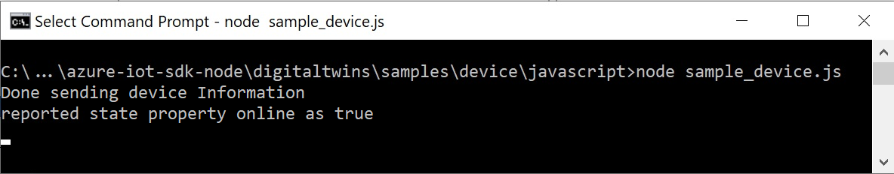

# Quickstart: Connect a sample IoT Plug and Play device application to IoT Hub (Node.js)

[!INCLUDE [iot-pnp-quickstarts-device-selector.md](../../includes/iot-pnp-quickstarts-device-selector.md)]

This quickstart shows you how to build a sample IoT Plug and Play device application, connect it to your IoT hub, and use the Azure IoT explorer tool to view the telemetry it sends. The sample application is written in Node.js and is included in the Azure IoT device SDK for Node.js. A solution builder can use the Azure IoT explorer tool to understand the capabilities of an IoT Plug and Play device without the need to view any device code.

## Prerequisites

[!INCLUDE [iot-pnp-prerequisites](../../includes/iot-pnp-prerequisites.md)]

To complete this quickstart, you need Node.js on your development machine. You can download the latest recommended version for multiple platforms from [nodejs.org](https://nodejs.org).

You can verify the current version of Node.js on your development machine using the following command:

```cmd/sh
node --version
```

## Download the code

In this quickstart, you prepare a development environment you can use to clone and build the Azure IoT Hub Device SDK for Node.js.

Open a command prompt in the directory of your choice. Execute the following command to clone the [Microsoft Azure IoT SDK for Node.js](https://github.com/Azure/azure-iot-sdk-node) GitHub repository into this location:

```cmd/sh
git clone https://github.com/Azure/azure-iot-sdk-node
```

## Install required libraries

You use the device SDK to build the included sample code. The application you build simulates a device that connects to an IoT hub. The application sends telemetry and properties and receives commands.

1. In a local terminal window, go to the folder of your cloned repository and navigate to the */azure-iot-sdk-node/device/samples/pnp* folder. Then run the following command to install the required libraries:

    ```cmd/sh
    npm install
    ```

1. Configure the environment variable with the device connection string you made a note of previously:

    ```cmd/sh
    set IOTHUB_DEVICE_CONNECTION_STRING=<YourDeviceConnectionString>
    ```

## Run the sample device

This sample implements a simple IoT Plug and Play thermostat device. The model this sample implements doesn't use IoT Plug and Play [components](concepts-components.md). The [DTDL model file for the thermostat device](https://github.com/Azure/opendigitaltwins-dtdl/blob/master/DTDL/v2/samples/Thermostat.json) defines the telemetry, properties, and commands the device implements.

Open the _simple_thermostat.js_ file. In this file, you can see how to:

1. Import the required interfaces.
1. Write a property update handler and a command handler.
1. Handle desired property patches and send telemetry.
1. Optionally, provision your device using the Azure Device Provisioning Service (DPS).

In the main function, you can see how it all comes together:

1. Create the device from your connection string or provision it using DPS.)
1. Use the **modelID** option to specify the IoT Plug and Play device model.
1. Enable the command handler.
1. Send telemetry from the device to your hub.
1. Get the devices twin and update the reported properties.
1. Enable the desired property update handler.

[!INCLUDE [iot-pnp-environment](../../includes/iot-pnp-environment.md)]

To learn more about the sample configuration, see the [sample readme](https://github.com/Azure/azure-iot-sdk-node/blob/master/device/samples/pnp/readme.md).

Run the sample application to simulate an IoT Plug and Play device that sends telemetry to your IoT hub. To run the sample application, use the following command:

```cmd\sh
node simple_thermostat.js
```

You see the following output, indicating the device has begun sending telemetry data to the hub, and is now ready to receive commands and property updates.



Keep the sample running as you complete the next steps.

## Use Azure IoT explorer to validate the code

After the device client sample starts, use the Azure IoT explorer tool to verify it's working.

[!INCLUDE [iot-pnp-iot-explorer.md](../../includes/iot-pnp-iot-explorer.md)]

## Next steps

In this quickstart, you've learned how to connect an IoT Plug and Play device to an IoT hub. To learn more about how to build a solution that interacts with your IoT Plug and Play devices, see:

> [!div class="nextstepaction"]
> [Interact with an IoT Plug and Play device that's connected to your solution](quickstart-service-node.md)
