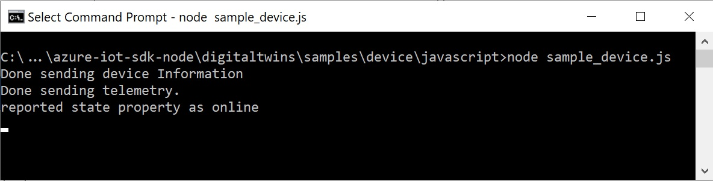

# Quickstart: Connect a sample IoT Plug and Play Preview device application to IoT Hub (Node.js)

[!INCLUDE [iot-pnp-quickstarts-2-selector.md](../../includes/iot-pnp-quickstarts-2-selector.md)]

This quickstart shows you how to build a sample IoT Plug and Play device application, connect it to your IoT hub, and use the Azure IoT explorer tool to view the information it sends to the hub. The sample application is written for Node.js and is included in the Azure IoT Hub Device SDK for Node.js. A solution developer can use the Azure IoT explorer tool to understand the capabilities of an IoT Plug and Play device without the need to view any device code.

[!INCLUDE [cloud-shell-try-it.md](../../includes/cloud-shell-try-it.md)]

## Prerequisites

To complete this quickstart, you need Node.js on your development machine. You can download the latest recommended version for multiple platforms from [nodejs.org](https://nodejs.org).

You can verify the current version of Node.js on your development machine using the following command:

```cmd/sh
node --version
```

### Install the Azure IoT explorer

Download and install the latest release of **Azure IoT explorer** from the tool's [repository](https://github.com/Azure/azure-iot-explorer/releases) page, by selecting the .msi file under "Assets" for the most recent update.

[!INCLUDE [iot-pnp-prepare-iot-hub.md](../../includes/iot-pnp-prepare-iot-hub.md)]

Run the following command to get the _IoT hub connection string_ for your hub (note for use later):

```azurecli-interactive
az iot hub show-connection-string --hub-name <YourIoTHubName> --output table
```

## Prepare the development environment

In this quickstart, you prepare a development environment you can use to clone and build the Azure IoT Hub Device SDK for Node.js.

Open a command prompt in the directory of your choice. Execute the following command to clone the [Microsoft Azure IoT SDK for Node.js](https://github.com/Azure/azure-iot-sdk-node) GitHub repository into this location:

```cmd/sh
git clone https://github.com/Azure/azure-iot-sdk-node --recursive -b digitaltwins-preview
```

This operation may take several minutes to complete.

## Install required libraries

You use the device SDK to build the included sample code. The application you build simulates a device that connects to an IoT hub. The application sends telemetry and properties and receives commands.

1. In a local terminal window, go to the folder of your cloned repository and navigate to the **/azure-iot-sdk-node/digitaltwins/samples/device/javascript** folder. Then run the following command to install the required libraries:

    ```cmd/sh
    npm install
    ```
1. Configure the _device connection string_:

    ```cmd/sh
    set DEVICE_CONNECTION_STRING=<YourDeviceConnectionString>
    ```

## Run the sample device

Run a sample application in the SDK to simulate an IoT Plug and Play device that sends telemetry to your IoT hub. To run the sample application, use the following command:

```cmd\sh
    node sample_device.js
```

You see the following output, indicating the device has begun sending telemetry data to the hub, and is now ready to receive commands and property updates.

   

 Keep the sample running as you complete the next steps.

## Use the Azure IoT explorer to validate the code

[!INCLUDE [iot-pnp-iot-explorer-1.md](../../includes/iot-pnp-iot-explorer-1.md)]

4. To ensure the tool can read the interface model definitions from your device, select **Settings**. In the Settings menu, **On the connected device** may already appear in the Plug and Play configurations; if it does not, select **+ Add module definition source** and then **On the connected device** to add it.

1. Back on the **Devices** overview page, find the device identity you created previously. With the device application still running in the command prompt, check that the device's **Connection state** in Azure IoT explorer is reporting as _Connected_ (if not, hit **Refresh** until it is). Select the device to view more details.

1. Expand the interface with ID **urn:contoso:com:EnvironmentalSensor:1** to reveal the interface and IoT Plug and Play primitives—properties, commands, and telemetry.

[!INCLUDE [iot-pnp-iot-explorer-2.md](../../includes/iot-pnp-iot-explorer-2.md)]

[!INCLUDE [iot-pnp-clean-resources.md](../../includes/iot-pnp-clean-resources.md)]

## Next steps

In this quickstart, you've learned how to connect an IoT Plug and Play device to an IoT hub. To learn more about how to build a solution that interacts with your IoT Plug and Play devices, see:

> [!div class="nextstepaction"]
> [How-to: Connect to and interact with an IoT Plug and Play Preview device](howto-develop-solution.md)
