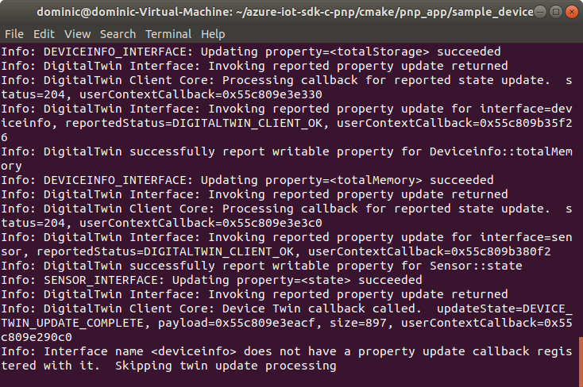

# Quickstart: Use a device capability model to create an IoT Plug and Play Preview device (Linux)

[!INCLUDE [iot-pnp-quickstarts-1-selector.md](../../includes/iot-pnp-quickstarts-1-selector.md)]

A _device capability model_ (DCM) describes the capabilities of an IoT Plug and Play device. A DCM is often associated with a product SKU. The capabilities defined in the DCM are organized into reusable interfaces. You can generate skeleton device code from a DCM. This quickstart shows you how to use VS Code on Ubuntu Linux to create an IoT Plug and Play device using a DCM.

## Prerequisites

This quickstart assumes you're using Ubuntu Linux with a desktop environment. The steps in this tutorial were tested using Ubuntu 18.04.

To complete this quickstart, you need to install the following software on your local Linux machine:

* Install **GCC**, **Git**, **cmake**, and all dependencies using the `apt-get` command:

    ```sh
    sudo apt-get update
    sudo apt-get install -y git cmake build-essential curl libcurl4-openssl-dev libssl-dev uuid-dev
    ```

    Verify the version of `cmake` is above **2.8.12** and the version of **GCC** is above **4.4.7**.

    ```sh
    cmake --version
    gcc --version
    ```

* [Visual Studio Code](https://code.visualstudio.com/).

### Install Azure IoT Tools

Use the following steps to install the [Azure IoT Tools for VS Code](https://marketplace.visualstudio.com/items?itemName=vsciot-vscode.azure-iot-tools) extension pack:

1. In VS Code, select the **Extensions** tab.
1. Search for **Azure IoT Tools**.
1. Select **Install**.

### Get the connection string for your company model repository

You can find your _company model repository connection string_ in the [Azure Certified for IoT portal](https://preview.catalog.azureiotsolutions.com) portal when you sign in with a Microsoft work or school account, or your Microsoft Partner ID if you have one. After you sign in, select **Company repository** and then **Connection strings**.

[!INCLUDE [cloud-shell-try-it.md](../../includes/cloud-shell-try-it.md)]

[!INCLUDE [iot-pnp-prepare-iot-hub.md](../../includes/iot-pnp-prepare-iot-hub.md)]

## Prepare the development environment

In this quickstart, you use the [Vcpkg](https://github.com/microsoft/vcpkg) library manager to install the Azure IoT C device SDK in your development environment.

Open a shell. Execute the following command to install Vcpkg:

```bash
cd ~
git clone https://github.com/microsoft/vcpkg
cd vcpkg
./bootstrap-vcpkg.sh
./vcpkg install azure-iot-sdk-c[public-preview,use_prov_client]
```

You should expect this operation to take several minutes to complete.

## Author your model

In this quickstart, you use an existing sample device capability model and associated interfaces.

1. Create a `pnp_app` directory in your local drive. You use this folder for the device model files and device code stub.

    ```bash
    cd ~
    mkdir pnp_app
    ```

1. Download the device capability model and interface sample files to the `pnp_app` folder.

    ```bash
    cd pnp_app
    curl -O -L https://raw.githubusercontent.com/Azure/IoTPlugandPlay/master/samples/SampleDevice.capabilitymodel.json
    curl -O -L https://raw.githubusercontent.com/Azure/IoTPlugandPlay/master/samples/EnvironmentalSensor.interface.json
    ```

1. Open `pnp_app` folder with VS Code. You can view the files with IntelliSense:

    

1. In the files you downloaded, replace `<YOUR_COMPANY_NAME_HERE>` in the `@id` and `schema` fields with a unique value. Use only the characters a-z, A-Z, 0-9, and underscore. For more information, see [Digital Twin identifier format](https://github.com/Azure/IoTPlugandPlay/tree/master/DTDL#digital-twin-identifier-format).

## Generate the C code stub

Now that you have a DCM and its associated interfaces, you can generate the device code that implements the model. To generate the C code stub in VS Code:

1. With the `pnp_app` folder open in VS Code, use **Ctrl+Shift+P** to open the command palette, enter **IoT Plug and Play**, and select **Generate Device Code Stub**.

    > [!NOTE]
    > The first time you use the IoT Plug and Play Code Generator utility, it takes a few seconds to download and install automatically.

1. Choose the **SampleDevice.capabilitymodel.json** file to use for generating the device code stub.

1. Enter the project name **sample_device**. This will be the name of your device application.

1. Choose **ANSI C** as your language.

1. Choose **Via IoT Hub device connection string** as connection method.

1. Choose **CMake Project on Linux** as your project template.

1. Choose **Via Vcpkg** as the way to include the device SDK.

1. A new folder called **sample_device** is created in the same location as the DCM file, and in it are the generated device code stub files. VS Code opens a new window to display these.
    

## Build and run the code

You use the device SDK source code to build the generated device code stub. The application you build simulates a device that connects to an IoT hub. The application sends telemetry and properties and receives commands.

1. Create a **CMake** build folder for the **sample_device** application:

    ```bash
    cd ~/pnp_app/sample_device
    mkdir cmake
    cd cmake
    ```

1. Run CMake to build your app with the SDK. The following command assumes you installed **vcpkg** in your home folder:

    ```bash
    cmake .. -DCMAKE_TOOLCHAIN_FILE=~/vcpkg/scripts/buildsystems/vcpkg.cmake -Duse_prov_client=ON -Dhsm_type_symm_key:BOOL=ON
    cmake --build .
    ```

1. After the build completes successfully, run your application passing the IoT hub device connection string as parameter.

    ```sh
    cd ~/pnp_app/sample_device/cmake
    ./sample_device "<YourDeviceConnectionString>"
    ```

1. The device application starts sending data to IoT Hub.

    

## Validate the code

### Publish device model files to model repository

To validate the device code with the **az** CLI, you need to publish the files to the model repository.

1. With the `pnp_app` folder open in VS code, use **Ctrl+Shift+P** to open the command palette, type and select **IoT Plug & Play: Submit files to Model Repository**.

1. Select `SampleDevice.capabilitymodel.json` and `EnvironmentalSensor.interface.json` files.

1. Enter your company model repository connection string.

    > [!NOTE]
    > The connection string is only required the first time you connect to the repository.

1. In VS Code output window and notification, you can check that the files have been published successfully.

    > [!NOTE]
    > If you get errors on publishing the device model files, you can try use command **IoT Plug and Play: Sign out Model Repository** to sign out and go through the steps again.

### Use the Azure IoT CLI to validate the code

After the device client sample starts, you can check that it's working with the Azure CLI.

Use the following command to view the telemetry the sample device is sending. You may need to wait a minute or two before you see any telemetry in the output:

```azurecli-interactive
az iot dt monitor-events --hub-name <YourIoTHubNme> --device-id <YourDeviceID>
```

Use the following command to view all the properties sent by the device:

```azurecli-interactive
az iot dt list-properties --device-id <YourDeviceID> --hub-name <YourIoTHubNme> --source private --repo-login "<YourCompanyModelRepositoryConnectionString>"
```

[!INCLUDE [iot-pnp-clean-resources.md](../../includes/iot-pnp-clean-resources.md)]

## Next steps

In this quickstart, you learned how to create an IoT Plug and Play device using a DCM.

To learn more about DCMs and how to create your own models, continue to the tutorial:

> [!div class="nextstepaction"]
> [Tutorial: Create and test a device capability model using Visual Studio Code](tutorial-pnp-visual-studio-code.md)
