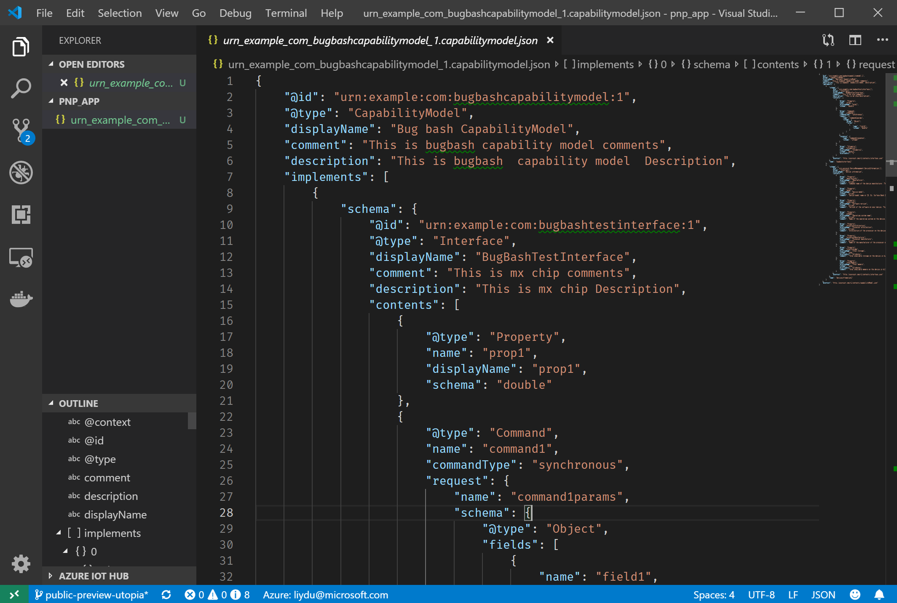
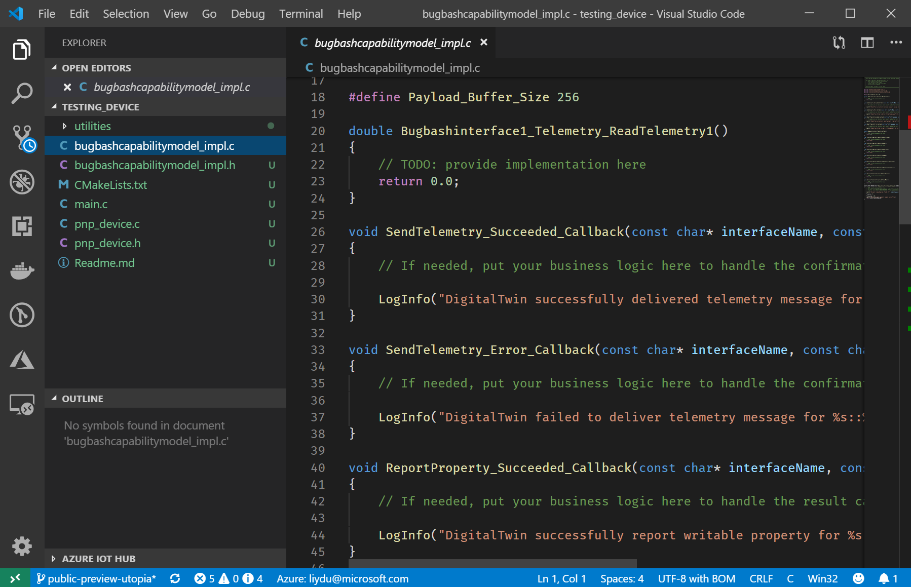
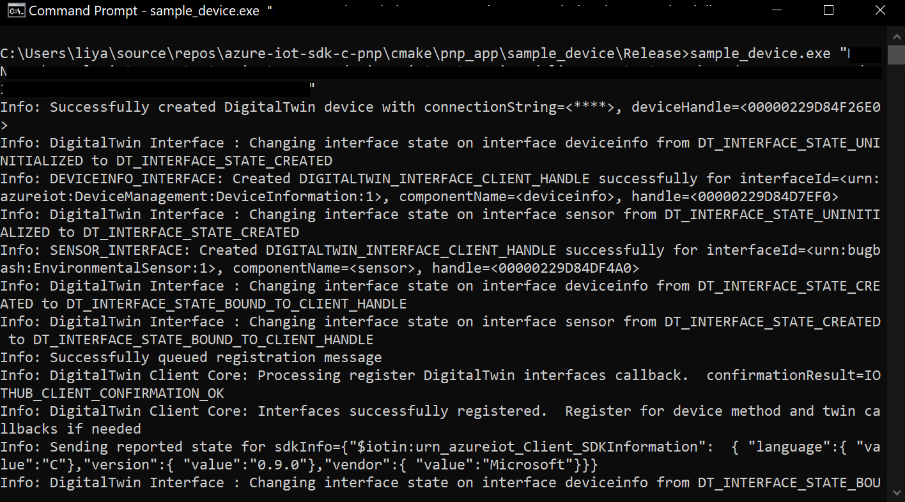

# Quickstart: Use a device capability model to create an IoT Plug and Play Preview device (Windows)

[!INCLUDE [iot-pnp-quickstarts-1-selector.md](../../includes/iot-pnp-quickstarts-1-selector.md)]

A _device capability model_ (DCM) describes the capabilities of an IoT Plug and Play device. A DCM is often associated with a product SKU. The capabilities defined in the DCM are organized into reusable interfaces. You can generate skeleton device code from a DCM. This quickstart shows you how to use VS Code on Windows to create an IoT Plug and Play device using a DCM.

## Prerequisites

To complete this quickstart, you need to install the following software on your local machine:

* [Build Tools for Visual Studio](https://visualstudio.microsoft.com/thank-you-downloading-visual-studio/?sku=BuildTools&rel=16) with **C++ build tools** and **NuGet package manager component** workloads. Or if you already have [Visual Studio (Community, Professional, or Enterprise)](https://visualstudio.microsoft.com/downloads/) 2019, 2017 or 2015 with same workloads installed.
* [Git](https://git-scm.com/download/).
* [CMake](https://cmake.org/download/).
* [Visual Studio Code](https://code.visualstudio.com/).

### Install Azure IoT Tools

Use the following steps to install the [Azure IoT Tools for VS Code](https://marketplace.visualstudio.com/items?itemName=vsciot-vscode.azure-iot-tools) extension pack:

1. In VS Code, select the **Extensions** tab.
1. Search for **Azure IoT Tools**.
1. Select **Install**.

### Install the Azure IoT explorer

Download and install the latest release of **Azure IoT explorer** from the tool's [repository](https://github.com/Azure/azure-iot-explorer/releases) page, by selecting the .msi file under "Assets" for the most recent update.

### Get the connection string for your company model repository

You can find your _company model repository connection string_ in the [Azure Certified for IoT portal](https://preview.catalog.azureiotsolutions.com) portal when you sign in with a Microsoft work or school account, or your Microsoft Partner ID if you have one. After you sign in, select **Company repository** and then **Connection strings**.

[!INCLUDE [cloud-shell-try-it.md](../../includes/cloud-shell-try-it.md)]

[!INCLUDE [iot-pnp-prepare-iot-hub.md](../../includes/iot-pnp-prepare-iot-hub.md)]

Run the following command to get the _IoT hub connection string_ for your hub (note for use later):

```azurecli-interactive
az iot hub show-connection-string --hub-name <YourIoTHubName> --output table
```

## Prepare the development environment

In this quickstart, you use the [Vcpkg](https://github.com/microsoft/vcpkg) library manager to install the Azure IoT C device SDK in your development environment.

1. Open a command prompt. Execute the following command to install Vcpkg:

    ```cmd
    git clone https://github.com/Microsoft/vcpkg.git
    cd vcpkg

    .\bootstrap-vcpkg.bat
    ```

    Then, to hook up user-wide [integration](https://github.com/microsoft/vcpkg/blob/master/docs/users/integration.md), run the following (note: requires admin on first use):

    ```cmd
    .\vcpkg.exe integrate install
    ```

1. Install Azure IoT C device SDK Vcpkg:

    ```cmd
    .\vcpkg.exe install azure-iot-sdk-c[public-preview,use_prov_client]
    ```

## Author your model

In this quickstart, you use an existing sample device capability model and associated interfaces.

1. Create a `pnp_app` folder in your local drive. You use this folder for the device model files and device code stub.

1. Download the [device capability model and interface sample files](https://github.com/Azure/opendigitaltwins-dtdl/blob/master/DTDL/v2/samples/SampleDevice.model.json) and [interface sample](https://github.com/Azure/opendigitaltwins-dtdl/blob/master/DTDL/v2/samples/EnvironmentalSensor.interface.json) and save the files into the `pnp_app` folder.

    > [!TIP]
    > To download a file from GitHub, navigate to the file, right-click on **Raw**, and then select **Save link as**.

1. Open `pnp_app` folder with VS Code. You can view the files with IntelliSense:

    

1. In the files you downloaded, replace `<YOUR_COMPANY_NAME_HERE>` in the `@id` and `schema` fields with a unique value. Use only the characters a-z, A-Z, 0-9, and underscore. For more information, see [Digital Twin identifier format](https://github.com/Azure/IoTPlugandPlay/tree/master/DTDL#digital-twin-identifier-format).

## Generate the C code stub

Now that you have a DCM and its associated interfaces, you can generate the device code that implements the model. To generate the C code stub in VS Code:

1. With the `pnp_app` folder open in VS Code, use **Ctrl+Shift+P** to open the command palette, enter **IoT Plug and Play**, and select **Generate Device Code Stub**.

    > [!NOTE]
    > The first time you use the IoT Plug and Play CodeGen CLI, it takes a few seconds to download and install automatically.

1. Choose the **SampleDevice.capabilitymodel.json** file to use for generating the device code stub.

1. Enter the project name **sample_device**. This is the name of your device application.

1. Choose **ANSI C** as your language.

1. Choose **Via IoT Hub device connection string** as connection method.

1. Choose **CMake Project on Windows** as your project template.

1. Choose **Via Vcpkg** as the way to include the device SDK.

1. A new folder called **sample_device** is created in the same location as the DCM file, and in it are the generated device code stub files. VS Code opens a new window to display these.
    

## Build and run the code

You use the Vcpkg package to build the generated device code stub. The application you build simulates a device that connects to an IoT hub. The application sends telemetry and properties and receives commands.

1. Create a `cmake` subdirectory in the `sample_device` folder, and navigate to that folder:

    ```cmd
    mkdir cmake
    cd cmake
    ```

1. Run the following commands to build the generated code stub (replacing the placeholder with the directory of your Vcpkg repo):

    ```cmd
    cmake .. -G "Visual Studio 16 2019" -A Win32 -Duse_prov_client=ON -Dhsm_type_symm_key:BOOL=ON -DCMAKE_TOOLCHAIN_FILE="<directory of your Vcpkg repo>\scripts\buildsystems\vcpkg.cmake"

    cmake --build .
    ```
    
    > [!NOTE]
    > If you are using Visual Studio 2017 or 2015, you need to specify the CMake generator based on the build tools you are using:
    >```cmd
    ># Either
    >cmake .. -G "Visual Studio 15 2017" -Duse_prov_client=ON -Dhsm_type_symm_key:BOOL=ON -DCMAKE_TOOLCHAIN_FILE="{directory of your Vcpkg repo}\scripts\buildsystems\vcpkg.cmake"
    ># or
    >cmake .. -G "Visual Studio 14 2015" -Duse_prov_client=ON -Dhsm_type_symm_key:BOOL=ON -DCMAKE_TOOLCHAIN_FILE="{directory of your Vcpkg repo}\scripts\buildsystems\vcpkg.cmake"
    >```

    > [!NOTE]
    > If cmake can't find your C++ compiler, you get build errors when you run the previous command. If that happens, try running this command at the [Visual Studio command prompt](https://docs.microsoft.com/dotnet/framework/tools/developer-command-prompt-for-vs).

1. After the build completes successfully, run your application, passing the IoT hub device connection string as a parameter.

    ```cmd\sh
    .\Debug\sample_device.exe "<YourDeviceConnectionString>"
    ```

1. The device application starts sending data to IoT Hub.

    

## Validate the code

### Publish device model files to model repository

To validate the device code with **Azure IoT Explorer**, you need to publish the files to the model repository.

1. With the `pnp_app` folder open in VS Code, use **Ctrl+Shift+P** to open the command palette, type and select **IoT Plug & Play: Submit files to Model Repository**.

1. Select `SampleDevice.capabilitymodel.json` and `EnvironmentalSensor.interface.json` files.

1. Enter your company model repository connection string.

    > [!NOTE]
    > The connection string is only required the first time you connect to the repository.

1. In VS Code output window and notification, you can check that the files have been published successfully.

    > [!NOTE]
    > If you get errors on publishing the device model files, you can try use command **IoT Plug and Play: Sign out Model Repository** to sign out and go through the steps again.

### Use the Azure IoT explorer to validate the code

[!INCLUDE [iot-pnp-iot-explorer-1.md](../../includes/iot-pnp-iot-explorer-1.md)]

4. To add your company repository, select **Settings**, then **+ Add module definition source**, then **Company repository**. Add your company model repository connection string, and select **Save and Connect**.

1. Back on the **Devices** overview page, find the device identity you created previously. With the device application still running in the command prompt, check that the device's **Connection state** in Azure IoT explorer is reporting as _Connected_ (if not, hit **Refresh** until it is). Select the device to view more details.

1. Expand the interface with ID **urn:<YOUR_INTERFACE_NAME>:EnvironmentalSensor:1** to see the IoT Plug and Play primitives - properties, commands, and telemetry. The interface name that will appear is the name you put in when authoring your model.

[!INCLUDE [iot-pnp-iot-explorer-2.md](../../includes/iot-pnp-iot-explorer-2.md)]

[!INCLUDE [iot-pnp-clean-resources.md](../../includes/iot-pnp-clean-resources.md)]

## Next steps

In this quickstart, you learned how to create an IoT Plug and Play device using a DCM.

To learn more about DCMs and how to create your own models, continue to the tutorial:

> [!div class="nextstepaction"]
> [Tutorial: Create and test a device capability model using Visual Studio Code](tutorial-pnp-visual-studio-code.md)
