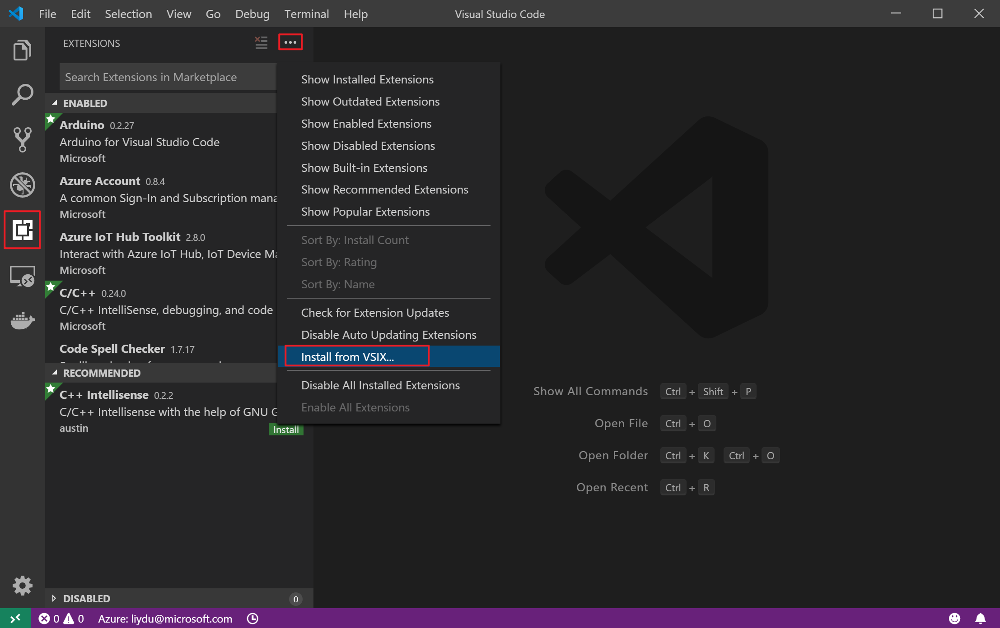
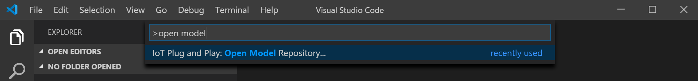
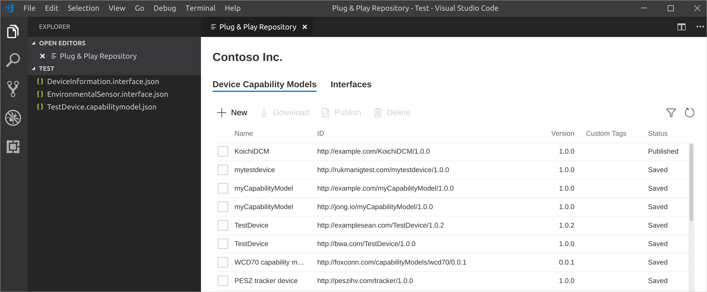
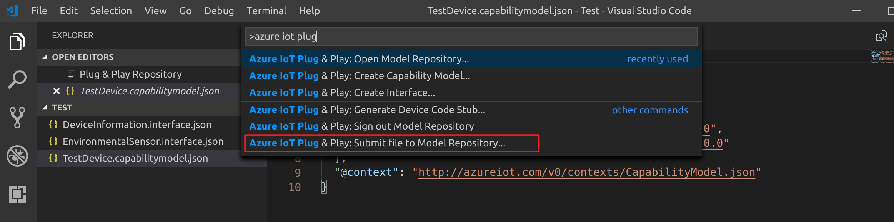
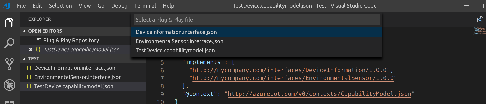
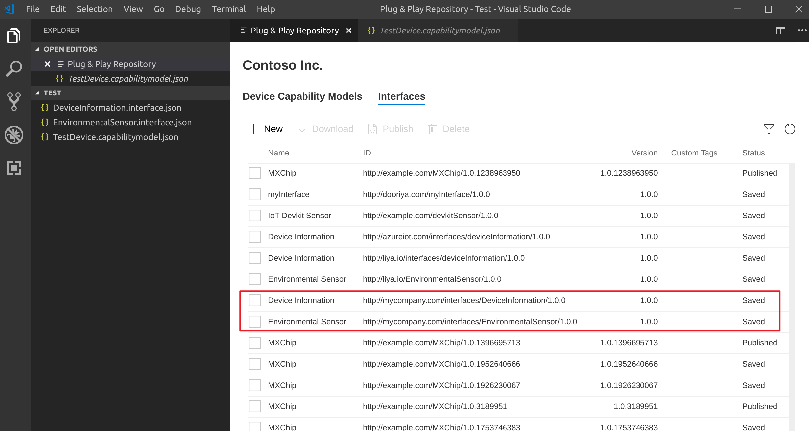
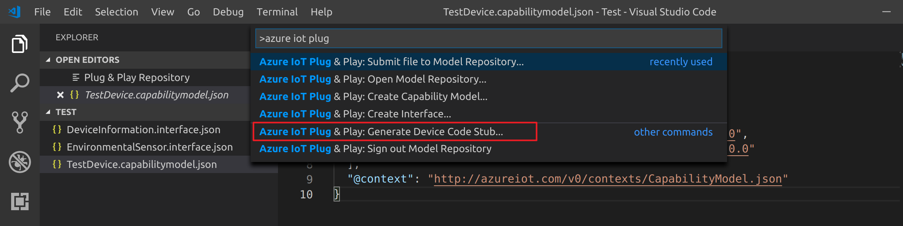
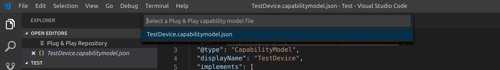
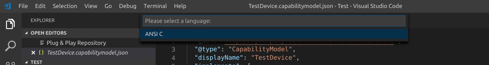

# Quickstart: Use a device capability model to create a device

For a plug and play device, a Device Capability Model (DCM) describes a physical device and often associated with a product SKU. A Device Capability Model defines the set of interfaces implemented by the digital twin, and a device can be created based on that. This quickstart shows you how to create a Plug and Play device using a device capability model.

## Prerequisites

### Install Visual Studio Code
1. Install the newest version of Visual Studio Code from [https://code.visualstudio.com/](https://code.visualstudio.com/). 

### Install Azure IoT Device Workbench
1. Download the `.vsix` file from [https://aka.ms/iot-workbench-pnp-pr](https://aka.ms/iot-workbench-pnp-pr).
2. Install Azure IoT Device Workbench VS Code from the `.vsix` file.
   1. In VS Code, Click Extensions
   2. Select the `...` menu dropdown
   3. Select "Install from VSIX"
   4. Select the `.vsix` file you just downloaded
   5. Click Install
   
   > NOTE: You must do this from within VS Code as you see in the image above. It is not directly installable from Windows Explorer.
   
### Install Digital Twin Explorer
Download and install the Digital Twin Explorer from the [latest release]().
### Azure IoT Hub
You will need to create a device identity in an Azure IoT Hub. If you don't have one, follow instructions [here](https://docs.microsoft.com/en-us/azure/iot-hub/quickstart-send-telemetry-node#create-an-iot-hub) to create one.

## Get Started

### Create new Plug and Play Interface 

1. In VS Code, press `F1`, type **Azure IoT Plug and Play** in the command palette, and then select **Create Interface** to create a new interface from scratch.
    

2. Provide the name of your interface file `DeviceInformation.interface.json` and then press `Enter`. A default interface file will be created.
3. Copy the contents from the file [here]() into the file you just created.
  
4. Make the id unique, e.g.
```
"@id": "http://yourdomain.com/environmentalsensor/1.0.1"
```

### Create new Plug and Play Device Capibility Model 

1. In VS Code, press `F1`, type **Azure IoT Plug and Play"** in the command palette, and select **Create Capibility Model** to create a new device capibility model.

2. Provide the name of your interface file `EnvironmentalSensorX4000` and then press `Enter`.

3. Update the json file to be the following:

```
{
  "@id": "http://yourdomain.com/EnvironmentalSensorX4000/1.0.0",
  "@type": "CapabilityModel",
  "displayName": "myCapabilityModel",
  "implements": [
    "http://yourdomain.com/environmentalsensor/1.0.1",
    "http://azureiot.com/interfaces/deviceInformation/1.0.0",
    "http://azureiot.com/interfaces/deviceDiscovery/1.0.0",
    "http://azureiot.com/interfaces/modelDefinitionDiscovery/1.0.0",
    "http://azureiot.com/interfaces/azureSDKInformation/1.0.0"
  ],
  "@context": "http://azureiot.com/v0/contexts/CapabilityModel.json"
}
```
 > **NOTE:** Please replace http://yourdomain.com/environmentalsensor/1.0.1 with the interface ID created in the previous section

### Open Model Repository

1. In VS Code, press the `F1` key, type **Azure IoT Plug and Play** in the command palette, and select **Open Model Repository**. 

   

2. Do not enter any connection string.

3. This will open the model repository in VS Code UI.
   

### Submit Interface to Model Repository

1. In VS Code, press the `F1` key, type **Azure IoT Plug and Play** in the command palette, and select **Submit file to Model Repository**. 

   

2. Select the Interface and Device Capability Model files you just created.
   

3. In the Plug & Play Model Repository UI, click the **Refresh** button to see the submitted files.
   


### Develop Device Code in C

#### Generate the C Code Stubs
1. In VS Code, press the `F1` key, type **Azure IoT Plug and Play** in the command palette, and select **Generate Device Code Stub**.
    

2. When prompted for a capability model, select the EnvironmentalSensorX4000.capabilitymodel.json capability model file.
    

3. When prompted a language, select **ANSI C**.
    

4. When prompted a platform, select **General platform**
   
   
5. Select the folder where you would like the C files to be outputed to.

#### Implement stubbed functions
1. Go to device_model.c.
2. Update the codes to be the folloing:
```
implementations of functions
```
#### Build the codes
#### Run the device app using command `the command`

## Validate Plug and Play Device Codes in Digital Twin Explorer

1. Open the application and connect with your IoT Hub connection string on the landing page.
2. Find the device you are using in your hub, and click to view the details.
3. Select `Telemetry` page under `interfaceX` to view the telemetry data being sent by the device.
4. Select `Properties` page under `interfaceX` to view the reported properties.
5. Select `Writable Properties` page under `interfaceX`. Under property `X`, update the value to be Y.
6. Select `Device Twin`, confirm the change you just made in property `X`.
7. Select `Command` page under `interfaceX`. Select command `X` and click submit.
8. Go to the device to verify that the command has been executed as expected.
