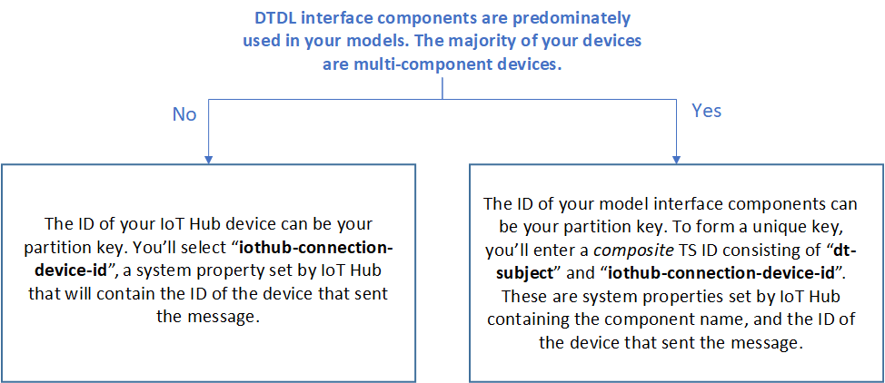
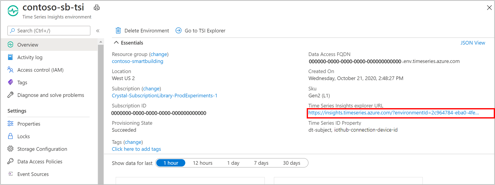
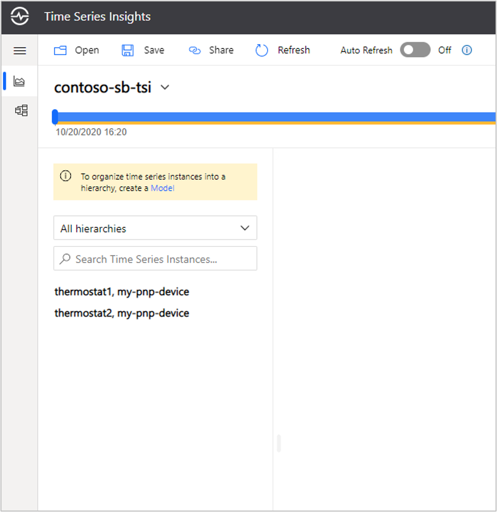
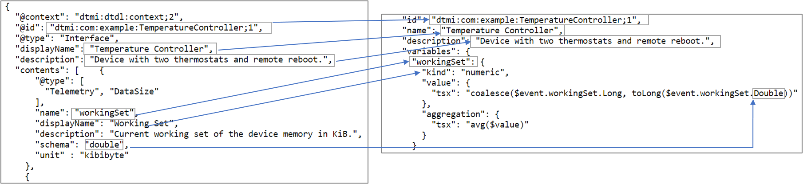
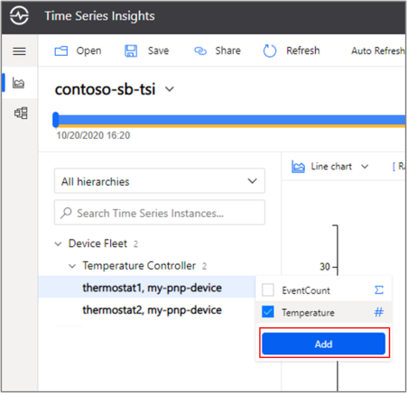
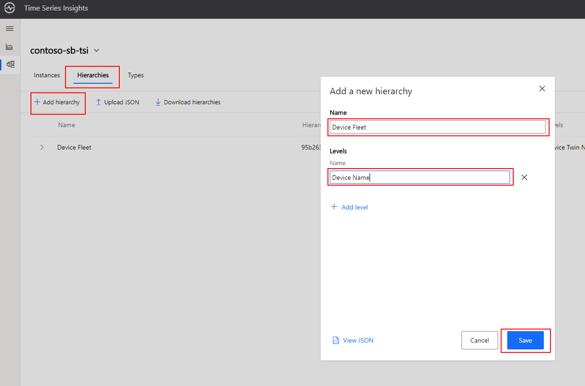
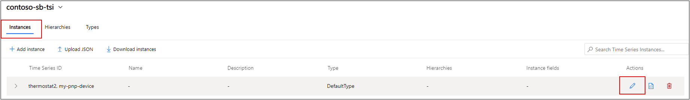
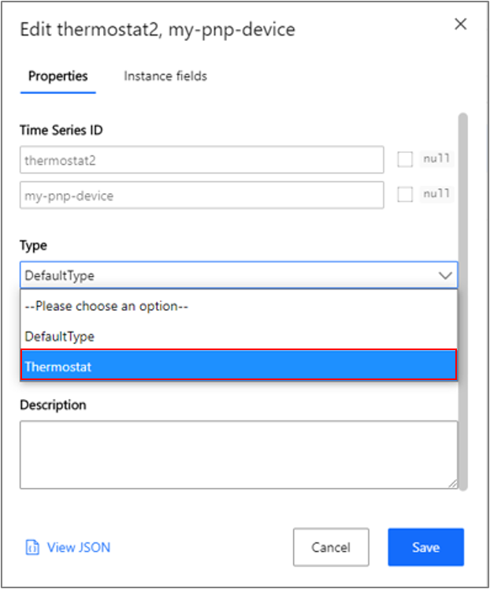
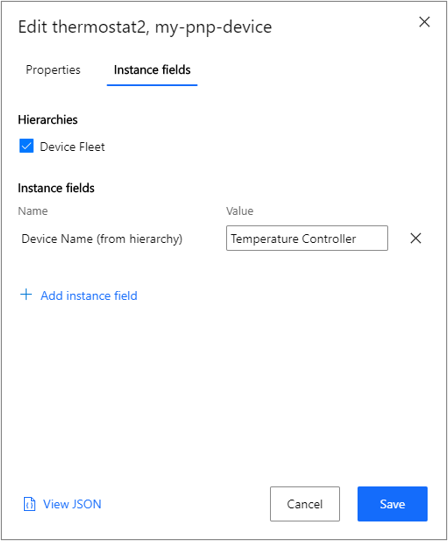
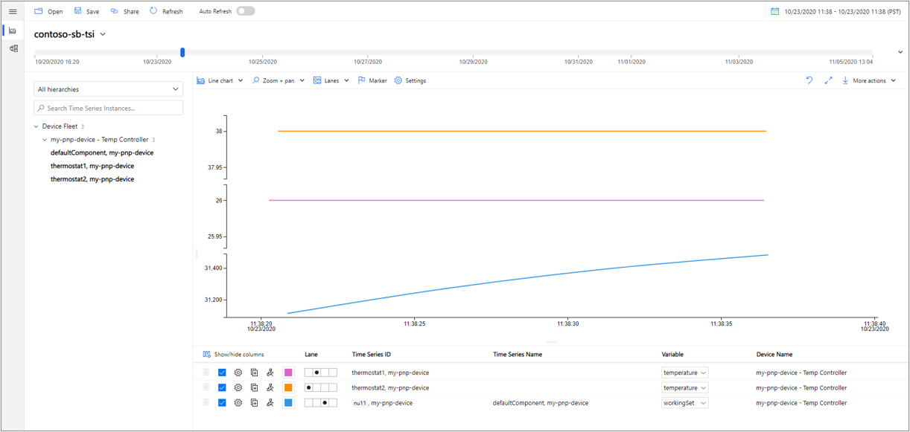

# Tutorial: Create and Connect to Time Series Insights Gen2 to store, visualize, and analyze IoT Plug and Play device telemetry

In this tutorial, you'll learn how to create and correctly configure an [Azure Time Series Insights Gen2](https://docs.microsoft.com/azure/time-series-insights/overview-what-is-tsi) (TSI) environment to integrate with your IoT Plug and Play solution. With TSI, you can collect, process, store, query and visualize time series data at Internet of Things (IoT) scale.

First you'll provision a TSI environment and connect your IoT Hub as a streaming event source. Then you'll work through model synchronization to author your TSI environment's Time Series Model based off of the [Digital Twins Definition Language (DTDL)](https://github.com/Azure/opendigitaltwins-dtdl) sample model files you used for the temperature controller and thermostat devices.

## Prerequisites

[!INCLUDE [iot-pnp-prerequisites](../../includes/iot-pnp-prerequisites.md)]

To avoid the requirement to install the Azure CLI locally, you can use the Azure Cloud Shell to set up the cloud services.

[!INCLUDE [cloud-shell-try-it.md](../../includes/cloud-shell-try-it.md)]

### Time Series ID selection

While provisioning your TSI environment, you'll be required to select a Time Series ID. Selecting the appropriate Time Series ID is critical, as the property is immutable and cannot be changed after it's set. Choosing a Time Series ID is like choosing a partition key for a database. Typically, your TS ID should be the leaf node of your asset model. In other words, you typically want to select the ID property of the most granular asset or sensor that is emitting telemetry.

As an IoT Plug and Play user, the pertinent question for selecting your TS ID is the presence of [components](https://github.com/Azure/opendigitaltwins-dtdl/blob/master/DTDL/v2/dtdlv2.md#component) in your device models. 



* If you've been doing the Quickstart and your IoT Hub device represents the [Thermostat](https://raw.githubusercontent.com/Azure/opendigitaltwins-dtdl/master/DTDL/v2/samples/Thermostat.json), use `iot-hub-connection-device-id` as your TS ID.

* If you've been doing one of the tutorials for the multi component [TemperatureController](https://raw.githubusercontent.com/Azure/opendigitaltwins-dtdl/master/DTDL/v2/samples/TemperatureController.json), use a composite key in the section below, written as  `iot-hub-connection-device-id, dt-subject`

## Provision your Azure Time Series Insights Gen2 environment

The command below does the following:

* Creates an Azure storage account for your environment's [cold store](https://docs.microsoft.com/azure/time-series-insights/concepts-storage#cold-store), designed for long-term retention and analytics over historical data.
  * Replace `mytsicoldstore` with a unique name for your account.
* Creates an Azure Time Series Insights Gen2 environment, including warm storage with a retention period of 7 days, and a cold store for infinite retention. 
  * Replace `my-tsi-env` with a unique name for your TSI environment 
  * Replace `my-pnp-resourcegroup` with the name of the resource group you used during set-up
  * Replace `my-ts-id-property` with your TS ID property value based on the selection criteria above

```azurecli-interactive
storage=mytsicoldstore
rg=my-pnp-resourcegroup
az storage account create -g $rg -n $storage --https-only
key=$(az storage account keys list -g $rg -n $storage --query [0].value --output tsv)
az timeseriesinsights environment longterm create --name my-tsi-env --resource-group $rg --time-series-id-properties my-ts-id-property --sku-name L1 --sku-capacity 1 --data-retention 7 --storage-account-name $storage --storage-management-key $key --location eastus2
```

Now you'll configure the IoT Hub you created previously as your environment's [event source](https://docs.microsoft.com/azure/time-series-insights/concepts-streaming-ingestion-event-sources). When your event source is connected, TSI will begin indexing events from your hub, beginning with the earliest event in the queue.

First create a unique consumer group on your IoT Hub for your TSI environment. Replace `my-pnp-hub` with the name of the IoT Hub you used previously.

```azurecli-interactive
az iot hub consumer-group create --hub-name my-pnp-hub --name tsi-consumer-group 
```

Connect the IoT Hub. Replace `my-pnp-resourcegroup`, `my-pnp-hub`, and `my-tsi-env` with your respective values.

```azurecli-interactive
rg=my-pnp-resourcegroup
iothub=my-pnp-hub
env=my-tsi-env
es_resource_id=$(az iot hub create -g $rg -n $iothub --query id --output tsv)
shared_access_key=$(az iot hub policy list -g $rg --hub-name $iothub --query "[?keyName=='service'].primaryKey" --output tsv)
az timeseriesinsights event-source iothub create -g $rg --environment-name $env -n iot-hub-event-source --consumer-group-name tsi-consumer-group  --key-name iothubowner --shared-access-key $shared_access_key --event-source-resource-id $es_resource_id
```
Navigate to your resource group in the [Azure portal](https://portal.azure.com) and select your newly created Time Series Insights environment. Visit the *Time Series Insights Explorer URL* shown in the instance overview.



In the explorer, you should see your two thermostats under "All hierarchies." Next, you'll curate your Time Series Model based off of your device model.



## Model synchronization between Digital Twins Definition Language and Time Series Insights Gen2

Next you'll translate your DTDL device model to the asset model in Azure Time Series Insights (TSI). TSI's Time Series Model is a semantic modeling tool for data contextualization within TSI. Time Series Model has three core components:

* [Time Series Model instances](https://docs.microsoft.com/azure/time-series-insights/concepts-model-overview#time-series-model-instances). Instances are virtual representations of the time series themselves. Instances will be uniquely identified by your TS ID.
* [Time Series Model hierarchies](https://docs.microsoft.com/azure/time-series-insights/concepts-model-overview#time-series-model-hierarchies). Hierarchies organize instances by specifying property names and their relationships.
* [Time Series Model types](https://docs.microsoft.com/azure/time-series-insights/concepts-model-overview#time-series-model-types). Types help you define [variables](https://docs.microsoft.com/azure/time-series-insights/concepts-variables) or formulas for doing computations. Types are associated with a specific instance.

> [!NOTE]
> The examples below are for the multi component TemperatureController.

### Define your Types

You can begin ingesting data into Azure Time Series Insights Gen2 without having pre-defined a model. When telemetry arrives, TSI will attempt to auto-resolve time series instances based on the TS ID property value. All instances will be assigned the *Default Type*. You'll need to manually create a new Type to represent your models. The image below depicts a simple method to synchronize a DTDL model and a TSM Type:



* Your digital twin model identifier (DTMI) will become your Type ID
* The Type name can be either the model's name or display name
* The model description becomes the Type's description
* At least one Type variable is created for each telemetry component that has a numeric schema. 
  * Only numeric data types can be used for variables, but if a value is sent as a string that is parsable, `"0"` for example, you can use a [conversion](https://docs.microsoft.com/rest/api/time-series-insights/reference-time-series-expression-syntax#conversion-functions) function such as `toDouble`
* The variable name can either be the telemetry name or display name
* When defining the variable Time Series Expression (TSX), refer to the telemetry's name on the wire, and it's data type.

> [!NOTE]
> This example shows only two variables--an aggregate and numeric, but each Type can have up to 100. Different variables can reference the same telemetry value to perform different calucaultions as needed. For the full list of filters, aggregates, and scalar functions view the [Time Series Insights Gen2 Time Series Expression syntax](https://docs.microsoft.com/rest/api/time-series-insights/reference-time-series-expression-syntax) documentation.

Open your text editor of choice and save the JSON below to your local drive:

```JSON
{
  "put": [
    {
      "id": "dtmi:com:example:Thermostat;1",
      "name": "Thermostat",
      "description": "Reports current temperature and provides desired temperature control.",
      "variables": {
        "EventCount": {
          "kind": "aggregate",
          "aggregation": {
            "tsx": "count()"
          }
        },
        "Temperature": {
          "kind": "numeric",
          "value": {
            "tsx": "$event.temperature.Double"
          },
          "aggregation": {
            "tsx": "avg($value)"
          }
        }
      }
    }
  ]
}
```

In your Time Series Insights Explorer navigate to the Model tab by clicking on the model icon on the left. Click on **Types** and the click on **Upload JSON**:



Select **Choose file**, select the JSON you saved previously, and click **Upload**

You should see the newly defined Thermostat Type.

### Optional - Create a hierarchy

You can optionally create a hierarchy to organize the two thermostat components under their TemeraptureController parent.

Click on *Hierarchies* and select *Add a hierarchy*. Enter `Device Fleet` as the name and create one level called `Device Name` and then click *Save*.



### Assign your instances to the correct type

Next you'll change the Type of your instances and optionally situate them within the hierarchy

Select the *Instances* tab and click on the *Edit* icon on the far right.



Click on the Type dropdown and select `Thermostat`. 



If you created a hierarchy, select *Instance fields* and check the `Device Fleet` box. Enter `Temperature Controller` as the Value of their parent device, and then click *Save*.



Repeat the above steps for your second Thermostat.

### View your data

Navigate back to the charting pane and expand the Device Fleet and TemperatureController. Click on thermostat1, select the `Temperature` variable, and then click *Add* to chart the value. Do the same for thermostat2.



## Next steps

* To learn more about the various charting options, including interval sizing and Y-axis controls, view the [Azure Time Series Insights Explorer
](https://docs.microsoft.com/azure/time-series-insights/concepts-ux-panels) documentation.

* For an in-depth overview of your environment's Time Series Model see [this](https://docs.microsoft.com/azure/time-series-insights/concepts-model-overview) article.

* To dive into the query APIs and the Time Series Expression syntax, [select](https://docs.microsoft.com/rest/api/time-series-insights/reference-query-apis).


