<properties 
	pageTitle="MyDriving Azure IoT Example - Build It | Microsoft Azure" 
	description="Build an app that's a comprehensive demonstration of how to architect an IoT system with Microsoft Azure, including stream analytics, machine learning, event hubs." 
	services="" 
    documentationCenter=""
    suite="iot-suite"
	authors="alancameronwills" 
	manager="douge"/>

<tags 
	ms.service="iot-suite" 
	ms.workload="tbd" 
	ms.tgt_pltfrm="ibiza" 
	ms.devlang="na" 
	ms.topic="article" 
	ms.date="03/25/2016" 
	ms.author="awills"/>


# Building and Deploying the MyDriving Solution to your environment

MyDriving is an Internet of Things (IoT) solution that gathers data from your car, processes it using machine learning, and presents it on your mobile phone. The backend consists of a variety of services provided by Microsoft Azure, and the clients can be Android, iOS or Windows 10 phones. 

We created the MyDriving solution to give you a jumpstart in creating your own IoT system. From the repo you can get Azure Resource Manager scripts to deploy the backend architecture into your own Azure account, from which point you can reconfigure the different services, modify the queries to suit your own data, and so on. You can find these scripts along with code for the mobile app, the Azure App Service API project, and more on <https://github.com/Azure-Samples/MyDriving>.

If you haven't tried the app yet, look at the [Get started guide](iot-solution-get-started.md).

## What do you have to create?

There's a detailed account of the architecture in the [MyDriving Reference Guide](http://aka.ms/mydrivingdocs). In summary, there are several pieces we set up, and that you would set up to create a similar project:

* **Client app**. It runs on Android, iOS and Windows 10 phones. We use the Xamarin platform to share much of the code, which is stored on GitHub under `src/MobileApp`. The app actually performs two distinct functions:
 * **Relay telemetry** from the OBD device and from its own location service to the system's cloud backend.
 * **User interface** that allows users to query about their recorded road trips.
* **Cloud service** that ingests the road trip data in real time and processes it. The main work of creating this service is to choose, parameterize and wire up a variety of Azure services. Some of the parts require scripts to filter and process the incoming data. We use an **Azure Resource Management (ARM)** template to configure all the parts.
* **Mobile service app**. This is the web service behind the user interface part of the device app. Its main job is to query the database of stored processed data. Its code is on GitHub under `src/MobileAppService`.
* **Visual Studio with Xamarin** is our development environment. Xamarin - which exists both a component of Visual Studio and as a stand-alone IDE - is used to build the cross-platform device code. To build the iOS code, it's necessary to have an instance of Xamarin running on an OSX machine, though if required it can be run as an agent, managed from Visual Studio.
* **Unit testing** of the device apps is performed in Xamarin Test Cloud.
* **GitHub** is the repository where we store all the code, scripts and templates.
* **Visual Studio Team Services** is a cloud service used to manage the continuous build and test of the web service and device apps.
* **HockeyApp** is used to distribute releases of the device code. As well as managing distribution, it collects crash and usage reports and user feedback.
* **Application Insights** monitors the mobile web service.


So let's see how we set up all of that. Note that many of the steps are optional.

## Sign up for Accounts

-   [**Visual Studio Dev Essentials**](https://www.visualstudio.com/products/visual-studio-dev-essentials-vs.aspx). This free program provides easy access to many developer tools and services including Visual Studio, Visual Studio Team Services, and Azure, and gives you $25/month credit on Azure for twelve months. It also includes subscriptions to Pluralsight training and Xamarin University. You can also sign up separately for free tiers of [Azure](https://azure.com) and [Visual Studio Team Services](https://www.visualstudio.com/products/visual-studio-team-services-vs.aspx), but these do not provide Azure credits.

-   [**HockeyApp**](https://rink.hockeyapp.net/) (optional), for managing test distribution of mobile apps and collecting telemetry.

-   [**Xamarin**](https://xamarin.com/) (required), for building the mobile app and running debug runs and tests on [Xamarin Test Cloud](https://xamarin.com/test-cloud).

-   [**GitHub**](https://github.com/Azure-Samples/MyDriving/) (optional), to create free public repositories for your own code (private repositories are paid). You can alternately use the basic plan in Visual Studio Team Services for private repositories.

-   [**Power BI**](https://powerbi.microsoft.com/) (optional), to create rich visualizations of data across the entire system.

> [AZURE.NOTE] You don't need a GitHub account to access the MyDriving code on [https://github.com/Azure-Samples/MyDriving](https://github.com/Azure-Samples/MyDriving).

## Install development tools

The following setup is for developing the full solution: iOS, Android and Windows Phone 10 cross-platform app, with an Azure backend.

As an alternative, you can use Xamarin Studio on either Mac or Windows to develop the mobile apps if you aren't working on the Azure backend.

There's a longer [description of this setup here](https://msdn.microsoft.com/library/mt613162.aspx).

### Windows development machine

The central tool on Windows is Visual Studio, for working with the MyDriving app for Android and Windows, the App Service API project, and microservice extensions.

Xamarin, Git, emulators and other useful components are all integrated integrated with Visual Studio.

Install:

-   [**Visual Studio 2015 with Xamarin**](https://www.visualstudio.com/products/visual-studio-community-vs) (any edition – Community is free)

-   [**SQLite for Universal Windows Platform**](https://visualstudiogallery.msdn.microsoft.com/4913e7d5-96c9-4dde-a1a1-69820d615936). Required to build the Windows Phone 10 code.

-   [Azure SDK for VS2015](https://go.microsoft.com/fwlink/?linkid=518003&clcid=0x409) – Gives you the SDK for running apps in Azure, command line tools for managing Azure.

-   [Azure Service Fabric SDK](http://www.microsoft.com/web/handlers/webpi.ashx?command=getinstallerredirect&appid=MicrosoftAzure-ServiceFabric). Required to build the [microservice](../service-fabric/service-fabric-get-started.md) extension.

Visual Studio extensions: Check that under Tools, you see Android, iOS, Xamarin…. If not, open **Control Panel**, **Programs and Features**, **Microsoft** **Visual Studio 2015**, **Modify**. Under **Cross-Platform development**, choose **C\#/.Net (Xamarin).** While you're there, check that **GitHub** is installed.

### Mac development machine

The Mac (Yosemite or later) is required if you want to develop iOS. Although we use Visual Studio with Xamarin on Windows to develop and manage all the code, Xamarin uses an agent installed on a Mac in order to build and sign the iOS code.

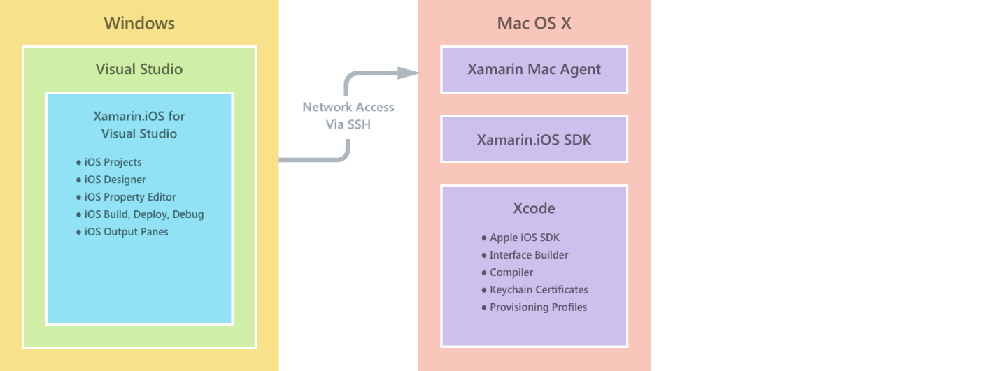

(As an alternative, you can use Xamarin Studio directly on the Mac to develop cross-platform apps.)

You don't need the Mac if you don't want to include iOS as a target platform.

Install:

-   [**Xamarin Studio** for iOS](https://developer.xamarin.com/guides/ios/getting_started/installation/mac/). You can also set up Visual Studio and Xamarin on a Mac running a Windows virtual machine. See [Setup, install, and verifications for Mac users](https://msdn.microsoft.com/library/mt488770.aspx) on MSDN.

-   (Optional) [Azure development tools](https://azure.microsoft.com/downloads/).

Enable remote login on the Mac. Open System Preferences, Sharing and check Remote Login.

When you open an iOS project in Visual Studio on Windows, the Xamarin plug-in will prompt you for the id of the Mac.

## Fetch the GitHub repo

Fetch a local copy of <https://github.com/Azure-Samples/MyDriving> using the **Download ZIP** button on GitHub, Visual Studio, or another Git client.

Unzip the file to a folder with a short path name, such as C:\\code.

Alternatively, if you want to keep up to date with or contribute to our code, clone the repository as follows:

> git clone <https://github.com/Azure-Samples/MyDriving.git>

## Bing maps developer code

[Register for a Bing Maps API Key](https://msdn.microsoft.com/library/ff428642.aspx). 

You need to replace this in line 22 in `src/MobileApps/MyDriving/MyDriving.Utils/Logger.cs`


## Build the demo app

Open these solutions in Visual Studio:

-   src\MobileApps\MyDriving.sln
-   src\MobileAppService\MyDrivingService.sln
-   src\Extensions\ServiceFabric\VINLookUpApplication\VINLookUpApplication.sln

You'll get prompts to:

-   Trust some potentially untrustworthy projects. Choose to open them if you want to go ahead.

-   Set Developer mode if you're working on a fresh Windows 10 machine.

-   Provide your Xamarin credentials.

-   Connect to the Xamarin Mac. If you don't have a Mac, right-click the iOS project in Visual Studio, and choose **Unload project**.

Rebuild the solution.

### Trouble building?

These are some quirks we've sometimes come across:

-   VINLookupApplication project doesn't load: make sure you installed the [Azure SDK for VS2015](https://go.microsoft.com/fwlink/?linkid=518003&clcid=0x409).

-   Service Fabric project doesn't build: build the interfaces projects first, and make sure you installed the Service Fabric SDK.

-   Android app doesn't build:

    -   Open Tools, Android, Android SDK Manager, and make sure Android 6 (API 23)/SDK Platform is installed.

    -   Delete this directory and then rebuild:<br/>
        `%LocalAppData%\Xamarin\zips`

## Get to know the code

In the solution, you'll find:

-   Azure extensions

    -   Service Fabric

-   HDInsight – scripts for processing trip data in Azure

-   Mobile Apps – the device apps

-   MobileAppsService/MyDrivingService – the web backend

-   Power BI – Power BI report definition

-   Scripts

    -   ARM – templates to build the Azure resources

    -   PowerShell – scripts to run the ARM templates

    -   SQLDatabase – debugging databases

-   SQLDatabase

    -   CreateTables – schema definitions

-   StreamingAnalytics – queries that transform the incoming data stream

## Run the apps in development mode

### Backend

Set MyDrivingService as the startup project, and press F5 to run the backend web service. It will open a browser view of the API listing.

### Mobile clients

The [mobile apps are developed in Xamarin](https://developer.xamarin.com/guides/cross-platform/deployment,_testing,_and_metrics/debugging_with_xamarin/).

-   [Debugging Android in Xamarin](http://developer.xamarin.com/guides/android/deployment,_testing,_and_metrics/debugging_with_xamarin_android/)

### iOS

-   [Debugging in iOS](http://developer.xamarin.com/guides/ios/deployment,_testing,_and_metrics/debugging_in_xamarin_ios/)

### Windows Phone

-   [Xamarin + Windows Phone](https://developer.xamarin.com/guides/cross-platform/windows/phone/)


## HockeyApp

HockeyApp manages the distribution of your device Android, iOS or Windows app to test users, notifying users of new releases. It also collects useful crash reports, user feedback with screenshots, as well as usage metrics.

[Start by uploading](http://support.hockeyapp.net/kb/app-management-2/how-to-create-a-new-app) your build app. Then sign in to HockeyApp (<https://rink.hockeyapp.net>) from your development machine. On the developer dashboard, click **New App**, and drag the built files onto the window. (Later, you can automate your build service to do this.)

Now you're in your app dashboard.

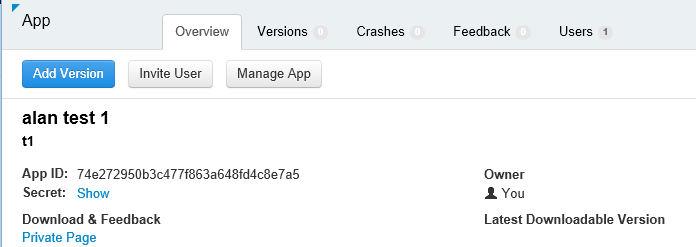

Repeat the process for each platform that your app runs on.

- Use the [App Id](http://support.hockeyapp.net/kb/app-management-2/how-to-find-the-app-id) from the dashboard to send crash data and feedback from your app. In MyDriving, update the ids in src/MobileApps/MyDriving/MyDriving.Utils/Logger.cs 
-   [**Invite test users**](http://support.hockeyapp.net/kb/app-management-2/how-to-invite-beta-testers). You get a URL to recruit testers users. They'll be able to sign up to your team, download the app and send you feedback.

-   Or if you'd prefer a more open beta release, set the distribution to public: click **Manage App, Distribution, Download = Public.** Now anyone can download your app and send you feedback, and they'll see a notification when you post a new version. And you might get some crash reports from them too.
    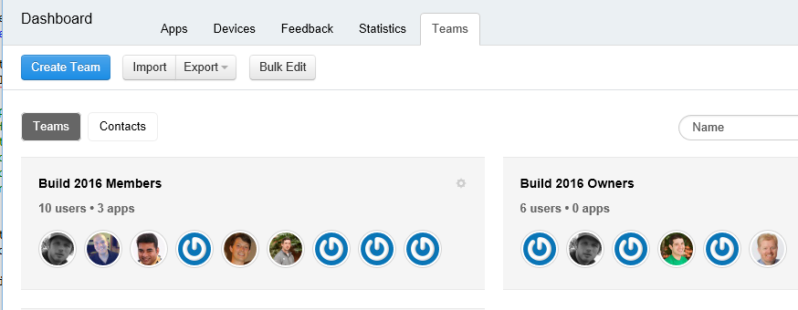

-   [**Link crash reports to Visual Studio Team Services**](http://support.hockeyapp.net/kb/third-party-bug-trackers-services-and-webhooks/how-to-use-hockeyapp-with-visual-studio-team-services-vsts-or-team-foundation-server-tfs): click **Manage App, Visual Studio Team Services**.
    HockeyApp can automatically create work items in Team Services when there are crash reports, or when feedback is received.

> Read more at <https://hockeyapp.net>.

## Xamarin Test Cloud

[Xamarin Test Cloud](https://developer.xamarin.com/guides/testcloud/introduction-to-test-cloud/) automates UI testing on real devices in the cloud. Using the NUnit framework, you write tests that run your app through the user interface.

To use Xamarin, you incorporate the [Xamarin.UITests](https://developer.xamarin.com/guides/testcloud/uitest/intro-to-uitest/) SDK into your app, which comes as a NuGet package. You'll find it in the demo app, and it's included when you create new test projects with the Xamarin templates.

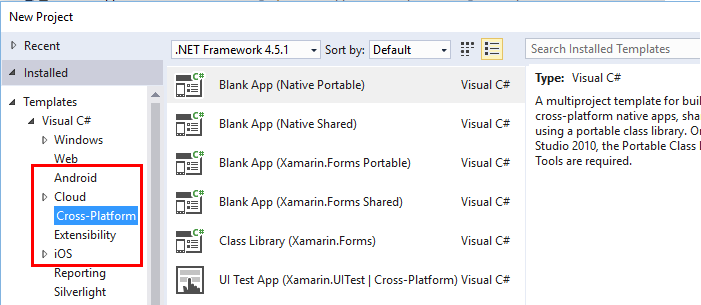

An example test project is included with the app in the repository: in [MyDriving](https://github.com/Azure-Samples/MyDriving/tree/master/src/MobileAppService), look under [src](https://github.com/Azure-Samples/MyDriving/tree/master/src)/MobileApps/[MyDriving](https://github.com/Azure-Samples/MyDriving/tree/master/src/MobileApps/MyDriving)/MyDriving.UITests/

If you use Visual Studio Team Services build, it's easy to write Xamarin UI unit tests and run them as part of your build.

## Deploy Azure services

Please refer to the detailed instructions in **scripts/README.md** to perform an automatic deployment of Azure services and Team Services Build services.

### What does the deployment script do?

Microsoft Azure provides a wealth of different services that you can use to build cloud applications. Although many can be used individually (such as App Service/Web Apps), they're at their best when interconnected to form an integrated system like that we use in MyDriving.

It's possible to create and interconnect Azure services manually, but it's much quicker and more reliable to use Azure Resource Manager (ARM) templates. [ARM](../resource-group-overview.md) automates the deployment of a solution's resources and making the interconnections between them.

You'll find the template for the MyDriving system in the GitHub repository under [Scripts/ARM](https://github.com/Azure-Samples/MyDriving/tree/master/scripts/ARM). It provides a very comprehensive and concise view of how the different services in our architecture are interconnected. We explain all these in detail in the [MyDriving Reference Guide](http://aka.ms/mydrivingdocs), but you can learn a lot just by reading through the template itself.

> [AZURE.NOTE] Most Azure services have an associated cost depending on the pricing tier. If you're new to Azure, you can [try it out for free](https://azure.microsoft.com/free/). However, if you don't plan on using certain components in the MyDriving system, be sure to remove them to avoid incurring costs. See *Estimated operations costs* below for a summary of typical service expenses.

#### Edit the template

To customize your deployment, perhaps to remove unneeded components or to add others, first make a copies of scenario\_complete.params.json and scenario\_complete.json in which to make changes.

The scenario\_complete.params.json file enables you to override various default values such as the service SKU or the storage replication type as described in the following table. The default values select the lowest cost options.

| **Parameter**         | **Description**                | **Default value** |
|--------|---------|-------|
| IoT Hub SKU           | Tier for Azure IoT Hub service | F1                |
| Storage Account Type  | Storage replication type       | Standard LRS      |
| SQL Service Objective | Concurrency slot consumption   | DW100             |
| Hosting Plan SKU      | Service plan for App Service   | F1                |

In scenario\_complete.json:

-   Search for "baseName" and change to a name you'd like to use.

-   Search on "Create" – each of these sections creates a resource.

-   Set sqlServerAdminLogin and sqlServerAdminPassword to suitable values.

-   Before deleting a section that creates a resource, check whether it has dependents by searching for its name elsewhere in the file. Note that each section creating a service includes a *dependsOn* section that lists its dependencies.

Here's what the template configures; details are in the [Reference Guide](http://aka.ms/mydrivingdocs):

| **Service**                 | **Description and details**  
|---|----
| Storage accounts            | The template creates three accounts:                                                                                                                                                                       
||-   A SQL database that receives aggregated telemetry from Stream Analytics, and serves as the backing store for Azure App Service tables that expose this data through API endpoints.                      
| | -   Blob storage that accumulates historical data from another Stream Analytics job, to be processed by HDInisight.                                                                                         
| | -   A SQL database that receives results from processed by HDInsight for use with Power BI.                                                                                                                 
| IoT Hub                     | Establishes a two-way connection to each connected device. In the MyDriving solution, the mobile app acts as a field gateway to send data to IoT Hub. IoT Hub then serves as an input to Stream Analytics. |
| Event Hub                   | An output for a Stream Analytics job that queues the output to extensions created with Azure Service Fabric.                                                                                               
| SQL Data warehouse          |                                                                                                                                                                                                            
| Stream Analytics (ASA) jobs | Connect inputs and outputs with a query, which is used to aggregate both real-time and historical data for the App Service APIs, Machine Learning, extensions, and Power BI.                               
| Machine Learning workspace  | Includes experiments, R code and API service.                                                                                                                                                              
| Data factory                | Scheduled Machine Learning retraining.                                                                                                                                                                     
| Service Fabric hosting plan | For extensions.                                                                                                                                                                                            
| App Service (“Mobile App”)  | Hosts the Mobile Apps API project that provides endpoints for the mobile app. The API code must be deployed to the App Service from Visual Studio.                                                         
| Alert rules                 | Sends you email if failures are indicated by the app responses.                                                                                                                                            
| Application Insights        | For monitoring performance of the APIs in the App Service. You have to configure the connection in Visual Studio.                                                                                          
| Key Vault                   | For saving web service cluster certificate.                                                                                                                                                                

#### Run the template

There are **detailed instructions in scripts/README.md**

To provision all these services in your own Azure account using the script, do one of the following:

-   Using PowerShell:

    ```

    cd scripts/PowerShell;
    deploy.ps1 *location* *resourceGroupName*
    ```

 -   *location* is the [Azure location](https://azure.microsoft.com/regions/) such as 'North Europe' or 'west us'. Use `Get-AzureLocation` to find a list of available locations.

 -   *resourceGroupName* is the name you'd like to give the group that all the resources will belong to. When you're finished with the resources, you'll be able to delete them all together by deleting this group.

-   Run DeploymentScripts/Bash/deploy.sh with Bash.

-   Open and build the Visual Studio solution DeploymentScripts/VS/DeployARM.sln

Note that each time the template is run, it creates a new set of resources with new names. To delete the resources, go to the portal and delete the resource group.

If the script fails for any reason, you can re-run it.

The script gives you the option of configuring continuous integration in Visual Studio Team Services. If you have set up a Team Services project, you'll have a URL https://yourAccountName.visualstudio.com. Enter the complete URL when asked. You can give it a new or existing name for a Team Services project. 


## Visual Studio Team Services

We use Team Services on this project mostly for its build and test features. But it also provides excellent collaboration support, such as task management with Kanban boards, code review integrated with tasks and source control, gated builds, and more. It integrates well with other tools such as GitHub, Xamarin, HockeyApp, and of course Visual Studio. You can access it through the web interface or through Visual Studio, whichever is more convenient at any moment.

The steps in the build and release definitions use a variety of plug-in services that are available in the Team Services [Marketplace](https://marketplace.visualstudio.com/VSTS). In addition to basic utilities to run command lines or copy files, there are services that invoke builds by Xamarin, Android and other vendors, and that interface to HockeyApp.

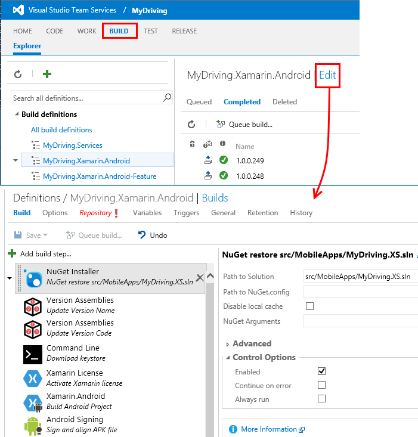

### Build definitions

We have build definitions for each of the main targets; and variations for feature and regression testing. That gives us:

-   MyDriving.Services – the backend web app for the mobile app

-   MyDriving.Xamarin.Android

    -   MyDriving.Xamarin.Android-Feature

    -   MyDriving.Xamarin.Android-Regression

-   MyDriving.Xamarin.iOS

    -   MyDriving.Xamarin.iOS-Feature

    -   MyDriving.Xamarin.iOS-Regression

-   MyDriving.Xamarin.UWP

    -   MyDriving.Xamarin.UWP-Feature

    -   MyDriving.Xamarin.UWP-Regression

If you'd like to see the full details of our configuration, see section 4.7 of the [MyDriving Reference Guide](http://aka.ms/mydrivingdocs), *Build and Release Configuration.* They follow the same general pattern:

1.  NuGet package restore. We don't keep compiled code in the repository, so the first steps of each build are to restore the required NuGet packages.

2.  License activation. The build is performed in the cloud, so where we need a licence – in particular, for the Xamarin build service – we have to activate our licence on the current build machine. Then we de-activate it immediately afterwards, to allow it to be used on another machine.

3.  Build using the appropriate service. We use Xamarin builds for the mobile apps, and Visual Studio build for the backend web service.

4.  Build tests

5.  Run tests. We run the mobile app tests in the Xamarin Test Cloud.

6.  Publish build result to drop location.

The trigger for the main builds is set to Continuous Integration – that is, the build is run every time code is checked in to the master branch.

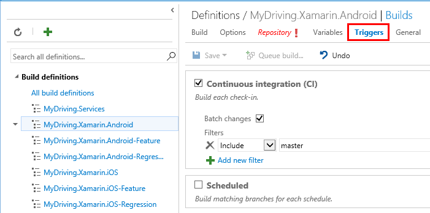

### Release definitions

Release definitions are set up in much the same way.

For the web service, we set up deployment as an Azure web app:

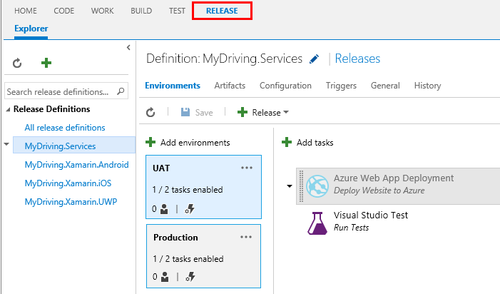

And set the release trigger to continuous deployment – that is, every checkin followed by a successful build results in an update to the web app:

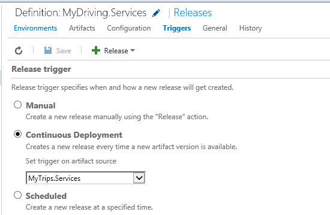

For mobile apps, we deploy to HockeyApp:
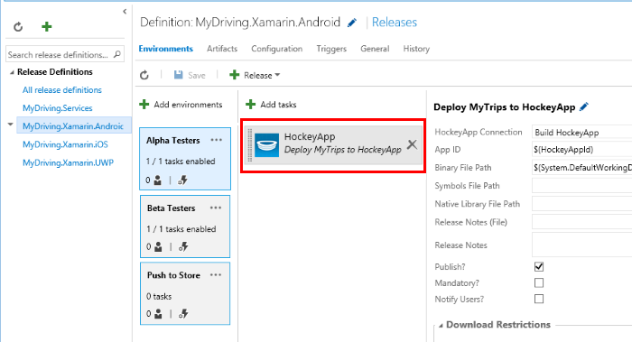

## Application Insights

[Application Insights](../application-insights/app-insights-overview.md) collects telemetry about the performance and usage of your web services. The Application Insights SDK sends telemetry from the service to the Application Insights resource in Azure.

Browse to the Application Insights resource that the template set up. There you can explore charts of the performance of your [Mobile App Service project](https://github.com/Azure-Samples/MyDriving/tree/master/src/MobileAppService). They show server requests and response times, failures, and exception counts. There are also charts of dependency response times - that is, calls to the database and to REST APIs such as Machine Learning. If there are any performance problems, you'll be able to see what piece of your system is causing them.


If you have a web service you set up by hand, it's easy to get the same charts:

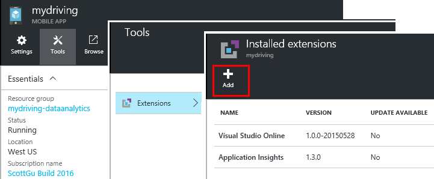

The feature works by instrumenting your application with the Application Insights SDK. 

You can add custom telemetry (or instrument an application running somewhere outside Azure) by [adding the Application Insights SDK](../application-insights/app-insights-asp-net.md) at development time. This is useful to log metrics that depend on the application, such as users' average trip length or total mileage. 

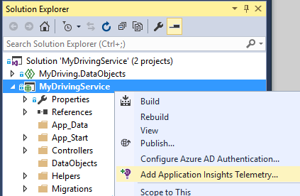 

Application Insights will send alert emails if it sees unusual numbers of failure responses, and you can also set up your own alerts on various metrics such as response times.

Just to be sure that your web service is always up and running, you can set up [availability tests](../application-insights/app-insights-monitor-web-app-availability.md), which ping your site from various locations around the world every fifteen minutes. Again, you'll get an email if there seems to be a problem.


## Estimated operational costs

It's remarkably inexpensive to run an app like this one at small scale. Many of the services have free entry-level tiers, so that development and small-scale operation costs very little. And of course, your own apps don't have to use all the features demonstrated in MyDriving.

Here's a rough estimate of the costs of setting up the development configuration for MyDriving.

We also note some alternatives that we did *not* use. \#

We assume:

-   A team of no more than five (+ observing stakeholders).

-   Running for about a month.

-   100 users with 4 trips per day.

>[AZURE.NOTE] if you're new to Azure, there's a [free trial account](https://azure.microsoft.com/free/).

| **Service/Component**  | **Notes** | **Cost/month** |
|--------|--------|----------------|
| [Visual Studio 2015 Community](https://www.visualstudio.com/products/visual-studio-community-vs) with [Xamarin](https://visualstudiogallery.msdn.microsoft.com/dcd5b7bd-48f0-4245-80b6-002d22ea6eee) <br/>Cross platform dev environment.| Visual Studio Community. <br/>(\# Need [VS Pro](https://www.visualstudio.com/vs-2015-product-editions) for [Xamarin.Forms](https://xamarin.com/forms), to design cross-platform from a single code base.)  | $0   |
| [Azure IoT Hub](https://azure.microsoft.com/pricing/details/iot-hub/) <br/>2-way data connection to devices. | 8,000 Messages + 0.5 KB/Message Free | $0             |
| [Stream Analytics](https://azure.microsoft.com/pricing/details/stream-analytics/)  <br/>   High-volume stream data processing.                                                                                                                                                              | Charge $0.031 per streaming unit per hour, while enabled. You choose the number of streaming units you want; more to scale up. | $23            |
| [Azure Machine Learning](https://azure.microsoft.com/documentation/services/machine-learning/)<br/> Adaptive responses.                                                                                                                                                                              |  $10/seat/month <br/>                                                                                                                                                                                 + 3h experiment \* $1 / experiment hour <br/>                                                                                                                                                           + 3.5h API CPU \* $2 /production CPU hour <br/>                                                                                                                                                          API CPU time assumes 5min/day retraining, though this would rise with more input data;                   <br/>                                                                                                                                                                     + 2min/day scoring to process 400 trips/day.  | $20            |
| [Azure App Service](https://azure.microsoft.com/pricing/details/app-service/)  <br/> host mobile backend                                                                                                                                                                              | Tier B1 – production web apps | $56            |
| [Visual Studio Team Services ](https://azure.microsoft.com/pricing/details/visual-studio-team-services/)  <br/> Build, unit test and release management. Task management. | Private Agents, 5 users| $0             |
| [Application Insights](https://azure.microsoft.com/pricing/details/application-insights/) <br/>Monitor perf & usage of web services and sites.| Free Tier  | $0             |
| [HockeyApp](http://hockeyapp.net/pricing/) <br/> Distribute beta apps, collect feedback, usage & crash data.                                                                                                                                      | Two free apps for new users.<br/> $30/month thereafter.  | $0    |
| [Xamarin](https://store.xamarin.com/)<br/> Code on a uniform platform for multiple devices. | Free trial. <br/>$25/month thereafter.| $0    |
| [SQL Instance](https://azure.microsoft.com/pricing/details/sql-database/) for Azure App Service| Basic tier; single database model | $5             |
| [Service Fabric](../service-fabric/services/service-fabric.md) (optional)  | Run a local cluster | $0             |
| [Power BI](https://powerbi.microsoft.com/pricing/)<br/> Versatile displays and investigation of streamed and static data.| Free tier: 1GB, 10k rows/hour, daily refresh <br/> \# $10/user/month for [higher limits](https://powerbi.microsoft.com/documentation/powerbi-power-bi-pro-content-what-is-it/), more connection options, collaboration    | $0             |
| [Storage](https://azure.microsoft.com/pricing/details/storage/)   | L (Locally Redundant) &lt; 100G $0.024/GB  | $3             |
| [Data Factory](https://azure.microsoft.com/pricing/details/data-factory/)                                                                                                                       | $0.60 per activity \* (8 - 5 FOC)| $2             |
| [HDInsight](https://azure.microsoft.com/pricing/details/hdinsight/) (on-demand cluster) <br/>  For daily retraining   | 3 A3 nodes at $0.32/hr for 1 hour daily X 31 days | $30            |
| [Event Hub](https://azure.microsoft.com/pricing/details/event-hubs/)  | Basic with $11/month throughput unit + $0.028 ingress | $11            |
| OBD Dongle  || $12            |
| **Total**|    | **$157**       |

See also:

-   Summary of [Azure service quotas and limits](../azure-subscription-service-limits/#iot-hub-limits).

-   Azure [pricing calculator](https://azure.microsoft.com/pricing/calculator/)


## Reference Guide

We recommend the [MyDriving Reference Guide](http://aka.ms/mydrivingdocs), which is a comprehensive description of the design of the system and its components.


## Feedback 

Because we created MyDriving to help jumpstart your own IoT systems, we certainly want to hear from you about how well it works! Let us know if you run into difficulties or challenges, if there is an extension point that would make it more suitable to your scenario, if you find a more efficient way to accomplish certain needs, or if you have any other suggestions for improving MyDriving or this documentation.

To give feedback, file an [issue on GitHub], or leave a comment below (en-us edition).

We look forward to hearing from you!
