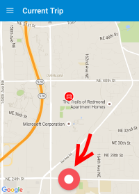
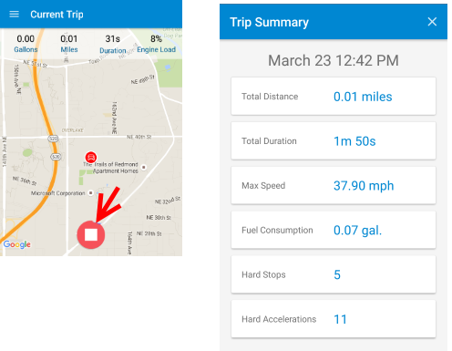
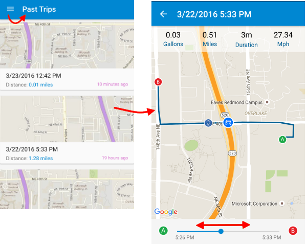
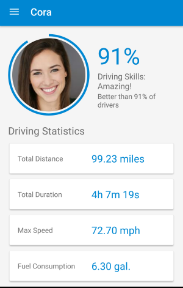

<properties
	pageTitle="MyDriving Azure IoT example: Quick start | Microsoft Azure"
	description="Get started with an app that's a comprehensive demonstration of how to architect an IoT system by using Microsoft Azure, including Stream Analytics, Machine Learning, and Event Hubs."
	services=""
    documentationCenter=".net"
    suite=""
	authors="harikmenon"
	manager="douge"/>

<tags
	ms.service="multiple"
	ms.workload="tbd"
	ms.tgt_pltfrm="ibiza"
	ms.devlang="dotnet"
	ms.topic="article"
	ms.date="03/25/2016"
	ms.author="harikm"/>

# MyDriving IoT system: Quick start

MyDriving is a system that demonstrates the design and implementation of a typical [Internet of Things](iot-suite-overview.md) (IoT) solution that gathers telemetry from devices, processes that data in the cloud, and applies machine learning to provide an adaptive response. The demonstration logs data about your car trips, by using data from both your mobile phone and an adapter that collects information from your car’s control system. It uses this data to provide feedback on your driving style in comparison to other users.

The real purpose of MyDriving is to get you started in creating your own IoT solution. But before that, let’s get you going with the MyDriving app itself--as a member of our test user team. This gives you an experience of the app and the system behind it as a consumer, before you delve into the architecture. It also introduces you to HockeyApp, a cool way of managing the alpha and beta distributions of your apps to test users.

## Use the mobile experience

You can use the MyDriving app if you have an Android, iOS, or Windows 10 device.

### Android and Windows 10 Mobile installation

On your device:

1.  Allow development apps:

    -   Android: In **Settings** > **Security**, allow apps from **Unknown sources**.

    -   Windows 10: In **Settings** > **Updates** > **For Developers**, set **Developer mode**.

2.  Join our beta test team by signing up with, or signing in to, [HockeyApp](https://rink.hockeyapp.net). HockeyApp makes it easy to distribute early releases of your app to test users.

    If you’re using Windows 10, use the Edge browser.

    If you were a Build 2016 attendee, sign in with the same Microsoft account email that you registered for the conference, by using one of the Microsoft buttons. You’re already signed up with HockeyApp.

    

3.  Download and install the app from here:

    -   [Android](http://rink.io/spMyDrivingAndroid)

    -   [Windows 10](http://rink.io/spMyDrivingUWP)

    There are two items. Install the certificate in **Trusted People**. Then install the app.

*Any issues starting the app on Windows 10 Mobile?* Your phone might be an update or two behind. Make sure you've got the latest updates, or install:

 - [Microsoft.NET.Native.Framework.1.2.appx](https://download.hockeyapp.net/packages/win10/Microsoft.NET.Native.Framework.1.2.appx) 

 - [Microsoft.NET.Native.Runtime.1.1.appx](https://download.hockeyapp.net/packages/win10/Microsoft.NET.Native.Runtime.1.1.appx) 

 - [Microsoft.VCLibs.ARM.14.00.appx](https://download.hockeyapp.net/packages/win10/Microsoft.VCLibs.ARM.14.00.appx)

### iOS installation

If you attended Build 2016, download the app as a member of our test team on HockeyApp:

1.  On your iOS device, sign in to [HockeyApp](https://rink.hockeyapp.net).
    Use one of the Microsoft sign-in buttons, and sign in with the same Microsoft account email that you registered with the conference. (Don’t use the email and password fields.)

    

2.  In the HockeyApp dashboard, select MyDriving and download it.

3.  Authorize the beta release from HockeyApp:

    a. Go to **Settings** > **General** > **Profiles and Device Management.**

    b. Trust the **Bit Stadium GmbH** certificate.

If you didn’t attend Build 2016, you can build and deploy the app yourself:

1.   Download the code [from GitHub].

2.   Build and deploy by [using Xamarin].

Find more details in the [MyDriving Reference Guide](http://aka.ms/mydrivingdocs).

## Get an OBD adapter (optional)

This is the part that makes this a real Internet of Things system! You can use the app without one, but it’s more fun with the real thing, and they aren’t expensive.

On-board diagnostics (OBD) is the feature of your car that the garage uses to tune up your car and diagnose odd noises and warning lamps. Unless your car is of great antiquity, you’ll find a socket somewhere in the cabin, typically behind a flap under the dashboard. With the right connector, you can get metrics of the engine’s performance and make certain adjustments. An OBD connector can be purchased cheaply from the usual places. It connects by using Bluetooth or Wi-Fi to an app on your phone.

In this case, we’re going to connect your car to the cloud. The direct connection from the OBD is to your phone, but our app works as a relay. Your car's telemetry is sent straight to the MyDriving IoT hub, where it's processed to log your road trips and assess your driving style.

To connect an OBD device:

1.  Check that your car has an OBD socket.

2.  Obtain an OBD adapter:

    -   If you're using an Android or Windows phone, you need a Bluetooth-enabled OBD II adapter. We used [BAFX Products 34t5 Bluetooth OBDII Scan Tool].

    -   If you're using an iOS phone, you need a Wi-Fi-enabled OBD adapter. We used [ScanTool OBDLink MX Wi-Fi: OBD Adapter/Diagnostic Scanner].

3.  Follow the instructions that come with your OBD adapter to connect it to your phone. Keep the following in mind:

    -   A Bluetooth adapter must be paired with the phone, on the **Settings** page.

    -   A Wi-Fi adapter must have an address in the range 192.168.xxx.xxx.

4.  If you have several cars, you can get a separate adapter for each (maximum of three).

If you don’t have an OBD adapter, the app will still send location and speed data from the phone's GPS receiver to the back end and will ask if you want to simulate an OBD.

You can find out more about how the app uses data from the OBD adapter and about options for creating your own OBD device in section 2.1, "IoT Devices," in the [MyDriving Reference Guide](http://aka.ms/mydrivingdocs).

## Use the app

Start the app. There’s an initial Quickstart to walk you through how it works.

### Track your trips

Tap the record button (big red circle at the bottom of the screen) to start a trip, and tap again to end.

Each time you start a trip, if there’s no OBD device, you’ll be asked if you want to use the simulator.

At the end of a trip, tap the stop button, and you get a summary.

### Review your trips

### Review your profile

## Send us your test feedback

Because we created MyDriving to help jumpstart your own IoT systems, we certainly want to hear from you about how well it works. Let us know if:

- You run into difficulties or challenges.

- There is an extension point that would make it more suitable to your scenario.

- You find a more efficient way to accomplish certain needs.

- You have any other suggestions for improving MyDriving or this documentation.

Within the MyDriving app itself, you can use the built-in HockeyApp feedback mechanism: on iOS and Android, just give your phone a shake, or use the **Feedback** menu command. This will automatically attach a screenshot, so that we’ll know what you’re talking about. And if there are any unfortunate crashes, HockeyApp collects the crash logs to tell us about them. You can also give feedback through the [HockeyApp portal].

You can also file an [issue on GitHub], or leave a comment below (en-us edition).

We look forward to hearing from you!

## Next steps

-   Explore the [MyDriving Reference Guide](http://aka.ms/mydrivingdocs) to understand how we’ve designed and built the entire MyDriving system.

-   [Create and deploy a system of your own](iot-solution-build-system.md) by using our Azure Resource Manager scripts. The [MyDriving Reference Guide](http://aka.ms/mydrivingdocs) also guides you through areas where you’ll make the most customizations.

  [from GitHub]: https://github.com/Azure-Samples/MyDriving
  [using Xamarin]: https://developer.xamarin.com/guides/ios/getting_started/installation/
  [BAFX Products 34t5 Bluetooth OBDII Scan Tool]: http://www.amazon.com/gp/product/B005NLQAHS
  [ScanTool OBDLink MX Wi-Fi: OBD Adapter/Diagnostic Scanner]: http://www.amazon.com/gp/product/B00OCYXTYY/ref=s9_simh_gw_g263_i1_r?pf_rd_m=ATVPDKIKX0DER&pf_rd_s=desktop-2&pf_rd_r=1MWRMKXK4KK9VYMJ44MP
  [HockeyApp portal]: https://rink.hockeyapp.org
  [issue on GitHub]: https://github.com/Azure-Samples/MyDriving/issues
