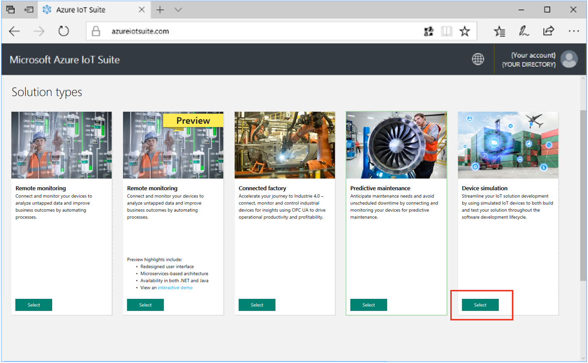
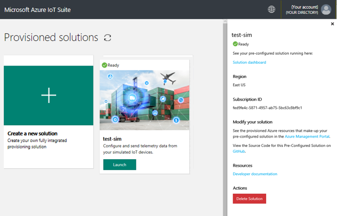

# Deploy the Azure IoT device simulation solution

This tutorial shows you how to provision a device simulation solution. You deploy the solution from azureiotsuite.com.

In this tutorial, you learn how to:

> [!div class="checklist"]
> * Configure the device simulation solution
> * Deploy the device simulation solution
> * Sign in to the device simulation solution

## Prerequisites

To complete this tutorial, you need an active Azure subscription.

If you don’t have an account, you can create a free trial account in just a couple of minutes. For details, see [Azure Free Trial](http://azure.microsoft.com/pricing/free-trial/).

## Deploy the solution

Before you deploy the solution to your Azure subscription, you must choose some configuration options:

1. Sign in to [azureiotsuite.com](https://www.azureiotsuite.com) using your Azure account credentials, and click **+** to create a new solution:

    

1. Click **Select** on the **Device simulation** tile:

    

1. On the **Create Device simulation solution** page, enter a **Solution name** for your device simulation solution.

1. Select the **Subscription** and **Region** you want to use to provision the solution.

1. Specify if you want a new IoT Hub deployed with your device simulation solution. If you check this box, a new IoT Hub is deployed into your subscription. Regardless of choice, you can always point your simulation at any IoT Hub.

1. Click **Create Solution** to begin the provisioning process. This process typically takes several minutes to run:

    

## Sign in to the solution

When the provisioning process is complete, you can sign in to your device simulation solution.

1. On the **Provisioned solutions** page, click **Launch** under your new device simulation solution:

    

1. You can view information about your device simulation solution in the panel that appears. Choose **Solution dashboard** to connect to your device simulation solution.

    > [!NOTE]
    > You can delete your device simulation solution from this panel when you are finished with it.

    

1. The device simulation solution dashboard displays in your browser.

## Next steps

In this tutorial, you learned how to:

> [!div class="checklist"]
> * Configure the solution
> * Deploy the solution
> * Sign in to the solution

Now that you have deployed the device simulation solution, the next step is to [explore the capabilities of the device simulation solution](./iot-suite-device-simulation-explore.md).

<!-- Next tutorials in the sequence -->