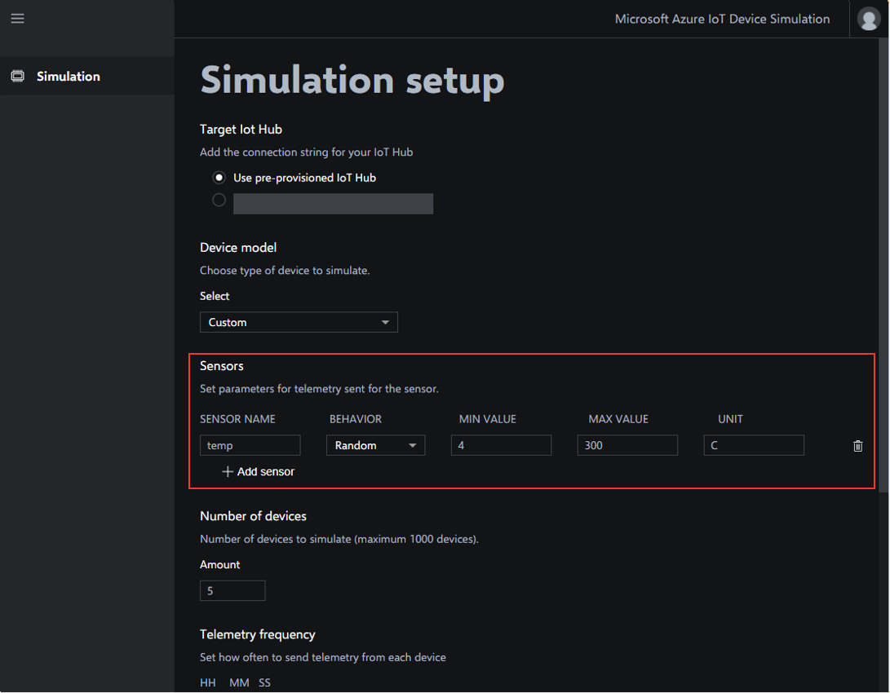
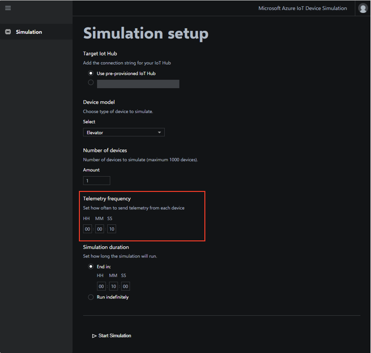
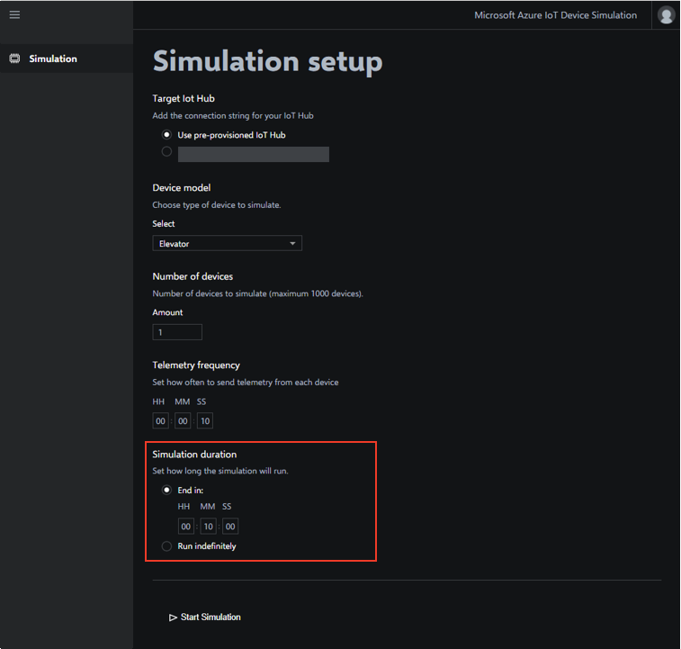
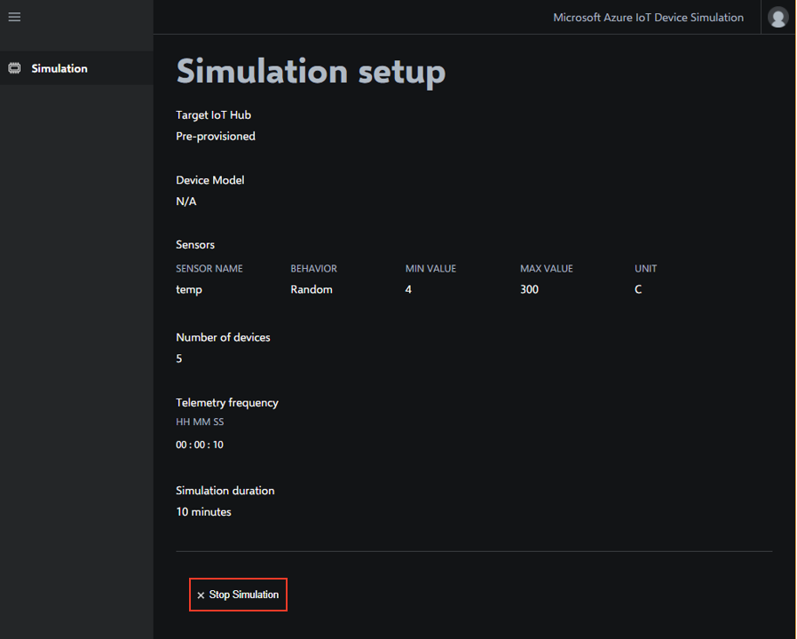

# Device Simulation walkthrough

Azure IoT Device Simulation is a tool that can be used to assist in the development and testing of an IoT solution. Device Simulation is a standalone offering that you can use in conjunction with other preconfigured solutions or with your own custom solutions.

This tutorial walks you through some of the features of Device Simulation. It shows you how it works, and enables you to use it to test your own IoT solutions.

In this tutorial, you learn how to:

>[!div class="checklist"]
> * Configure a simulation
> * Starting and stopping a simulation
> * View telemetry metrics

## Prerequisites

To complete this tutorial, you need a deployed instance of Azure IoT Device Simulation in your Azure subscription.

If you haven't deployed Device Simulation yet, you should complete the [Deploy Azure IoT Device Simulation](iot-suite-device-simulation-deploy.md) tutorial.

## Configuring Device Simulation

You can configure and run Device Simulation completely from within the dashboard. Open the dashboard from the IoT Suite [Provisioned solutions](https://www.azureiotsuite.com/) page. Click **Launch** under your new Device Simulation deployment.

### Target IoT Hub

You can use Device Simulation with a pre-provisioned IoT hub or with any other IoT hub:

> [!NOTE]
> The option to use a pre-provisioned IoT Hub is only available if you chose to create a new IoT Hub when you deployed Device Simulation. If you don't have an IoT hub, you can always create a new one from the [Azure portal](https://portal.azure.com).

To target a specific IoT hub, provide the **iothubowner** connection string. You can get this connection string from the [Azure portal](https://portal.azure.com):

1. On the IoT Hub configuration page in the Azure portal, click **Shared access policies**.
1. Click **iothubowner**.
1. Copy either the primary or secondary key.
1. Paste this value into the text box under Target IoT Hub.

### Device model

The device model enables you to choose the type of device to simulate. You can choose one of the pre-configured device models or define a list of sensors for a custom device model:

#### Pre-Configured device models

Device Simulation provides three pre-configured device models. Device models for Chillers, Elevators, and Trucks are available.

Pre-configured device models include multiple sensors with advanced behaviors defined in a JavaScript file. These custom behaviors are not supported in the web UI. 

The following table shows a list of the configurations for each pre-configured device model:

| Device model | Sensor | Unit | 
| -------------| ------ | -----| 
| Chiller | humidity | % |
| | pressure | psig | 
| | temperature | F | 
| Elevator | Floor | 
| | Vibration | mm | 
| | Temperature | F | 
| Truck | Latitude | |
| | Longitude | | 
| | speed | mph | 
| | cargotemperature | F | 

#### Custom device model

Custom device models enable you to model sensors that more closely represent your own devices. A custom device can have up to 10 custom sensors.

When you select the custom device model type, you can add new sensors by clicking **+Add sensor**.

Custom sensors have the following properties:

| Field | Description |
| ----- | ----------- |
| Sensor Name | A friendly name for the sensor such as **temperature** or **speed**. |
| Behavior | Behaviors enable telemetry data to vary from one message to the next to simulate real-world data. **Increment** increases the value by one in each message sent starting at the minimum value. Once the maximum value is met, then it starts over again at the minimum value. **Decrement** behaves in the same way as **Increment** but counts down. The **Random** behavior generates a random value between the minimum value and maximum values. |
| Min Value | The lowest number representing your acceptable range. |
| Max Value | The largest number representing your acceptable range. |
| Unit | The unit of measurement for the sensor such as °F or MPH. |

### Number of devices

Device Simulation currently enables you to simulate up to 20,000 devices.

### Telemetry frequency

Telemetry frequency enables you to specify how often your simulated devices should send data to the IoT hub. You can send data as frequently as every 10 seconds or as infrequently every as 99 hours, 59 minutes, and 59 seconds.

> [!NOTE]
> If you are using an IoT hub other than the pre-provisioned IoT hub, then you should consider message limits for your target IoT hub. For example, if you have 1,000 simulated devices sending telemetry every 10 seconds to an S1 hub you reach the telemetry limit for the hub in just over an hour.

### Simulation duration

You can choose to run your simulation for a specific length of time or to run until you explicitly stop it. When you choose a specific length of time, you can choose any duration from 10 minutes up to 99 hours, 59 minutes, and 59 seconds.

### Start and stop the simulation

When you have added all the necessary configuration data to the form, the **Start Simulation** button is enabled. To start the simulation, click this button.

If you specified a specific duration for your simulation, then it stops automatically when the time has been reached. You can always stop the simulation early by clicking **Stop Simulation.**

If you chose to run your simulation indefinitely, then it runs until you click **Stop Simulation**. You can close your browser and come back to the Device Simulation page to stop your simulation at any time.

> [!NOTE]
> Only one simulation can be run at a time. You must stop the currently running simulation before you start a new simulation.
