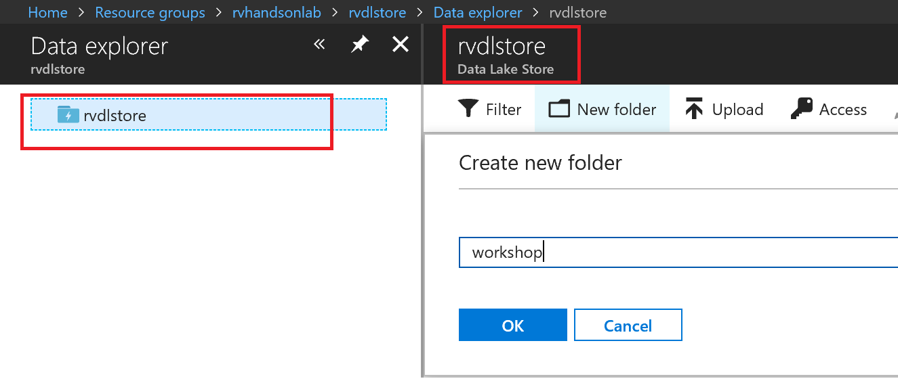
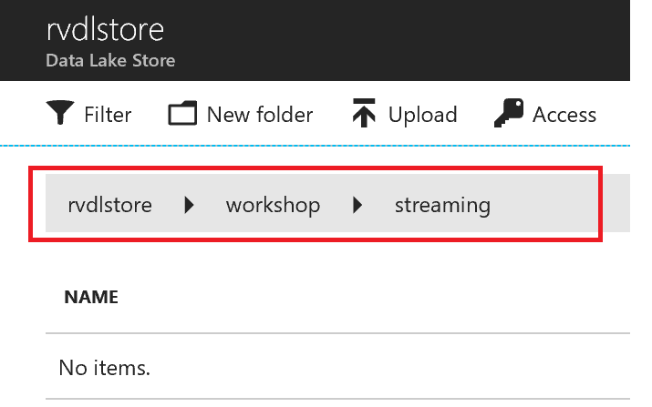

# Create Data Lake Store and Stream Data from IoTHub using Azure Stream Analytics

 Azure Data Lake Store is an enterprise-wide hyper-scale repository for big data analytic workloads. Azure Data Lake enables you to capture data of any size, type, and ingestion speed in one single place for operational and exploratory analytics. Data Lake Store can store trillions of files. A single file can be larger than one petabyte in size. This makes Data Lake Store ideal for storing any type of data including massive datasets like high-resolution video, genomic and seismic datasets, medical data, and data from a wide variety of industries.

## Prerequisites

To complete this tutorial, [deploy the remote monitoring preconfigured solution] (https://docs.microsoft.com/azure/iot-suite/iot-suite-remote-monitoring-deploy).

## Create Azure Data Lake Store

 Create a hyper scale data lake store to store IoT Data.


 During creation of data lake you have the choice to encrypt the store

 Data Lake Store protects your data assets and extends your on-premises security and governance controls to the cloud. Your data is always encrypted, while in motion using SSL, and at rest using service or user-managed HSM-backed keys in Azure Key Vault. Single sign-on (SSO), multi-factor authentication, and seamless management of millions of identities is built-in through Azure Active Directory. Authorize users and groups with fine-grained POSIX-based ACLs for all data in your store and enable role-based access controls. Meet security and regulatory compliance needs by auditing every access or configuration change to the system.


## Explore Data in Data Lake Store


## Create Folders in Data Lake Store

Create /streaming folder to store Streaming data coming from your device through IoTHub using Stream Analytics Job

Create  folder



Create /streaming folder




## Create a consumer group in your IoT hub

Consumer groups are used by applications to pull data from Azure IoT Hub. Create a dedicated consumer group to be used by Data Lake Store for streaming. Each consumer group allows up to 5 output consumers. Make sure you create a new consumer group for every 5 output sinks and you can create up to 32 consumer groups.

The following command will create a new consumer group:

```azurecli-interactive
az iot hub consumer-group create --hub-name howto-iot-hub --name streamanalyticsjob --resource-group howto-rg
```

## Create Stream Analytics Job

Azure Stream Analytics is a managed event-processing engine set up real-time analytic computations on streaming data. The data can come from devices, sensors, web sites, social media feeds, applications, infrastructure systems, and more.

1. Click **Create a resource**, select **Internet of Things** from the Marketplace and click **Stream Analytics job**.


2. Enter a job name and select the appropriate Subscription, Resource group. 

1. Select a Location in the same region as your Data Lake Store. Here we are using East US 2.

1. Ensure to leave the Hosting environent as the default **Cloud**.

3. Click **Create**.


4. Go to the new **Stream Analytics job**.

5. On the Overview page, click **Inputs**.


6. Click **Add stream input** and select **IoT Hub** from the drop-down.


7. On the New input tab, enter an Input alias of **IoTHub**.

8. From the Consumer group drop-down, select the consumer group you created earlier. Here we are suing **streamanalyticsjob**.

9. Click **Save**.


10. On the Overview page, click **Outputs**.


11. Click **Add** and select **Data Lake Store** from the drop-down.


12. On the New output tab, enter an Output alias of **DataLakeStore**.

13. Select the Data Lake Store account you created in previous steps and provide folder structure to stream data to the store.

14. In the Date format field, enter **/streaming/{date}/{time}**. Leave the default Date format of YYYY/MM/DD and Time format of HH.


15. Click **Authorize**.

You will have to authorize with Data Lake Store to give the Stream analytics job write access to the file system.
    [PM] Note sure what all this is...
    1. Multi-factor authentication based on OAuth2.0
    2. Integration with on-premises AD for federated authentication
    3. Role-based access control
    4. Privileged account management
    5. Application usage monitoring and rich auditing
    6. Security monitoring and alerting
    7. Fine-grained ACLs for AD identities


You will see a popup and once the popup closes Authorize button will be greyed out after azuthorization is complete.

[NOTE] If the popup errors, open a new browser window in Incognito Mode and try again.


16. Click **Save**.

## Edit Stream Analytics Query

1. On the Overview tab, click Edit query.


2. In the Query editor replace the [YourOutputAlias] and [YourInputAlias] placeholders with the values you defined previously.

```sql
SELECT
    *, System.Timestamp as time
INTO
    DataLakeStore
FROM
    IoTHub
```

3. Click **Save**.


4. Click Yes to accept the changes.


## Start Streaming Analytics Job

1. On the Overview tab, click **Start**.


On the Start job tab, click **Custom**.

Pick custom time to go back a few hours to pick up data from when your device has started streaming.

Click Start.


Wait till job goes into running state, if you see errors it could be from your query, make sure to verify that the syntax is correct.


The streaming job will begin to read data from your IoT Hub and store the data in your Data Lake Store. It may take a few minutes for the data to begin to appear in your Data Lake Store.

## Explore Streaming Data

1. Go to your Data Lake Store.

2. On the Overview tab, click **Data explorer**.

3. In the Data explorer, drill down to the **/streaming** folder. You will see folders created with YYYY/MM/DD/HH format.


You will see json files with one file per hour.

